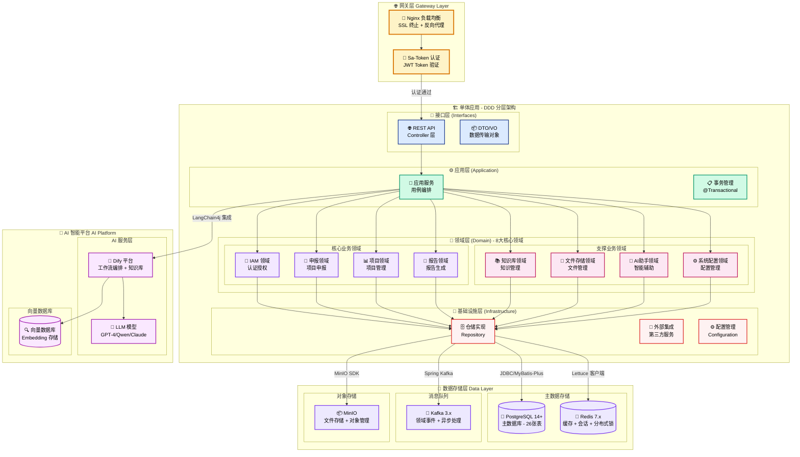
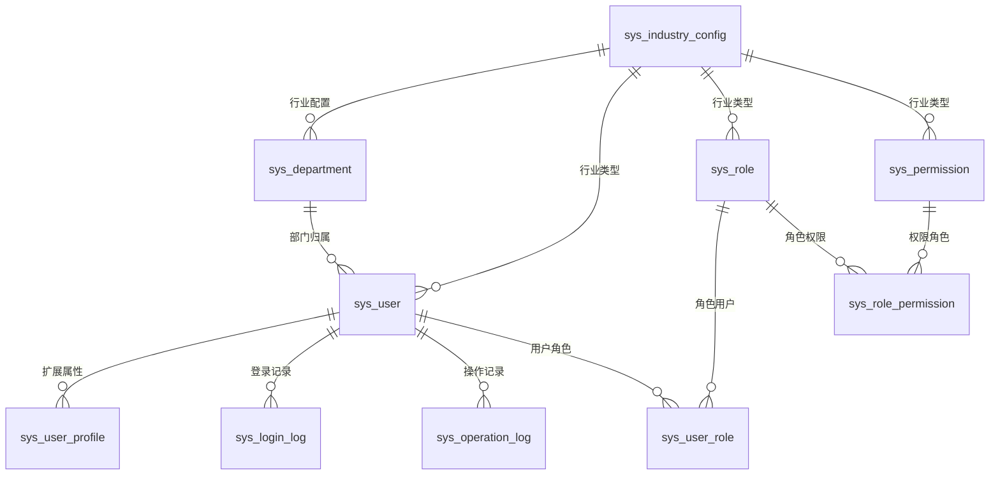
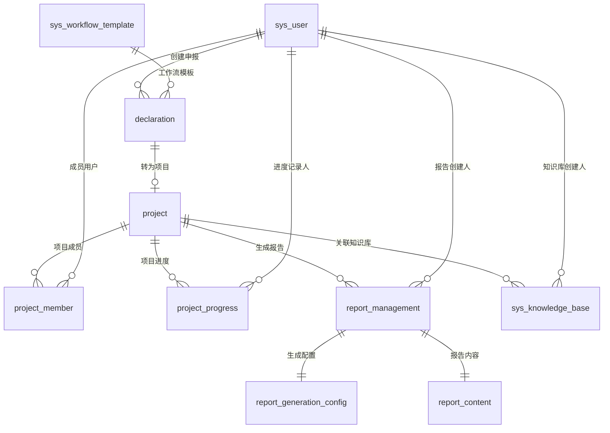
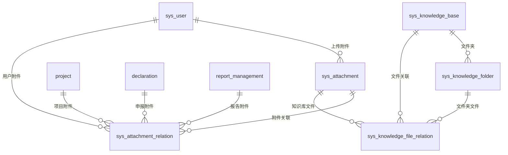
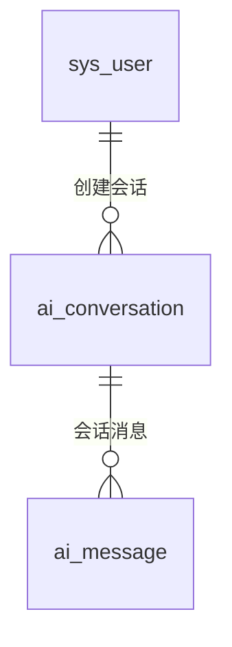
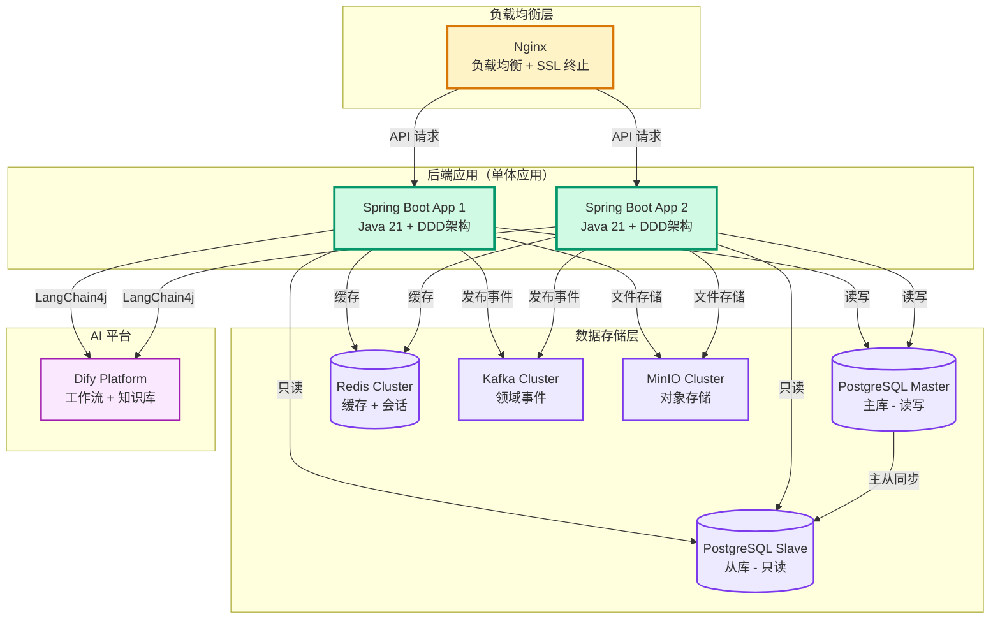

# 高校科研项目管理平台 - 开发文档

## 目录

- [1. 项目概述](#1-项目概述)
  - [1.1 核心特性](#11-核心特性)
  - [1.2 技术栈](#12-技术栈)
- [2. 核心功能模块](#2-核心功能模块)
  - [2.1 认证模块](#21-认证模块)
  - [2.2 仪表板模块](#22-仪表板模块)
  - [2.3 申报模块](#23-申报模块)
  - [2.4 项目模块](#24-项目模块)
  - [2.5 报告管理模块](#25-报告管理模块)
  - [2.6 文件管理模块](#26-文件管理模块)
  - [2.7 知识库模块](#27-知识库模块)
  - [2.8 AI 助手模块](#28-ai-助手模块)
  - [2.9 用户中心模块](#29-用户中心模块)
  - [2.10 系统管理模块](#210-系统管理模块)
- [3. 技术架构](#3-技术架构)
  - [3.1 总体架构](#31-总体架构)
  - [3.2 DDD 领域驱动设计](#32-ddd-领域驱动设计)
- [4. 数据库设计](#4-数据库设计)
  - [4.1 数据库说明](#41-数据库说明)
  - [4.2 表结构设计](#42-表结构设计)
  - [4.3 初始化数据](#43-初始化数据)
  - [4.4 数据库表关系图](#44-数据库表关系图)
  - [4.5 表关系说明](#45-表关系说明)
- [5. 后端设计](#5-后端设计)
  - [5.1 DDD 分层架构](#51-ddd-分层架构)
  - [5.2 后端 API 接口设计](#52-后端-api-接口设计)
  - [5.3 统一响应格式](#53-统一响应格式)
- [7. 部署说明](#7-部署说明)
  - [7.1 环境要求](#71-环境要求)
  - [7.2 部署架构](#72-部署架构)
  - [7.3 部署步骤](#73-部署步骤)
  - [7.4 配置说明](#74-配置说明)

---

## 1. 项目概述

高校科研项目管理平台是一个基于 **DDD 领域驱动设计**、**前后端分离**、**单体应用架构**的智能化科研项目全生命周期管理系统。平台以 Dify 工作流为核心，实现科研项目从申报、执行到验收的智能化、自动化管理。

### 1.1 核心特性

- 🎯 **DDD 领域驱动**：8 大领域，清晰的边界，高内聚低耦合
- 🚀 **单体应用架构**：简化部署，易于维护，支持未来拆分为微服务
- 🤖 **AI 智能化**：集成 Dify 平台，实现智能工作流编排
- 📊 **全生命周期管理**：覆盖申报、执行、报告全流程
- 🔒 **安全可靠**：基于 Sa-Token 的 JWT 认证体系
- ⚡ **Java 21 新特性**：虚拟线程、记录模式、模式匹配等

### 1.2 技术栈

#### 后端技术栈

- **Java 21 (LTS)** - 编程语言（2023 年 9 月发布，长期支持版本）
- **Spring Boot 3.2.x** - 应用框架（原生支持 Java 21 虚拟线程、记录模式等新特性）
- **PostgreSQL 14+** - 关系型数据库
- **Redis 7.x** - 缓存、会话、分布式锁
- **Apache Kafka 3.x** - 消息队列（领域事件发布）
- **MinIO** - 对象存储（文件存储）
- **Sa-Token 1.37.0+** - 轻量级权限认证框架（支持 Spring Boot 3.x）
- **MyBatis-Plus 3.5.5+** - ORM 框架（支持 Spring Boot 3.x）
- **LangChain4j 0.34.0+** - LLM 集成框架（支持 Java 21）
- **Resilience4j 2.x** - 断路器、重试、限流

#### AI 平台

- **Dify** - AI 工作流编排与知识库管理
- **Vector Database** - 向量数据库（语义搜索）

#### 架构模式

- **DDD 领域驱动设计** - 单体应用，清晰的领域边界
- **CQRS** - 命令查询职责分离
- **事件驱动** - 基于领域事件的异步处理
- **分层架构** - 接口层、应用层、领域层、基础设施层

---

## 2. 核心功能模块

本系统共包含 **9 大核心功能模块**，覆盖科研项目全生命周期管理。

---

### 2.1 认证模块

#### 功能描述

用户身份认证模块，提供登录、注册、密码重置等基础功能。

#### 核心功能

- **用户登录**：支持用户名/邮箱登录，可选记住登录状态
- **用户注册**：新用户注册，支持邮箱/手机验证
- **密码重置**：通过邮箱/手机验证码重置密码
- **验证码**：图形验证码防止暴力破解
- **自动登录**：支持 7 天免登录

#### 涉及表

- `sys_user` - 用户基础信息
- `sys_login_log` - 登录日志

---

### 2.2 仪表板模块

#### 功能描述

数据可视化仪表板，提供项目统计、进度概览、快捷入口等功能。

#### 核心功能

- **统计卡片**：项目总数、进行中、待验收、已完成
- **项目进度概览**：可视化展示所有项目的进度
- **最近申报列表**：最新提交的申报记录
- **快捷操作**：快速跳转到各功能模块
- **数据趋势分析**：项目统计数据的趋势变化

#### 涉及表

- `project` - 项目统计数据
- `declaration` - 申报统计数据
- `report_management` - 报告统计数据

---

### 2.3 申报模块

#### 功能描述

科研项目申报模块，通过 Dify 工作流辅助用户完成申报信息填写和提交。

#### 核心功能

- **申报列表**：查看所有申报记录，支持搜索、筛选、分页
- **新建申报**：填写申报信息（研究方向、领域、课题等）
- **申报详情**：查看申报详细信息和工作流执行结果
- **工作流触发**：提交后触发 Dify 申报工作流
- **状态跟踪**：实时跟踪工作流执行状态
- **草稿保存**：支持保存草稿，稍后继续编辑

#### 涉及表

- `declaration` - 申报主表
- `sys_workflow_template` - 工作流模板配置
- `sys_attachment` + `sys_attachment_relation` - 申报附件

---

### 2.4 项目模块

#### 功能描述

科研项目执行管理模块，提供项目详情、成员管理、进度跟踪等功能。

#### 核心功能

- **项目列表**：查看所有项目，支持搜索、筛选、分页
- **项目详情**：查看项目基本信息、成员、进度、文档
- **成员管理**：添加/移除项目成员，分配成员角色
- **进度管理**：记录项目进度，设置里程碑
- **文档管理**：上传项目文档，自动同步到 Dify 知识库
- **知识库搜索**：基于 Dify 的语义搜索功能
- **项目编辑**：修改项目描述、预算等可编辑字段

#### 设计特性

- **数据关联**：项目通过 `declaration_id` 关联申报表，基础信息从申报表查询
- **权限控制**：项目负责人、核心成员、普通成员不同权限
- **自动创建**：申报成功后，后端自动创建项目记录

#### 涉及表

- `project` - 项目主表
- `project_member` - 项目成员
- `project_progress` - 项目进度
- `sys_attachment` + `sys_attachment_relation` - 项目文档

---

### 2.5 报告管理模块

#### 功能描述

基于 Dify 工作流自动生成科技报告和自评报告，支持多格式导出。

#### 核心功能

- **报告列表**：查看所有报告，支持搜索、筛选、分页
- **创建报告**：选择项目和报告类型，配置生成参数
- **生成报告**：触发 Dify 工作流，实时显示生成进度
- **报告预览**：在线预览生成的 HTML 报告内容
- **报告导出**：导出为 PDF、Word、Markdown 等格式
- **重新生成**：调整参数后重新生成报告
- **报告删除**：删除不需要的报告记录

#### 设计特性

- **配置灵活**：支持报告风格（正式/学术/简洁）、详细程度（简要/标准/详细）配置
- **进度跟踪**：实时显示 Dify 工作流生成进度（0-100%）
- **文件管理**：导出文件通过附件系统统一管理，易于扩展新格式
- **内容存储**：报告 HTML 内容单独存储，支持百万字级别

#### 涉及表

- `report_management` - 报告主表
- `report_generation_config` - 生成配置
- `report_content` - 报告内容
- `sys_attachment` + `sys_attachment_relation` - 报告导出文件

---

### 2.6 文件管理模块

#### 功能描述

通用文件存储与管理模块，支持文件去重、MinIO 集成、Dify 同步。

#### 核心功能

- **文件上传**：单文件/批量文件上传
- **文件列表**：查看文件列表，支持筛选、搜索
- **文件预览**：在线预览 PDF、图片等文件
- **文件下载**：下载文件到本地
- **文件重命名**：修改文件名称
- **文件删除**：删除文件（软删除）
- **文件去重**：通过 MD5 哈希值避免重复存储
- **Dify 同步**：文件自动同步到 Dify 知识库

#### 设计特性

- **统一管理**：所有业务模块的文件通过统一表管理
- **灵活关联**：一个文件可关联多个业务对象（项目、申报、报告、用户）
- **支持多种类型**：文档、图片、视频等多种文件类型
- **访问控制**：支持公开/私有文件权限控制

#### 涉及表

- `sys_attachment` - 附件主表
- `sys_attachment_relation` - 附件关联表

---

### 2.7 知识库模块

#### 功能描述

独立的知识库管理模块，支持多层级文件夹结构、文件管理、AI 问答。

#### 核心功能

- **知识库创建**：创建独立知识库或关联项目知识库
- **文件夹管理**：创建多级文件夹，支持重命名、删除
- **文件管理**：上传、重命名、删除、移动文件
- **文件夹树**：展示知识库的文件夹树形结构
- **文件列表**：查看知识库文件，支持筛选、搜索
- **AI 问答**：基于知识库内容进行实时问答（调用 Dify）
- **知识库共享**：设置知识库为私有或共享
- **Dify 集成**：自动同步到 Dify 知识库

#### 设计特性

- **独立管理**：支持创建独立知识库，不依赖特定业务模块
- **项目关联**：可关联到项目，形成项目专属知识库
- **文件复用**：通过附件系统实现文件在不同知识库间复用
- **实时问答**：直接调用 Dify API，不存储问答记录

#### 涉及表

- `sys_knowledge_base` - 知识库主表
- `sys_knowledge_folder` - 文件夹表
- `sys_knowledge_file_relation` - 文件关联表
- `sys_attachment` - 附件表（复用）

---

### 2.8 AI 助手模块

#### 功能描述

基于 Dify 平台的智能对话助手，提供项目相关的智能问答和知识检索服务。

#### 核心功能

- **创建会话**：创建新的对话会话
- **发送消息**：发送用户消息，接收 AI 回复
- **会话列表**：查看所有对话会话
- **会话历史**：查看对话的完整消息历史
- **会话管理**：修改会话标题、置顶会话、删除会话
- **知识来源**：显示 AI 回复的知识来源和置信度
- **流式输出**：支持 AI 回复的流式输出

#### 设计特性

- **会话管理**：支持多会话管理，每个会话独立存储
- **置顶功能**：重要会话可置顶显示
- **知识追溯**：显示 AI 回复引用的知识库文档
- **Dify 集成**：通过 `dify_conversation_id` 关联 Dify 会话

#### 涉及表

- `ai_conversation` - 会话表
- `ai_message` - 消息表

---

### 2.9 用户中心模块

#### 功能描述

用户个人信息管理和安全设置模块，支持多行业动态字段配置。

#### 核心功能

- **个人信息**：查看和编辑个人基本信息
- **头像上传**：上传和更换用户头像
- **密码修改**：修改登录密码
- **登录日志**：查看个人登录历史记录
- **安全设置**：密码强度、登录通知等安全配置

#### 设计特性

- **多行业支持**：字段标签根据行业类型动态显示
- **扩展属性**：支持行业特定的用户扩展属性
- **动态下拉**：部门、角色等下拉选项根据行业动态加载

#### 涉及表

- `sys_user` - 用户主表
- `sys_user_profile` - 用户扩展属性
- `sys_login_log` - 登录日志
- `sys_industry_config` - 行业配置
- `sys_department` - 部门表

---

### 2.10 系统管理模块

#### 功能描述

系统管理员功能模块，包含用户管理、角色权限、系统配置、日志管理等。

#### 核心功能

**用户管理**：

- 用户列表查询（支持搜索、筛选、分页）
- 新建用户（分配角色、部门）
- 编辑用户信息
- 启用/禁用用户
- 重置用户密码
- 删除用户

**角色权限管理**：

- 角色列表查询
- 新建角色
- 编辑角色
- 删除角色
- 配置角色权限（权限树选择）
- 查看权限树结构

**部门管理**：

- 部门列表查询（按行业筛选）
- 部门树形结构展示

**系统配置**：

- 行业配置（行业类型、字段标签）
- 基本配置（系统名称、Logo、联系方式）
- Dify 配置（API 地址、密钥、工作流配置、连接测试）
- 邮件配置（SMTP 配置、发送测试）
- 文件存储配置（MinIO 配置、文件大小限制、允许扩展名）
- 安全配置（密码策略、会话超时、登录锁定）

**日志管理**：

- 操作日志查询（支持筛选、搜索、分页）
- 操作日志详情查看
- 操作日志导出（Excel/CSV）
- 操作日志清空
- 登录日志查询

#### 设计特性

- **多行业支持**：用户、角色、权限、部门按行业类型分类管理
- **动态权限树**：根据行业类型动态加载权限树
- **配置中心化**：所有系统配置通过 `sys_config` 表统一管理
- **日志审计**：完整记录用户登录和操作日志，支持导出和清空

#### 涉及表

- `sys_user` - 用户管理
- `sys_role` - 角色管理
- `sys_permission` - 权限管理
- `sys_user_role` - 用户角色关联
- `sys_role_permission` - 角色权限关联
- `sys_department` - 部门管理
- `sys_industry_config` - 行业配置
- `sys_config` - 系统配置
- `sys_operation_log` - 操作日志
- `sys_login_log` - 登录日志

---

### 功能模块总览

| 模块     | 页面数 | 核心功能                           | 涉及表数 | DDD 领域                 |
| -------- | ------ | ---------------------------------- | -------- | ------------------------ |
| 认证模块 | 3      | 登录、注册、密码重置               | 2        | IAM 领域（认证子域）     |
| 仪表板   | 1      | 数据统计、快捷入口                 | 3        | 跨领域聚合查询           |
| 申报模块 | 3      | 申报列表、新建申报、申报详情       | 3        | 申报领域                 |
| 项目模块 | 3      | 项目列表、项目详情、项目进度       | 5        | 项目领域                 |
| 报告管理 | 2      | 报告列表、报告生成                 | 5        | 报告领域                 |
| 文件管理 | -      | 文件上传、下载、预览、删除         | 2        | 文件存储领域             |
| 知识库   | 2      | 知识库列表、知识库详情、AI 问答    | 4        | 知识库领域               |
| AI 助手  | 1      | AI 对话、会话管理                  | 2        | AI 助手领域（辅助）      |
| 用户中心 | 2      | 个人信息、安全设置                 | 5        | IAM 领域（用户中心子域） |
| 系统管理 | 4      | 用户、角色、权限、部门、配置、日志 | 10       | IAM 领域（系统管理子域） |
| **总计** | **21** | **完整科研项目全生命周期管理**     | **26**   | **8 大 DDD 领域**        |

---

## 3. 技术架构

### 3.1 总体架构

平台采用**单体应用 + 前后端分离 + DDD 领域驱动设计**模式。



#### 架构说明

**设计原则**：

1. **单体应用优先**：基于 DDD 的单体应用，清晰的领域边界，避免过度设计
2. **前后端分离**：Vue.js 前端 + Spring Boot 后端，独立开发、部署
3. **DDD 分层架构**：接口层、应用层、领域层、基础设施层，职责清晰
4. **事件驱动**：领域事件通过 Kafka 异步处理，解耦领域间依赖
5. **统一数据源**：单一 PostgreSQL 数据库，保证数据一致性

**技术优势**：

- ✅ **Java 21 新特性**：虚拟线程（Virtual Threads）提升并发性能
- ✅ **简化部署**：单体应用，无需复杂的服务治理
- ✅ **高内聚低耦合**：DDD 领域边界清晰，易于维护和扩展
- ✅ **事务一致性**：同一数据库，避免分布式事务
- ✅ **开发效率高**：无需跨服务调用，降低开发和调试成本

**未来扩展**：

如果业务量增长，可以基于 DDD 领域边界，轻松拆分为微服务：

- IAM 领域 → 用户服务
- 项目领域 → 项目服务
- 报告领域 → 报告服务
- ... 其他领域独立成服务

### 3.2 DDD 领域驱动设计

#### 核心领域（Core Domain）

系统共划分为 **6 大核心领域** + **2 个辅助领域**，每个领域基于**事务一致性边界**和**业务内聚性**进行划分。

---

#### 领域 1: 身份与访问管理领域（Identity & Access Management Domain）

**业务职责**:

- 统一管理用户身份认证、授权、角色权限、部门组织、行业配置
- 涵盖：认证模块、用户中心模块、系统管理模块

**数据库表** (10 个):

- `sys_user` ⭐ (聚合根)
- `sys_role`
- `sys_permission`
- `sys_user_role` (关联表)
- `sys_role_permission` (关联表)
- `sys_industry_config`
- `sys_department`
- `sys_user_profile`
- `sys_login_log`
- `sys_operation_log`

**领域模型**:

- **聚合根**: User (用户聚合根，包含基本信息、角色、权限、部门、行业类型)
- **实体**:
  - Role (角色实体)
  - Permission (权限实体)
  - Department (部门实体)
  - IndustryConfig (行业配置实体)
  - LoginLog (登录日志实体)
  - OperationLog (操作日志实体)
- **值对象**:
  - UserProfile (用户档案：扩展属性)
  - UserStatus (用户状态：正常/禁用)
  - Password (密码值对象：加密存储)
  - RoleType (角色类型：system/business/custom)
  - PermissionType (权限类型：menu/button/api)
  - DepartmentHierarchy (部门层级结构)
  - IndustryType (行业类型：education/medical/power)
- **领域服务**:
  - AuthenticationService (认证服务：登录、注册、重置密码)
  - UserDomainService (用户领域服务：用户 CRUD、状态管理)
  - RoleManagementService (角色管理服务：角色 CRUD、权限配置)
  - PermissionManagementService (权限管理服务：权限树构建)
  - DepartmentManagementService (部门管理服务：部门树构建)
  - IndustryConfigService (行业配置服务：行业切换、标签配置)
  - LogManagementService (日志管理服务：登录日志、操作日志)
- **仓储接口**:
  - UserRepository
  - RoleRepository
  - PermissionRepository
  - DepartmentRepository
  - IndustryConfigRepository
  - LoginLogRepository
  - OperationLogRepository

**设计理由**:

- ✅ 用户、角色、权限是 RBAC 核心，必须保证强一致性
- ✅ 部门和行业配置直接影响用户创建，属于同一业务上下文
- ✅ 登录日志和操作日志是用户行为审计，与用户生命周期紧密绑定

---

#### 领域 2: 申报管理领域（Declaration Domain）

**业务职责**:

- 科研项目申报的创建、提交、工作流编排
- 涵盖：申报模块

**数据库表** (2 个):

- `declaration` ⭐ (聚合根)
- `sys_workflow_template`

**领域模型**:

- **聚合根**: Declaration (申报聚合根)
- **实体**:
  - WorkflowTemplate (工作流模板实体)
- **值对象**:
  - DeclarationNumber (申报编号)
  - ResearchDirection (研究方向：富文本)
  - ResearchFields (研究领域：JSON 数组)
  - WorkflowStatus (工作流状态：pending/running/success/failed)
  - WorkflowResult (工作流结果：JSON)
  - DeclarationStatus (申报状态：draft/pending/success/failed)
- **领域服务**:
  - DeclarationDomainService (申报领域服务：申报业务规则验证)
  - DeclarationWorkflowService (工作流服务：触发 Dify 工作流、状态跟踪)
  - WorkflowTemplateService (工作流模板服务：模板管理、分类筛选)
- **仓储接口**:
  - DeclarationRepository
  - WorkflowTemplateRepository

**设计理由**:

- ✅ 申报与工作流模板是强关联，申报必须选择工作流模板
- ✅ 工作流执行结果直接影响申报状态，属于同一事务边界

---

#### 领域 3: 项目管理领域（Project Domain）

**业务职责**:

- 项目的执行管理、成员协作、进度跟踪
- 涵盖：项目模块

**数据库表** (3 个):

- `project` ⭐ (聚合根)
- `project_member`
- `project_progress`

**领域模型**:

- **聚合根**: Project (项目聚合根)
- **实体**:
  - ProjectMember (项目成员实体)
  - ProjectProgress (项目进度实体)
- **值对象**:
  - ProjectNumber (项目编号)
  - ProjectStatus (项目状态：pending/in_progress/completed/delayed/paused/terminated)
  - Budget (项目预算)
  - ProgressPercentage (进度百分比：0-100)
  - MemberRole (成员角色：manager/core/member)
  - Milestone (里程碑信息)
  - DifyKnowledgeId (Dify 知识库 ID)
- **领域服务**:
  - ProjectDomainService (项目领域服务：项目创建、状态变更)
  - MemberManagementService (成员管理服务：成员添加、移除、角色分配)
  - ProgressTrackingService (进度跟踪服务：进度记录、里程碑管理)
- **仓储接口**:
  - ProjectRepository
  - ProjectMemberRepository
  - ProjectProgressRepository

**设计理由**:

- ✅ 项目、成员、进度是强一致性关系，项目状态依赖成员和进度
- ✅ 成员和进度的变更必须在项目的控制下，保证业务完整性

---

#### 领域 4: 报告管理领域（Report Domain）

**业务职责**:

- 科技报告和自评报告的生成、配置、内容管理
- 涵盖：报告管理模块（原验收模块）

**数据库表** (3 个):

- `report_management` ⭐ (聚合根)
- `report_generation_config`
- `report_content`

**领域模型**:

- **聚合根**: ReportManagement (报告聚合根)
- **实体**:
  - GenerationConfig (生成配置实体：一对一)
  - ReportContent (报告内容实体：一对一)
- **值对象**:
  - ReportNumber (报告编号)
  - ReportType (报告类型：tech/self)
  - GenerationStatus (生成状态：pending/generating/success/failed)
  - ReportStyle (报告风格：formal/academic/concise)
  - DetailLevel (详细程度：brief/standard/detailed)
  - ProgressInfo (生成进度：0-100)
  - DifyTaskId (Dify 任务 ID)
- **领域服务**:
  - ReportDomainService (报告领域服务：报告业务规则)
  - ReportGenerationService (报告生成服务：调用 Dify 生成报告、实时跟踪进度)
  - ReportExportService (报告导出服务：多格式导出 PDF/Word/Markdown)
- **仓储接口**:
  - ReportManagementRepository
  - GenerationConfigRepository
  - ReportContentRepository

**设计理由**:

- ✅ 报告、配置、内容是 1:1:1 强一致性关系
- ✅ 生成进度需要原子性更新，必须在同一事务中

---

#### 领域 5: 知识库领域（Knowledge Domain）

**业务职责**:

- 知识库的组织、文件夹结构、文件管理、智能检索
- 涵盖：知识库模块

**数据库表** (3 个):

- `sys_knowledge_base` ⭐ (聚合根)
- `sys_knowledge_folder`
- `sys_knowledge_file_relation`

**领域模型**:

- **聚合根**: KnowledgeBase (知识库聚合根)
- **实体**:
  - KnowledgeFolder (文件夹实体：支持多级层次)
  - FileRelation (文件关联实体：关联附件)
- **值对象**:
  - KnowledgeStatus (知识库状态：active/inactive)
  - FolderPath (文件夹路径：/folder1/folder2)
  - DifyKnowledgeId (Dify 知识库 ID)
  - ShareStatus (共享状态：private/shared)
- **领域服务**:
  - KnowledgeManagementService (知识库管理服务：知识库 CRUD、共享设置)
  - FolderManagementService (文件夹管理服务：文件夹树构建、路径计算)
  - KnowledgeFileService (文件管理服务：文件添加、移动、重命名)
  - KnowledgeSearchService (知识检索服务：基于 Dify 的语义搜索)
- **仓储接口**:
  - KnowledgeBaseRepository
  - KnowledgeFolderRepository
  - FileRelationRepository

**设计理由**:

- ✅ 知识库、文件夹、文件关联是树形结构，需要保证层次一致性
- ✅ 文件夹路径计算依赖父子关系，必须在同一聚合内

---

#### 领域 6: 文件存储领域（File Storage Domain）

**业务职责**:

- 通用文件的上传、存储、去重、关联管理（被其他领域引用）
- 涵盖：文件管理模块

**数据库表** (2 个):

- `sys_attachment` ⭐ (聚合根)
- `sys_attachment_relation`

**领域模型**:

- **聚合根**: Attachment (附件聚合根)
- **实体**:
  - AttachmentRelation (附件关联实体：一个附件可关联多个业务对象)
- **值对象**:
  - FileName (文件名称)
  - FileMetadata (文件元数据：类型、大小、MIME)
  - FileType (文件类型：PDF/DOCX/XLSX/JPG 等)
  - StoragePath (存储路径：MinIO 路径)
  - MD5Hash (MD5 哈希值：去重标识)
  - RelationType (关联类型：project/declaration/report/user)
  - AttachmentType (附件类型：document/image/export/other)
  - DifyDocId (Dify 文档 ID)
- **领域服务**:
  - FileStorageService (文件存储服务：上传到 MinIO、生成 URL)
  - FileDeduplicationService (文件去重服务：MD5 检查、复用文件)
  - FileSyncService (文件同步服务：同步到 Dify 知识库)
  - FileRelationService (关联管理服务：建立业务对象与文件的关联)
- **仓储接口**:
  - AttachmentRepository
  - AttachmentRelationRepository

**设计理由**:

- ✅ 附件是通用基础设施，被多个领域引用（项目、申报、报告、知识库）
- ✅ 附件与关联关系是一对多，需要在同一聚合内保证一致性
- ✅ 文件去重逻辑需要原子性操作（查询+创建）

---

#### 辅助领域 1: AI 助手领域（AI Assistant Domain）

**业务职责**:

- AI 智能对话、消息管理、知识来源追溯
- 涵盖：AI 助手模块

**数据库表** (2 个):

- `ai_conversation` ⭐ (聚合根)
- `ai_message`

**领域模型**:

- **聚合根**: Conversation (对话聚合根)
- **实体**:
  - Message (消息实体：一对多)
- **值对象**:
  - ConversationTitle (会话标题)
  - MessageRole (消息角色：user/assistant)
  - MessageContent (消息内容)
  - MessageSource (知识来源：JSON 数组)
  - Confidence (置信度：0-100)
  - PinStatus (置顶状态：是否置顶)
  - DifyConversationId (Dify 会话 ID)
- **领域服务**:
  - ConversationService (对话管理服务：对话 CRUD、标题修改、置顶)
  - AIChatService (AI 聊天服务：调用 Dify、流式输出)
  - MessageService (消息服务：消息存储、历史查询)
- **仓储接口**:
  - ConversationRepository
  - MessageRepository

**设计理由**:

- ✅ 对话和消息是一对多聚合关系，消息依附于对话存在
- ✅ 对话的删除会级联删除所有消息，符合聚合一致性

---

#### 辅助领域 2: 系统配置领域（System Config Domain）

**业务职责**:

- 系统级配置管理（Dify、邮件、MinIO、安全策略等）
- 涵盖：系统配置功能

**数据库表** (1 个):

- `sys_config` ⭐ (聚合根)

**领域模型**:

- **聚合根**: SystemConfig (系统配置聚合根)
- **值对象**:
  - ConfigKey (配置键：唯一标识)
  - ConfigValue (配置值：支持 string/number/json/boolean)
  - ConfigType (配置类型)
  - EncryptionStatus (是否加密)
- **领域服务**:
  - SystemConfigService (系统配置服务：配置 CRUD、类型转换)
  - ConfigValidationService (配置验证服务：格式验证、连接测试)
- **仓储接口**:
  - SystemConfigRepository

**设计理由**:

- ✅ 系统配置是独立的技术配置，不依赖业务领域
- ✅ 配置项之间相对独立，没有复杂的聚合关系

---

### 领域边界说明

#### 核心领域 vs 辅助领域

**核心领域** (占系统核心业务价值的 80%):

1. **身份与访问管理领域** - 系统安全基础
2. **申报管理领域** - 业务起点
3. **项目管理领域** - 业务核心
4. **报告管理领域** - 业务终点
5. **知识库领域** - 知识沉淀
6. **文件存储领域** - 通用基础设施

**辅助领域** (支撑性功能):

1. **AI 助手领域** - 智能辅助
2. **系统配置领域** - 技术配置

#### 领域间依赖关系

```
身份与访问管理领域 ←─── 所有领域（用户认证、权限验证）

申报管理领域 ──→ 项目管理领域（申报成功生成项目）

项目管理领域 ──→ 报告管理领域（项目生成报告）
              ──→ 知识库领域（项目关联知识库）
              ──→ 文件存储领域（项目文档附件）

报告管理领域 ──→ 文件存储领域（报告导出文件）

知识库领域 ──→ 文件存储领域（知识库文件）

AI助手领域 ──→ 知识库领域（基于知识库问答）
```

#### 事务边界

- **强一致性**（同一聚合内）：User↔Role↔Permission, Project↔Member↔Progress, Report↔Config↔Content
- **最终一致性**（跨聚合）：Declaration → Project（通过领域事件）, Project → KnowledgeBase（通过领域事件）
- **引用关系**（跨领域）：所有领域 → FileStorage（通过附件 ID 引用）

---

### 与原型图模块的映射关系

| 原型图模块      | DDD 领域                           | 说明                               |
| --------------- | ---------------------------------- | ---------------------------------- |
| 🔐 认证模块     | 身份与访问管理领域（认证子域）     | 负责登录、注册、密码重置           |
| 👤 用户中心模块 | 身份与访问管理领域（用户中心子域） | 负责个人信息管理、安全设置         |
| ⚙️ 系统管理模块 | 身份与访问管理领域（系统管理子域） | 负责用户、角色、权限、部门的管理   |
| 📝 申报模块     | 申报管理领域                       | 独立领域                           |
| 📁 项目模块     | 项目管理领域                       | 独立领域                           |
| ✅ 报告管理模块 | 报告管理领域                       | 独立领域                           |
| 📚 知识库模块   | 知识库领域                         | 独立领域                           |
| 🤖 AI 助手模块  | AI 助手领域（辅助）                | 辅助领域                           |
| 📎 文件管理     | 文件存储领域                       | 通用基础设施领域，被其他领域引用   |
| 📊 仪表板模块   | 无独立领域（跨领域聚合查询）       | 仪表板是展示层，聚合多个领域的数据 |
| ⚙️ 系统配置     | 系统配置领域（辅助）               | 辅助领域                           |

---

## 4. 数据库设计

### 4.1 数据库说明

**数据库名称：** `sci-z-college`  
**字符集：** UTF8MB4  
**数据库引擎：** PostgreSQL 14+

### 4.2 表结构设计

#### 4.2.1 用户及权限管理表

**用户表（sys_user）**

```sql
CREATE TABLE sys_user (
    id BIGINT GENERATED BY DEFAULT AS IDENTITY PRIMARY KEY,
    username VARCHAR(50) NOT NULL,
    password VARCHAR(255) NOT NULL,
    real_name VARCHAR(50) NOT NULL,
    email VARCHAR(100),
    phone VARCHAR(20),
    avatar_url VARCHAR(500),
    employee_id VARCHAR(50),
    department_id BIGINT,
    industry_type VARCHAR(50) NOT NULL,
    status SMALLINT DEFAULT 1,
    login_count INT DEFAULT 0,
    last_login_time TIMESTAMP,
    last_login_ip VARCHAR(50),
    is_deleted SMALLINT DEFAULT 0,
    created_by BIGINT,
    created_time TIMESTAMP DEFAULT CURRENT_TIMESTAMP,
    updated_by BIGINT,
    updated_time TIMESTAMP DEFAULT CURRENT_TIMESTAMP
);

-- 表注释
COMMENT ON TABLE sys_user IS '系统用户表';

-- 字段注释
COMMENT ON COLUMN sys_user.id IS '用户ID，主键，自增';
COMMENT ON COLUMN sys_user.username IS '用户名，唯一标识，用于登录';
COMMENT ON COLUMN sys_user.password IS '密码，加密存储';
COMMENT ON COLUMN sys_user.real_name IS '真实姓名';
COMMENT ON COLUMN sys_user.email IS '邮箱地址';
COMMENT ON COLUMN sys_user.phone IS '手机号码';
COMMENT ON COLUMN sys_user.avatar_url IS '头像URL';
COMMENT ON COLUMN sys_user.employee_id IS '员工ID（学工号/工号/员工号）';
COMMENT ON COLUMN sys_user.department_id IS '所属部门ID';
COMMENT ON COLUMN sys_user.industry_type IS '行业类型';
COMMENT ON COLUMN sys_user.status IS '用户状态：1=正常，0=禁用';
COMMENT ON COLUMN sys_user.login_count IS '登录次数';
COMMENT ON COLUMN sys_user.last_login_time IS '最后登录时间';
COMMENT ON COLUMN sys_user.last_login_ip IS '最后登录IP';
COMMENT ON COLUMN sys_user.is_deleted IS '逻辑删除标识：0=未删除，1=已删除';
COMMENT ON COLUMN sys_user.created_by IS '创建人ID';
COMMENT ON COLUMN sys_user.created_time IS '创建时间';
COMMENT ON COLUMN sys_user.updated_by IS '更新人ID';
COMMENT ON COLUMN sys_user.updated_time IS '更新时间';

-- 创建索引
CREATE UNIQUE INDEX uk_sys_user_username ON sys_user(username) WHERE is_deleted = 0;
CREATE UNIQUE INDEX uk_sys_user_employee_industry ON sys_user(employee_id, industry_type) WHERE is_deleted = 0;
CREATE INDEX idx_sys_user_email ON sys_user(email);
CREATE INDEX idx_sys_user_phone ON sys_user(phone);
CREATE INDEX idx_sys_user_department_id ON sys_user(department_id);
CREATE INDEX idx_sys_user_industry_type ON sys_user(industry_type);
CREATE INDEX idx_sys_user_status ON sys_user(status);
CREATE INDEX idx_sys_user_is_deleted ON sys_user(is_deleted);
CREATE INDEX idx_sys_user_created_time ON sys_user(created_time);
```

**行业配置表（sys_industry_config）**

```sql
CREATE TABLE sys_industry_config (
    id BIGINT GENERATED BY DEFAULT AS IDENTITY PRIMARY KEY,
    industry_type VARCHAR(50) NOT NULL,
    industry_name VARCHAR(100) NOT NULL,
    department_label VARCHAR(50) NOT NULL,
    role_label VARCHAR(50) NOT NULL,
    employee_id_label VARCHAR(50) NOT NULL,
    is_active SMALLINT DEFAULT 1,
    created_time TIMESTAMP DEFAULT CURRENT_TIMESTAMP
);

-- 表注释
COMMENT ON TABLE sys_industry_config IS '行业配置表';

-- 字段注释
COMMENT ON COLUMN sys_industry_config.id IS '配置ID，主键，自增';
COMMENT ON COLUMN sys_industry_config.industry_type IS '行业类型(education/medical/power)';
COMMENT ON COLUMN sys_industry_config.industry_name IS '行业名称';
COMMENT ON COLUMN sys_industry_config.department_label IS '部门标签(院系/科室/部门)';
COMMENT ON COLUMN sys_industry_config.role_label IS '角色标签(角色/职务/岗位)';
COMMENT ON COLUMN sys_industry_config.employee_id_label IS '员工ID标签(学工号/工号/员工号)';
COMMENT ON COLUMN sys_industry_config.is_active IS '是否启用(0:禁用,1:启用)';
COMMENT ON COLUMN sys_industry_config.created_time IS '创建时间';

-- 创建索引
CREATE UNIQUE INDEX uk_sys_industry_type ON sys_industry_config(industry_type);
```

**部门表（sys_department）**

```sql
CREATE TABLE sys_department (
    id BIGINT GENERATED BY DEFAULT AS IDENTITY PRIMARY KEY,
    parent_id BIGINT DEFAULT 0,
    department_name VARCHAR(100) NOT NULL,
    department_code VARCHAR(50) NOT NULL,
    industry_type VARCHAR(50) NOT NULL,
    level INT NOT NULL,
    sort_order INT DEFAULT 0,
    status SMALLINT DEFAULT 1,
    is_deleted SMALLINT DEFAULT 0,
    created_time TIMESTAMP DEFAULT CURRENT_TIMESTAMP
);

-- 表注释
COMMENT ON TABLE sys_department IS '部门表';

-- 字段注释
COMMENT ON COLUMN sys_department.id IS '部门ID，主键，自增';
COMMENT ON COLUMN sys_department.parent_id IS '父部门ID(0为顶级)';
COMMENT ON COLUMN sys_department.department_name IS '部门名称';
COMMENT ON COLUMN sys_department.department_code IS '部门编码';
COMMENT ON COLUMN sys_department.industry_type IS '行业类型';
COMMENT ON COLUMN sys_department.level IS '部门层级';
COMMENT ON COLUMN sys_department.sort_order IS '排序号';
COMMENT ON COLUMN sys_department.status IS '状态(0:禁用,1:启用)';
COMMENT ON COLUMN sys_department.is_deleted IS '逻辑删除标识：0=未删除，1=已删除';
COMMENT ON COLUMN sys_department.created_time IS '创建时间';

-- 创建索引
CREATE INDEX idx_sys_department_parent_id ON sys_department(parent_id);
CREATE INDEX idx_sys_department_industry_type ON sys_department(industry_type);
CREATE INDEX idx_sys_department_is_deleted ON sys_department(is_deleted);
```

**用户扩展属性表（sys_user_profile）**

```sql
CREATE TABLE sys_user_profile (
    id BIGINT GENERATED BY DEFAULT AS IDENTITY PRIMARY KEY,
    user_id BIGINT NOT NULL,
    attribute_name VARCHAR(50) NOT NULL,
    attribute_value VARCHAR(255),
    attribute_type VARCHAR(20) NOT NULL,
    is_required SMALLINT DEFAULT 0,
    sort_order INT DEFAULT 0,
    created_time TIMESTAMP DEFAULT CURRENT_TIMESTAMP,
    updated_time TIMESTAMP DEFAULT CURRENT_TIMESTAMP
);

-- 表注释
COMMENT ON TABLE sys_user_profile IS '用户扩展属性表';

-- 字段注释
COMMENT ON COLUMN sys_user_profile.id IS '属性ID，主键，自增';
COMMENT ON COLUMN sys_user_profile.user_id IS '用户ID';
COMMENT ON COLUMN sys_user_profile.attribute_name IS '属性名称';
COMMENT ON COLUMN sys_user_profile.attribute_value IS '属性值';
COMMENT ON COLUMN sys_user_profile.attribute_type IS '属性类型(text/select/number/date)';
COMMENT ON COLUMN sys_user_profile.is_required IS '是否必填(0:否,1:是)';
COMMENT ON COLUMN sys_user_profile.sort_order IS '排序号';
COMMENT ON COLUMN sys_user_profile.created_time IS '创建时间';
COMMENT ON COLUMN sys_user_profile.updated_time IS '更新时间';

-- 创建索引
CREATE UNIQUE INDEX uk_sys_user_profile_user_attribute ON sys_user_profile(user_id, attribute_name);
CREATE INDEX idx_sys_user_profile_user_id ON sys_user_profile(user_id);
```

**角色表（sys_role）**

```sql
CREATE TABLE sys_role (
    id BIGINT GENERATED BY DEFAULT AS IDENTITY PRIMARY KEY,
    role_name VARCHAR(50) NOT NULL,
    role_code VARCHAR(50) NOT NULL,
    description VARCHAR(255),
    industry_type VARCHAR(50) NOT NULL,
    role_type VARCHAR(20) DEFAULT 'custom',
    sort_order INT DEFAULT 0,
    status SMALLINT DEFAULT 1,
    is_deleted SMALLINT DEFAULT 0,
    created_by BIGINT,
    created_time TIMESTAMP DEFAULT CURRENT_TIMESTAMP,
    updated_by BIGINT,
    updated_time TIMESTAMP DEFAULT CURRENT_TIMESTAMP
);

-- 表注释
COMMENT ON TABLE sys_role IS '系统角色表';

-- 字段注释
COMMENT ON COLUMN sys_role.id IS '角色ID，主键，自增';
COMMENT ON COLUMN sys_role.role_name IS '角色名称，唯一标识';
COMMENT ON COLUMN sys_role.role_code IS '角色编码，唯一标识';
COMMENT ON COLUMN sys_role.description IS '角色描述';
COMMENT ON COLUMN sys_role.industry_type IS '行业类型';
COMMENT ON COLUMN sys_role.role_type IS '角色类型(system/custom)';
COMMENT ON COLUMN sys_role.sort_order IS '排序';
COMMENT ON COLUMN sys_role.status IS '角色状态：1=启用，0=禁用';
COMMENT ON COLUMN sys_role.is_deleted IS '逻辑删除标识：0=未删除，1=已删除';
COMMENT ON COLUMN sys_role.created_by IS '创建人ID';
COMMENT ON COLUMN sys_role.created_time IS '创建时间';
COMMENT ON COLUMN sys_role.updated_by IS '更新人ID';
COMMENT ON COLUMN sys_role.updated_time IS '更新时间';

-- 创建索引
CREATE UNIQUE INDEX uk_sys_role_code_industry ON sys_role(role_code, industry_type) WHERE is_deleted = 0;
CREATE INDEX idx_sys_role_industry_type ON sys_role(industry_type);
CREATE INDEX idx_sys_role_status ON sys_role(status);
CREATE INDEX idx_sys_role_is_deleted ON sys_role(is_deleted);
CREATE INDEX idx_sys_role_sort_order ON sys_role(sort_order);
```

**权限表（sys_permission）**

```sql
CREATE TABLE sys_permission (
    id BIGINT GENERATED BY DEFAULT AS IDENTITY PRIMARY KEY,
    parent_id BIGINT DEFAULT 0,
    permission_name VARCHAR(50) NOT NULL,
    permission_code VARCHAR(100) NOT NULL,
    permission_type SMALLINT NOT NULL,
    industry_type VARCHAR(50) NOT NULL,
    path VARCHAR(200),
    component VARCHAR(200),
    icon VARCHAR(100),
    sort_order INT DEFAULT 0,
    status SMALLINT DEFAULT 1,
    is_deleted SMALLINT DEFAULT 0,
    created_time TIMESTAMP DEFAULT CURRENT_TIMESTAMP,
    updated_time TIMESTAMP DEFAULT CURRENT_TIMESTAMP
);

-- 表注释
COMMENT ON TABLE sys_permission IS '系统权限表';

-- 字段注释
COMMENT ON COLUMN sys_permission.id IS '权限ID，主键，自增';
COMMENT ON COLUMN sys_permission.parent_id IS '父权限ID，0表示顶级权限';
COMMENT ON COLUMN sys_permission.permission_name IS '权限名称';
COMMENT ON COLUMN sys_permission.permission_code IS '权限编码，唯一标识';
COMMENT ON COLUMN sys_permission.permission_type IS '权限类型：1=菜单，2=按钮，3=API';
COMMENT ON COLUMN sys_permission.industry_type IS '行业类型';
COMMENT ON COLUMN sys_permission.path IS '路由路径';
COMMENT ON COLUMN sys_permission.component IS '组件路径';
COMMENT ON COLUMN sys_permission.icon IS '图标';
COMMENT ON COLUMN sys_permission.sort_order IS '排序';
COMMENT ON COLUMN sys_permission.status IS '权限状态：1=启用，0=禁用';
COMMENT ON COLUMN sys_permission.is_deleted IS '逻辑删除标识：0=未删除，1=已删除';
COMMENT ON COLUMN sys_permission.created_time IS '创建时间';
COMMENT ON COLUMN sys_permission.updated_time IS '更新时间';

-- 创建索引
CREATE UNIQUE INDEX uk_sys_permission_code_industry ON sys_permission(permission_code, industry_type) WHERE is_deleted = 0;
CREATE INDEX idx_sys_permission_parent_id ON sys_permission(parent_id);
CREATE INDEX idx_sys_permission_industry_type ON sys_permission(industry_type);
CREATE INDEX idx_sys_permission_type ON sys_permission(permission_type);
CREATE INDEX idx_sys_permission_status ON sys_permission(status);
CREATE INDEX idx_sys_permission_is_deleted ON sys_permission(is_deleted);
CREATE INDEX idx_sys_permission_sort_order ON sys_permission(sort_order);
```

**用户角色关联表（sys_user_role）**

```sql
CREATE TABLE sys_user_role (
    id BIGINT GENERATED BY DEFAULT AS IDENTITY PRIMARY KEY,
    user_id BIGINT NOT NULL,
    role_id BIGINT NOT NULL,
    is_deleted SMALLINT DEFAULT 0,
    created_time TIMESTAMP DEFAULT CURRENT_TIMESTAMP
);

-- 表注释
COMMENT ON TABLE sys_user_role IS '用户角色关联表';

-- 字段注释
COMMENT ON COLUMN sys_user_role.id IS '关联ID，主键，自增';
COMMENT ON COLUMN sys_user_role.user_id IS '用户ID，关联sys_user表';
COMMENT ON COLUMN sys_user_role.role_id IS '角色ID，关联sys_role表';
COMMENT ON COLUMN sys_user_role.is_deleted IS '逻辑删除标识：0=未删除，1=已删除';
COMMENT ON COLUMN sys_user_role.created_time IS '创建时间';

-- 创建索引
CREATE UNIQUE INDEX uk_sys_user_role ON sys_user_role(user_id, role_id) WHERE is_deleted = 0;
CREATE INDEX idx_sys_user_role_user_id ON sys_user_role(user_id);
CREATE INDEX idx_sys_user_role_role_id ON sys_user_role(role_id);
CREATE INDEX idx_sys_user_role_is_deleted ON sys_user_role(is_deleted);
```

**角色权限关联表（sys_role_permission）**

```sql
CREATE TABLE sys_role_permission (
    id BIGINT GENERATED BY DEFAULT AS IDENTITY PRIMARY KEY,
    role_id BIGINT NOT NULL,
    permission_id BIGINT NOT NULL,
    is_deleted SMALLINT DEFAULT 0,
    created_time TIMESTAMP DEFAULT CURRENT_TIMESTAMP
);

-- 表注释
COMMENT ON TABLE sys_role_permission IS '角色权限关联表';

-- 字段注释
COMMENT ON COLUMN sys_role_permission.id IS '关联ID，主键，自增';
COMMENT ON COLUMN sys_role_permission.role_id IS '角色ID，关联sys_role表';
COMMENT ON COLUMN sys_role_permission.permission_id IS '权限ID，关联sys_permission表';
COMMENT ON COLUMN sys_role_permission.is_deleted IS '逻辑删除标识：0=未删除，1=已删除';
COMMENT ON COLUMN sys_role_permission.created_time IS '创建时间';

-- 创建索引
CREATE UNIQUE INDEX uk_sys_role_permission ON sys_role_permission(role_id, permission_id) WHERE is_deleted = 0;
CREATE INDEX idx_sys_role_permission_role_id ON sys_role_permission(role_id);
CREATE INDEX idx_sys_role_permission_permission_id ON sys_role_permission(permission_id);
CREATE INDEX idx_sys_role_permission_is_deleted ON sys_role_permission(is_deleted);
```

**登录日志表（sys_login_log）**

```sql
CREATE TABLE sys_login_log (
    id BIGINT GENERATED BY DEFAULT AS IDENTITY PRIMARY KEY,
    user_id BIGINT,
    username VARCHAR(50),
    login_ip VARCHAR(50),
    login_location VARCHAR(100),
    browser VARCHAR(50),
    os VARCHAR(50),
    status SMALLINT,
    message VARCHAR(255),
    is_deleted SMALLINT DEFAULT 0,
    login_time TIMESTAMP DEFAULT CURRENT_TIMESTAMP
);

-- 表注释
COMMENT ON TABLE sys_login_log IS '用户登录日志表';

-- 字段注释
COMMENT ON COLUMN sys_login_log.id IS '日志ID，主键，自增';
COMMENT ON COLUMN sys_login_log.user_id IS '用户ID，关联sys_user表';
COMMENT ON COLUMN sys_login_log.username IS '用户名';
COMMENT ON COLUMN sys_login_log.login_ip IS '登录IP地址';
COMMENT ON COLUMN sys_login_log.login_location IS '登录地点';
COMMENT ON COLUMN sys_login_log.browser IS '浏览器信息';
COMMENT ON COLUMN sys_login_log.os IS '操作系统信息';
COMMENT ON COLUMN sys_login_log.status IS '登录状态：1=成功，0=失败';
COMMENT ON COLUMN sys_login_log.message IS '提示消息';
COMMENT ON COLUMN sys_login_log.is_deleted IS '逻辑删除标识：0=未删除，1=已删除';
COMMENT ON COLUMN sys_login_log.login_time IS '登录时间';

-- 创建索引
CREATE INDEX idx_sys_login_log_user_id ON sys_login_log(user_id);
CREATE INDEX idx_sys_login_log_username ON sys_login_log(username);
CREATE INDEX idx_sys_login_log_login_ip ON sys_login_log(login_ip);
CREATE INDEX idx_sys_login_log_status ON sys_login_log(status);
CREATE INDEX idx_sys_login_log_login_time ON sys_login_log(login_time);
CREATE INDEX idx_sys_login_log_is_deleted ON sys_login_log(is_deleted);
```

#### 4.2.2 AI 助手服务表

**AI 对话表（ai_conversation）**

```sql
CREATE TABLE ai_conversation (
    id BIGINT GENERATED BY DEFAULT AS IDENTITY PRIMARY KEY,
    user_id BIGINT NOT NULL,
    title VARCHAR(255) NOT NULL,
    dify_conversation_id VARCHAR(100),
    is_pinned TINYINT DEFAULT 0,
    is_deleted SMALLINT DEFAULT 0,
    created_time TIMESTAMP DEFAULT CURRENT_TIMESTAMP,
    updated_time TIMESTAMP DEFAULT CURRENT_TIMESTAMP
);

-- 表注释
COMMENT ON TABLE ai_conversation IS 'AI对话表';

-- 字段注释
COMMENT ON COLUMN ai_conversation.id IS '对话ID，主键，自增';
COMMENT ON COLUMN ai_conversation.user_id IS '用户ID';
COMMENT ON COLUMN ai_conversation.title IS '会话标题';
COMMENT ON COLUMN ai_conversation.dify_conversation_id IS 'Dify会话ID';
COMMENT ON COLUMN ai_conversation.is_pinned IS '是否置顶(0:否,1:是)';
COMMENT ON COLUMN ai_conversation.is_deleted IS '逻辑删除标识：0=未删除，1=已删除';
COMMENT ON COLUMN ai_conversation.created_time IS '创建时间';
COMMENT ON COLUMN ai_conversation.updated_time IS '更新时间';

-- 创建索引
CREATE INDEX idx_ai_conversation_user_id ON ai_conversation(user_id);
CREATE INDEX idx_ai_conversation_is_pinned ON ai_conversation(is_pinned);
CREATE INDEX idx_ai_conversation_is_deleted ON ai_conversation(is_deleted);
```

**AI 消息表（ai_message）**

```sql
CREATE TABLE ai_message (
    id BIGINT GENERATED BY DEFAULT AS IDENTITY PRIMARY KEY,
    conversation_id BIGINT NOT NULL,
    role VARCHAR(10) NOT NULL,
    content TEXT NOT NULL,
    dify_message_id VARCHAR(100),
    sources JSON,
    confidence DECIMAL(5,2),
    send_time TIMESTAMP NOT NULL,
    is_deleted SMALLINT DEFAULT 0,
    created_time TIMESTAMP DEFAULT CURRENT_TIMESTAMP
);

-- 表注释
COMMENT ON TABLE ai_message IS 'AI消息表';

-- 字段注释
COMMENT ON COLUMN ai_message.id IS '消息ID，主键，自增';
COMMENT ON COLUMN ai_message.conversation_id IS '会话ID';
COMMENT ON COLUMN ai_message.role IS '角色(user/assistant)';
COMMENT ON COLUMN ai_message.content IS '消息内容';
COMMENT ON COLUMN ai_message.dify_message_id IS 'Dify消息ID';
COMMENT ON COLUMN ai_message.sources IS '知识来源(JSON数组)';
COMMENT ON COLUMN ai_message.confidence IS '置信度(0-100)';
COMMENT ON COLUMN ai_message.send_time IS '发送时间';
COMMENT ON COLUMN ai_message.is_deleted IS '逻辑删除标识：0=未删除，1=已删除';
COMMENT ON COLUMN ai_message.created_time IS '创建时间';

-- 创建索引
CREATE INDEX idx_ai_message_conversation_id ON ai_message(conversation_id);
CREATE INDEX idx_ai_message_role ON ai_message(role);
CREATE INDEX idx_ai_message_send_time ON ai_message(send_time);
CREATE INDEX idx_ai_message_is_deleted ON ai_message(is_deleted);
```

#### 4.2.3 申报服务表

**申报表（declaration）**

```sql
CREATE TABLE declaration (
    id BIGINT GENERATED BY DEFAULT AS IDENTITY PRIMARY KEY,
    number VARCHAR(50) NOT NULL,
    applicant_id BIGINT NOT NULL,
    applicant_name VARCHAR(50) NOT NULL,
    department VARCHAR(100) NOT NULL,
    project_leader VARCHAR(50) NOT NULL,
    document_publish_time DATE,
    project_start_time DATE,
    project_end_time DATE,
    research_direction TEXT NOT NULL,
    research_fields JSONB,
    research_topic VARCHAR(500),
    content_summary TEXT,
    workflow_id VARCHAR(50),
    workflow_status VARCHAR(20) DEFAULT 'pending',
    workflow_result JSONB,
    status VARCHAR(20) DEFAULT 'pending',
    submit_time TIMESTAMP,
    is_deleted SMALLINT DEFAULT 0,
    created_time TIMESTAMP DEFAULT CURRENT_TIMESTAMP,
    updated_time TIMESTAMP DEFAULT CURRENT_TIMESTAMP
);

-- 表注释
COMMENT ON TABLE declaration IS '申报表';

-- 字段注释
COMMENT ON COLUMN declaration.id IS '申报ID，主键，自增';
COMMENT ON COLUMN declaration.number IS '申报编号';
COMMENT ON COLUMN declaration.applicant_id IS '申报人ID';
COMMENT ON COLUMN declaration.applicant_name IS '申报人姓名';
COMMENT ON COLUMN declaration.department IS '课题发布部门';
COMMENT ON COLUMN declaration.project_leader IS '项目负责人';
COMMENT ON COLUMN declaration.document_publish_time IS '红头文件发布时间';
COMMENT ON COLUMN declaration.project_start_time IS '项目开始时间';
COMMENT ON COLUMN declaration.project_end_time IS '项目结束时间';
COMMENT ON COLUMN declaration.research_direction IS '研究方向(富文本)';
COMMENT ON COLUMN declaration.research_fields IS '研究领域(JSON数组)';
COMMENT ON COLUMN declaration.research_topic IS '研究课题';
COMMENT ON COLUMN declaration.content_summary IS '研究内容摘要';
COMMENT ON COLUMN declaration.workflow_id IS '工作流ID';
COMMENT ON COLUMN declaration.workflow_status IS '工作流状态';
COMMENT ON COLUMN declaration.workflow_result IS '工作流结果(JSON)';
COMMENT ON COLUMN declaration.status IS '申报状态';
COMMENT ON COLUMN declaration.submit_time IS '提交时间';
COMMENT ON COLUMN declaration.is_deleted IS '删除标记';
COMMENT ON COLUMN declaration.created_time IS '创建时间';
COMMENT ON COLUMN declaration.updated_time IS '更新时间';

-- 创建索引
CREATE UNIQUE INDEX uk_declaration_number ON declaration(number) WHERE is_deleted = 0;
CREATE INDEX idx_declaration_applicant_id ON declaration(applicant_id);
CREATE INDEX idx_declaration_status ON declaration(status);
CREATE INDEX idx_declaration_submit_time ON declaration(submit_time);
CREATE INDEX idx_declaration_is_deleted ON declaration(is_deleted);
```

**工作流模板表（sys_workflow_template）**

```sql
CREATE TABLE sys_workflow_template (
    id BIGINT GENERATED BY DEFAULT AS IDENTITY PRIMARY KEY,
    name VARCHAR(100) NOT NULL,
    description TEXT,
    dify_workflow_id VARCHAR(100),
    category VARCHAR(50) NOT NULL,
    is_active SMALLINT DEFAULT 1,
    sort_order INT DEFAULT 0,
    is_deleted SMALLINT DEFAULT 0,
    created_time TIMESTAMP DEFAULT CURRENT_TIMESTAMP,
    updated_time TIMESTAMP DEFAULT CURRENT_TIMESTAMP
);

-- 表注释
COMMENT ON TABLE sys_workflow_template IS '工作流模板表';

-- 字段注释
COMMENT ON COLUMN sys_workflow_template.id IS '模板ID，主键，自增';
COMMENT ON COLUMN sys_workflow_template.name IS '工作流名称';
COMMENT ON COLUMN sys_workflow_template.description IS '工作流描述';
COMMENT ON COLUMN sys_workflow_template.dify_workflow_id IS 'Dify工作流ID';
COMMENT ON COLUMN sys_workflow_template.category IS '工作流分类';
COMMENT ON COLUMN sys_workflow_template.is_active IS '是否启用';
COMMENT ON COLUMN sys_workflow_template.sort_order IS '排序号';
COMMENT ON COLUMN sys_workflow_template.is_deleted IS '删除标记';
COMMENT ON COLUMN sys_workflow_template.created_time IS '创建时间';
COMMENT ON COLUMN sys_workflow_template.updated_time IS '更新时间';

-- 创建索引
CREATE INDEX idx_sys_workflow_template_category ON sys_workflow_template(category);
CREATE INDEX idx_sys_workflow_template_is_active ON sys_workflow_template(is_active);
CREATE INDEX idx_sys_workflow_template_is_deleted ON sys_workflow_template(is_deleted);
```

#### 4.2.4 项目管理服务表

**项目表（project）**

```sql
CREATE TABLE project (
    id BIGINT GENERATED BY DEFAULT AS IDENTITY PRIMARY KEY,
    number VARCHAR(50) NOT NULL,
    name VARCHAR(200) NOT NULL,
    description TEXT,
    declaration_id BIGINT NOT NULL,
    budget DECIMAL(15,2) DEFAULT 0.00,
    progress SMALLINT DEFAULT 0,
    status VARCHAR(20) DEFAULT 'pending',
    dify_knowledge_id VARCHAR(100),
    is_deleted SMALLINT DEFAULT 0,
    created_time TIMESTAMP DEFAULT CURRENT_TIMESTAMP,
    updated_time TIMESTAMP DEFAULT CURRENT_TIMESTAMP
);

-- 表注释
COMMENT ON TABLE project IS '项目表';

-- 字段注释
COMMENT ON COLUMN project.id IS '项目ID，主键，自增';
COMMENT ON COLUMN project.number IS '项目编号';
COMMENT ON COLUMN project.name IS '项目名称';
COMMENT ON COLUMN project.description IS '项目描述';
COMMENT ON COLUMN project.declaration_id IS '关联申报ID';
COMMENT ON COLUMN project.budget IS '项目预算';
COMMENT ON COLUMN project.progress IS '进度百分比';
COMMENT ON COLUMN project.status IS '项目状态';
COMMENT ON COLUMN project.dify_knowledge_id IS 'Dify知识库ID';
COMMENT ON COLUMN project.is_deleted IS '删除标记';
COMMENT ON COLUMN project.created_time IS '创建时间';
COMMENT ON COLUMN project.updated_time IS '更新时间';

-- 创建索引
CREATE UNIQUE INDEX uk_project_number ON project(number) WHERE is_deleted = 0;
CREATE INDEX idx_project_status ON project(status);
CREATE INDEX idx_project_declaration_id ON project(declaration_id);
CREATE INDEX idx_project_is_deleted ON project(is_deleted);
```

**项目成员表（project_member）**

```sql
CREATE TABLE project_member (
    id BIGINT GENERATED BY DEFAULT AS IDENTITY PRIMARY KEY,
    project_id BIGINT NOT NULL,
    user_id BIGINT NOT NULL,
    user_name VARCHAR(50) NOT NULL,
    role VARCHAR(20) NOT NULL,
    join_time TIMESTAMP NOT NULL,
    is_deleted SMALLINT DEFAULT 0,
    created_time TIMESTAMP DEFAULT CURRENT_TIMESTAMP
);

-- 表注释
COMMENT ON TABLE project_member IS '项目成员表';

-- 字段注释
COMMENT ON COLUMN project_member.id IS '成员ID，主键，自增';
COMMENT ON COLUMN project_member.project_id IS '项目ID';
COMMENT ON COLUMN project_member.user_id IS '用户ID';
COMMENT ON COLUMN project_member.user_name IS '用户姓名';
COMMENT ON COLUMN project_member.role IS '角色';
COMMENT ON COLUMN project_member.join_time IS '加入时间';
COMMENT ON COLUMN project_member.is_deleted IS '删除标记';
COMMENT ON COLUMN project_member.created_time IS '创建时间';

-- 创建索引
CREATE UNIQUE INDEX uk_project_member_project_user ON project_member(project_id, user_id) WHERE is_deleted = 0;
CREATE INDEX idx_project_member_user_id ON project_member(user_id);
CREATE INDEX idx_project_member_is_deleted ON project_member(is_deleted);
```

**项目进度表（project_progress）**

```sql
CREATE TABLE project_progress (
    id BIGINT GENERATED BY DEFAULT AS IDENTITY PRIMARY KEY,
    project_id BIGINT NOT NULL,
    title VARCHAR(200) NOT NULL,
    content TEXT,
    progress SMALLINT NOT NULL,
    is_milestone SMALLINT DEFAULT 0,
    milestone_start_time DATE,
    milestone_end_time DATE,
    recorder_id BIGINT NOT NULL,
    recorder_name VARCHAR(50) NOT NULL,
    record_time TIMESTAMP NOT NULL,
    is_deleted SMALLINT DEFAULT 0,
    created_time TIMESTAMP DEFAULT CURRENT_TIMESTAMP
);

-- 表注释
COMMENT ON TABLE project_progress IS '项目进度表';

-- 字段注释
COMMENT ON COLUMN project_progress.id IS '进度ID，主键，自增';
COMMENT ON COLUMN project_progress.project_id IS '项目ID';
COMMENT ON COLUMN project_progress.title IS '进度标题';
COMMENT ON COLUMN project_progress.content IS '进度内容';
COMMENT ON COLUMN project_progress.progress IS '进度百分比';
COMMENT ON COLUMN project_progress.is_milestone IS '是否里程碑';
COMMENT ON COLUMN project_progress.milestone_start_time IS '里程碑开始时间';
COMMENT ON COLUMN project_progress.milestone_end_time IS '里程碑结束时间';
COMMENT ON COLUMN project_progress.recorder_id IS '记录人ID';
COMMENT ON COLUMN project_progress.recorder_name IS '记录人姓名';
COMMENT ON COLUMN project_progress.record_time IS '记录时间';
COMMENT ON COLUMN project_progress.is_deleted IS '删除标记';
COMMENT ON COLUMN project_progress.created_time IS '创建时间';

-- 创建索引
CREATE INDEX idx_project_progress_project_id ON project_progress(project_id);
CREATE INDEX idx_project_progress_is_milestone ON project_progress(is_milestone);
CREATE INDEX idx_project_progress_is_deleted ON project_progress(is_deleted);
```

#### 4.2.5 文件服务表

**通用附件表（sys_attachment）**

```sql
CREATE TABLE sys_attachment (
    id BIGINT GENERATED BY DEFAULT AS IDENTITY PRIMARY KEY,
    file_name VARCHAR(255) NOT NULL,
    original_name VARCHAR(255) NOT NULL,
    file_type VARCHAR(20) NOT NULL,
    file_extension VARCHAR(10) NOT NULL,
    file_size BIGINT NOT NULL,
    file_url VARCHAR(500) NOT NULL,
    file_path VARCHAR(500) NOT NULL,
    mime_type VARCHAR(100) NOT NULL,
    md5_hash VARCHAR(32) NOT NULL,
    uploader_id BIGINT NOT NULL,
    uploader_name VARCHAR(50) NOT NULL,
    upload_time TIMESTAMP NOT NULL,
    download_count INT DEFAULT 0,
    is_public SMALLINT DEFAULT 0,
    dify_doc_id VARCHAR(100),
    is_deleted SMALLINT DEFAULT 0,
    created_time TIMESTAMP DEFAULT CURRENT_TIMESTAMP
);

-- 表注释
COMMENT ON TABLE sys_attachment IS '通用附件表';

-- 字段注释
COMMENT ON COLUMN sys_attachment.id IS '附件ID，主键，自增';
COMMENT ON COLUMN sys_attachment.file_name IS '文件名称';
COMMENT ON COLUMN sys_attachment.original_name IS '原始文件名';
COMMENT ON COLUMN sys_attachment.file_type IS '文件类型';
COMMENT ON COLUMN sys_attachment.file_extension IS '文件扩展名';
COMMENT ON COLUMN sys_attachment.file_size IS '文件大小（字节）';
COMMENT ON COLUMN sys_attachment.file_url IS '文件URL';
COMMENT ON COLUMN sys_attachment.file_path IS '存储路径';
COMMENT ON COLUMN sys_attachment.mime_type IS 'MIME类型';
COMMENT ON COLUMN sys_attachment.md5_hash IS '文件MD5哈希值';
COMMENT ON COLUMN sys_attachment.uploader_id IS '上传人ID';
COMMENT ON COLUMN sys_attachment.uploader_name IS '上传人姓名';
COMMENT ON COLUMN sys_attachment.upload_time IS '上传时间';
COMMENT ON COLUMN sys_attachment.download_count IS '下载次数';
COMMENT ON COLUMN sys_attachment.is_public IS '是否公开（0:私有,1:公开）';
COMMENT ON COLUMN sys_attachment.dify_doc_id IS 'Dify文档ID';
COMMENT ON COLUMN sys_attachment.is_deleted IS '逻辑删除标识：0=未删除，1=已删除';
COMMENT ON COLUMN sys_attachment.created_time IS '创建时间';

-- 创建索引
CREATE INDEX idx_sys_attachment_uploader_id ON sys_attachment(uploader_id);
CREATE INDEX idx_sys_attachment_file_type ON sys_attachment(file_type);
CREATE INDEX idx_sys_attachment_md5_hash ON sys_attachment(md5_hash);
CREATE INDEX idx_sys_attachment_is_public ON sys_attachment(is_public);
CREATE INDEX idx_sys_attachment_is_deleted ON sys_attachment(is_deleted);
```

**附件关联表（sys_attachment_relation）**

```sql
CREATE TABLE sys_attachment_relation (
    id BIGINT GENERATED BY DEFAULT AS IDENTITY PRIMARY KEY,
    attachment_id BIGINT NOT NULL,
    relation_type VARCHAR(20) NOT NULL,
    relation_id BIGINT NOT NULL,
    relation_name VARCHAR(100),
    attachment_type VARCHAR(20) NOT NULL,
    sort_order INT DEFAULT 0,
    is_deleted SMALLINT DEFAULT 0,
    created_time TIMESTAMP DEFAULT CURRENT_TIMESTAMP
);

-- 表注释
COMMENT ON TABLE sys_attachment_relation IS '附件关联表';

-- 字段注释
COMMENT ON COLUMN sys_attachment_relation.id IS '关联ID，主键，自增';
COMMENT ON COLUMN sys_attachment_relation.attachment_id IS '附件ID';
COMMENT ON COLUMN sys_attachment_relation.relation_type IS '关联类型（project/declaration/report/user）';
COMMENT ON COLUMN sys_attachment_relation.relation_id IS '关联对象ID';
COMMENT ON COLUMN sys_attachment_relation.relation_name IS '关联对象名称';
COMMENT ON COLUMN sys_attachment_relation.attachment_type IS '附件类型（document/image/export/other）';
COMMENT ON COLUMN sys_attachment_relation.sort_order IS '排序号';
COMMENT ON COLUMN sys_attachment_relation.is_deleted IS '逻辑删除标识：0=未删除，1=已删除';
COMMENT ON COLUMN sys_attachment_relation.created_time IS '创建时间';

-- 创建索引
CREATE INDEX idx_sys_attachment_relation_attachment_id ON sys_attachment_relation(attachment_id);
CREATE INDEX idx_sys_attachment_relation_relation ON sys_attachment_relation(relation_type, relation_id);
CREATE INDEX idx_sys_attachment_relation_type ON sys_attachment_relation(attachment_type);
CREATE INDEX idx_sys_attachment_relation_is_deleted ON sys_attachment_relation(is_deleted);
```

#### 4.2.6 知识库服务表

**知识库表（sys_knowledge_base）**

```sql
CREATE TABLE sys_knowledge_base (
    id BIGINT GENERATED BY DEFAULT AS IDENTITY PRIMARY KEY,
    name VARCHAR(200) NOT NULL,
    description TEXT,
    owner_id BIGINT NOT NULL,
    owner_name VARCHAR(50) NOT NULL,
    project_id BIGINT,
    project_name VARCHAR(200),
    dify_kb_id VARCHAR(100),
    is_shared SMALLINT DEFAULT 0,
    status VARCHAR(20) DEFAULT 'active',
    file_count INT DEFAULT 0,
    folder_count INT DEFAULT 0,
    is_deleted SMALLINT DEFAULT 0,
    created_time TIMESTAMP DEFAULT CURRENT_TIMESTAMP,
    updated_time TIMESTAMP DEFAULT CURRENT_TIMESTAMP
);

-- 表注释
COMMENT ON TABLE sys_knowledge_base IS '知识库表';

-- 字段注释
COMMENT ON COLUMN sys_knowledge_base.id IS '知识库ID，主键，自增';
COMMENT ON COLUMN sys_knowledge_base.name IS '知识库名称';
COMMENT ON COLUMN sys_knowledge_base.description IS '知识库描述';
COMMENT ON COLUMN sys_knowledge_base.owner_id IS '创建人ID';
COMMENT ON COLUMN sys_knowledge_base.owner_name IS '创建人姓名';
COMMENT ON COLUMN sys_knowledge_base.project_id IS '关联项目ID';
COMMENT ON COLUMN sys_knowledge_base.project_name IS '关联项目名称';
COMMENT ON COLUMN sys_knowledge_base.dify_kb_id IS 'Dify知识库ID';
COMMENT ON COLUMN sys_knowledge_base.is_shared IS '是否共享';
COMMENT ON COLUMN sys_knowledge_base.status IS '状态';
COMMENT ON COLUMN sys_knowledge_base.file_count IS '文件数量';
COMMENT ON COLUMN sys_knowledge_base.folder_count IS '文件夹数量';
COMMENT ON COLUMN sys_knowledge_base.is_deleted IS '逻辑删除标识：0=未删除，1=已删除';
COMMENT ON COLUMN sys_knowledge_base.created_time IS '创建时间';
COMMENT ON COLUMN sys_knowledge_base.updated_time IS '更新时间';

-- 创建索引
CREATE INDEX idx_sys_knowledge_base_owner_id ON sys_knowledge_base(owner_id);
CREATE INDEX idx_sys_knowledge_base_project_id ON sys_knowledge_base(project_id);
CREATE INDEX idx_sys_knowledge_base_is_shared ON sys_knowledge_base(is_shared);
CREATE INDEX idx_sys_knowledge_base_is_deleted ON sys_knowledge_base(is_deleted);
```

**知识库文件夹表（sys_knowledge_folder）**

```sql
CREATE TABLE sys_knowledge_folder (
    id BIGINT GENERATED BY DEFAULT AS IDENTITY PRIMARY KEY,
    knowledge_id BIGINT NOT NULL,
    parent_id BIGINT DEFAULT 0,
    folder_name VARCHAR(100) NOT NULL,
    folder_path VARCHAR(500) NOT NULL,
    sort_order INT DEFAULT 0,
    is_deleted SMALLINT DEFAULT 0,
    created_time TIMESTAMP DEFAULT CURRENT_TIMESTAMP
);

-- 表注释
COMMENT ON TABLE sys_knowledge_folder IS '知识库文件夹表';

-- 字段注释
COMMENT ON COLUMN sys_knowledge_folder.id IS '文件夹ID，主键，自增';
COMMENT ON COLUMN sys_knowledge_folder.knowledge_id IS '知识库ID';
COMMENT ON COLUMN sys_knowledge_folder.parent_id IS '父文件夹ID(0为根目录)';
COMMENT ON COLUMN sys_knowledge_folder.folder_name IS '文件夹名称';
COMMENT ON COLUMN sys_knowledge_folder.folder_path IS '文件夹路径';
COMMENT ON COLUMN sys_knowledge_folder.sort_order IS '排序号';
COMMENT ON COLUMN sys_knowledge_folder.is_deleted IS '逻辑删除标识：0=未删除，1=已删除';
COMMENT ON COLUMN sys_knowledge_folder.created_time IS '创建时间';

-- 创建索引
CREATE INDEX idx_sys_knowledge_folder_knowledge_id ON sys_knowledge_folder(knowledge_id);
CREATE INDEX idx_sys_knowledge_folder_parent_id ON sys_knowledge_folder(parent_id);
CREATE INDEX idx_sys_knowledge_folder_is_deleted ON sys_knowledge_folder(is_deleted);
```

**知识库文件关联表（sys_knowledge_file_relation）**

```sql
CREATE TABLE sys_knowledge_file_relation (
    id BIGINT GENERATED BY DEFAULT AS IDENTITY PRIMARY KEY,
    knowledge_id BIGINT NOT NULL,
    folder_id BIGINT DEFAULT 0,
    attachment_id BIGINT NOT NULL,
    file_name VARCHAR(255) NOT NULL,
    sort_order INT DEFAULT 0,
    is_deleted SMALLINT DEFAULT 0,
    created_time TIMESTAMP DEFAULT CURRENT_TIMESTAMP
);

-- 表注释
COMMENT ON TABLE sys_knowledge_file_relation IS '知识库文件关联表';

-- 字段注释
COMMENT ON COLUMN sys_knowledge_file_relation.id IS '关联ID，主键，自增';
COMMENT ON COLUMN sys_knowledge_file_relation.knowledge_id IS '知识库ID';
COMMENT ON COLUMN sys_knowledge_file_relation.folder_id IS '文件夹ID（0为根目录）';
COMMENT ON COLUMN sys_knowledge_file_relation.attachment_id IS '附件ID';
COMMENT ON COLUMN sys_knowledge_file_relation.file_name IS '文件显示名称';
COMMENT ON COLUMN sys_knowledge_file_relation.sort_order IS '排序号';
COMMENT ON COLUMN sys_knowledge_file_relation.is_deleted IS '逻辑删除标识：0=未删除，1=已删除';
COMMENT ON COLUMN sys_knowledge_file_relation.created_time IS '创建时间';

-- 创建索引
CREATE INDEX idx_sys_knowledge_file_relation_knowledge_id ON sys_knowledge_file_relation(knowledge_id);
CREATE INDEX idx_sys_knowledge_file_relation_folder_id ON sys_knowledge_file_relation(folder_id);
CREATE INDEX idx_sys_knowledge_file_relation_attachment_id ON sys_knowledge_file_relation(attachment_id);
CREATE INDEX idx_sys_knowledge_file_relation_is_deleted ON sys_knowledge_file_relation(is_deleted);
```

#### 4.2.7 报告管理服务表

**报告管理表（report_management）**

```sql
CREATE TABLE report_management (
    id BIGINT GENERATED BY DEFAULT AS IDENTITY PRIMARY KEY,
    number VARCHAR(50) NOT NULL,
    project_id BIGINT NOT NULL,
    project_name VARCHAR(200) NOT NULL,
    project_code VARCHAR(50),
    project_knowledge_id VARCHAR(100),
    report_type VARCHAR(20) NOT NULL,
    creator_id BIGINT NOT NULL,
    creator_name VARCHAR(50) NOT NULL,
    summary TEXT,
    status VARCHAR(20) DEFAULT 'pending',
    is_deleted SMALLINT DEFAULT 0,
    created_time TIMESTAMP DEFAULT CURRENT_TIMESTAMP,
    generate_time TIMESTAMP,
    updated_time TIMESTAMP DEFAULT CURRENT_TIMESTAMP
);

-- 表注释
COMMENT ON TABLE report_management IS '报告管理表';

-- 字段注释
COMMENT ON COLUMN report_management.id IS '报告ID，主键，自增';
COMMENT ON COLUMN report_management.number IS '报告编号，唯一标识';
COMMENT ON COLUMN report_management.project_id IS '项目ID';
COMMENT ON COLUMN report_management.project_name IS '项目名称';
COMMENT ON COLUMN report_management.project_code IS '项目编号';
COMMENT ON COLUMN report_management.project_knowledge_id IS '项目知识库ID';
COMMENT ON COLUMN report_management.report_type IS '报告类型(tech=科技报告/self=自评报告)';
COMMENT ON COLUMN report_management.creator_id IS '创建人ID';
COMMENT ON COLUMN report_management.creator_name IS '创建人姓名';
COMMENT ON COLUMN report_management.summary IS '报告摘要';
COMMENT ON COLUMN report_management.status IS '状态(pending/generating/completed/failed)';
COMMENT ON COLUMN report_management.is_deleted IS '逻辑删除标识：0=未删除，1=已删除';
COMMENT ON COLUMN report_management.created_time IS '创建时间';
COMMENT ON COLUMN report_management.generate_time IS '生成完成时间';
COMMENT ON COLUMN report_management.updated_time IS '更新时间';

-- 创建索引
CREATE UNIQUE INDEX uk_report_management_number ON report_management(number) WHERE is_deleted = 0;
CREATE INDEX idx_report_management_project_id ON report_management(project_id);
CREATE INDEX idx_report_management_creator_id ON report_management(creator_id);
CREATE INDEX idx_report_management_report_type ON report_management(report_type);
CREATE INDEX idx_report_management_status ON report_management(status);
CREATE INDEX idx_report_management_created_time ON report_management(created_time);
CREATE INDEX idx_report_management_is_deleted ON report_management(is_deleted);
```

**报告生成配置表（report_generation_config）**

```sql
CREATE TABLE report_generation_config (
    id BIGINT GENERATED BY DEFAULT AS IDENTITY PRIMARY KEY,
    report_id BIGINT NOT NULL,
    report_style VARCHAR(20) NOT NULL,
    detail_level VARCHAR(20) NOT NULL,
    special_requirements TEXT,
    generate_status VARCHAR(20) DEFAULT 'pending',
    progress INT DEFAULT 0,
    estimated_time INT,
    error_message TEXT,
    dify_task_id VARCHAR(100),
    is_deleted SMALLINT DEFAULT 0,
    created_time TIMESTAMP DEFAULT CURRENT_TIMESTAMP,
    generate_start_time TIMESTAMP,
    generate_end_time TIMESTAMP
);

-- 表注释
COMMENT ON TABLE report_generation_config IS '报告生成配置表';

-- 字段注释
COMMENT ON COLUMN report_generation_config.id IS '配置ID，主键，自增';
COMMENT ON COLUMN report_generation_config.report_id IS '报告ID';
COMMENT ON COLUMN report_generation_config.report_style IS '报告风格（formal=正式/academic=学术/concise=简洁）';
COMMENT ON COLUMN report_generation_config.detail_level IS '详细程度（brief=简要/standard=标准/detailed=详细）';
COMMENT ON COLUMN report_generation_config.special_requirements IS '特殊要求';
COMMENT ON COLUMN report_generation_config.generate_status IS '生成状态（pending/generating/success/failed）';
COMMENT ON COLUMN report_generation_config.progress IS '生成进度（0-100）';
COMMENT ON COLUMN report_generation_config.estimated_time IS '预计剩余时间（秒）';
COMMENT ON COLUMN report_generation_config.error_message IS '错误信息';
COMMENT ON COLUMN report_generation_config.dify_task_id IS 'Dify任务ID';
COMMENT ON COLUMN report_generation_config.is_deleted IS '逻辑删除标识：0=未删除，1=已删除';
COMMENT ON COLUMN report_generation_config.created_time IS '创建时间';
COMMENT ON COLUMN report_generation_config.generate_start_time IS '开始生成时间';
COMMENT ON COLUMN report_generation_config.generate_end_time IS '生成完成时间';

-- 创建索引
CREATE INDEX idx_report_generation_config_report_id ON report_generation_config(report_id);
CREATE INDEX idx_report_generation_config_status ON report_generation_config(generate_status);
CREATE INDEX idx_report_generation_config_task_id ON report_generation_config(dify_task_id);
CREATE INDEX idx_report_generation_config_is_deleted ON report_generation_config(is_deleted);
```

**报告内容表（report_content）**

```sql
CREATE TABLE report_content (
    id BIGINT GENERATED BY DEFAULT AS IDENTITY PRIMARY KEY,
    report_id BIGINT NOT NULL,
    title VARCHAR(255) NOT NULL,
    content TEXT NOT NULL,
    word_count INT DEFAULT 0,
    ref_docs_count INT DEFAULT 0,
    is_deleted SMALLINT DEFAULT 0,
    created_time TIMESTAMP DEFAULT CURRENT_TIMESTAMP,
    updated_time TIMESTAMP DEFAULT CURRENT_TIMESTAMP
);

-- 表注释
COMMENT ON TABLE report_content IS '报告内容表';

-- 字段注释
COMMENT ON COLUMN report_content.id IS '内容ID，主键，自增';
COMMENT ON COLUMN report_content.report_id IS '报告ID';
COMMENT ON COLUMN report_content.title IS '报告标题';
COMMENT ON COLUMN report_content.content IS '报告HTML内容';
COMMENT ON COLUMN report_content.word_count IS '字数统计';
COMMENT ON COLUMN report_content.ref_docs_count IS '引用文档数量';
COMMENT ON COLUMN report_content.is_deleted IS '逻辑删除标识：0=未删除，1=已删除';
COMMENT ON COLUMN report_content.created_time IS '创建时间';
COMMENT ON COLUMN report_content.updated_time IS '更新时间';

-- 创建索引
CREATE INDEX idx_report_content_report_id ON report_content(report_id);
CREATE INDEX idx_report_content_is_deleted ON report_content(is_deleted);
```

#### 4.2.8 系统配置表

**系统配置表（sys_config）**

```sql
CREATE TABLE sys_config (
    id BIGINT GENERATED BY DEFAULT AS IDENTITY PRIMARY KEY,
    config_key VARCHAR(100) NOT NULL,
    config_value TEXT,
    config_type VARCHAR(50),
    description VARCHAR(255),
    is_encrypted SMALLINT DEFAULT 0,
    is_deleted SMALLINT DEFAULT 0,
    created_time TIMESTAMP DEFAULT CURRENT_TIMESTAMP,
    updated_time TIMESTAMP DEFAULT CURRENT_TIMESTAMP
);

-- 表注释
COMMENT ON TABLE sys_config IS '系统配置表';

-- 字段注释
COMMENT ON COLUMN sys_config.id IS '配置ID，主键，自增';
COMMENT ON COLUMN sys_config.config_key IS '配置键，唯一标识';
COMMENT ON COLUMN sys_config.config_value IS '配置值';
COMMENT ON COLUMN sys_config.config_type IS '配置类型：string/number/json/boolean';
COMMENT ON COLUMN sys_config.description IS '配置描述';
COMMENT ON COLUMN sys_config.is_encrypted IS '是否加密：0=否，1=是';
COMMENT ON COLUMN sys_config.is_deleted IS '逻辑删除标识：0=未删除，1=已删除';
COMMENT ON COLUMN sys_config.created_time IS '创建时间';
COMMENT ON COLUMN sys_config.updated_time IS '更新时间';

-- 创建索引
CREATE UNIQUE INDEX uk_sys_config_key ON sys_config(config_key) WHERE is_deleted = 0;
CREATE INDEX idx_sys_config_type ON sys_config(config_type);
CREATE INDEX idx_sys_config_is_deleted ON sys_config(is_deleted);
```

**系统操作日志表（sys_operation_log）**

```sql
CREATE TABLE sys_operation_log (
    id BIGINT GENERATED BY DEFAULT AS IDENTITY PRIMARY KEY,
    user_id BIGINT,
    username VARCHAR(50),
    operation VARCHAR(100) NOT NULL,
    method VARCHAR(20) NOT NULL,
    request_url VARCHAR(500) NOT NULL,
    request_params TEXT,
    response_result TEXT,
    ip_address VARCHAR(50) NOT NULL,
    location VARCHAR(100),
    browser VARCHAR(100),
    os VARCHAR(100),
    status SMALLINT NOT NULL,
    error_message TEXT,
    execution_time INT NOT NULL,
    created_time TIMESTAMP DEFAULT CURRENT_TIMESTAMP
);

-- 表注释
COMMENT ON TABLE sys_operation_log IS '系统操作日志表';

-- 字段注释
COMMENT ON COLUMN sys_operation_log.id IS '日志ID，主键，自增';
COMMENT ON COLUMN sys_operation_log.user_id IS '用户ID';
COMMENT ON COLUMN sys_operation_log.username IS '用户名';
COMMENT ON COLUMN sys_operation_log.operation IS '操作类型';
COMMENT ON COLUMN sys_operation_log.method IS '请求方法（GET/POST等）';
COMMENT ON COLUMN sys_operation_log.request_url IS '请求URL';
COMMENT ON COLUMN sys_operation_log.request_params IS '请求参数';
COMMENT ON COLUMN sys_operation_log.response_result IS '响应结果';
COMMENT ON COLUMN sys_operation_log.ip_address IS 'IP地址';
COMMENT ON COLUMN sys_operation_log.location IS '操作地点';
COMMENT ON COLUMN sys_operation_log.browser IS '浏览器';
COMMENT ON COLUMN sys_operation_log.os IS '操作系统';
COMMENT ON COLUMN sys_operation_log.status IS '操作状态（0:失败,1:成功）';
COMMENT ON COLUMN sys_operation_log.error_message IS '错误信息';
COMMENT ON COLUMN sys_operation_log.execution_time IS '执行时长（毫秒）';
COMMENT ON COLUMN sys_operation_log.created_time IS '创建时间';

-- 创建索引
CREATE INDEX idx_sys_operation_log_user_id ON sys_operation_log(user_id);
CREATE INDEX idx_sys_operation_log_created_time ON sys_operation_log(created_time);
CREATE INDEX idx_sys_operation_log_status ON sys_operation_log(status);
```

### 4.3 初始化数据

**行业配置初始化数据**

```sql
-- 初始化行业配置数据
INSERT INTO sys_industry_config (industry_type, industry_name, department_label, role_label, employee_id_label, is_active) VALUES
('education', '教育行业', '院系', '角色', '学工号', 1),
('medical', '医疗行业', '科室', '职务', '工号', 1),
('power', '电力行业', '部门', '岗位', '员工号', 1);

-- 初始化教育行业部门数据
INSERT INTO sys_department (parent_id, department_name, department_code, industry_type, level, sort_order, status) VALUES
(0, '计算机科学学院', 'CS', 'education', 1, 1, 1),
(0, '人工智能学院', 'AI', 'education', 1, 2, 1),
(0, '软件学院', 'SOFTWARE', 'education', 1, 3, 1),
(0, '信息工程学院', 'IE', 'education', 1, 4, 1);

-- 初始化医疗行业部门数据
INSERT INTO sys_department (parent_id, department_name, department_code, industry_type, level, sort_order, status) VALUES
(0, '内科', 'INTERNAL', 'medical', 1, 1, 1),
(0, '外科', 'SURGERY', 'medical', 1, 2, 1),
(0, '儿科', 'PEDIATRICS', 'medical', 1, 3, 1),
(0, '妇产科', 'OBSTETRICS', 'medical', 1, 4, 1);

-- 初始化电力行业部门数据
INSERT INTO sys_department (parent_id, department_name, department_code, industry_type, level, sort_order, status) VALUES
(0, '发电部', 'GENERATION', 'power', 1, 1, 1),
(0, '输电部', 'TRANSMISSION', 'power', 1, 2, 1),
(0, '配电部', 'DISTRIBUTION', 'power', 1, 3, 1),
(0, '调度部', 'DISPATCH', 'power', 1, 4, 1);

-- 系统配置初始化数据
INSERT INTO sys_config (config_key, config_value, config_type, description) VALUES
('current_industry_type', 'education', 'string', '当前系统使用的行业类型'),
('current_industry_name', '教育行业', 'string', '当前系统使用的行业名称'),
('system_name', '高校科研项目管理平台', 'string', '系统名称'),
('system_version', 'v1.0.0', 'string', '系统版本'),
('dify_api_url', 'https://api.dify.ai/v1', 'string', 'Dify API地址'),
('dify_api_key', '', 'string', 'Dify API密钥'),
('dify_timeout', '60', 'number', 'Dify连接超时时间（秒）');
```

### 4.4 数据库表关系图

#### 4.4.1 完整 ER 关系图（包含所有字段）

```mermaid
erDiagram
    %% ==================== IAM领域（10个表） ====================

    sys_industry_config {
        BIGINT id PK "配置ID"
        VARCHAR industry_type UK "行业类型"
        VARCHAR industry_name "行业名称"
        VARCHAR department_label "部门标签"
        VARCHAR role_label "角色标签"
        VARCHAR employee_id_label "员工ID标签"
        SMALLINT is_active "是否启用"
        TIMESTAMP created_time "创建时间"
    }

    sys_department {
        BIGINT id PK "部门ID"
        BIGINT parent_id FK "父部门ID"
        VARCHAR department_name "部门名称"
        VARCHAR department_code "部门编码"
        VARCHAR industry_type FK "行业类型"
        INT level "部门层级"
        INT sort_order "排序号"
        SMALLINT status "状态"
        SMALLINT is_deleted "删除标记"
        TIMESTAMP created_time "创建时间"
    }

    sys_user {
        BIGINT id PK "用户ID"
        VARCHAR username UK "用户名"
        VARCHAR password "密码(加密)"
        VARCHAR real_name "真实姓名"
        VARCHAR email "邮箱"
        VARCHAR phone "手机号"
        VARCHAR avatar_url "头像URL"
        VARCHAR employee_id "员工ID"
        BIGINT department_id FK "部门ID"
        VARCHAR industry_type FK "行业类型"
        SMALLINT status "用户状态"
        INT login_count "登录次数"
        TIMESTAMP last_login_time "最后登录时间"
        VARCHAR last_login_ip "最后登录IP"
        SMALLINT is_deleted "删除标记"
        BIGINT created_by "创建人ID"
        TIMESTAMP created_time "创建时间"
        BIGINT updated_by "更新人ID"
        TIMESTAMP updated_time "更新时间"
    }

    sys_user_profile {
        BIGINT id PK "属性ID"
        BIGINT user_id FK "用户ID"
        VARCHAR attribute_name "属性名称"
        VARCHAR attribute_value "属性值"
        VARCHAR attribute_type "属性类型"
        SMALLINT is_required "是否必填"
        INT sort_order "排序号"
        TIMESTAMP created_time "创建时间"
        TIMESTAMP updated_time "更新时间"
    }

    sys_role {
        BIGINT id PK "角色ID"
        VARCHAR role_name "角色名称"
        VARCHAR role_code "角色编码"
        VARCHAR industry_type FK "行业类型"
        VARCHAR role_type "角色类型"
        VARCHAR description "角色描述"
        INT sort_order "排序号"
        SMALLINT status "状态"
        SMALLINT is_deleted "删除标记"
        BIGINT created_by "创建人ID"
        TIMESTAMP created_time "创建时间"
        BIGINT updated_by "更新人ID"
        TIMESTAMP updated_time "更新时间"
    }

    sys_permission {
        BIGINT id PK "权限ID"
        BIGINT parent_id "父权限ID"
        VARCHAR permission_name "权限名称"
        VARCHAR permission_code "权限编码"
        VARCHAR industry_type FK "行业类型"
        SMALLINT permission_type "权限类型"
        VARCHAR path "路由路径"
        VARCHAR component "组件路径"
        VARCHAR icon "图标"
        INT sort_order "排序号"
        SMALLINT status "状态"
        SMALLINT is_deleted "删除标记"
        TIMESTAMP created_time "创建时间"
        TIMESTAMP updated_time "更新时间"
    }

    sys_user_role {
        BIGINT id PK "关联ID"
        BIGINT user_id FK "用户ID"
        BIGINT role_id FK "角色ID"
        SMALLINT is_deleted "删除标记"
        TIMESTAMP created_time "创建时间"
    }

    sys_role_permission {
        BIGINT id PK "关联ID"
        BIGINT role_id FK "角色ID"
        BIGINT permission_id FK "权限ID"
        SMALLINT is_deleted "删除标记"
        TIMESTAMP created_time "创建时间"
    }

    sys_login_log {
        BIGINT id PK "日志ID"
        BIGINT user_id FK "用户ID"
        VARCHAR username "用户名"
        VARCHAR login_ip "登录IP"
        VARCHAR login_location "登录地点"
        VARCHAR browser "浏览器"
        VARCHAR os "操作系统"
        SMALLINT status "登录状态"
        VARCHAR message "提示消息"
        SMALLINT is_deleted "删除标记"
        TIMESTAMP login_time "登录时间"
    }

    sys_operation_log {
        BIGINT id PK "日志ID"
        BIGINT user_id FK "用户ID"
        VARCHAR username "用户名"
        VARCHAR operation "操作类型"
        VARCHAR method "请求方法"
        VARCHAR request_url "请求URL"
        TEXT request_params "请求参数"
        TEXT response_result "响应结果"
        VARCHAR ip_address "IP地址"
        VARCHAR location "操作地点"
        VARCHAR browser "浏览器"
        VARCHAR os "操作系统"
        SMALLINT status "操作状态"
        TEXT error_message "错误信息"
        INT execution_time "执行时长"
        TIMESTAMP created_time "创建时间"
    }

    %% ==================== 申报领域（2个表） ====================

    declaration {
        BIGINT id PK "申报ID"
        VARCHAR number UK "申报编号"
        BIGINT applicant_id FK "申报人ID"
        VARCHAR applicant_name "申报人姓名"
        VARCHAR department "课题发布部门"
        VARCHAR project_leader "项目负责人"
        DATE document_publish_time "红头文件发布时间"
        DATE project_start_time "项目开始时间"
        DATE project_end_time "项目结束时间"
        TEXT research_direction "研究方向(富文本)"
        JSONB research_fields "研究领域(JSON)"
        VARCHAR research_topic "研究课题"
        TEXT content_summary "研究内容摘要"
        VARCHAR workflow_id "工作流ID"
        VARCHAR workflow_status "工作流状态"
        JSONB workflow_result "工作流结果(JSON)"
        VARCHAR status "申报状态"
        TIMESTAMP submit_time "提交时间"
        SMALLINT is_deleted "删除标记"
        TIMESTAMP created_time "创建时间"
        TIMESTAMP updated_time "更新时间"
    }

    sys_workflow_template {
        BIGINT id PK "模板ID"
        VARCHAR name "工作流名称"
        TEXT description "工作流描述"
        VARCHAR dify_workflow_id "Dify工作流ID"
        VARCHAR category "工作流分类"
        SMALLINT is_active "是否启用"
        INT sort_order "排序号"
        SMALLINT is_deleted "删除标记"
        TIMESTAMP created_time "创建时间"
        TIMESTAMP updated_time "更新时间"
    }

    %% ==================== 项目领域（3个表） ====================

    project {
        BIGINT id PK "项目ID"
        VARCHAR number UK "项目编号"
        VARCHAR name "项目名称"
        TEXT description "项目描述"
        BIGINT declaration_id FK "关联申报ID"
        DECIMAL budget "项目预算"
        SMALLINT progress "进度百分比"
        VARCHAR status "项目状态"
        VARCHAR dify_knowledge_id "Dify知识库ID"
        SMALLINT is_deleted "删除标记"
        TIMESTAMP created_time "创建时间"
        TIMESTAMP updated_time "更新时间"
    }

    project_member {
        BIGINT id PK "成员ID"
        BIGINT project_id FK "项目ID"
        BIGINT user_id FK "用户ID"
        VARCHAR user_name "用户姓名"
        VARCHAR role "角色"
        TIMESTAMP join_time "加入时间"
        SMALLINT is_deleted "删除标记"
        TIMESTAMP created_time "创建时间"
    }

    project_progress {
        BIGINT id PK "进度ID"
        BIGINT project_id FK "项目ID"
        VARCHAR title "进度标题"
        TEXT content "进度内容"
        SMALLINT progress "进度百分比"
        SMALLINT is_milestone "是否里程碑"
        DATE milestone_start_time "里程碑开始时间"
        DATE milestone_end_time "里程碑结束时间"
        BIGINT recorder_id FK "记录人ID"
        VARCHAR recorder_name "记录人姓名"
        TIMESTAMP record_time "记录时间"
        SMALLINT is_deleted "删除标记"
        TIMESTAMP created_time "创建时间"
    }

    %% ==================== 报告领域（3个表） ====================

    report_management {
        BIGINT id PK "报告ID"
        VARCHAR number UK "报告编号"
        BIGINT project_id FK "项目ID"
        VARCHAR project_name "项目名称"
        VARCHAR project_code "项目编号"
        VARCHAR project_knowledge_id "项目知识库ID"
        VARCHAR report_type "报告类型"
        BIGINT creator_id FK "创建人ID"
        VARCHAR creator_name "创建人姓名"
        TEXT summary "报告摘要"
        VARCHAR status "状态"
        SMALLINT is_deleted "删除标记"
        TIMESTAMP created_time "创建时间"
        TIMESTAMP generate_time "生成完成时间"
        TIMESTAMP updated_time "更新时间"
    }

    report_generation_config {
        BIGINT id PK "配置ID"
        BIGINT report_id FK "报告ID"
        VARCHAR report_style "报告风格"
        VARCHAR detail_level "详细程度"
        TEXT special_requirements "特殊要求"
        VARCHAR generate_status "生成状态"
        INT progress "生成进度"
        INT estimated_time "预计剩余时间"
        TEXT error_message "错误信息"
        VARCHAR dify_task_id "Dify任务ID"
        SMALLINT is_deleted "删除标记"
        TIMESTAMP created_time "创建时间"
        TIMESTAMP generate_start_time "开始生成时间"
        TIMESTAMP generate_end_time "生成完成时间"
    }

    report_content {
        BIGINT id PK "内容ID"
        BIGINT report_id FK "报告ID"
        VARCHAR title "报告标题"
        TEXT content "报告HTML内容"
        INT word_count "字数统计"
        INT ref_docs_count "引用文档数量"
        SMALLINT is_deleted "删除标记"
        TIMESTAMP created_time "创建时间"
        TIMESTAMP updated_time "更新时间"
    }

    %% ==================== 知识库领域（3个表） ====================

    sys_knowledge_base {
        BIGINT id PK "知识库ID"
        VARCHAR name "知识库名称"
        TEXT description "知识库描述"
        BIGINT owner_id FK "创建人ID"
        VARCHAR owner_name "创建人姓名"
        BIGINT project_id FK "关联项目ID"
        VARCHAR project_name "关联项目名称"
        VARCHAR dify_kb_id "Dify知识库ID"
        SMALLINT is_shared "是否共享"
        VARCHAR status "状态"
        INT file_count "文件数量"
        INT folder_count "文件夹数量"
        SMALLINT is_deleted "删除标记"
        TIMESTAMP created_time "创建时间"
        TIMESTAMP updated_time "更新时间"
    }

    sys_knowledge_folder {
        BIGINT id PK "文件夹ID"
        BIGINT knowledge_id FK "知识库ID"
        BIGINT parent_id "父文件夹ID"
        VARCHAR folder_name "文件夹名称"
        VARCHAR folder_path "文件夹路径"
        INT sort_order "排序号"
        SMALLINT is_deleted "删除标记"
        TIMESTAMP created_time "创建时间"
    }

    sys_knowledge_file_relation {
        BIGINT id PK "关联ID"
        BIGINT knowledge_id FK "知识库ID"
        BIGINT folder_id FK "文件夹ID"
        BIGINT attachment_id FK "附件ID"
        VARCHAR file_name "文件显示名称"
        INT sort_order "排序号"
        SMALLINT is_deleted "删除标记"
        TIMESTAMP created_time "创建时间"
    }

    %% ==================== 文件存储领域（2个表） ====================

    sys_attachment {
        BIGINT id PK "附件ID"
        VARCHAR file_name "文件名称"
        VARCHAR original_name "原始文件名"
        VARCHAR file_type "文件类型"
        VARCHAR file_extension "文件扩展名"
        BIGINT file_size "文件大小(字节)"
        VARCHAR file_url "文件URL"
        VARCHAR file_path "存储路径"
        VARCHAR mime_type "MIME类型"
        VARCHAR md5_hash UK "MD5哈希值"
        BIGINT uploader_id FK "上传人ID"
        VARCHAR uploader_name "上传人姓名"
        TIMESTAMP upload_time "上传时间"
        INT download_count "下载次数"
        SMALLINT is_public "是否公开"
        VARCHAR dify_doc_id "Dify文档ID"
        SMALLINT is_deleted "删除标记"
        TIMESTAMP created_time "创建时间"
    }

    sys_attachment_relation {
        BIGINT id PK "关联ID"
        BIGINT attachment_id FK "附件ID"
        VARCHAR relation_type "关联类型"
        BIGINT relation_id "关联对象ID"
        VARCHAR relation_name "关联对象名称"
        VARCHAR attachment_type "附件类型"
        INT sort_order "排序号"
        SMALLINT is_deleted "删除标记"
        TIMESTAMP created_time "创建时间"
    }

    %% ==================== AI助手领域（2个表） ====================

    ai_conversation {
        BIGINT id PK "会话ID"
        BIGINT user_id FK "用户ID"
        VARCHAR title "会话标题"
        VARCHAR dify_conversation_id "Dify会话ID"
        SMALLINT is_pinned "是否置顶"
        SMALLINT is_deleted "删除标记"
        TIMESTAMP created_time "创建时间"
        TIMESTAMP updated_time "更新时间"
    }

    ai_message {
        BIGINT id PK "消息ID"
        BIGINT conversation_id FK "会话ID"
        VARCHAR role "角色(user/assistant)"
        TEXT content "消息内容"
        VARCHAR dify_message_id "Dify消息ID"
        JSON sources "知识来源(JSON)"
        DECIMAL confidence "置信度"
        TIMESTAMP send_time "发送时间"
        SMALLINT is_deleted "删除标记"
        TIMESTAMP created_time "创建时间"
    }

    %% ==================== 系统配置领域（1个表） ====================

    sys_config {
        BIGINT id PK "配置ID"
        VARCHAR config_key UK "配置键"
        TEXT config_value "配置值"
        VARCHAR config_type "配置类型"
        VARCHAR description "配置描述"
        SMALLINT is_encrypted "是否加密"
        SMALLINT is_deleted "删除标记"
        TIMESTAMP created_time "创建时间"
        TIMESTAMP updated_time "更新时间"
    }

    %% ==================== 表关系定义 ====================

    %% IAM领域内部关系
    sys_industry_config ||--o{ sys_department : "industry_type"
    sys_industry_config ||--o{ sys_role : "industry_type"
    sys_industry_config ||--o{ sys_permission : "industry_type"
    sys_industry_config ||--o{ sys_user : "industry_type"
    sys_department ||--o{ sys_user : "department_id"
    sys_user ||--o{ sys_user_profile : "user_id"
    sys_user ||--o{ sys_login_log : "user_id"
    sys_user ||--o{ sys_operation_log : "user_id"
    sys_user ||--o{ sys_user_role : "user_id"
    sys_role ||--o{ sys_user_role : "role_id"
    sys_role ||--o{ sys_role_permission : "role_id"
    sys_permission ||--o{ sys_role_permission : "permission_id"

    %% 申报领域关系
    sys_user ||--o{ declaration : "applicant_id"
    sys_workflow_template ||--o{ declaration : "workflow_id"
    declaration ||--o| project : "declaration_id"

    %% 项目领域关系
    project ||--o{ project_member : "project_id"
    project ||--o{ project_progress : "project_id"
    sys_user ||--o{ project_member : "user_id"
    sys_user ||--o{ project_progress : "recorder_id"

    %% 报告领域关系
    project ||--o{ report_management : "project_id"
    sys_user ||--o{ report_management : "creator_id"
    report_management ||--|| report_generation_config : "report_id"
    report_management ||--|| report_content : "report_id"

    %% 知识库领域关系
    sys_user ||--o{ sys_knowledge_base : "owner_id"
    project ||--o{ sys_knowledge_base : "project_id"
    sys_knowledge_base ||--o{ sys_knowledge_folder : "knowledge_id"
    sys_knowledge_base ||--o{ sys_knowledge_file_relation : "knowledge_id"
    sys_knowledge_folder ||--o{ sys_knowledge_file_relation : "folder_id"

    %% 文件存储领域关系
    sys_user ||--o{ sys_attachment : "uploader_id"
    sys_attachment ||--o{ sys_attachment_relation : "attachment_id"
    sys_attachment ||--o{ sys_knowledge_file_relation : "attachment_id"

    %% 跨领域关系（通过attachment_relation的多态关联）
    project ||--o{ sys_attachment_relation : "relation_id(project)"
    declaration ||--o{ sys_attachment_relation : "relation_id(declaration)"
    report_management ||--o{ sys_attachment_relation : "relation_id(report)"
    sys_user ||--o{ sys_attachment_relation : "relation_id(user)"

    %% AI助手领域关系
    sys_user ||--o{ ai_conversation : "user_id"
    ai_conversation ||--o{ ai_message : "conversation_id"
```



#### 4.4.2 分领域 ER 关系图

**IAM 领域关系图**（用户、角色、权限、部门、行业配置）



**业务流程关系图**（申报 → 项目 → 报告）



**文件与知识库关系图**



**AI 助手关系图**



### 4.5 表关系说明

#### 用户权限关系

- `sys_user` 与 `sys_role` 多对多关系，通过 `sys_user_role` 关联
- `sys_role` 与 `sys_permission` 多对多关系，通过 `sys_role_permission` 关联
- 实现 RBAC（基于角色的访问控制）模型
- 支持多行业用户管理，通过 `industry_type` 字段隔离

#### 行业配置关系

- `sys_industry_config` 定义行业类型和字段标签
- `sys_department` 按行业类型组织部门结构
- `sys_role` 和 `sys_permission` 按行业类型分类管理
- `sys_user` 通过 `industry_type` 关联到具体行业
- `sys_user_profile` 存储用户扩展属性

#### 申报与项目关系

- `declaration` 与 `project` 一对一关系
- 申报成功后生成项目记录，通过 `declaration_id` 关联
- `sys_workflow_template` 为申报提供工作流模板

#### 项目核心关系

- `project` 与 `project_member` 一对多关系（项目包含多个成员）
- `project` 与 `project_progress` 一对多关系（项目有多条进度记录）
- `project` 与 `sys_knowledge_base` 一对多关系（项目可创建知识库）
- `project` 与 `report_management` 一对多关系（项目可生成多个报告）
- `project` 通过 `sys_attachment_relation` 关联项目文档附件

#### 报告管理关系

- `report_management` 与 `report_generation_config` 一对一关系（报告配置）
- `report_management` 与 `report_content` 一对一关系（报告内容）
- `report_management` 与 `sys_attachment_relation` 一对多关系（导出文件）
- 报告导出文件通过附件系统管理

#### AI 助手关系

- `sys_user` 与 `ai_conversation` 一对多关系（用户创建多个对话）
- `ai_conversation` 与 `ai_message` 一对多关系（对话包含多条消息）
- AI 对话通过 `dify_conversation_id` 关联 Dify 工作流
- 支持会话置顶功能（`is_pinned` 字段）

#### 知识库关系

- `sys_user` 与 `sys_knowledge_base` 一对多关系（用户创建知识库）
- `project` 与 `sys_knowledge_base` 一对多关系（项目关联知识库）
- `sys_knowledge_base` 与 `sys_knowledge_folder` 一对多关系（知识库包含文件夹）
- `sys_knowledge_base` 与 `sys_knowledge_file_relation` 一对多关系（知识库包含文件）
- `sys_knowledge_folder` 与 `sys_knowledge_file_relation` 一对多关系（文件夹包含文件）
- `sys_attachment` 与 `sys_knowledge_file_relation` 一对多关系（附件被知识库引用）

#### 用户关联关系

- `sys_user` 作为项目成员、文档上传者、进度记录者等多种角色
- 通过不同外键字段关联到各业务表

#### 文件附件管理

- `sys_attachment` 统一管理所有附件文件（文件基础信息、上传信息、存储路径）
- `sys_attachment_relation` 管理附件与业务对象的关联关系
- 支持一个附件关联多个业务对象（文件复用）
- 支持多种关联类型：project（项目）、declaration（申报）、report（报告）、user（用户）
- 支持多种附件类型：document（文档）、image（图片）、export（导出）、other（其他）
- 文件去重通过 `md5_hash` 字段实现，避免重复存储

#### 系统配置关系

- `sys_config` 采用键值对存储方式
- 支持多种配置类型：string、number、json、boolean
- 敏感配置通过 `is_encrypted` 字段标识，需加密存储
- 配置项包括：行业类型、系统名称、Dify 配置、邮件配置、文件存储配置、安全策略等

#### 表数量统计

- **IAM 领域**: 10 个表（sys_industry_config, sys_department, sys_user, sys_user_profile, sys_role, sys_permission, sys_user_role, sys_role_permission, sys_login_log, sys_operation_log）
- **申报领域**: 2 个表（declaration, sys_workflow_template）
- **项目领域**: 3 个表（project, project_member, project_progress）
- **报告领域**: 3 个表（report_management, report_generation_config, report_content）
- **知识库领域**: 3 个表（sys_knowledge_base, sys_knowledge_folder, sys_knowledge_file_relation）
- **文件存储领域**: 2 个表（sys_attachment, sys_attachment_relation）
- **AI 助手领域**: 2 个表（ai_conversation, ai_message）
- **系统配置领域**: 1 个表（sys_config）

**总计**: 26 个表

---

## 5. 后端设计

### 5.1 DDD 分层架构

采用经典的 DDD 四层架构：接口层（Interfaces）、应用层（Application）、领域层（Domain）、基础设施层（Infrastructure）。

```
sci-z-server/
├── pom.xml                              # Maven 项目配置
└── src/main/
    ├── java/com/sciz/server/
    │   ├── ServerApplication.java       # 应用启动类
    │   │
    │   ├── interfaces/                  # 接口层 - 对外接口
    │   │   ├── controller/              # 控制器
    │   │   │   ├── AuthController.java          # 认证控制器
    │   │   │   ├── UserController.java          # 用户控制器
    │   │   │   ├── ProjectController.java       # 项目控制器
    │   │   │   ├── DeclarationController.java   # 申报控制器
    │   │   │   ├── ReportController.java        # 报告控制器
    │   │   │   ├── KnowledgeController.java     # 知识库控制器
    │   │   │   └── ChatController.java          # AI对话控制器
    │   │   └── converter/                # 统一转换器（单次转换）
    │   │       ├── UserConverter.java
    │   │       ├── ProjectConverter.java
    │   │       └── DeclarationConverter.java
    │   │
    │   ├── application/                 # 应用层 - 业务编排
    │   │   ├── service/                 # 应用服务
    │   │   │   ├── AuthService.java             # 认证服务接口
    │   │   │   ├── UserService.java             # 用户服务接口
    │   │   │   ├── ProjectService.java          # 项目服务接口
    │   │   │   ├── DeclarationService.java      # 申报服务接口
    │   │   │   ├── ReportService.java           # 报告服务接口
    │   │   │   ├── KnowledgeService.java        # 知识库服务接口
    │   │   │   └── ChatService.java             # AI对话服务接口
    │   │   ├── impl/            # 应用服务实现
    │   │   │   ├── AuthServiceImpl.java         # 认证服务实现
    │   │   │   ├── UserServiceImpl.java         # 用户服务实现
    │   │   │   ├── ProjectServiceImpl.java      # 项目服务实现
    │   │   │   ├── DeclarationServiceImpl.java  # 申报服务实现
    │   │   │   ├── ReportServiceImpl.java       # 报告服务实现
    │   │   │   ├── KnowledgeServiceImpl.java    # 知识库服务实现
    │   │   │   └── ChatServiceImpl.java         # AI对话服务实现
    │   │   └── task/                    # 任务调度
    │   │       ├── ScheduledTask.java           # 定时任务
    │   │       ├── AsyncTask.java               # 异步任务
    │   │       └── WorkflowTask.java            # 工作流任务
    │   │
    │   ├── domain/                      # 领域层 - 核心业务
    │   │   ├── pojo/                    # 对象模型
    │   │   │   ├── entity/              # 领域实体
    │   │   │   │   ├── user/            # 用户相关实体
    │   │   │   │   │   ├── User.java            # 用户实体
    │   │   │   │   │   ├── Role.java            # 角色实体
    │   │   │   │   │   └── Permission.java      # 权限实体
    │   │   │   │   ├── project/         # 项目相关实体
    │   │   │   │   │   ├── Project.java         # 项目实体
    │   │   │   │   │   ├── ProjectMember.java   # 项目成员实体
    │   │   │   │   │   └── ProjectDocument.java # 项目文档实体
    │   │   │   │   ├── declaration/     # 申报相关实体
    │   │   │   │   │   ├── Declaration.java     # 申报实体
    │   │   │   │   │   └── DeclarationTemplate.java # 申报模板实体
    │   │   │   │   ├── report/          # 报告相关实体
    │   │   │   │   │   ├── Report.java          # 报告实体
    │   │   │   │   │   └── ReportTemplate.java  # 报告模板实体
    │   │   │   │   ├── knowledge/       # 知识库相关实体
    │   │   │   │   │   ├── KnowledgeBase.java   # 知识库实体
    │   │   │   │   │   └── KnowledgeFile.java   # 知识库文件实体
    │   │   │   │   └── ai/              # AI相关实体
    │   │   │   │       ├── Conversation.java    # 对话实体
    │   │   │   │       └── Message.java         # 消息实体
    │   │   │   ├── dto/                 # 数据传输对象
    │   │   │   │   ├── request/         # 请求DTO
    │   │   │   │   │   ├── LoginReq.java
    │   │   │   │   │   ├── RegisterReq.java
    │   │   │   │   │   ├── ProjectCreateReq.java
    │   │   │   │   │   ├── DeclarationSubmitReq.java
    │   │   │   │   │   └── ReportGenerateReq.java
    │       │   │   │   └── response/        # 响应DTO
    │   │   │       ├── LoginResp.java
    │   │   │       ├── UserInfoResp.java
    │   │   │       ├── ProjectInfoResp.java
    │   │   │       ├── DeclarationInfoResp.java
    │   │   │       └── ReportInfoResp.java
    │   │   ├── mapper/                  # 数据映射接口
    │   │   │   ├── UserMapper.java
    │   │   │   ├── ProjectMapper.java
    │   │   │   ├── DeclarationMapper.java
    │   │   │   ├── ReportMapper.java
    │   │   │   ├── KnowledgeMapper.java
    │   │   │   └── ConversationMapper.java
    │   │   └── repository/             # 仓储接口
    │   │       ├── UserRepository.java
    │   │       ├── ProjectRepository.java
    │   │       ├── DeclarationRepository.java
    │   │       ├── ReportRepository.java
    │   │       ├── KnowledgeRepository.java
    │   │       └── ConversationRepository.java
    │   │
    │   └── infrastructure/               # 基础设施层 - 技术实现
    │       ├── config/                  # 配置类
    │       │   ├── database/            # 数据库配置
    │       │   │   ├── DatabaseConfig.java
    │       │   │   └── MyBatisConfig.java
    │       │   ├── cache/               # 缓存配置
    │       │   │   └── RedisConfig.java
    │       │   ├── mq/                  # 消息队列配置
    │       │   │   └── KafkaConfig.java
    │       │   ├── security/           # 安全配置
    │       │   │   ├── SecurityConfig.java
    │       │   │   └── JwtConfig.java
    │       │   ├── storage/            # 存储配置
    │       │   │   └── MinioConfig.java
    │       │   ├── ai/                 # AI配置
    │       │   │   └── DifyConfig.java
    │       │   ├── web/                # Web配置
    │       │   │   ├── WebConfig.java
    │       │   │   └── SwaggerConfig.java
    │       │   ├── idempotent/         # 幂等性配置
    │       │   │   └── IdempotentConfig.java
    │       │   ├── retry/              # 重试配置
    │       │   │   └── RetryConfig.java
    │       │   └── trace/              # 链路追踪配置
    │       │       └── TraceConfig.java
    │       ├── external/               # 外部服务集成
    │       │   ├── dify/               # Dify平台集成
    │       │   │   ├── DifyService.java
    │       │   │   ├── WorkflowService.java
    │       │   │   ├── KnowledgeBaseService.java
    │       │   │   ├── dto/            # Dify API模型
    │       │   │   │   ├── request/    # 请求模型
    │       │   │   │   │   ├── DifyChatReq.java
    │       │   │   │   │   ├── DifyWorkflowReq.java
    │       │   │   │   │   ├── DifyKnowledgeReq.java
    │       │   │   │   │   └── DifyFileUploadReq.java
    │       │   │   │   └── response/   # 响应模型
    │       │   │   │       ├── DifyChatResp.java
    │       │   │   │       ├── DifyWorkflowResp.java
    │       │   │   │       ├── DifyKnowledgeResp.java
    │       │   │   │       └── DifyFileUploadResp.java
    │       │   │   └── converter/      # Dify模型转换器
    │       │   │       └── DifyConverter.java
    │       │   ├── minio/              # MinIO存储集成
    │       │   │   ├── MinioService.java
    │       │   │   ├── FileUploadService.java
    │       │   │   ├── FileDownloadService.java
    │       │   │   └── dto/            # MinIO API模型
    │       │   │       ├── request/    # 请求模型
    │       │   │       │   ├── MinioUploadReq.java
    │       │   │       │   ├── MinioDownloadReq.java
    │       │   │       │   └── MinioDeleteReq.java
    │       │   │       └── response/   # 响应模型
    │       │   │           ├── MinioUploadResp.java
    │       │   │           ├── MinioDownloadResp.java
    │       │   │           └── MinioDeleteResp.java
    │       │   ├── kafka/              # Kafka消息集成
    │       │   │   ├── KafkaProducer.java
    │       │   │   ├── KafkaConsumer.java
    │       │   │   └── dto/            # Kafka消息模型
    │       │   │       ├── request/    # 请求模型
    │       │   │       │   ├── KafkaMessageReq.java
    │       │   │       │   └── KafkaEventReq.java
    │       │   │       └── response/   # 响应模型
    │       │   │           ├── KafkaMessageResp.java
    │       │   │           └── KafkaEventResp.java
    │       │   └── redis/              # Redis缓存集成
    │       │       ├── RedisService.java
    │       │       └── dto/            # Redis缓存模型
    │       │           ├── request/    # 请求模型
    │       │           │   ├── RedisSetReq.java
    │       │           │   ├── RedisGetReq.java
    │       │           │   └── RedisDeleteReq.java
    │       │           └── response/   # 响应模型
    │       │               ├── RedisSetResp.java
    │       │               ├── RedisGetResp.java
    │       │               └── RedisDeleteResp.java
    │       ├── common/                 # 通用组件
    │       │   ├── annotation/         # 自定义注解
    │       │   │   ├── Log.java
    │       │   │   ├── Idempotent.java
    │       │   │   └── Retry.java
    │       │   ├── interceptor/        # 拦截器
    │       │   │   ├── AuthInterceptor.java
    │       │   │   ├── LogInterceptor.java
    │       │   │   └── IdempotentInterceptor.java
    │       │   ├── aspect/             # 切面
    │       │   │   ├── LogAspect.java
    │       │   │   ├── IdempotentAspect.java
    │       │   │   └── RetryAspect.java
    │       │   ├── handler/            # 处理器
    │       │   │   ├── GlobalExceptionHandler.java
    │       │   │   ├── GlobalEventHandler.java
    │       │   │   └── SecurityHandler.java
    │       │   └── filter/             # 过滤器
    │       │       ├── AuthFilter.java
    │       │       ├── LogFilter.java
    │       │       └── TraceFilter.java
    │       └── shared/                 # 共享组件
    │           ├── result/             # 统一返回结果
    │           │   ├── Result.java
    │           │   ├── ResultCode.java
    │           │   └── PageResult.java
    │           ├── exception/           # 异常处理
    │           │   ├── BusinessException.java
    │           │   ├── ValidationException.java
    │           │   └── NotFoundException.java
    │           ├── event/               # 事件
    │           │   ├── EventPublisher.java        # 事件发布器
    │           │   ├── DomainEvent.java
    │           │   ├── UserLoginEvent.java
    │           │   ├── UserLogoutEvent.java
    │           │   ├── UserRegisteredEvent.java
    │           │   └── ProjectCreatedEvent.java
    │           ├── constant/           # 常量
    │           │   ├── SystemConstant.java
    │           │   ├── CacheConstant.java
    │           │   └── MessageConstant.java
    │           ├── enums/              # 枚举
    │           │   ├── UserStatus.java
    │           │   ├── ProjectStatus.java
    │           │   └── DeclarationStatus.java
    │           └── utils/              # 工具类
    │               ├── JsonUtil.java
    │               ├── DateUtil.java
    │               ├── FileUtil.java
    │               └── ValidationUtil.java
    │
    └── resources/                       # 资源文件
        ├── application.yml              # 应用配置
        ├── application-dev.yml          # 开发环境配置
        ├── application-prod.yml        # 生产环境配置
        ├── mapper/                     # MyBatis映射文件
        │   ├── user/                   # 用户相关映射文件
        │   │   └── UserMapper.xml
        │   ├── project/                # 项目相关映射文件
        │   │   └── ProjectMapper.xml
        │   ├── declaration/            # 申报相关映射文件
        │   │   └── DeclarationMapper.xml
        │   ├── report/                 # 报告相关映射文件
        │   │   └── ReportMapper.xml
        │   ├── knowledge/              # 知识库相关映射文件
        │   │   └── KnowledgeMapper.xml
        │   └── ai/                     # AI相关映射文件
        │       └── ConversationMapper.xml
        ├── static/                     # 静态资源
        └── templates/                  # 模板文件
```

#### DDD 分层职责说明

**接口层（Interfaces Layer）**

- **职责**：处理用户请求、参数校验、权限验证、响应返回
- **核心组件**：
  - Controller：RESTful API 端点
  - DTO：数据传输对象（Request/Response）
  - Assembler：DTO 与领域模型的转换
  - Facade：对外暴露的门面接口

**应用层（Application Layer）**

- **职责**：业务用例编排、事务管理、跨聚合协调
- **核心组件**：
  - ApplicationService：应用服务，协调多个领域服务完成业务用例
  - Command：命令对象，封装写操作
  - Query：查询对象，封装读操作
  - EventHandler：处理领域事件

**领域层（Domain Layer）**

- **职责**：核心业务逻辑、业务规则、领域模型
- **核心组件**：
  - Aggregate：聚合根，保证业务一致性边界
  - Entity：实体，具有唯一标识的领域对象
  - ValueObject：值对象，无标识的不可变对象
  - DomainService：领域服务，跨实体的业务逻辑
  - Repository：仓储接口，定义数据访问契约

**基础设施层（Infrastructure Layer）**

- **职责**：技术实现、外部集成、数据持久化
- **核心组件**：
  - RepositoryImpl：仓储实现
  - Mapper：MyBatis 数据访问
  - PO：持久化对象
  - Integration：外部系统集成（Dify、Minio、Kafka）
  - Config：各种技术配置

#### 领域模型与功能模块映射

| DDD 领域                                | 原型图模块               | 数据库表(数量) | 核心聚合根       | 主要领域服务                                                           |
| --------------------------------------- | ------------------------ | -------------- | ---------------- | ---------------------------------------------------------------------- |
| **Identity & Access Management Domain** | 认证+用户中心+系统管理   | 10 个表        | User             | AuthenticationService, UserDomainService, RoleManagementService        |
| **Declaration Domain**                  | 申报模块                 | 2 个表         | Declaration      | DeclarationWorkflowService, WorkflowTemplateService                    |
| **Project Domain**                      | 项目模块                 | 3 个表         | Project          | ProjectDomainService, MemberManagementService, ProgressTrackingService |
| **Report Domain**                       | 报告管理模块             | 3 个表         | ReportManagement | ReportGenerationService, ReportExportService                           |
| **Knowledge Domain**                    | 知识库模块               | 3 个表         | KnowledgeBase    | KnowledgeManagementService, KnowledgeSearchService                     |
| **File Storage Domain**                 | 文件管理（通用基础设施） | 2 个表         | Attachment       | FileStorageService, FileDeduplicationService                           |
| **AI Assistant Domain** (辅助)          | AI 助手模块              | 2 个表         | Conversation     | AIChatService, ConversationService                                     |
| **System Config Domain** (辅助)         | 系统配置                 | 1 个表         | SystemConfig     | SystemConfigService, ConfigValidationService                           |

**总计**: 8 个 DDD 领域，覆盖 26 个数据库表

---

### 架构增强功能设计

#### 1. 幂等性设计

**设计目标**: 防止重复提交导致的数据重复问题（如重复下单、重复支付）

**实现方案**:

**① 幂等性注解**:

```java
@Target(ElementType.METHOD)
@Retention(RetentionPolicy.RUNTIME)
public @interface Idempotent {
    /**
     * 幂等性key前缀
     */
    String prefix() default "idempotent";

    /**
     * 幂等性key的过期时间（秒）
     */
    int expireSeconds() default 300;

    /**
     * 幂等性key的生成策略
     */
    IdempotentStrategy strategy() default IdempotentStrategy.TOKEN;
}
```

**② 幂等性拦截器**:

```java
@Component
public class IdempotentInterceptor {
    @Autowired
    private RedisTemplate<String, Object> redisTemplate;

    public boolean checkIdempotent(String key) {
        // 使用Redis的SETNX实现分布式锁
        Boolean success = redisTemplate.opsForValue()
            .setIfAbsent(key, "1", 300, TimeUnit.SECONDS);
        return Boolean.TRUE.equals(success);
    }
}
```

**③ 使用示例**:

```java
@PostMapping("/declaration/create")
@Idempotent(prefix = "declaration:create", expireSeconds = 300)
public Result<Long> createDeclaration(@RequestBody DeclarationRequest request) {
    // 业务逻辑
}
```

**④ 幂等 Key 生成策略**:

- **TOKEN 策略**: 前端生成唯一 token，后端验证
- **PARAM 策略**: 基于请求参数 MD5 生成 key
- **USER_PARAM 策略**: 基于用户 ID+请求参数生成 key

---

#### 2. 重试机制设计

**设计目标**: 提高系统可用性，自动重试临时性失败的操作

**实现方案**:

**① 重试注解**:

```java
@Target(ElementType.METHOD)
@Retention(RetentionPolicy.RUNTIME)
public @interface Retry {
    /**
     * 最大重试次数
     */
    int maxAttempts() default 3;

    /**
     * 重试间隔（毫秒）
     */
    long backoff() default 1000;

    /**
     * 需要重试的异常类型
     */
    Class<? extends Throwable>[] include() default {Exception.class};

    /**
     * 不需要重试的异常类型
     */
    Class<? extends Throwable>[] exclude() default {};
}
```

**② 重试切面**:

```java
@Aspect
@Component
public class RetryAspect {
    @Around("@annotation(retry)")
    public Object handleRetry(ProceedingJoinPoint joinPoint, Retry retry) {
        int attempts = 0;
        while (attempts < retry.maxAttempts()) {
            try {
                return joinPoint.proceed();
            } catch (Throwable ex) {
                attempts++;
                if (attempts >= retry.maxAttempts()) {
                    throw ex;
                }
                Thread.sleep(retry.backoff() * attempts);
            }
        }
    }
}
```

**③ 断路器配置**（基于 Resilience4j）:

```java
@Configuration
public class CircuitBreakerConfig {
    @Bean
    public CircuitBreaker difyCircuitBreaker() {
        CircuitBreakerConfig config = CircuitBreakerConfig.custom()
            .failureRateThreshold(50) // 失败率阈值50%
            .waitDurationInOpenState(Duration.ofSeconds(60)) // 断路器打开60秒
            .slidingWindowSize(10) // 滑动窗口大小
            .build();
        return CircuitBreaker.of("dify", config);
    }
}
```

**④ 使用示例**:

```java
@Retry(maxAttempts = 3, backoff = 2000)
public WorkflowResult callDifyWorkflow(String workflowId, String input) {
    // 调用Dify API，失败自动重试3次
}
```

---

#### 3. TraceId 链路追踪设计

**设计目标**: 实现全链路日志追踪，快速定位分布式系统中的问题

**实现方案**:

**① TraceId 生成**:

```java
public class TraceIdUtil {
    private static final ThreadLocal<String> TRACE_ID = new ThreadLocal<>();

    public static String generateTraceId() {
        return UUID.randomUUID().toString().replace("-", "");
    }

    public static void setTraceId(String traceId) {
        TRACE_ID.set(traceId);
        MDC.put("traceId", traceId);
    }

    public static String getTraceId() {
        return TRACE_ID.get();
    }

    public static void clear() {
        TRACE_ID.remove();
        MDC.remove("traceId");
    }
}
```

**② TraceId 过滤器**（请求入口）:

```java
@Component
@Order(Ordered.HIGHEST_PRECEDENCE)
public class TraceIdFilter implements Filter {
    @Override
    public void doFilter(ServletRequest request, ServletResponse response,
                        FilterChain chain) throws IOException, ServletException {
        HttpServletRequest req = (HttpServletRequest) request;
        HttpServletResponse resp = (HttpServletResponse) response;

        // 从请求头获取或生成TraceId
        String traceId = req.getHeader("X-Trace-Id");
        if (StringUtils.isEmpty(traceId)) {
            traceId = TraceIdUtil.generateTraceId();
        }

        TraceIdUtil.setTraceId(traceId);
        resp.setHeader("X-Trace-Id", traceId);

        try {
            chain.doFilter(request, response);
        } finally {
            TraceIdUtil.clear();
        }
    }
}
```

**③ 日志切面增强**:

```java
@Aspect
@Component
public class LogAspect {
    private static final Logger log = LoggerFactory.getLogger(LogAspect.class);

    @Around("@within(org.springframework.web.bind.annotation.RestController)")
    public Object logAround(ProceedingJoinPoint joinPoint) throws Throwable {
        String traceId = TraceIdUtil.getTraceId();
        String method = joinPoint.getSignature().toShortString();

        log.info("[TraceId:{}] 请求开始: {}", traceId, method);
        long startTime = System.currentTimeMillis();

        try {
            Object result = joinPoint.proceed();
            long costTime = System.currentTimeMillis() - startTime;
            log.info("[TraceId:{}] 请求成功: {} | 耗时: {}ms", traceId, method, costTime);
            return result;
        } catch (Throwable ex) {
            long costTime = System.currentTimeMillis() - startTime;
            log.error("[TraceId:{}] 请求失败: {} | 耗时: {}ms | 异常: {}",
                     traceId, method, costTime, ex.getMessage(), ex);
            throw ex;
        }
    }
}
```

**④ 统一响应格式增强**:

```java
public class Result<T> {
    private Integer code;
    private String message;
    private T data;
    private Long timestamp;
    private String traceId; // 新增TraceId字段

    public static <T> Result<T> success(T data) {
        Result<T> result = new Result<>();
        result.setCode(200);
        result.setMessage("操作成功");
        result.setData(data);
        result.setTimestamp(System.currentTimeMillis());
        result.setTraceId(TraceIdUtil.getTraceId()); // 自动填充TraceId
        return result;
    }
}
```

**⑤ Logback 配置**:

```xml
<configuration>
    <appender name="CONSOLE" class="ch.qos.logback.core.ConsoleAppender">
        <encoder>
            <pattern>%d{yyyy-MM-dd HH:mm:ss.SSS} [%thread] [%X{traceId}] %-5level %logger{36} - %msg%n</pattern>
        </encoder>
    </appender>
</configuration>
```

---

#### 4. Swagger API 文档配置

**设计目标**: 自动生成完整的 API 文档，支持在线调试

**实现方案**:

**① Swagger 配置类**:

```java
@Configuration
@EnableOpenApi
public class SwaggerConfig {
    @Bean
    public OpenAPI customOpenAPI() {
        return new OpenAPI()
            .info(new Info()
                .title("高校科研项目管理平台 API")
                .version("v1.0.0")
                .description("基于DDD架构的科研项目管理系统API文档")
                .contact(new Contact()
                    .name("Sci-Z Platform Team")
                    .email("support@sciz.edu.cn")))
            .externalDocs(new ExternalDocumentation()
                .description("项目文档")
                .url("https://docs.sciz.edu.cn"))
            .addSecurityItem(new SecurityRequirement().addList("Bearer Authentication"))
            .components(new Components()
                .addSecuritySchemes("Bearer Authentication",
                    new SecurityScheme()
                        .name("Authorization")
                        .type(SecurityScheme.Type.HTTP)
                        .scheme("bearer")
                        .bearerFormat("JWT")));
    }

    @Bean
    public GroupedOpenApi iamApi() {
        return GroupedOpenApi.builder()
            .group("1-身份与访问管理")
            .pathsToMatch("/api/auth/**", "/api/user/**", "/api/system/**")
            .build();
    }

    @Bean
    public GroupedOpenApi declarationApi() {
        return GroupedOpenApi.builder()
            .group("2-申报管理")
            .pathsToMatch("/api/declaration/**")
            .build();
    }

    @Bean
    public GroupedOpenApi projectApi() {
        return GroupedOpenApi.builder()
            .group("3-项目管理")
            .pathsToMatch("/api/project/**")
            .build();
    }

    @Bean
    public GroupedOpenApi reportApi() {
        return GroupedOpenApi.builder()
            .group("4-报告管理")
            .pathsToMatch("/api/report/**")
            .build();
    }

    @Bean
    public GroupedOpenApi knowledgeApi() {
        return GroupedOpenApi.builder()
            .group("5-知识库管理")
            .pathsToMatch("/api/knowledge/**")
            .build();
    }

    @Bean
    public GroupedOpenApi fileApi() {
        return GroupedOpenApi.builder()
            .group("6-文件管理")
            .pathsToMatch("/api/file/**")
            .build();
    }

    @Bean
    public GroupedOpenApi aiApi() {
        return GroupedOpenApi.builder()
            .group("7-AI助手")
            .pathsToMatch("/api/ai/**")
            .build();
    }
}
```

**② Controller 注解示例**:

```java
@RestController
@RequestMapping("/api/declaration")
@Tag(name = "申报管理", description = "科研项目申报相关接口")
public class DeclarationController {

    @Operation(summary = "创建申报", description = "提交新的科研项目申报")
    @ApiResponses(value = {
        @ApiResponse(responseCode = "200", description = "创建成功"),
        @ApiResponse(responseCode = "400", description = "参数错误"),
        @ApiResponse(responseCode = "401", description = "未授权")
    })
    @PostMapping("/create")
    @Idempotent(prefix = "declaration:create")
    public Result<DeclarationDTO> create(
        @Parameter(description = "申报请求", required = true)
        @RequestBody @Validated DeclarationRequest request) {
        // 业务逻辑
    }
}
```

**③ DTO 注解示例**:

```java
@Schema(description = "申报请求")
public class DeclarationRequest {
    @Schema(description = "申报人姓名", required = true, example = "张三")
    @NotBlank(message = "申报人姓名不能为空")
    private String applicantName;

    @Schema(description = "研究方向（富文本）", required = true)
    @NotBlank(message = "研究方向不能为空")
    private String researchDirection;

    @Schema(description = "研究领域", example = "[\"人工智能\", \"机器学习\"]")
    private List<String> researchFields;
}
```

**④ Swagger 访问地址**:

- Swagger UI: `http://localhost:8080/swagger-ui.html`
- API Docs: `http://localhost:8080/v3/api-docs`

---

#### 5. 架构增强功能总结

| 功能模块     | 技术组件                    | 配置位置                                  | 使用场景                         |
| ------------ | --------------------------- | ----------------------------------------- | -------------------------------- |
| **幂等性**   | Redis + 注解 + 拦截器       | `infrastructure/config/idempotent/`       | 防止重复提交（申报、支付、订单） |
| **重试机制** | Resilience4j + 注解 + 切面  | `infrastructure/config/retry/`            | Dify 调用、MinIO 上传、外部 API  |
| **断路器**   | Resilience4j CircuitBreaker | `infrastructure/config/retry/`            | Dify 服务降级、第三方服务熔断    |
| **链路追踪** | MDC + Filter + Aspect       | `infrastructure/config/trace/`            | 全链路日志追踪、问题定位         |
| **API 文档** | Swagger 3 (OpenAPI)         | `infrastructure/config/web/SwaggerConfig` | 接口文档自动生成、在线调试       |

---

### 领域划分关键决策

#### **为什么合并认证、用户中心、系统管理为一个领域？**

**原因**:

1. ✅ **强一致性要求**: 用户、角色、权限是 RBAC 核心，必须在同一事务边界内保证数据一致性
2. ✅ **高内聚性**: 用户的创建、角色分配、权限配置、部门归属是紧密耦合的业务操作
3. ✅ **共享核心实体**: 三个模块都围绕 `sys_user` 表展开，共享 Role、Permission、Department 等核心实体
4. ✅ **避免分布式事务**: 如果拆分，会导致大量跨领域事务（如：创建用户同时分配角色）

**前端模块 vs 后端领域的区别**:

- **前端视角**: 按用户角色和使用场景划分（普通用户看用户中心，管理员看系统管理）
- **后端视角**: 按数据一致性边界和业务内聚性划分（用户、角色、权限是统一的 IAM 领域）

#### **为什么文件存储是独立领域？**

**原因**:

1. ✅ **通用基础设施**: 被申报、项目、报告、知识库多个领域引用
2. ✅ **弱依赖关系**: 其他领域只需要通过 AttachmentId 引用，不需要了解文件存储的内部细节
3. ✅ **独立演化**: 文件存储策略的变更（如从 MinIO 切换到 OSS）不影响其他领域
4. ✅ **去重逻辑**: 文件去重是领域内的核心业务规则，需要独立管理

#### **为什么报告管理是独立领域而不是项目领域的一部分？**

**原因**:

1. ✅ **复杂的生成逻辑**: 报告生成涉及 Dify 工作流、进度跟踪、多格式导出等复杂逻辑
2. ✅ **一对多关系**: 一个项目可以生成多个报告（科技报告、自评报告）
3. ✅ **独立的生命周期**: 报告有自己的生成、配置、导出生命周期
4. ✅ **聚合边界清晰**: 报告、配置、内容是 1:1:1 强一致性关系，构成独立聚合

#### 依赖关系

```
Interfaces → Application → Domain ← Infrastructure
                            ↑
                         Shared
```

- 接口层依赖应用层
- 应用层依赖领域层
- 基础设施层实现领域层定义的接口（依赖倒置）
- 所有层都可以依赖共享内核

### 5.2 后端 API 接口设计

**说明**:

- API 路径统一使用 `/api/` 前缀（不使用版本号）
- 所有 API 遵循 RESTful 规范
- 响应格式统一为 `{code, message, data}` 结构
- 完全对应原型图 README.md 的 API 接口规范

---

#### 5.2.1 认证模块 API

**基础路径：** `/api/auth`

| 接口路径          | 方法 | 功能     | 权限 |
| ----------------- | ---- | -------- | ---- |
| `/login`          | POST | 用户登录 | 公开 |
| `/register`       | POST | 用户注册 | 公开 |
| `/reset-password` | POST | 重置密码 | 公开 |

**1. 用户登录**

```json
POST /api/auth/login

请求参数:
{
  "username": "zhangsan",
  "password": "password123",
  "captcha": "ABCD",
  "rememberMe": true
}

响应数据:
{
  "code": 200,
  "message": "登录成功",
  "data": {
    "token": "eyJhbGciOiJIUzI1NiIsInR5cCI6IkpXVCJ9...",
    "userId": 1,
    "username": "zhangsan",
  "realName": "张三",
    "avatar": "https://example.com/avatar.jpg",
    "permissions": ["menu:dashboard:view", "menu:project:list"],
    "roles": ["teacher"]
  }
}
```

**2. 用户注册**

```json
POST /api/auth/register

请求参数:
{
  "username": "zhangsan",
  "password": "Pass123!",
  "realName": "张三",
  "email": "zhangsan@example.com",
  "phone": "13800138000",
  "department": "计算机学院",
  "verifyCode": "123456"
}

响应数据:
{
  "code": 200,
  "message": "注册成功",
  "data": {
    "userId": 1,
    "username": "zhangsan"
  }
}
```

**3. 重置密码**

```json
POST /api/auth/reset-password

请求参数:
{
  "email": "zhangsan@example.com",
  "verifyCode": "123456",
  "newPassword": "NewPass123!"
}

响应数据:
{
  "code": 200,
  "message": "密码重置成功"
}
```

#### 5.2.2 申报模块 API

**基础路径：** `/api/declaration`

| 接口路径       | 方法 | 功能     | 权限   |
| -------------- | ---- | -------- | ------ |
| `/list`        | GET  | 申报列表 | 需登录 |
| `/create`      | POST | 创建申报 | 需登录 |
| `/detail/{id}` | GET  | 申报详情 | 需登录 |

**1. 申报列表**

```json
GET /api/declaration/list

查询参数:
- page: 页码 (默认: 1)
- size: 每页数量 (默认: 10)
- keyword: 关键词搜索
- status: 状态筛选
- applicantId: 申报人ID

响应数据:
{
  "code": 200,
  "message": "查询成功",
  "data": {
    "list": [
      {
        "id": 1,
        "number": "DEC202501001",
        "applicantName": "张三",
      "department": "计算机学院",
        "projectLeader": "李四",
        "status": "draft",
        "submitTime": "2025-01-21 10:30:00",
        "createTime": "2025-01-21 09:00:00"
    }
    ],
    "total": 100,
    "page": 1,
    "size": 10
  }
}
```

**2. 创建申报**

```json
POST /api/declaration/create

请求参数:
{
  "applicantName": "张三",
  "department": "计算机学院",
  "projectLeader": "李四",
  "documentFileUrl": "https://minio.example.com/files/document.pdf",
  "documentPublishTime": "2025-01-15",
  "projectStartTime": "2025-02-01",
  "projectEndTime": "2025-12-31",
  "researchDirection": "<p>研究方向内容</p>",
  "researchFields": ["人工智能", "机器学习"],
  "researchTopic": "基于深度学习的图像识别研究"
}

响应数据:
{
  "code": 200,
  "message": "创建成功",
  "data": {
    "id": 1,
    "number": "DEC202501001"
  }
}
```

**3. 申报详情**

```json
GET /api/declaration/detail/{id}

响应数据:
{
  "code": 200,
  "message": "查询成功",
  "data": {
    "id": 1,
    "number": "DEC202501001",
    "applicantId": 1,
    "applicantName": "张三",
    "department": "计算机学院",
    "projectLeader": "李四",
    "documentFileUrl": "https://minio.example.com/files/document.pdf",
    "documentPublishTime": "2025-01-15",
    "projectStartTime": "2025-02-01",
    "projectEndTime": "2025-12-31",
    "researchDirection": "<p>研究方向内容</p>",
    "researchFields": ["人工智能", "机器学习"],
    "researchTopic": "基于深度学习的图像识别研究",
    "workflowId": "workflow_123",
    "workflowStatus": "pending",
    "workflowResult": null,
    "status": "draft",
    "submitTime": null,
    "createTime": "2025-01-21 09:00:00",
    "updateTime": "2025-01-21 09:00:00"
  }
}
```

#### 5.2.3 项目管理服务 API

**基础路径：** `/api/v1/project`

| 接口路径          | 方法   | 功能         | 权限       |
| ----------------- | ------ | ------------ | ---------- |
| `/list`           | GET    | 获取项目列表 | 科研人员   |
| `/detail/{id}`    | GET    | 获取项目详情 | 科研人员   |
| `/create`         | POST   | 创建项目     | 科研管理员 |
| `/update/{id}`    | PUT    | 更新项目信息 | 项目负责人 |
| `/members/{id}`   | GET    | 获取项目成员 | 项目成员   |
| `/members/add`    | POST   | 添加项目成员 | 项目负责人 |
| `/members/remove` | DELETE | 移除项目成员 | 项目负责人 |
| `/progress/{id}`  | GET    | 获取项目进度 | 项目成员   |
| `/progress/add`   | POST   | 添加进度记录 | 项目成员   |

**文档管理 API**

**基础路径：** `/api/v1/project/document`

| 接口路径            | 方法   | 功能         | 权限          |
| ------------------- | ------ | ------------ | ------------- |
| `/upload`           | POST   | 上传文档     | 项目成员      |
| `/list/{projectId}` | GET    | 获取文档列表 | 项目成员      |
| `/preview/{id}`     | GET    | 获取预览链接 | 项目成员      |
| `/download/{id}`    | GET    | 下载文档     | 项目成员      |
| `/delete/{id}`      | DELETE | 删除文档     | 上传者/负责人 |
| `/search`           | POST   | 知识库搜索   | 项目成员      |

**上传文档接口**

```json
POST /api/v1/project/document/upload
Content-Type: multipart/form-data
Request:
{
  "projectId": 1,
  "files": [File, File, ...]
}

Response:
{
  "code": 200,
  "message": "上传成功",
  "data": {
    "successCount": 3,
    "failCount": 0,
    "documents": [
      {
        "documentId": 101,
        "documentName": "研究报告.pdf",
        "fileSize": 2048576,
        "uploadTime": "2025-10-10T10:30:00"
      }
    ]
  }
}
```

**知识库搜索接口**

```json
POST /api/v1/project/document/search
Request:
{
  "projectId": 1,
  "keyword": "深度学习算法",
  "searchType": "semantic",
  "limit": 10
}

Response:
{
  "code": 200,
  "message": "搜索成功",
  "data": {
    "total": 5,
    "results": [
      {
        "documentId": 101,
        "documentName": "深度学习研究报告.pdf",
        "relevanceScore": 0.95,
        "snippet": "...深度学习算法在图像识别领域的应用...",
        "uploadTime": "2025-09-15T14:20:00"
      }
    ]
  }
}
```

#### 5.2.4 验收服务 API

**基础路径：** `/api/v1/acceptance`

| 接口路径                      | 方法 | 功能         | 权限       |
| ----------------------------- | ---- | ------------ | ---------- |
| `/apply`                      | POST | 申请验收     | 项目负责人 |
| `/list`                       | GET  | 获取验收列表 | 科研人员   |
| `/detail/{id}`                | GET  | 获取验收详情 | 科研人员   |
| `/report/generate`            | POST | 生成报告     | 项目负责人 |
| `/report/list/{acceptanceId}` | GET  | 获取报告列表 | 项目负责人 |
| `/report/preview/{id}`        | GET  | 预览报告     | 项目负责人 |
| `/report/download/{id}`       | GET  | 下载报告     | 项目负责人 |
| `/submit/{id}`                | PUT  | 提交验收     | 项目负责人 |
| `/review/{id}`                | PUT  | 审核验收     | 科研管理员 |

**生成报告接口**

```json
POST /api/v1/acceptance/report/generate
Request:
{
  "acceptanceId": 1,
  "projectId": 1,
  "reportType": 1,
  "reportConfig": {
    "includeAllDocuments": true,
    "dateRange": {
      "startDate": "2024-01-01",
      "endDate": "2025-10-10"
    }
  }
}

Response:
{
  "code": 200,
  "message": "报告生成任务已提交",
  "data": {
    "reportId": 1001,
    "taskId": "task_abc123",
    "status": 1,
    "estimatedTime": 300
  }
}
```

**查询报告生成状态接口**

```json
GET /api/v1/acceptance/report/status/{reportId}
Response:
{
  "code": 200,
  "message": "查询成功",
  "data": {
    "reportId": 1001,
    "status": 2,
    "progress": 100,
    "wordCount": 1250000,
    "generatedTime": "2025-10-10T15:30:00",
    "downloadUrl": "https://minio.sciz.edu.cn/reports/tech_report_1001.pdf"
  }
}
```

#### 5.2.5 报告管理服务 API

**基础路径：** `/api/v1/report`

| 接口路径              | 方法   | 功能                 | 权限       |
| --------------------- | ------ | -------------------- | ---------- |
| `/list`               | GET    | 获取报告列表         | 需登录     |
| `/create`             | POST   | 创建报告             | 项目负责人 |
| `/detail/{id}`        | GET    | 获取报告详情         | 需登录     |
| `/generate`           | POST   | 开始生成报告         | 项目负责人 |
| `/status/{reportId}`  | GET    | 查询报告生成状态     | 需登录     |
| `/export`             | POST   | 导出报告             | 需登录     |
| `/{reportId}/exports` | GET    | 获取报告导出文件列表 | 需登录     |
| `/regenerate`         | POST   | 重新生成报告         | 项目负责人 |
| `/{reportId}`         | DELETE | 删除报告             | 项目负责人 |

**报告管理接口示例**

```json
POST /api/v1/report/create
Request:
{
  "projectId": 1,
  "reportType": "tech",
  "reportStyle": "formal",
  "detailLevel": "standard",
  "specialRequirements": "请重点关注技术实现细节和性能指标"
}

Response:
{
  "code": 200,
  "message": "创建成功",
  "data": {
    "reportId": 1,
    "number": "RPT202501001",
    "status": "pending"
  }
}
```

```json
POST /api/v1/report/export
Request:
{
  "reportId": 1,
  "format": "pdf"
}

Response:
{
  "code": 200,
  "message": "导出成功",
  "data": {
    "attachmentId": 123,
    "fileType": "PDF",
    "fileName": "基于深度学习的图像识别技术研究_科技报告.pdf",
    "fileSize": 2048000,
    "fileUrl": "https://minio.example.com/reports/report_1.pdf",
    "downloadUrl": "/api/file/download/123"
  }
}
```

#### 5.2.6 AI 助手服务 API

**基础路径：** `/api/v1/ai`

| 接口路径                          | 方法   | 功能             | 权限     |
| --------------------------------- | ------ | ---------------- | -------- |
| `/chat/conversations`             | GET    | 获取对话列表     | 需登录   |
| `/chat/conversations`             | POST   | 创建新对话       | 需登录   |
| `/chat/conversations/{id}`        | GET    | 获取对话详情     | 需登录   |
| `/chat/conversations/{id}`        | PUT    | 更新对话标题     | 需登录   |
| `/chat/conversations/{id}`        | DELETE | 删除对话         | 需登录   |
| `/chat/messages`                  | POST   | 发送消息         | 需登录   |
| `/chat/messages/{conversationId}` | GET    | 获取对话消息历史 | 需登录   |
| `/chat/messages/{id}`             | DELETE | 删除消息         | 需登录   |
| `/workflow/execute`               | POST   | 执行 Dify 工作流 | 内部服务 |
| `/knowledge/sync`                 | POST   | 同步知识库       | 内部服务 |
| `/workflow/status/{taskId}`       | GET    | 查询工作流状态   | 内部服务 |

**AI 对话接口示例**

```json
POST /api/v1/ai/chat/messages
Request:
{
  "conversationId": 1,
  "content": "请帮我分析这个项目的技术难点",
  "messageType": "text"
}

Response:
{
  "code": 200,
  "message": "消息发送成功",
  "data": {
    "messageId": 1001,
    "content": "根据您的项目描述，主要技术难点包括...",
    "sources": [
      {
        "title": "技术文档1.pdf",
        "url": "https://minio.example.com/docs/tech1.pdf",
        "relevance": 0.95
      }
    ],
    "confidence": 0.92,
    "sendTime": "2025-10-10T15:30:00"
  }
}
```

#### 5.2.7 知识库管理服务 API

**基础路径：** `/api/v1/knowledge`

| 接口路径                 | 方法   | 功能           | 权限   |
| ------------------------ | ------ | -------------- | ------ |
| `/list`                  | GET    | 获取知识库列表 | 需登录 |
| `/create`                | POST   | 创建知识库     | 需登录 |
| `/detail/{id}`           | GET    | 获取知识库详情 | 需登录 |
| `/update/{id}`           | PUT    | 更新知识库     | 需登录 |
| `/delete/{id}`           | DELETE | 删除知识库     | 需登录 |
| `/folders/{knowledgeId}` | GET    | 获取文件夹树   | 需登录 |
| `/folders`               | POST   | 创建文件夹     | 需登录 |
| `/folders/{id}`          | PUT    | 更新文件夹     | 需登录 |
| `/folders/{id}`          | DELETE | 删除文件夹     | 需登录 |
| `/files/upload`          | POST   | 上传文件       | 需登录 |
| `/files/{knowledgeId}`   | GET    | 获取文件列表   | 需登录 |
| `/files/{id}`            | DELETE | 删除文件       | 需登录 |
| `/files/rename/{id}`     | PUT    | 重命名文件     | 需登录 |
| `/files/move/{id}`       | PUT    | 移动文件       | 需登录 |
| `/qa/ask`                | POST   | 知识库问答     | 需登录 |

**知识库管理接口示例**

```json
POST /api/v1/knowledge/create
Request:
{
  "name": "智能制造系统研究",
  "description": "智能制造系统研究项目知识库",
  "projectId": 1,
  "isShared": 1
}

Response:
{
  "code": 200,
  "message": "知识库创建成功",
  "data": {
    "id": 1,
    "name": "智能制造系统研究",
    "difyKbId": "kb_123",
    "createTime": "2025-10-10T15:30:00"
  }
}
```

```json
POST /api/v1/knowledge/qa/ask
Request:
{
  "knowledgeId": 1,
  "question": "智能制造系统的主要特点是什么？",
  "modelName": "Qwen3-Max"
}

Response:
{
  "code": 200,
  "message": "问答成功",
  "data": {
    "question": "智能制造系统的主要特点是什么？",
    "answer": "智能制造系统的主要特点包括：1. 自动化程度高...",
    "sources": [
      {
        "fileName": "智能制造技术文档.pdf",
        "fileUrl": "https://minio.example.com/files/智能制造技术文档.pdf",
        "relevance": 0.95
      }
    ],
    "confidence": 92.5,
    "modelName": "Qwen3-Max",
    "askTime": "2025-10-10T15:30:00"
  }
}
```

#### 5.2.8 文件管理服务 API

**基础路径：** `/api/v1/file`

| 接口路径           | 方法   | 功能               | 权限   |
| ------------------ | ------ | ------------------ | ------ |
| `/upload`          | POST   | 文件上传           | 需登录 |
| `/batch-upload`    | POST   | 批量文件上传       | 需登录 |
| `/list`            | GET    | 获取文件列表       | 需登录 |
| `/download/{id}`   | GET    | 文件下载           | 需登录 |
| `/preview/{id}`    | GET    | 文件预览           | 需登录 |
| `/delete/{id}`     | DELETE | 删除文件           | 需登录 |
| `/check-duplicate` | POST   | 文件去重检查       | 需登录 |
| `/sync-dify`       | POST   | 同步到 Dify 知识库 | 需登录 |

**文件管理接口示例**

```json
POST /api/v1/file/upload
Request (multipart/form-data):
{
  "file": File对象,
  "relationType": "project",
  "relationId": 1,
  "attachmentType": "document",
  "isPublic": 0
}

Response:
{
  "code": 200,
  "message": "上传成功",
  "data": {
    "id": 1,
    "fileName": "project_doc_20250121.pdf",
    "originalName": "项目文档.pdf",
    "fileType": "PDF",
    "fileSize": 1024000,
    "fileUrl": "https://minio.example.com/files/project_doc_20250121.pdf",
    "md5Hash": "d41d8cd98f00b204e9800998ecf8427e",
    "uploadTime": "2025-10-10T10:30:00"
  }
}
```

#### 5.2.9 系统管理服务 API

**基础路径：** `/api/v1/system`

| 接口路径            | 方法   | 功能         | 权限   |
| ------------------- | ------ | ------------ | ------ |
| `/industry/config`  | GET    | 获取行业配置 | 需登录 |
| `/industry/config`  | PUT    | 更新行业配置 | 管理员 |
| `/departments`      | GET    | 获取部门列表 | 需登录 |
| `/departments`      | POST   | 创建部门     | 管理员 |
| `/departments/{id}` | PUT    | 更新部门     | 管理员 |
| `/departments/{id}` | DELETE | 删除部门     | 管理员 |
| `/roles`            | GET    | 获取角色列表 | 需登录 |
| `/roles`            | POST   | 创建角色     | 管理员 |
| `/roles/{id}`       | PUT    | 更新角色     | 管理员 |
| `/roles/{id}`       | DELETE | 删除角色     | 管理员 |
| `/permissions/tree` | GET    | 获取权限树   | 需登录 |
| `/permissions`      | POST   | 创建权限     | 管理员 |
| `/permissions/{id}` | PUT    | 更新权限     | 管理员 |
| `/permissions/{id}` | DELETE | 删除权限     | 管理员 |
| `/users`            | GET    | 用户管理列表 | 管理员 |
| `/users`            | POST   | 创建用户     | 管理员 |
| `/users/{id}`       | PUT    | 更新用户     | 管理员 |
| `/users/{id}`       | DELETE | 删除用户     | 管理员 |
| `/logs/login`       | GET    | 登录日志     | 管理员 |
| `/logs/operation`   | GET    | 操作日志     | 管理员 |

**行业配置接口示例**

```json
GET /api/v1/system/industry/config
Response:
{
  "code": 200,
  "message": "查询成功",
  "data": {
    "industryType": "education",
    "industryName": "教育行业",
    "departmentLabel": "院系",
    "roleLabel": "角色",
    "employeeIdLabel": "学工号"
  }
}
```

```json
GET /api/v1/system/departments?industryType=education
Response:
{
  "code": 200,
  "message": "查询成功",
  "data": [
    {
      "id": 1,
      "parentId": 0,
      "departmentName": "计算机科学学院",
      "departmentCode": "CS",
      "industryType": "education",
      "level": 1,
      "status": 1
    },
    {
      "id": 2,
      "parentId": 0,
      "departmentName": "人工智能学院",
      "departmentCode": "AI",
      "industryType": "education",
      "level": 1,
      "status": 1
    }
  ]
}
```

```json
GET /api/v1/system/permissions/tree?industryType=education
Response:
{
  "code": 200,
  "message": "查询成功",
  "data": [
    {
      "id": 1,
      "permissionName": "系统管理",
      "permissionCode": "menu:system",
      "permissionType": 1,
      "children": [
        {
          "id": 11,
          "permissionName": "用户管理",
          "permissionCode": "menu:system:user",
          "permissionType": 1,
          "children": [
            {
              "id": 111,
              "permissionName": "查看用户",
              "permissionCode": "btn:system:user:view",
              "permissionType": 2
            }
          ]
        }
      ]
    }
  ]
}
```

### 5.3 统一响应格式

```json
{
  "code": 200,
  "message": "操作成功",
  "data": {},
  "timestamp": "2025-10-10T10:30:00",
  "traceId": "abc123def456"
}
```

**状态码规范：**

- `200`：成功
- `400`：请求参数错误
- `401`：未授权
- `403`：无权限
- `404`：资源不存在
- `500`：服务器内部错误
- `503`：服务不可用

---

## 7. 部署说明

### 7.1 环境要求

**后端环境：**

- **JDK 21** (LTS, 推荐使用 Eclipse Temurin 或 Oracle OpenJDK)
- **Maven 3.9+** (支持 Java 21)
- **PostgreSQL 14+** (推荐 PostgreSQL 15 或 16)
- **Redis 7.x** (推荐 Redis 7.2+)
- **Kafka 3.x** (推荐 Kafka 3.6+)
- **MinIO** (最新稳定版)

### 7.2 部署架构



#### 部署说明

**架构特点**：

1. **单体应用多实例部署**：2+ Spring Boot 实例，通过 Nginx 负载均衡
2. **数据库主从复制**：PostgreSQL 主从架构，读写分离
3. **Redis 集群**：缓存高可用，支持分布式锁
4. **Kafka 集群**：领域事件异步处理，解耦领域间依赖
5. **MinIO 集群**：文件存储高可用

**部署优势**：

- ✅ **简单可靠**：无需复杂的服务治理（Nacos、Sentinel 等）
- ✅ **易于扩展**：通过增加应用实例横向扩展
- ✅ **事务一致性**：单一数据库，无分布式事务
- ✅ **运维成本低**：只需维护一个应用，降低运维复杂度

### 7.3 部署步骤

#### 7.3.1 基础设施部署

1. **PostgreSQL 部署**

```bash
# 使用 Docker Compose
docker-compose up -d postgres
```

2. **Redis 部署**

```bash
docker-compose up -d redis
```

3. **Kafka 部署**

```bash
docker-compose up -d kafka
```

4. **Minio 部署**

```bash
docker-compose up -d minio
```

#### 7.3.2 后端应用部署

1. **编译打包**

```bash
# 使用 Maven 打包（Java 21）
mvn clean package -Dmaven.test.skip=true

# 生成的 JAR 文件
# target/sci-z-server-1.0.0.jar
```

2. **启动单体应用**

```bash
# 方式 1: 直接启动（开发环境）
java -jar sci-z-server-1.0.0.jar --spring.profiles.active=dev

# 方式 2: 后台启动（生产环境）
nohup java -jar sci-z-server-1.0.0.jar --spring.profiles.active=prod > app.log 2>&1 &

# 方式 3: 使用 JVM 参数优化（推荐）
java -Xms2g -Xmx4g \
     -XX:+UseZGC \
     -XX:+EnableVirtualThreads \
     -Dspring.profiles.active=prod \
     -jar sci-z-server-1.0.0.jar
```

**JVM 参数说明**：

- `-Xms2g -Xmx4g`：堆内存 2GB~4GB
- `-XX:+UseZGC`：使用 ZGC 垃圾回收器（Java 21 推荐）
- `-XX:+EnableVirtualThreads`：启用虚拟线程（Java 21 新特性，提升并发性能）

3. **多实例部署**（生产环境）

```bash
# 实例 1（端口 8080）
java -jar sci-z-server-1.0.0.jar --server.port=8080 --spring.profiles.active=prod

# 实例 2（端口 8081）
java -jar sci-z-server-1.0.0.jar --server.port=8081 --spring.profiles.active=prod
```

### 7.4 配置说明

#### 7.4.1 数据库配置

```yaml
spring:
  datasource:
    url: jdbc:postgresql://localhost:5432/sciz_platform
    username: postgres
    password: your_password
    driver-class-name: org.postgresql.Driver
```

#### 7.4.2 Redis 配置

```yaml
spring:
  redis:
    host: localhost
    port: 6379
    password: your_password
    database: 0
```

#### 7.4.3 Minio 配置

```yaml
minio:
  endpoint: http://localhost:9000
  access-key: minioadmin
  secret-key: minioadmin
  bucket-name: sciz-files
```

#### 7.4.4 Dify 配置

```yaml
dify:
  api:
    base-url: https://api.dify.ai/v1
    api-key: your_dify_api_key
  workflows:
    declaration: workflow_id_1
    tech-report: workflow_id_2
    self-report: workflow_id_3
  knowledge-base:
    base-id: knowledge_base_id
```

---

## 附录

### A. 开发规范

#### A.1 代码规范

- 遵循阿里巴巴 Java 开发手册
- 前端遵循 Vue.js 官方风格指南
- 使用 ESLint + Prettier 统一代码风格

#### A.2 Git 提交规范

```
feat: 新功能
fix: 修复 bug
docs: 文档更新
style: 代码格式调整
refactor: 重构
test: 测试相关
chore: 构建/工具链相关
```

#### A.3 日志规范

- 使用 SLF4J + Logback
- 日志级别：ERROR、WARN、INFO、DEBUG
- 关键业务操作必须记录日志

### B. 测试策略

#### B.1 单元测试

- 使用 JUnit 5 + Mockito
- 代码覆盖率要求 > 70%

#### B.2 集成测试

- 使用 Spring Boot Test
- 测试服务间调用

#### B.3 前端测试

- 使用 Vitest + Vue Test Utils
- 组件单元测试

### C. 监控与运维

#### C.1 应用监控

- 使用 Spring Boot Actuator
- 集成 Prometheus + Grafana

#### C.2 日志收集

- 使用 ELK Stack（Elasticsearch + Logstash + Kibana）

#### C.3 链路追踪

- 使用 SkyWalking 或 Zipkin

---

## 联系方式

- 项目负责人：[负责人姓名]
- 技术支持：support@sciz.edu.cn
- 项目地址：https://github.com/sciz-platform/sci-z-web

---

**文档版本：** v1.0.0  
**最后更新：** 2025-10-22  
**维护团队：** Sci-Z Platform Development Team
