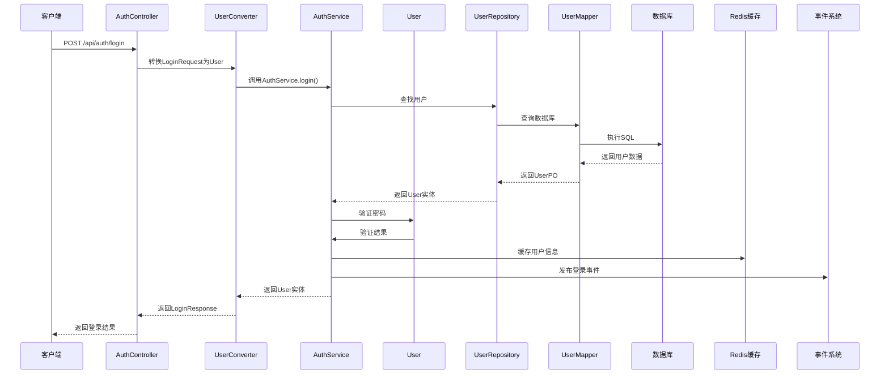

# Sci-Z 科研平台 DDD 架构设计 - 智能化科研项目管理

## 🎯 设计原则

1. **保持 DDD 核心思想**：领域驱动、分层架构、业务逻辑清晰
2. **简化实现**：降低学习成本，减少过度抽象
3. **适合单体应用**：避免微服务级别的复杂设计
4. **便于维护**：统一处理通用逻辑，减少重复代码
5. **智能化特色**：突出 AI 工作流和知识库管理特点

## 📁 平台目录结构

```
sci-z-server/
├── pom.xml
└── src/main/
    ├── java/com/sciz/server/
    │   ├── ServerApplication.java                    # 应用启动类
    │   │
    │   ├── interfaces/                                 # 接口层（用户接口层）
    │   │   ├── controller/                            # REST 控制器
    │   │   │   ├── user/                              # 用户模块控制器
    │   │   │   │   ├── UserController.java            # 用户管理
    │   │   │   │   ├── RoleController.java            # 角色管理
    │   │   │   │   ├── PermissionController.java      # 权限管理
    │   │   │   │   └── AuthController.java            # 认证授权
    │   │   │   ├── declaration/                       # 申报模块控制器
    │   │   │   │   └── DeclarationController.java     # 项目申报管理
    │   │   │   ├── project/                           # 项目管理模块控制器
    │   │   │   │   ├── ProjectController.java         # 项目管理
    │   │   │   │   ├── ProjectMemberController.java   # 项目成员管理
    │   │   │   │   ├── ProjectDocumentController.java # 项目文档管理
    │   │   │   │   ├── ProjectProgressController.java # 项目进度管理
    │   │   │   │   └── KnowledgeBaseController.java   # 知识库搜索
    │   │   │   ├── acceptance/                        # 验收模块控制器
    │   │   │   │   ├── AcceptanceController.java      # 验收管理
    │   │   │   │   └── ReportController.java          # 报告管理
    │   │   │   ├── ai/                                # AI助手模块控制器
    │   │   │   │   ├── ConversationController.java    # AI对话管理
    │   │   │   │   └── MessageController.java         # 消息管理
    │   │   │   ├── knowledge/                         # 知识库模块控制器
    │   │   │   │   ├── KnowledgeBaseController.java   # 知识库管理
    │   │   │   │   ├── KnowledgeFolderController.java # 文件夹管理
    │   │   │   │   └── KnowledgeFileController.java   # 文件管理
    │   │   │   ├── file/                              # 文件模块控制器
    │   │   │   │   └── FileController.java            # 文件管理
    │   │   │   └── system/                            # 系统管理模块控制器
    │   │   │       ├── IndustryConfigController.java  # 行业配置管理
    │   │   │       ├── DepartmentController.java      # 部门管理
    │   │   │       └── LogController.java             # 日志管理
    │   │   ├── assembler/                             # 接口层转换器（DTO <-> VO）
    │   │   │   ├── UserAssembler.java
    │   │   │   ├── DeclarationAssembler.java
    │   │   │   ├── ProjectAssembler.java
    │   │   │   └── AcceptanceAssembler.java
    │   │   ├── dto/                                   # 数据传输对象
    │   │   │   ├── request/                           # 请求 DTO
    │   │   │   │   ├── user/
    │   │   │   │   │   ├── UserRegisterRequest.java
    │   │   │   │   │   ├── UserLoginRequest.java
    │   │   │   │   │   └── UserUpdateRequest.java
    │   │   │   │   ├── declaration/
    │   │   │   │   │   └── DeclarationSubmitRequest.java
    │   │   │   │   ├── project/
    │   │   │   │   │   ├── ProjectCreateRequest.java
    │   │   │   │   │   ├── ProjectUpdateRequest.java
    │   │   │   │   │   ├── MemberAddRequest.java
    │   │   │   │   │   ├── ProgressAddRequest.java
    │   │   │   │   │   └── DocumentSearchRequest.java
    │   │   │   │   └── acceptance/
    │   │   │   │       ├── AcceptanceApplyRequest.java
    │   │   │   │       └── ReportGenerateRequest.java
    │   │   │   └── response/                          # 响应 DTO
    │   │   │       ├── user/
    │   │   │       │   ├── UserInfoResponse.java
    │   │   │       │   └── LoginResponse.java
    │   │   │       ├── declaration/
    │   │   │       │   ├── DeclarationDetailResponse.java
    │   │   │       │   └── DeclarationListResponse.java
    │   │   │       ├── project/
    │   │   │       │   ├── ProjectDetailResponse.java
    │   │   │       │   ├── ProjectListResponse.java
    │   │   │       │   ├── DocumentListResponse.java
    │   │   │       │   ├── SearchResultResponse.java
    │   │   │       │   └── ProgressListResponse.java
    │   │   │       └── acceptance/
    │   │   │           ├── AcceptanceDetailResponse.java
    │   │   │           ├── ReportStatusResponse.java
    │   │   │           └── ReportListResponse.java
    │   │   └── facade/                                # 门面接口（对外暴露）
    │   │       ├── UserFacade.java
    │   │       ├── DeclarationFacade.java
    │   │       ├── ProjectFacade.java
    │   │       └── AcceptanceFacade.java
    │   │
    │   ├── application/                               # 应用层（用例编排）
    │   │   ├── service/                              # 应用服务
    │   │   │   ├── user/                             # 用户应用服务
    │   │   │   │   ├── UserApplicationService.java   # 用户管理应用服务
    │   │   │   │   ├── AuthApplicationService.java   # 认证授权应用服务
    │   │   │   │   └── RoleApplicationService.java   # 角色权限应用服务
    │   │   │   ├── declaration/                      # 申报应用服务
    │   │   │   │   └── DeclarationApplicationService.java
    │   │   │   ├── project/                          # 项目应用服务
    │   │   │   │   ├── ProjectApplicationService.java
    │   │   │   │   ├── ProjectMemberApplicationService.java
    │   │   │   │   ├── ProjectDocumentApplicationService.java
    │   │   │   │   ├── ProjectProgressApplicationService.java
    │   │   │   │   └── KnowledgeBaseApplicationService.java
    │   │   │   ├── acceptance/                       # 验收应用服务
    │   │   │   │   ├── AcceptanceApplicationService.java
    │   │   │   │   └── ReportApplicationService.java
    │   │   │   ├── ai/                               # AI助手应用服务
    │   │   │   │   ├── ConversationApplicationService.java
    │   │   │   │   └── MessageApplicationService.java
    │   │   │   ├── knowledge/                        # 知识库应用服务
    │   │   │   │   ├── KnowledgeBaseApplicationService.java
    │   │   │   │   ├── KnowledgeFolderApplicationService.java
    │   │   │   │   └── KnowledgeFileApplicationService.java
    │   │   │   ├── file/                             # 文件应用服务
    │   │   │   │   └── FileApplicationService.java
    │   │   │   └── system/                           # 系统管理应用服务
    │   │   │       ├── IndustryConfigApplicationService.java
    │   │   │       ├── DepartmentApplicationService.java
    │   │   │       └── LogApplicationService.java
    │   │   ├── command/                              # 命令对象（写操作）
    │   │   │   ├── user/
    │   │   │   │   ├── CreateUserCommand.java
    │   │   │   │   └── UpdateUserCommand.java
    │   │   │   ├── declaration/
    │   │   │   │   └── SubmitDeclarationCommand.java
    │   │   │   ├── project/
    │   │   │   │   ├── CreateProjectCommand.java
    │   │   │   │   ├── UpdateProjectCommand.java
    │   │   │   │   ├── AddMemberCommand.java
    │   │   │   │   ├── UploadDocumentCommand.java
    │   │   │   │   └── AddProgressCommand.java
    │   │   │   └── acceptance/
    │   │   │       ├── ApplyAcceptanceCommand.java
    │   │   │       └── GenerateReportCommand.java
    │   │   ├── query/                                # 查询对象（读操作）
    │   │   │   ├── user/
    │   │   │   │   ├── UserQuery.java
    │   │   │   │   └── RoleQuery.java
    │   │   │   ├── declaration/
    │   │   │   │   └── DeclarationQuery.java
    │   │   │   ├── project/
    │   │   │   │   ├── ProjectQuery.java
    │   │   │   │   ├── DocumentQuery.java
    │   │   │   │   └── ProgressQuery.java
    │   │   │   └── acceptance/
    │   │   │       ├── AcceptanceQuery.java
    │   │   │       └── ReportQuery.java
    │   │   ├── event/                                # 应用事件（跨聚合协调）
    │   │   │   ├── handler/                          # 事件处理器
    │   │   │   │   ├── DeclarationEventHandler.java
    │   │   │   │   ├── ProjectEventHandler.java
    │   │   │   │   └── AcceptanceEventHandler.java
    │   │   │   └── publisher/                        # 事件发布器
    │   │   │       └── DomainEventPublisher.java
    │   │   └── assembler/                            # 应用层转换器（Command/Query <-> Domain）
    │   │       ├── UserApplicationAssembler.java
    │   │       ├── DeclarationApplicationAssembler.java
    │   │       ├── ProjectApplicationAssembler.java
    │   │       └── AcceptanceApplicationAssembler.java
    │   │
    │   ├── domain/                                    # 领域层（核心业务逻辑）
    │   │   ├── iam/                                   # 身份与访问管理领域（IAM）
    │   │   │   ├── aggregate/                        # 聚合根
    │   │   │   │   └── User.java                     # 用户聚合根
    │   │   │   ├── entity/                           # 实体
    │   │   │   │   ├── Role.java                     # 角色实体
    │   │   │   │   ├── Permission.java               # 权限实体
    │   │   │   │   ├── Department.java               # 部门实体
    │   │   │   │   ├── IndustryConfig.java           # 行业配置实体
    │   │   │   │   ├── LoginLog.java                 # 登录日志实体
    │   │   │   │   └── OperationLog.java             # 操作日志实体
    │   │   │   ├── valueobject/                      # 值对象
    │   │   │   │   ├── UserProfile.java              # 用户档案（扩展属性）
    │   │   │   │   ├── UserStatus.java               # 用户状态
    │   │   │   │   ├── Password.java                 # 密码值对象
    │   │   │   │   ├── RoleType.java                 # 角色类型
    │   │   │   │   ├── PermissionType.java           # 权限类型
    │   │   │   │   ├── DepartmentHierarchy.java      # 部门层级结构
    │   │   │   │   └── IndustryType.java             # 行业类型
    │   │   │   ├── service/                          # 领域服务
    │   │   │   │   ├── AuthenticationService.java    # 认证服务
    │   │   │   │   ├── UserDomainService.java        # 用户领域服务
    │   │   │   │   ├── RoleManagementService.java    # 角色管理服务
    │   │   │   │   ├── PermissionManagementService.java # 权限管理服务
    │   │   │   │   ├── DepartmentManagementService.java # 部门管理服务
    │   │   │   │   ├── IndustryConfigService.java    # 行业配置服务
    │   │   │   │   └── LogManagementService.java     # 日志管理服务
    │   │   │   └── repository/                       # 仓储接口
    │   │   │       ├── UserRepository.java
    │   │   │       ├── RoleRepository.java
    │   │   │       ├── PermissionRepository.java
    │   │   │       ├── DepartmentRepository.java
    │   │   │       ├── IndustryConfigRepository.java
    │   │   │       ├── LoginLogRepository.java
    │   │   │       └── OperationLogRepository.java
    │   │   ├── declaration/                          # 申报管理领域
    │   │   │   ├── aggregate/
    │   │   │   │   └── Declaration.java              # 申报聚合根
    │   │   │   ├── entity/
    │   │   │   │   └── WorkflowTemplate.java         # 工作流模板实体
    │   │   │   ├── valueobject/
    │   │   │   │   ├── DeclarationNumber.java        # 申报编号
    │   │   │   │   ├── ResearchDirection.java        # 研究方向
    │   │   │   │   ├── ResearchFields.java           # 研究领域
    │   │   │   │   ├── DeclarationStatus.java        # 申报状态
    │   │   │   │   ├── WorkflowStatus.java           # 工作流状态
    │   │   │   │   └── WorkflowResult.java           # Dify工作流结果
    │   │   │   ├── service/
    │   │   │   │   ├── DeclarationDomainService.java # 申报领域服务
    │   │   │   │   ├── DeclarationWorkflowService.java # 申报工作流服务
    │   │   │   │   └── WorkflowTemplateService.java  # 工作流模板服务
    │   │   │   └── repository/
    │   │   │       ├── DeclarationRepository.java
    │   │   │       └── WorkflowTemplateRepository.java
    │   │   ├── project/                              # 项目管理领域
    │   │   │   ├── aggregate/
    │   │   │   │   └── Project.java                  # 项目聚合根
    │   │   │   ├── entity/
    │   │   │   │   ├── ProjectMember.java            # 项目成员实体
    │   │   │   │   └── ProjectProgress.java          # 项目进度实体
    │   │   │   ├── valueobject/
    │   │   │   │   ├── ProjectNumber.java            # 项目编号
    │   │   │   │   ├── ProjectStatus.java            # 项目状态
    │   │   │   │   ├── Budget.java                   # 项目预算
    │   │   │   │   ├── ProgressPercentage.java       # 进度百分比
    │   │   │   │   ├── MemberRole.java               # 成员角色
    │   │   │   │   ├── Milestone.java                # 里程碑信息
    │   │   │   │   └── DifyKnowledgeId.java          # Dify知识库ID
    │   │   │   ├── service/
    │   │   │   │   ├── ProjectDomainService.java     # 项目领域服务
    │   │   │   │   ├── MemberManagementService.java  # 成员管理服务
    │   │   │   │   └── ProgressTrackingService.java  # 进度跟踪服务
    │   │   │   └── repository/
    │   │   │       ├── ProjectRepository.java
    │   │   │       ├── ProjectMemberRepository.java
    │   │   │       └── ProjectProgressRepository.java
    │   │   ├── report/                               # 报告管理领域
    │   │   │   ├── aggregate/
    │   │   │   │   └── ReportManagement.java         # 报告聚合根
    │   │   │   ├── entity/
    │   │   │   │   ├── GenerationConfig.java         # 生成配置实体
    │   │   │   │   └── ReportContent.java            # 报告内容实体
    │   │   │   ├── valueobject/
    │   │   │   │   ├── ReportNumber.java             # 报告编号
    │   │   │   │   ├── ReportType.java               # 报告类型
    │   │   │   │   ├── GenerationStatus.java         # 生成状态
    │   │   │   │   ├── ReportStyle.java              # 报告风格
    │   │   │   │   ├── DetailLevel.java              # 详细程度
    │   │   │   │   ├── ProgressInfo.java             # 生成进度
    │   │   │   │   └── DifyTaskId.java               # Dify任务ID
    │   │   │   ├── service/
    │   │   │   │   ├── ReportDomainService.java      # 报告领域服务
    │   │   │   │   ├── ReportGenerationService.java  # 报告生成服务
    │   │   │   │   └── ReportExportService.java      # 报告导出服务
    │   │   │   └── repository/
    │   │   │       ├── ReportManagementRepository.java
    │   │   │       ├── GenerationConfigRepository.java
    │   │   │       └── ReportContentRepository.java
    │   │   ├── file/                                 # 文件存储领域
    │   │   │   ├── aggregate/
    │   │   │   │   └── Attachment.java               # 附件聚合根
    │   │   │   ├── entity/
    │   │   │   │   └── AttachmentRelation.java       # 附件关联实体
    │   │   │   ├── valueobject/
    │   │   │   │   ├── FileName.java                 # 文件名称
    │   │   │   │   ├── FileMetadata.java             # 文件元数据
    │   │   │   │   ├── FileType.java                 # 文件类型
    │   │   │   │   ├── StoragePath.java              # 存储路径
    │   │   │   │   ├── MD5Hash.java                  # MD5哈希值
    │   │   │   │   ├── RelationType.java             # 关联类型
    │   │   │   │   ├── AttachmentType.java           # 附件类型
    │   │   │   │   └── DifyDocId.java                # Dify文档ID
    │   │   │   ├── service/
    │   │   │   │   ├── FileStorageService.java       # 文件存储服务
    │   │   │   │   ├── FileDeduplicationService.java # 文件去重服务
    │   │   │   │   ├── FileSyncService.java          # 文件同步服务
    │   │   │   │   └── FileRelationService.java      # 关联管理服务
    │   │   │   └── repository/
    │   │   │       ├── AttachmentRepository.java
    │   │   │       └── AttachmentRelationRepository.java
    │   │   ├── ai/                                   # AI助手领域（辅助）
    │   │   │   ├── aggregate/
    │   │   │   │   └── Conversation.java             # 对话聚合根
    │   │   │   ├── entity/
    │   │   │   │   └── Message.java                  # 消息实体
    │   │   │   ├── valueobject/
    │   │   │   │   ├── ConversationTitle.java        # 会话标题
    │   │   │   │   ├── MessageRole.java              # 消息角色
    │   │   │   │   ├── MessageContent.java           # 消息内容
    │   │   │   │   ├── MessageSource.java            # 知识来源
    │   │   │   │   ├── Confidence.java               # 置信度
    │   │   │   │   ├── PinStatus.java                # 置顶状态
    │   │   │   │   └── DifyConversationId.java       # Dify会话ID
    │   │   │   ├── service/
    │   │   │   │   ├── ConversationService.java      # 对话管理服务
    │   │   │   │   ├── AIChatService.java            # AI聊天服务
    │   │   │   │   └── MessageService.java           # 消息服务
    │   │   │   └── repository/
    │   │   │       ├── ConversationRepository.java
    │   │   │       └── MessageRepository.java
    │   │   ├── knowledge/                            # 知识库领域
    │   │   │   ├── aggregate/
    │   │   │   │   └── KnowledgeBase.java            # 知识库聚合根
    │   │   │   ├── entity/
    │   │   │   │   ├── KnowledgeFolder.java          # 文件夹实体
    │   │   │   │   └── FileRelation.java             # 文件关联实体
    │   │   │   ├── valueobject/
    │   │   │   │   ├── KnowledgeStatus.java          # 知识库状态
    │   │   │   │   ├── FolderPath.java               # 文件夹路径
    │   │   │   │   ├── DifyKnowledgeId.java          # Dify知识库ID
    │   │   │   │   └── ShareStatus.java              # 共享状态
    │   │   │   ├── service/
    │   │   │   │   ├── KnowledgeManagementService.java # 知识库管理服务
    │   │   │   │   ├── FolderManagementService.java  # 文件夹管理服务
    │   │   │   │   ├── KnowledgeFileService.java     # 文件管理服务
    │   │   │   │   └── KnowledgeSearchService.java   # 知识检索服务
    │   │   │   └── repository/
    │   │   │       ├── KnowledgeBaseRepository.java
    │   │   │       ├── KnowledgeFolderRepository.java
    │   │   │       └── FileRelationRepository.java
    │   │   ├── config/                               # 系统配置领域（辅助）
    │   │   │   ├── aggregate/
    │   │   │   │   └── SystemConfig.java             # 系统配置聚合根
    │   │   │   ├── valueobject/
    │   │   │   │   ├── ConfigKey.java                # 配置键
    │   │   │   │   ├── ConfigValue.java              # 配置值
    │   │   │   │   ├── ConfigType.java               # 配置类型
    │   │   │   │   └── EncryptionStatus.java         # 是否加密
    │   │   │   ├── service/
    │   │   │   │   ├── SystemConfigService.java      # 系统配置服务
    │   │   │   │   └── ConfigValidationService.java  # 配置验证服务
    │   │   │   └── repository/
    │   │   │       └── SystemConfigRepository.java
    │   │   └── shared/                               # 共享领域（跨领域）
    │   │       ├── valueobject/                      # 共享值对象
    │   │       │   ├── UserId.java
    │   │       │   ├── ProjectId.java
    │   │       │   ├── DeclarationId.java
    │   │       │   ├── ReportId.java
    │   │       │   ├── AttachmentId.java
    │   │       │   ├── ConversationId.java
    │   │       │   ├── KnowledgeBaseId.java
    │   │       │   ├── DateRange.java
    │   │       │   └── AuditInfo.java                # 审计信息
    │   │       ├── event/                            # 领域事件
    │   │       │   ├── DeclarationSubmittedEvent.java # 申报提交事件
    │   │       │   ├── DeclarationApprovedEvent.java  # 申报通过事件（触发项目创建）
    │   │       │   ├── ProjectCreatedEvent.java       # 项目创建事件
    │   │       │   ├── ProjectCompletedEvent.java     # 项目完成事件
    │   │       │   ├── FileUploadedEvent.java         # 文件上传事件
    │   │       │   ├── FileSyncedEvent.java           # 文件同步到Dify事件
    │   │       │   ├── ReportGenerationStartedEvent.java # 报告生成开始事件
    │   │       │   ├── ReportGeneratedEvent.java      # 报告生成完成事件
    │   │       │   └── KnowledgeBaseCreatedEvent.java # 知识库创建事件
    │   │       └── exception/                        # 领域异常
    │   │           ├── DomainException.java
    │   │           ├── UserNotFoundException.java
    │   │           ├── PermissionDeniedException.java
    │   │           ├── RoleNotFoundException.java
    │   │           ├── DepartmentNotFoundException.java
    │   │           ├── DeclarationNotFoundException.java
    │   │           ├── ProjectNotFoundException.java
    │   │           ├── ReportNotFoundException.java
    │   │           ├── FileNotFoundException.java
    │   │           ├── KnowledgeBaseNotFoundException.java
    │   │           └── InvalidOperationException.java
    │   │
    │   ├── infrastructure/                            # 基础设施层（技术实现）
    │   │   ├── config/                               # 配置类
    │   │   │   ├── database/
    │   │   │   │   ├── DataSourceConfig.java         # 数据源配置
    │   │   │   │   ├── MyBatisPlusConfig.java        # MyBatis-Plus 配置
    │   │   │   │   └── TransactionConfig.java        # 事务配置
    │   │   │   ├── cache/
    │   │   │   │   ├── RedisConfig.java              # Redis 配置
    │   │   │   │   └── CacheConfig.java              # 缓存配置
    │   │   │   ├── mq/
    │   │   │   │   ├── KafkaConfig.java              # Kafka 配置
    │   │   │   │   └── KafkaTopicConfig.java         # Kafka Topic 配置
    │   │   │   ├── security/
    │   │   │   │   ├── SaTokenConfig.java            # Sa-Token 配置
    │   │   │   │   └── SecurityConfig.java           # 安全配置
    │   │   │   ├── storage/
    │   │   │   │   └── MinioConfig.java              # Minio 配置
    │   │   │   ├── ai/
    │   │   │   │   ├── DifyConfig.java               # Dify 配置
    │   │   │   │   └── LangChain4jConfig.java        # LangChain4j 配置
    │   │   │   ├── web/
    │   │   │   │   ├── WebMvcConfig.java             # Spring MVC 配置
    │   │   │   │   ├── CorsConfig.java               # 跨域配置
    │   │   │   │   └── SwaggerConfig.java            # Swagger API文档配置
    │   │   │   ├── idempotent/                       # 幂等性配置
    │   │   │   │   ├── IdempotentConfig.java         # 幂等性配置
    │   │   │   │   └── IdempotentInterceptor.java    # 幂等性拦截器
    │   │   │   ├── retry/                            # 重试机制配置
    │   │   │   │   ├── RetryConfig.java              # 重试策略配置
    │   │   │   │   └── CircuitBreakerConfig.java     # 断路器配置
    │   │   │   └── trace/                            # 链路追踪配置
    │   │   │       ├── TraceConfig.java              # TraceId配置
    │   │   │       └── TraceIdFilter.java            # TraceId过滤器
    │   │   ├── persistence/                          # 持久化实现
    │   │   │   ├── mapper/                           # MyBatis-Plus Mapper
    │   │   │   │   ├── UserMapper.java
    │   │   │   │   ├── RoleMapper.java
    │   │   │   │   ├── PermissionMapper.java
    │   │   │   │   ├── UserRoleMapper.java
    │   │   │   │   ├── RolePermissionMapper.java
    │   │   │   │   ├── IndustryConfigMapper.java
    │   │   │   │   ├── DepartmentMapper.java
    │   │   │   │   ├── UserProfileMapper.java
    │   │   │   │   ├── LoginLogMapper.java
    │   │   │   │   ├── DeclarationMapper.java
    │   │   │   │   ├── WorkflowTemplateMapper.java
    │   │   │   │   ├── ProjectMapper.java
    │   │   │   │   ├── ProjectMemberMapper.java
    │   │   │   │   ├── ProjectProgressMapper.java
    │   │   │   │   ├── AttachmentMapper.java
    │   │   │   │   ├── AttachmentRelationMapper.java
    │   │   │   │   ├── ConversationMapper.java
    │   │   │   │   ├── MessageMapper.java
    │   │   │   │   ├── KnowledgeBaseMapper.java
    │   │   │   │   ├── KnowledgeFolderMapper.java
    │   │   │   │   ├── KnowledgeFileRelationMapper.java
    │   │   │   │   ├── ReportManagementMapper.java
    │   │   │   │   ├── ReportGenerationConfigMapper.java
    │   │   │   │   ├── ReportContentMapper.java
    │   │   │   │   ├── ConfigMapper.java
    │   │   │   │   └── OperationLogMapper.java
    │   │   │   ├── po/                               # 持久化对象（数据库实体）
    │   │   │   │   ├── UserPO.java
    │   │   │   │   ├── RolePO.java
    │   │   │   │   ├── PermissionPO.java
    │   │   │   │   ├── UserRolePO.java
    │   │   │   │   ├── RolePermissionPO.java
    │   │   │   │   ├── IndustryConfigPO.java
    │   │   │   │   ├── DepartmentPO.java
    │   │   │   │   ├── UserProfilePO.java
    │   │   │   │   ├── LoginLogPO.java
    │   │   │   │   ├── DeclarationPO.java
    │   │   │   │   ├── WorkflowTemplatePO.java
    │   │   │   │   ├── ProjectPO.java
    │   │   │   │   ├── ProjectMemberPO.java
    │   │   │   │   ├── ProjectProgressPO.java
    │   │   │   │   ├── AttachmentPO.java
    │   │   │   │   ├── AttachmentRelationPO.java
    │   │   │   │   ├── ConversationPO.java
    │   │   │   │   ├── MessagePO.java
    │   │   │   │   ├── KnowledgeBasePO.java
    │   │   │   │   ├── KnowledgeFolderPO.java
    │   │   │   │   ├── KnowledgeFileRelationPO.java
    │   │   │   │   ├── ReportManagementPO.java
    │   │   │   │   ├── ReportGenerationConfigPO.java
    │   │   │   │   ├── ReportContentPO.java
    │   │   │   │   ├── ConfigPO.java
    │   │   │   │   └── OperationLogPO.java
    │   │   │   ├── converter/                        # 转换器（PO <-> Domain）
    │   │   │   │   ├── UserConverter.java
    │   │   │   │   ├── DeclarationConverter.java
    │   │   │   │   ├── ProjectConverter.java
    │   │   │   │   ├── ReportConverter.java
    │   │   │   │   ├── KnowledgeConverter.java
    │   │   │   │   └── AIConverter.java
    │   │   │   └── repository/                       # 仓储实现
    │   │   │       ├── UserRepositoryImpl.java
    │   │   │       ├── RoleRepositoryImpl.java
    │   │   │       ├── PermissionRepositoryImpl.java
    │   │   │       ├── IndustryConfigRepositoryImpl.java
    │   │   │       ├── DepartmentRepositoryImpl.java
    │   │   │       ├── DeclarationRepositoryImpl.java
    │   │   │       ├── ProjectRepositoryImpl.java
    │   │   │       ├── ProjectMemberRepositoryImpl.java
    │   │   │       ├── ProjectDocumentRepositoryImpl.java
    │   │   │       ├── AcceptanceRepositoryImpl.java
    │   │   │       ├── ReportRepositoryImpl.java
    │   │   │       ├── ReportManagementRepositoryImpl.java
    │   │   │       ├── ConversationRepositoryImpl.java
    │   │   │       ├── MessageRepositoryImpl.java
    │   │   │       ├── KnowledgeBaseRepositoryImpl.java
    │   │   │       ├── AttachmentRepositoryImpl.java
    │   │   │       └── FileRepositoryImpl.java
    │   │   ├── external/                          # 外部系统集成
    │   │   │   ├── dify/                             # Dify 集成
    │   │   │   │   ├── DifyClient.java               # Dify 客户端
    │   │   │   │   ├── DifyWorkflowClient.java       # 工作流客户端
    │   │   │   │   ├── DifyKnowledgeBaseClient.java  # 知识库客户端
    │   │   │   │   ├── dto/                          # Dify DTO
    │   │   │   │   │   ├── WorkflowRequest.java
    │   │   │   │   │   ├── WorkflowResponse.java
    │   │   │   │   │   ├── KnowledgeBaseRequest.java
    │   │   │   │   │   └── KnowledgeBaseResponse.java
    │   │   │   │   └── adapter/                      # Dify 适配器
    │   │   │   │       ├── DeclarationWorkflowAdapter.java
    │   │   │   │       ├── ReportWorkflowAdapter.java
    │   │   │   │       └── KnowledgeBaseAdapter.java
    │   │   │   ├── minio/                            # Minio 集成
    │   │   │   │   ├── MinioClient.java              # Minio 客户端
    │   │   │   │   ├── MinioStorageService.java      # 存储服务实现
    │   │   │   │   └── dto/
    │   │   │   │       ├── UploadRequest.java
    │   │   │   │       └── UploadResponse.java
    │   │   │   └── kafka/                            # Kafka 集成
    │   │   │       ├── producer/                     # 生产者
    │   │   │       │   └── EventProducer.java
    │   │   │       └── consumer/                     # 消费者
    │   │   │           ├── DeclarationEventConsumer.java
    │   │   │           ├── DocumentEventConsumer.java
    │   │   │           └── ReportEventConsumer.java
    │   │   └── common/                               # 基础设施公共组件
    │   │       ├── annotation/                       # 自定义注解
    │   │       │   ├── Idempotent.java               # 幂等性注解
    │   │       │   ├── Retry.java                    # 重试注解
    │   │       │   ├── TraceLog.java                 # 链路追踪日志注解
    │   │       │   └── ApiVersion.java               # API版本注解
    │   │       ├── aspect/                           # AOP 切面
    │   │       │   ├── LogAspect.java                # 日志切面（含TraceId）
    │   │       │   ├── PermissionAspect.java         # 权限切面
    │   │       │   ├── TransactionAspect.java        # 事务切面
    │   │       │   ├── IdempotentAspect.java         # 幂等性切面
    │   │       │   └── RetryAspect.java              # 重试切面
    │   │       ├── interceptor/                      # 拦截器
    │   │       │   ├── AuthInterceptor.java          # 认证拦截器
    │   │       │   ├── RateLimitInterceptor.java     # 限流拦截器
    │   │       │   ├── IdempotentInterceptor.java    # 幂等性拦截器
    │   │       │   └── TraceIdInterceptor.java       # TraceId拦截器
    │   │       ├── filter/                           # 过滤器
    │   │       │   ├── AuthFilter.java               # 认证过滤器
    │   │       │   ├── CorsFilter.java               # 跨域过滤器
    │   │       │   └── TraceIdFilter.java            # TraceId过滤器（请求入口）
    │   │       └── handler/                          # 处理器
    │   │           ├── GlobalExceptionHandler.java   # 全局异常处理器
    │   │           ├── ResponseHandler.java          # 响应处理器
    │   │           └── RetryHandler.java             # 重试处理器
    │   │
    │   └── shared/                                    # 共享内核（跨层共享）
    │       ├── result/                               # 统一返回结果
    │       │   ├── Result.java                       # 统一结果类
    │       │   ├── PageResult.java                   # 分页结果类
    │       │   └── ResultCode.java                   # 结果码枚举
    │       ├── exception/                            # 全局异常
    │       │   ├── BusinessException.java            # 业务异常
    │       │   ├── SystemException.java              # 系统异常
    │       │   └── ExceptionCode.java                # 异常码枚举
    │       ├── constant/                             # 常量定义
    │       │   ├── SystemConstants.java              # 系统常量
    │       │   ├── CacheConstants.java               # 缓存常量
    │       │   └── KafkaTopicConstants.java          # Kafka Topic 常量
    │       ├── enums/                                # 枚举定义
    │       │   ├── UserStatus.java                   # 用户状态
    │       │   ├── DeclarationStatus.java            # 申报状态
    │       │   ├── ProjectStatus.java                # 项目状态
    │       │   ├── AcceptanceStatus.java             # 验收状态
    │       │   └── ReportType.java                   # 报告类型
    │       └── util/                                 # 工具类
    │           ├── JsonUtil.java                     # JSON 工具
    │           ├── DateUtil.java                     # 日期工具
    │           ├── StringUtil.java                   # 字符串工具
    │           ├── EncryptUtil.java                  # 加密工具
    │           ├── IdGenerator.java                  # ID 生成器
    │           ├── TraceIdUtil.java                  # TraceId 工具
    │           ├── IdempotentUtil.java               # 幂等性工具
    │           └── RetryUtil.java                    # 重试工具
    │
    └── resources/
        ├── application.yml                            # 主配置文件
        ├── application-dev.yml                        # 开发环境配置
        ├── application-test.yml                       # 测试环境配置
        ├── application-prod.yml                       # 生产环境配置
        ├── mapper/                                    # MyBatis XML 映射文件
        │   ├── UserMapper.xml
        │   ├── RoleMapper.xml
        │   ├── PermissionMapper.xml
        │   ├── IndustryConfigMapper.xml
        │   ├── DepartmentMapper.xml
        │   ├── DeclarationMapper.xml
        │   ├── ProjectMapper.xml
        │   ├── AcceptanceMapper.xml
        │   ├── ReportManagementMapper.xml
        │   ├── ConversationMapper.xml
        │   ├── MessageMapper.xml
        │   ├── KnowledgeBaseMapper.xml
        │   └── AttachmentMapper.xml
        ├── db/                                        # 数据库脚本
        │   ├── migration/                            # 数据库迁移脚本
        │   │   ├── V1__init_all_tables.sql
        │   └── seed/                                 # 初始数据
        │       └── init_data.sql
        ├── logback-spring.xml                         # 日志配置
        └── static/                                    # 静态资源
```

## 📋 核心概念解释

### 1. **Domain 层对象模型（POJO）**

#### **Entity（领域实体）**

- **定义**：具有唯一标识的业务对象，包含业务逻辑
- **特点**：有 ID，有生命周期，包含业务规则
- **示例**：User、Project、Declaration 等

#### **DTO（数据传输对象）**

- **定义**：用于不同层之间传输数据的对象
- **特点**：无业务逻辑，纯数据传输
- **分类**：
  - **Request DTO**：接收外部请求数据
  - **Response DTO**：返回给外部响应数据

### 2. **Mapper vs Repository 区别**

#### **Mapper（数据映射接口）**

- **职责**：定义数据库操作接口
- **特点**：MyBatis 框架，直接操作数据库
- **作用**：CRUD 操作，SQL 映射
- **示例**：

```java
@Mapper
public interface UserMapper {
    User selectById(Long id);
    int insert(User user);
    int update(User user);
    int deleteById(Long id);
}
```

#### **Repository（仓储接口）**

- **职责**：定义领域数据访问接口
- **特点**：领域驱动设计，业务导向
- **作用**：聚合根管理，业务查询
- **示例**：

```java
public interface UserRepository {
    User findById(UserId id);
    User findByUsername(Username username);
    void save(User user);
    void remove(User user);
}
```
#### **关系说明**

- **Mapper**：技术实现层，关注数据操作
- **Repository**：业务抽象层，关注领域概念
- **Repository 实现**：在 Infrastructure 层实现，内部调用 Mapper

### 3. **Application Service 实现类划分**

#### **接口与实现分离**

- **Service 接口**：定义业务契约
- **ServiceImpl 实现**：具体业务逻辑实现

#### **实现类职责**

- **业务编排**：协调多个 Domain 服务
- **事务管理**：使用@Transactional
- **事件发布**：发布领域事件
- **外部调用**：调用外部服务

## 🔄 模块交互流程详解

### 1. **Interfaces 层（对外接口）**

**职责**：处理 HTTP 请求，参数校验，数据转换

**工作流程**：

1. **接收请求**：Controller 接收 HTTP 请求
2. **参数校验**：使用@Valid 注解进行参数验证
3. **数据转换**：使用 Converter 将 DTO 转换为领域对象
4. **调用服务**：调用 Application 层的服务
5. **结果转换**：将领域对象转换为 DTO 返回

**关键组件**：

- **Controller**：按业务模块分类的 REST 控制器
- **Converter**：DTO 与领域对象之间的转换器

### 2. **Application 层（业务编排）**

**职责**：编排业务用例，事务管理，跨聚合协调

**工作流程**：

1. **接收调用**：接收来自 Interfaces 层的调用
2. **业务编排**：协调多个 Domain 层的服务
3. **事务管理**：使用@Transactional 管理事务边界
4. **事件发布**：发布领域事件
5. **结果返回**：将处理结果返回给 Interfaces 层

**关键组件**：

- **Service 接口**：定义业务契约
- **ServiceImpl 实现**：具体业务逻辑实现
- **Task**：任务调度（定时任务、异步任务、工作流任务）

### 3. **Domain 层（核心业务）**

**职责**：核心业务逻辑，业务规则，领域模型

**工作流程**：

1. **接收调用**：接收来自 Application 层的调用
2. **业务验证**：执行业务规则验证
3. **状态变更**：修改实体状态
4. **事件发布**：发布领域事件
5. **数据持久化**：通过 Repository 接口保存数据

**关键组件**：

- **Entity**：领域实体，包含业务逻辑
- **DTO**：数据传输对象
- **Mapper**：数据映射接口
- **Repository**：仓储接口，定义数据访问契约

### 4. **Infrastructure 层（技术实现）**

**职责**：技术实现，外部集成，数据持久化

**工作流程**：

1. **实现接口**：实现 Domain 层定义的 Repository 接口
2. **数据持久化**：通过 MyBatis 进行数据库操作
3. **外部集成**：集成 Dify、MinIO、Kafka 等外部服务
4. **事件处理**：处理领域事件，调用外部服务
5. **缓存管理**：通过 Redis 进行缓存操作

**关键组件**：

- **Config**：配置类（database、cache、mq、security、storage、ai、web、idempotent、retry、trace）
- **External**：外部服务集成（dify、minio、kafka、redis）
- **Common**：通用组件（annotation、interceptor、aspect、handler、filter）
- **Shared**：共享组件（result、exception、event、constant、enums、utils）

## 🎯 架构特色优势

### ✅ **智能化特色**

- **AI 工作流集成**：深度集成 Dify 平台
- **智能知识库**：支持语义搜索和 AI 问答
- **智能报告生成**：基于 AI 的自动化报告生成
- **智能搜索**：支持向量化搜索和语义理解

### ✅ **科研领域特色**

- **项目全生命周期管理**：从申报到验收的完整流程
- **多角色权限管理**：支持不同角色的权限控制
- **行业配置化**：支持不同行业的动态字段配置
- **工作流自动化**：基于 Dify 的智能工作流编排

### ✅ **技术架构优势**

- **贴近实际开发**：避免过度理论化的 DDD 概念
- **学习成本低**：目录结构清晰，易于理解
- **开发效率高**：使用工具自动生成，减少重复代码
- **维护简单**：统一处理通用逻辑，共享组件

### ✅ **业务导向**

- **科研项目管理**：突出科研领域的业务特点
- **AI 集成**：深度集成 Dify 平台，支持智能工作流
- **知识库管理**：支持知识库的创建、管理和搜索
- **多角色权限**：支持不同角色的权限控制

### ✅ **技术架构**

- **分层清晰**：四层架构，职责分明
- **依赖倒置**：Domain 层不依赖 Infrastructure 层
- **事件驱动**：使用事件解耦业务逻辑
- **统一处理**：异常、事件、转换等统一处理

## 📋 实施建议

### 1. **渐进式实施**

- **第一阶段**：实现核心领域（user、project）
- **第二阶段**：添加申报和报告功能
- **第三阶段**：集成知识库和 AI 功能
- **第四阶段**：优化性能和用户体验

### 2. **团队培训**

- **DDD 核心概念**：重点讲解聚合根、实体、值对象
- **架构设计原则**：讲解分层架构和依赖倒置
- **开发规范**：建立代码规范和命名约定
- **工具使用**：培训 MapStruct、MyBatis 等工具使用

### 3. **工具支持**

- **代码生成**：使用 MapStruct 自动生成转换器
- **数据库管理**：使用 Flyway 进行数据库版本管理
- **API 文档**：使用 Swagger 生成 API 文档
- **监控告警**：集成监控和日志系统

## 🏆 总结

这个 Sci-Z 科研平台的 DDD 架构设计具有以下特点：

### 🎯 **智能化特色**

- 深度集成 AI 工作流和知识库管理
- 支持智能搜索和自动化报告生成
- 突出科研领域的业务特点

### 🏗️ **架构优势**

- 既保持 DDD 核心思想，又降低复杂度
- 适合单体应用和初中级团队
- 支持未来扩展为微服务架构

### 🚀 **实施价值**

- **快速开发**：简化实现，专注业务逻辑
- **易于维护**：统一处理，减少重复代码
- **团队友好**：降低学习成本，提高开发效率

通过这种设计，团队可以更好地理解 DDD 思想，同时构建出具有鲜明特色的智能化科研项目管理平台！

## 🚀 完整登录示例 - 覆盖所有目录结构

### 📋 登录业务流程



### 🔧 具体代码实现

#### 1. **Interfaces 层 - 对外接口**

##### **Controller（控制器）**

```java
// interfaces/controller/AuthController.java
@RestController
@RequestMapping("/api/auth")
@Slf4j
public class AuthController {

    @Autowired
    private AuthService authService;

    @Autowired
    private UserConverter userConverter;

    @PostMapping("/login")
    public Result<LoginResp> login(@Valid @RequestBody LoginReq request) {
        log.info("用户登录请求: {}", request.getUsername());

        // 1. 转换DTO为领域对象
        User user = userConverter.toDomain(request);

        // 2. 调用应用服务
        User loginUser = authService.login(user);

        // 3. 转换领域对象为响应DTO
        LoginResp response = userConverter.toResponse(loginUser);

        return Result.success(response);
    }
}
```

##### **Converter（转换器）**

```java
// interfaces/converter/UserConverter.java
@Mapper(componentModel = "spring")
public interface UserConverter {

    UserConverter INSTANCE = Mappers.getMapper(UserConverter.class);

    // DTO -> Domain Object
    User toDomain(LoginReq request);

    // Domain Object -> Response DTO
    LoginResp toResponse(User user);

}
```

#### 2. **Application 层 - 业务编排**

##### **Service 接口**

```java
// application/service/AuthService.java
public interface AuthService {

    /**
     * 用户登录
     * @param user 用户信息
     * @return 登录后的用户信息
     */
    User login(User user);

    /**
     * 用户登出
     * @param userId 用户ID
     */
    void logout(Long userId);
}
```

##### **ServiceImpl 实现**

```java
// application/impl/AuthServiceImpl.java
@Service
@Transactional
@Slf4j
public class AuthServiceImpl implements AuthService {

    @Autowired
    private UserRepository userRepository;

    @Autowired
    private RedisService redisService;

    @Autowired
    private EventPublisher eventPublisher;

    @Override
    public User login(User user) {
        // 1. 查找用户
        User foundUser = userRepository.findByUsername(user.getUsername());
        if (foundUser == null) {
            throw new NotFoundException("用户不存在");
        }

        // 2. 验证密码
        if (!foundUser.validatePassword(user.getPassword())) {
            throw new ValidationException("密码错误");
        }

        // 3. 更新登录时间
        foundUser.updateLastLoginTime();
        userRepository.save(foundUser);

        // 4. 缓存用户信息
        redisService.setUserInfo(foundUser);

        // 5. 发布登录事件
        eventPublisher.publish(new UserLoginEvent(foundUser));

        log.info("用户登录成功: {}", foundUser.getUsername());
        return foundUser;
    }

    @Override
    public void logout(Long userId) {
        // 1. 清除缓存
        redisService.removeUserInfo(userId);

        // 2. 发布登出事件
        eventPublisher.publish(new UserLogoutEvent(userId));

        log.info("用户登出: {}", userId);
    }
}
```

##### **Task（任务调度）**

```java
// application/task/ScheduledTask.java
@Component
@Slf4j
public class ScheduledTask {

    @Autowired
    private UserRepository userRepository;

    /**
     * 定时清理过期登录信息
     */
    @Scheduled(fixedRate = 3600000) // 每小时执行一次
    public void cleanExpiredLoginInfo() {
        log.info("开始清理过期登录信息");
        // 清理逻辑
    }
}
```

#### 3. **Domain 层 - 核心业务**

##### **Entity（领域实体）**

```java
// domain/pojo/entity/user/User.java
@Entity
@Table(name = "sys_user")
public class User {

    @Id
    private Long id;

    private String username;
    private String password;
    private String email;
    private UserStatus status;
    private LocalDateTime lastLoginTime;

    /**
     * 验证密码
     */
    public boolean validatePassword(String inputPassword) {
        return BCrypt.checkpw(inputPassword, this.password);
    }

    /**
     * 更新最后登录时间
     */
    public void updateLastLoginTime() {
        this.lastLoginTime = LocalDateTime.now();
    }

    /**
     * 检查用户状态
     */
    public boolean isActive() {
        return this.status == UserStatus.ACTIVE;
    }

    // getter、setter方法
}
```

##### **DTO（数据传输对象）**

```java
// domain/pojo/dto/request/LoginReq.java
public class LoginReq {

    @NotBlank(message = "用户名不能为空")
    private String username;

    @NotBlank(message = "密码不能为空")
    private String password;

    private Boolean rememberMe = false;

    // getter、setter方法
}

// domain/pojo/dto/response/LoginResp.java
public class LoginResp {
    private String token;
    private String refreshToken;
    private UserInfo userInfo;
    private Long expiresIn;

    // getter、setter方法
}
```

##### **Mapper（数据映射接口）**

```java
// domain/mapper/UserMapper.java
@Mapper
public interface UserMapper {

    /**
     * 根据用户名查找用户
     */
    UserPO selectByUsername(@Param("username") String username);

    /**
     * 更新用户信息
     */
    int updateUser(UserPO userPO);

    /**
     * 插入用户
     */
    int insertUser(UserPO userPO);
}
```

##### **Repository（仓储接口）**

```java
// domain/repository/UserRepository.java
public interface UserRepository {

    /**
     * 根据用户名查找用户
     */
    User findByUsername(String username);

    /**
     * 保存用户
     */
    User save(User user);

    /**
     * 根据ID查找用户
     */
    User findById(Long id);
}
```

#### 4. **Infrastructure 层 - 技术实现**

##### **Config（配置类）**

```java
// infrastructure/config/database/DatabaseConfig.java
@Configuration
@EnableTransactionManagement
public class DatabaseConfig {

    @Bean
    @ConfigurationProperties("spring.datasource")
    public DataSource dataSource() {
        return new HikariDataSource();
    }

    @Bean
    public SqlSessionFactory sqlSessionFactory() throws Exception {
        SqlSessionFactoryBean factoryBean = new SqlSessionFactoryBean();
        factoryBean.setDataSource(dataSource());
        return factoryBean.getObject();
    }
}

// infrastructure/config/cache/RedisConfig.java
@Configuration
@EnableCaching
public class RedisConfig {

    @Bean
    public RedisTemplate<String, Object> redisTemplate(RedisConnectionFactory factory) {
        RedisTemplate<String, Object> template = new RedisTemplate<>();
        template.setConnectionFactory(factory);
        template.setKeySerializer(new StringRedisSerializer());
        template.setValueSerializer(new GenericJackson2JsonRedisSerializer());
        return template;
    }
}

// infrastructure/config/security/SecurityConfig.java
@Configuration
@EnableWebSecurity
public class SecurityConfig {

    @Bean
    public PasswordEncoder passwordEncoder() {
        return new BCryptPasswordEncoder();
    }

    @Bean
    public SecurityFilterChain filterChain(HttpSecurity http) throws Exception {
        return http
            .csrf().disable()
            .authorizeHttpRequests()
            .requestMatchers("/api/auth/**").permitAll()
            .anyRequest().authenticated()
            .and()
            .build();
    }
}
```

##### **Common（通用组件）**

```java
// infrastructure/common/annotation/Log.java
@Target(ElementType.METHOD)
@Retention(RetentionPolicy.RUNTIME)
public @interface Log {
    String value() default "";
    String module() default "";
}

// infrastructure/common/aspect/LogAspect.java
@Aspect
@Component
@Slf4j
public class LogAspect {

    @Around("@annotation(log)")
    public Object around(ProceedingJoinPoint point, Log log) throws Throwable {
        long startTime = System.currentTimeMillis();
        try {
            Object result = point.proceed();
            long endTime = System.currentTimeMillis();
            log.info("方法执行完成，耗时: {}ms", endTime - startTime);
            return result;
        } catch (Exception e) {
            log.error("方法执行异常", e);
            throw e;
        }
    }
}

// infrastructure/common/handler/GlobalExceptionHandler.java
@RestControllerAdvice
@Slf4j
public class GlobalExceptionHandler {

    @ExceptionHandler(BusinessException.class)
    public Result<Void> handleBusinessException(BusinessException e) {
        log.error("业务异常: {}", e.getMessage());
        return Result.error(e.getCode(), e.getMessage());
    }

    @ExceptionHandler(ValidationException.class)
    public Result<Void> handleValidationException(ValidationException e) {
        log.error("验证异常: {}", e.getMessage());
        return Result.error("VALIDATION_ERROR", e.getMessage());
    }
}
```

##### **EventPublisher（事件发布器）**

```java
// infrastructure/shared/event/EventPublisher.java
@Component
@Slf4j
public class EventPublisher {

    @Autowired
    private ApplicationEventPublisher applicationEventPublisher;

    /**
     * 发布领域事件
     * @param event 领域事件
     */
    public void publish(DomainEvent event) {
        log.info("发布领域事件: {}", event.getClass().getSimpleName());
        applicationEventPublisher.publishEvent(event);
    }

    /**
     * 发布用户登录事件
     * @param user 用户信息
     */
    public void publishUserLogin(User user) {
        UserLoginEvent event = new UserLoginEvent(user);
        publish(event);
    }

    /**
     * 发布用户登出事件
     * @param userId 用户ID
     */
    public void publishUserLogout(Long userId) {
        UserLogoutEvent event = new UserLogoutEvent(userId);
        publish(event);
    }

    /**
     * 发布项目创建事件
     * @param project 项目信息
     */
    public void publishProjectCreated(Project project) {
        ProjectCreatedEvent event = new ProjectCreatedEvent(project);
        publish(event);
    }
}
```

##### **External（外部服务集成）**

```java
// infrastructure/external/dify/dto/request/DifyChatReq.java
public class DifyChatReq {
    private String query;
    private String conversationId;
    private String user;
    private Map<String, Object> inputs;
    private String responseMode;
    private String userId;

    // getter、setter方法
}

// infrastructure/external/dify/dto/response/DifyChatResp.java
public class DifyChatResp {
    private String message;
    private String conversationId;
    private String messageId;
    private String answer;
    private Map<String, Object> metadata;
    private String createdAt;

    // getter、setter方法
}

// infrastructure/external/minio/dto/request/MinioUploadReq.java
public class MinioUploadReq {
    private String bucketName;
    private String objectName;
    private MultipartFile file;
    private String contentType;
    private Map<String, String> metadata;

    // getter、setter方法
}

// infrastructure/external/minio/dto/response/MinioUploadResp.java
public class MinioUploadResp {
    private String objectName;
    private String url;
    private String etag;
    private Long size;
    private LocalDateTime uploadTime;

    // getter、setter方法
}

// infrastructure/external/kafka/dto/request/KafkaMessageReq.java
public class KafkaMessageReq {
    private String topic;
    private String key;
    private Object message;
    private Map<String, String> headers;
    private Integer partition;

    // getter、setter方法
}

// infrastructure/external/kafka/dto/response/KafkaMessageResp.java
public class KafkaMessageResp {
    private String topic;
    private Integer partition;
    private Long offset;
    private String timestamp;
    private Boolean success;

    // getter、setter方法
}

// infrastructure/external/redis/dto/request/RedisSetReq.java
public class RedisSetReq {
    private String key;
    private Object value;
    private Duration timeout;
    private String dataType;

    // getter、setter方法
}

// infrastructure/external/redis/dto/response/RedisSetResp.java
public class RedisSetResp {
    private String key;
    private Boolean success;
    private String message;
    private LocalDateTime setTime;

    // getter、setter方法
}

// infrastructure/external/dify/DifyService.java
@Service
@Slf4j
public class DifyService {

    @Autowired
    private DifyConfig difyConfig;

    @Autowired
    private DifyConverter difyConverter;

    /**
     * 发送聊天消息到 Dify
     */
    public ChatResp sendChatMessage(ChatReq chatReq) {
        log.info("发送消息到 Dify: {}", chatReq.getMessage());

        // 1. 转换为 Dify API 模型
        DifyChatReq difyReq = difyConverter.toDifyReq(chatReq);

        // 2. 调用 Dify API
        DifyChatResp difyResp = callDifyApi(difyReq);

        // 3. 转换为业务模型
        ChatResp chatResp = difyConverter.toChatResp(difyResp);

        return chatResp;
    }

    private DifyChatResp callDifyApi(DifyChatReq req) {
        // 具体的 API 调用逻辑
        // 使用 RestTemplate 或 WebClient 调用 Dify API
        return new DifyChatResp();
    }
}

// infrastructure/external/minio/MinioService.java
@Service
@Slf4j
public class MinioService {

    @Autowired
    private MinioConfig minioConfig;

    /**
     * 上传文件到 MinIO
     */
    public String uploadFile(MultipartFile file) {
        log.info("上传文件到 MinIO: {}", file.getOriginalFilename());
        // 文件上传逻辑
        return "file-url";
    }

    /**
     * 从 MinIO 下载文件
     */
    public byte[] downloadFile(String fileUrl) {
        log.info("从 MinIO 下载文件: {}", fileUrl);
        // 文件下载逻辑
        return new byte[0];
    }
}

// infrastructure/external/kafka/KafkaProducer.java
@Component
@Slf4j
public class KafkaProducer {

    @Autowired
    private KafkaTemplate<String, Object> kafkaTemplate;

    /**
     * 发送消息到 Kafka
     */
    public void sendMessage(String topic, Object message) {
        log.info("发送消息到 Kafka 主题: {}", topic);
        kafkaTemplate.send(topic, message);
    }
}

// infrastructure/external/redis/RedisService.java
@Service
@Slf4j
public class RedisService {

    @Autowired
    private RedisTemplate<String, Object> redisTemplate;

    /**
     * 设置用户信息到缓存
     */
    public void setUserInfo(User user) {
        String key = "user:info:" + user.getId();
        redisTemplate.opsForValue().set(key, user, Duration.ofHours(1));
        log.info("用户信息已缓存: {}", user.getUsername());
    }

    /**
     * 从缓存获取用户信息
     */
    public User getUserInfo(Long userId) {
        String key = "user:info:" + userId;
        return (User) redisTemplate.opsForValue().get(key);
    }

    /**
     * 清除用户缓存
     */
    public void removeUserInfo(Long userId) {
        String key = "user:info:" + userId;
        redisTemplate.delete(key);
        log.info("用户缓存已清除: {}", userId);
    }
}
```

##### **Shared（共享组件）**

```java
// infrastructure/shared/result/Result.java
public class Result<T> {
    private String code;
    private String message;
    private T data;

    public static <T> Result<T> success(T data) {
        Result<T> result = new Result<>();
        result.setCode("200");
        result.setMessage("成功");
        result.setData(data);
        return result;
    }

    public static <T> Result<T> error(String code, String message) {
        Result<T> result = new Result<>();
        result.setCode(code);
        result.setMessage(message);
        return result;
    }
}

// infrastructure/shared/exception/BusinessException.java
public class BusinessException extends RuntimeException {
    private final String code;
    private final String message;

    public BusinessException(String code, String message) {
        super(message);
        this.code = code;
        this.message = message;
    }
}

// infrastructure/shared/event/DomainEvent.java
public abstract class DomainEvent {
    private final String eventId;
    private final LocalDateTime occurredOn;

    public DomainEvent() {
        this.eventId = UUID.randomUUID().toString();
        this.occurredOn = LocalDateTime.now();
    }

    public String getEventId() { return eventId; }
    public LocalDateTime getOccurredOn() { return occurredOn; }
}

// infrastructure/shared/event/UserLoginEvent.java
public class UserLoginEvent extends DomainEvent {
    private final Long userId;
    private final String username;
    private final LocalDateTime loginTime;

    public UserLoginEvent(User user) {
        super();
        this.userId = user.getId();
        this.username = user.getUsername();
        this.loginTime = LocalDateTime.now();
    }

    // getter方法
    public Long getUserId() { return userId; }
    public String getUsername() { return username; }
    public LocalDateTime getLoginTime() { return loginTime; }
}

// infrastructure/shared/event/UserLogoutEvent.java
public class UserLogoutEvent extends DomainEvent {
    private final Long userId;
    private final LocalDateTime logoutTime;

    public UserLogoutEvent(Long userId) {
        super();
        this.userId = userId;
        this.logoutTime = LocalDateTime.now();
    }

    // getter方法
    public Long getUserId() { return userId; }
    public LocalDateTime getLogoutTime() { return logoutTime; }
}

// infrastructure/shared/event/ProjectCreatedEvent.java
public class ProjectCreatedEvent extends DomainEvent {
    private final Long projectId;
    private final String projectName;
    private final Long creatorId;
    private final LocalDateTime createTime;

    public ProjectCreatedEvent(Project project) {
        super();
        this.projectId = project.getId();
        this.projectName = project.getName();
        this.creatorId = project.getCreatorId();
        this.createTime = LocalDateTime.now();
    }

    // getter方法
    public Long getProjectId() { return projectId; }
    public String getProjectName() { return projectName; }
    public Long getCreatorId() { return creatorId; }
    public LocalDateTime getCreateTime() { return createTime; }
}

// infrastructure/shared/enums/UserStatus.java
public enum UserStatus {
    ACTIVE("激活"),
    INACTIVE("未激活"),
    LOCKED("锁定"),
    DISABLED("禁用");

    private final String description;

    UserStatus(String description) {
        this.description = description;
    }
}

// infrastructure/shared/utils/JsonUtils.java
public class JsonUtils {

    private static final ObjectMapper objectMapper = new ObjectMapper();

    public static String toJson(Object obj) {
        try {
            return objectMapper.writeValueAsString(obj);
        } catch (Exception e) {
            throw new RuntimeException("JSON转换失败", e);
        }
    }

    public static <T> T fromJson(String json, Class<T> clazz) {
        try {
            return objectMapper.readValue(json, clazz);
        } catch (Exception e) {
            throw new RuntimeException("JSON解析失败", e);
        }
    }
}
```

#### 5. **Resources 层 - 资源文件**

##### **application.yml**

```yaml
# resources/application.yml
server:
  port: 8080

spring:
  application:
    name: sci-z-server

  datasource:
    url: jdbc:postgresql://localhost:5432/sciz_db
    username: sciz_user
    password: sciz_pass
    driver-class-name: org.postgresql.Driver

  redis:
    host: localhost
    port: 6379
    password:
    database: 0

  kafka:
    bootstrap-servers: localhost:9092
    consumer:
      group-id: sci-z-group
```

##### **UserMapper.xml**

```xml
<!-- resources/mapper/user/UserMapper.xml -->
<?xml version="1.0" encoding="UTF-8"?>
<!DOCTYPE mapper PUBLIC "-//mybatis.org//DTD Mapper 3.0//EN"
    "http://mybatis.org/dtd/mybatis-3-mapper.dtd">
<mapper namespace="com.sciz.server.domain.mapper.UserMapper">

    <select id="selectByUsername" resultType="com.sciz.server.infrastructure.persistence.entity.UserPO">
        SELECT * FROM sys_user WHERE username = #{username}
    </select>

    <update id="updateUser" parameterType="com.sciz.server.infrastructure.persistence.entity.UserPO">
        UPDATE sys_user
        SET last_login_time = #{lastLoginTime}
        WHERE id = #{id}
    </update>

</mapper>
```

### 🎯 **完整流程总结**

1. **客户端** → **AuthController** → **UserConverter** → **AuthService**
2. **AuthService** → **UserRepository** → **UserMapper** → **数据库**
3. **数据库** → **UserPO** → **User 实体** → **业务验证**
4. **业务验证** → **缓存更新** → **事件发布** → **响应返回**

这个完整的登录示例覆盖了项目目录结构中的每一项，展示了从接口层到基础设施层的完整调用链，体现了 DDD 架构的分层职责和依赖关系。
