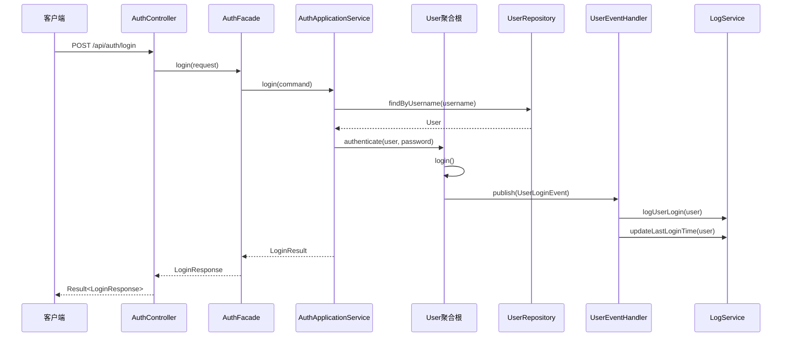

# DDD 架构详细解释与登录业务流程示例

## 📋 目录

- [1. Interfaces 层详解](#1-interfaces层详解)
- [2. Application 层详解](#2-application层详解)
- [3. Command/Query 与 DTO 关系](#3-commandquery与dto关系)
- [4. Domain 层核心概念](#4-domain层核心概念)
- [5. Domain 层共享组件](#5-domain层共享组件)
- [6. Domain 实体详解](#6-domain实体详解)
- [7. 登录业务流程完整示例](#7-登录业务流程完整示例)

---

## 1. Interfaces 层详解

### 1.1 Assembler 转换器（DTO <-> VO）

**作用**：在接口层和应用层之间进行数据转换，将外部 DTO 转换为内部领域对象，或将领域对象转换为外部 VO。

**转换方式**：

```java
// 示例：UserAssembler.java
@Component
public class UserAssembler {

    /**
     * DTO -> Domain Object
     * 将外部请求转换为领域对象
     */
    public User toDomain(UserRegisterRequest request) {
        return User.builder()
            .username(request.getUsername())
            .email(new Email(request.getEmail()))
            .password(new Password(request.getPassword()))
            .build();
    }

    /**
     * Domain Object -> VO
     * 将领域对象转换为外部响应
     */
    public UserInfoResponse toResponse(User user) {
        return UserInfoResponse.builder()
            .id(user.getId())
            .username(user.getUsername())
            .email(user.getEmail().getValue())
            .status(user.getStatus().name())
            .build();
    }
}
```

### 1.2 Facade 门面接口

**作用**：对外暴露统一的业务接口，隐藏内部复杂性，提供粗粒度的业务操作。

**与 Controller 的区别**：

- **Controller**：处理 HTTP 请求，参数校验，权限验证
- **Facade**：提供业务门面，协调多个应用服务

```java
// 示例：UserFacade.java
@Service
public class UserFacade {

    @Autowired
    private UserApplicationService userApplicationService;
    @Autowired
    private AuthApplicationService authApplicationService;

    /**
     * 用户注册门面
     * 协调多个应用服务完成复杂业务
     */
    public UserInfoResponse registerUser(UserRegisterRequest request) {
        // 1. 创建用户
        User user = userApplicationService.createUser(request);

        // 2. 发送欢迎邮件
        authApplicationService.sendWelcomeEmail(user);

        // 3. 记录注册日志
        authApplicationService.logUserRegistration(user);

        return UserAssembler.toResponse(user);
    }
}
```

### 1.3 Controller 控制器

**作用**：处理 HTTP 请求，参数校验，权限验证，调用 Facade 或 ApplicationService。

```java
// 示例：UserController.java
@RestController
@RequestMapping("/api/users")
public class UserController {

    @Autowired
    private UserFacade userFacade;

    @PostMapping("/register")
    public Result<UserInfoResponse> register(@Valid @RequestBody UserRegisterRequest request) {
        // 参数校验由@Valid自动完成
        UserInfoResponse response = userFacade.registerUser(request);
        return Result.success(response);
    }
}
```

---

## 2. Application 层详解

### 2.1 Event 事件处理机制

**Handler（事件处理器）**：处理领域事件，执行副作用操作。

```java
// 示例：UserEventHandler.java
@Component
public class UserEventHandler {

    @Autowired
    private EmailService emailService;
    @Autowired
    private LogService logService;

    /**
     * 处理用户注册事件
     */
    @EventHandler
    public void handleUserRegistered(UserRegisteredEvent event) {
        // 发送欢迎邮件
        emailService.sendWelcomeEmail(event.getUser());

        // 记录注册日志
        logService.logUserRegistration(event.getUser());
    }

    /**
     * 处理用户登录事件
     */
    @EventHandler
    public void handleUserLogin(UserLoginEvent event) {
        // 更新最后登录时间
        logService.updateLastLoginTime(event.getUser());

        // 发送登录通知
        emailService.sendLoginNotification(event.getUser());
    }
}
```

**Publisher（事件发布器）**：发布领域事件，解耦业务逻辑。

```java
// 示例：DomainEventPublisher.java
@Component
public class DomainEventPublisher {

    @Autowired
    private ApplicationEventPublisher eventPublisher;

    /**
     * 发布领域事件
     */
    public void publish(DomainEvent event) {
        eventPublisher.publishEvent(event);
    }

    /**
     * 发布用户注册事件
     */
    public void publishUserRegistered(User user) {
        UserRegisteredEvent event = new UserRegisteredEvent(user);
        publish(event);
    }
}
```

---

## 3. Command/Query 与 DTO 关系

### 3.1 Command（命令对象）

**作用**：封装写操作，包含业务意图和必要数据。

```java
// 示例：CreateUserCommand.java
public class CreateUserCommand {
    private String username;
    private String email;
    private String password;
    private String departmentId;

    // 构造函数、getter、setter
}

// 与DTO的关系
public class UserRegisterRequest {  // DTO
    private String username;
    private String email;
    private String password;
    private String departmentId;

    // 转换为Command
    public CreateUserCommand toCommand() {
        return new CreateUserCommand(username, email, password, departmentId);
    }
}
```

### 3.2 Query（查询对象）

**作用**：封装读操作，包含查询条件和分页信息。

```java
// 示例：UserQuery.java
public class UserQuery {
    private String keyword;
    private String departmentId;
    private UserStatus status;
    private PageRequest pageRequest;

    // 构造函数、getter、setter
}

// 与DTO的关系
public class UserSearchRequest {  // DTO
    private String keyword;
    private String departmentId;
    private String status;
    private int page;
    private int size;

    // 转换为Query
    public UserQuery toQuery() {
        return new UserQuery(keyword, departmentId,
                           UserStatus.valueOf(status),
                           PageRequest.of(page, size));
    }
}
```

---

## 4. Domain 层核心概念

### 4.1 Aggregate（聚合根）

**定义**：保证业务一致性的边界，包含实体和值对象，通过唯一标识进行管理。

```java
// 示例：User.java（用户聚合根）
@Entity
@Table(name = "sys_user")
public class User {

    @Id
    private UserId id;

    private Username username;
    private Email email;
    private Password password;
    private UserStatus status;

    // 聚合内的实体
    private List<Role> roles;
    private UserProfile profile;

    /**
     * 业务方法：用户注册
     */
    public void register(Username username, Email email, Password password) {
        this.username = username;
        this.email = email;
        this.password = password;
        this.status = UserStatus.ACTIVE;

        // 发布领域事件
        DomainEventPublisher.publish(new UserRegisteredEvent(this));
    }

    /**
     * 业务方法：用户登录
     */
    public void login(String inputPassword) {
        if (!this.password.matches(inputPassword)) {
            throw new InvalidPasswordException("密码错误");
        }

        // 发布登录事件
        DomainEventPublisher.publish(new UserLoginEvent(this));
    }
}
```

### 4.2 ValueObject（值对象）

**定义**：无标识的不可变对象，通过值相等性判断。

```java
// 示例：Email.java（邮箱值对象）
@Embeddable
public class Email {

    private String value;

    private Email() {} // JPA需要

    public Email(String value) {
        if (!isValidEmail(value)) {
            throw new InvalidEmailException("邮箱格式不正确");
        }
        this.value = value;
    }

    public String getValue() {
        return value;
    }

    private boolean isValidEmail(String email) {
        return email.matches("^[\\w-\\.]+@([\\w-]+\\.)+[\\w-]{2,4}$");
    }

    @Override
    public boolean equals(Object obj) {
        if (this == obj) return true;
        if (obj == null || getClass() != obj.getClass()) return false;
        Email email = (Email) obj;
        return Objects.equals(value, email.value);
    }

    @Override
    public int hashCode() {
        return Objects.hash(value);
    }
}
```

---

## 5. Domain 层共享组件

### 5.1 Shared/Event（共享事件）

**定义**：跨聚合的领域事件，用于解耦业务逻辑。

```java
// 示例：UserRegisteredEvent.java
public class UserRegisteredEvent extends DomainEvent {

    private final UserId userId;
    private final String username;
    private final String email;

    public UserRegisteredEvent(User user) {
        super();
        this.userId = user.getId();
        this.username = user.getUsername().getValue();
        this.email = user.getEmail().getValue();
    }

    // getter方法
}
```

### 5.2 Shared/Exception（共享异常）

**定义**：领域异常，表示业务规则违反。

```java
// 示例：InvalidPasswordException.java
public class InvalidPasswordException extends DomainException {

    public InvalidPasswordException(String message) {
        super(message);
    }

    public InvalidPasswordException(String message, Throwable cause) {
        super(message, cause);
    }
}

// 示例：UserNotFoundException.java
public class UserNotFoundException extends DomainException {

    public UserNotFoundException(UserId userId) {
        super("用户不存在: " + userId.getValue());
    }
}
```

---

## 6. Domain 实体详解

### 6.1 Entity（实体）

**定义**：具有唯一标识的领域对象，通过 ID 区分不同实例。

```java
// 示例：Role.java（角色实体）
@Entity
@Table(name = "sys_role")
public class Role {

    @Id
    private RoleId id;

    private String name;
    private String description;
    private RoleStatus status;

    // 关联的权限
    private List<Permission> permissions;

    /**
     * 业务方法：分配权限
     */
    public void assignPermission(Permission permission) {
        if (permissions == null) {
            permissions = new ArrayList<>();
        }
        permissions.add(permission);
    }

    /**
     * 业务方法：移除权限
     */
    public void removePermission(Permission permission) {
        if (permissions != null) {
            permissions.remove(permission);
        }
    }
}
```

---

## 7. 登录业务流程完整示例

### 7.1 完整目录结构展示

```
src/main/java/com/sciz/server/
├── interfaces/                           # 接口层
│   ├── controller/
│   │   └── user/
│   │       └── AuthController.java      # 认证控制器
│   ├── dto/
│   │   ├── request/
│   │   │   └── UserLoginRequest.java    # 登录请求DTO
│   │   └── response/
│   │       └── LoginResponse.java       # 登录响应DTO
│   ├── assembler/
│   │   └── AuthAssembler.java          # 认证转换器
│   └── facade/
│       └── AuthFacade.java              # 认证门面
├── application/                         # 应用层
│   ├── service/
│   │   └── user/
│   │       └── AuthApplicationService.java # 认证应用服务
│   ├── command/
│   │   └── user/
│   │       └── LoginCommand.java         # 登录命令
│   ├── query/
│   │   └── user/
│   │       └── UserQuery.java           # 用户查询
│   └── event/
│       ├── handler/
│       │   └── UserEventHandler.java    # 用户事件处理器
│       └── publisher/
│           └── DomainEventPublisher.java # 领域事件发布器
├── domain/                              # 领域层
│   ├── iam/                             # IAM领域
│   │   ├── aggregate/
│   │   │   └── User.java                # 用户聚合根
│   │   ├── entity/
│   │   │   ├── Role.java                # 角色实体
│   │   │   └── Permission.java          # 权限实体
│   │   ├── valueobject/
│   │   │   ├── Username.java            # 用户名值对象
│   │   │   ├── Email.java               # 邮箱值对象
│   │   │   ├── Password.java            # 密码值对象
│   │   │   └── UserStatus.java          # 用户状态值对象
│   │   ├── service/
│   │   │   └── AuthenticationService.java # 认证领域服务
│   │   ├── repository/
│   │   │   └── UserRepository.java      # 用户仓储接口
│   │   └── event/
│   │       ├── UserLoginEvent.java      # 用户登录事件
│   │       └── UserRegisteredEvent.java # 用户注册事件
│   └── shared/                          # 共享组件
│       ├── event/
│       │   └── DomainEvent.java         # 领域事件基类
│       └── exception/
│           ├── InvalidPasswordException.java # 密码错误异常
│           └── UserNotFoundException.java  # 用户不存在异常
└── infrastructure/                      # 基础设施层
    ├── persistence/
    │   ├── repository/
    │   │   └── user/
    │   │       └── UserRepositoryImpl.java # 用户仓储实现
    │   ├── mapper/
    │   │   └── user/
    │   │       └── UserMapper.java       # 用户Mapper
    │   └── entity/
    │       └── user/
    │           └── UserPO.java           # 用户数据库实体
    ├── cache/
    │   └── redis/
    │       └── UserCacheService.java     # 用户缓存服务
    └── external/
        └── dify/
            └── DifyService.java          # Dify服务集成
```

### 7.2 登录业务流程代码示例

#### 7.2.1 接口层 - Controller

```java
// AuthController.java
@RestController
@RequestMapping("/api/auth")
public class AuthController {

    @Autowired
    private AuthFacade authFacade;

    @PostMapping("/login")
    public Result<LoginResponse> login(@Valid @RequestBody UserLoginRequest request) {
        LoginResponse response = authFacade.login(request);
        return Result.success(response);
    }
}
```

#### 7.2.2 接口层 - DTO

```java
// UserLoginRequest.java
public class UserLoginRequest {
    @NotBlank(message = "用户名不能为空")
    private String username;

    @NotBlank(message = "密码不能为空")
    private String password;

    private Boolean rememberMe = false;

    // getter、setter
}

// LoginResponse.java
public class LoginResponse {
    private String token;
    private String refreshToken;
    private UserInfo userInfo;
    private Long expiresIn;

    // getter、setter
}
```

#### 7.2.3 接口层 - Assembler

```java
// AuthAssembler.java
@Component
public class AuthAssembler {

    public LoginCommand toCommand(UserLoginRequest request) {
        return new LoginCommand(
            new Username(request.getUsername()),
            new Password(request.getPassword()),
            request.getRememberMe()
        );
    }

    public LoginResponse toResponse(String token, String refreshToken,
                                  User user, Long expiresIn) {
        return LoginResponse.builder()
            .token(token)
            .refreshToken(refreshToken)
            .userInfo(UserInfo.builder()
                .id(user.getId().getValue())
                .username(user.getUsername().getValue())
                .email(user.getEmail().getValue())
                .build())
            .expiresIn(expiresIn)
            .build();
    }
}
```

#### 7.2.4 接口层 - Facade

```java
// AuthFacade.java
@Service
public class AuthFacade {

    @Autowired
    private AuthApplicationService authApplicationService;

    @Autowired
    private AuthAssembler authAssembler;

    public LoginResponse login(UserLoginRequest request) {
        // 1. 转换为命令对象
        LoginCommand command = authAssembler.toCommand(request);

        // 2. 执行登录业务
        LoginResult result = authApplicationService.login(command);

        // 3. 转换为响应对象
        return authAssembler.toResponse(
            result.getToken(),
            result.getRefreshToken(),
            result.getUser(),
            result.getExpiresIn()
        );
    }
}
```

#### 7.2.5 应用层 - ApplicationService

```java
// AuthApplicationService.java
@Service
@Transactional
public class AuthApplicationService {

    @Autowired
    private UserRepository userRepository;

    @Autowired
    private AuthenticationService authenticationService;

    @Autowired
    private TokenService tokenService;

    @Autowired
    private DomainEventPublisher eventPublisher;

    public LoginResult login(LoginCommand command) {
        // 1. 查找用户
        User user = userRepository.findByUsername(command.getUsername())
            .orElseThrow(() -> new UserNotFoundException(command.getUsername()));

        // 2. 验证密码
        authenticationService.authenticate(user, command.getPassword());

        // 3. 生成Token
        String token = tokenService.generateToken(user);
        String refreshToken = tokenService.generateRefreshToken(user);
        Long expiresIn = command.getRememberMe() ? 7 * 24 * 3600L : 3600L;

        // 4. 发布登录事件
        eventPublisher.publish(new UserLoginEvent(user));

        return new LoginResult(token, refreshToken, user, expiresIn);
    }
}
```

#### 7.2.6 应用层 - Command

```java
// LoginCommand.java
public class LoginCommand {
    private final Username username;
    private final Password password;
    private final Boolean rememberMe;

    public LoginCommand(Username username, Password password, Boolean rememberMe) {
        this.username = username;
        this.password = password;
        this.rememberMe = rememberMe;
    }

    // getter方法
}
```

#### 7.2.7 应用层 - Event Handler

```java
// UserEventHandler.java
@Component
public class UserEventHandler {

    @Autowired
    private LogService logService;

    @Autowired
    private EmailService emailService;

    @EventHandler
    public void handleUserLogin(UserLoginEvent event) {
        // 1. 记录登录日志
        logService.logUserLogin(event.getUser());

        // 2. 更新最后登录时间
        logService.updateLastLoginTime(event.getUser());

        // 3. 发送登录通知（可选）
        if (event.getUser().isNotificationEnabled()) {
            emailService.sendLoginNotification(event.getUser());
        }
    }
}
```

#### 7.2.8 领域层 - Aggregate

```java
// User.java（用户聚合根）
@Entity
@Table(name = "sys_user")
public class User {

    @Id
    private UserId id;

    private Username username;
    private Email email;
    private Password password;
    private UserStatus status;

    private LocalDateTime lastLoginTime;
    private Boolean notificationEnabled = true;

    // 构造函数
    private User() {} // JPA需要

    public User(Username username, Email email, Password password) {
        this.id = new UserId();
        this.username = username;
        this.email = email;
        this.password = password;
        this.status = UserStatus.ACTIVE;
    }

    /**
     * 业务方法：用户登录
     */
    public void login() {
        if (this.status != UserStatus.ACTIVE) {
            throw new UserStatusException("用户状态异常，无法登录");
        }

        this.lastLoginTime = LocalDateTime.now();

        // 发布登录事件
        DomainEventPublisher.publish(new UserLoginEvent(this));
    }

    // getter方法
}
```

#### 7.2.9 领域层 - ValueObject

```java
// Username.java
@Embeddable
public class Username {

    private String value;

    private Username() {} // JPA需要

    public Username(String value) {
        if (value == null || value.trim().isEmpty()) {
            throw new InvalidUsernameException("用户名不能为空");
        }
        if (value.length() < 3 || value.length() > 20) {
            throw new InvalidUsernameException("用户名长度必须在3-20个字符之间");
        }
        this.value = value;
    }

    public String getValue() {
        return value;
    }

    @Override
    public boolean equals(Object obj) {
        if (this == obj) return true;
        if (obj == null || getClass() != obj.getClass()) return false;
        Username username = (Username) obj;
        return Objects.equals(value, username.value);
    }

    @Override
    public int hashCode() {
        return Objects.hash(value);
    }
}
```

#### 7.2.10 领域层 - DomainService

```java
// AuthenticationService.java
@Service
public class AuthenticationService {

    @Autowired
    private PasswordEncoder passwordEncoder;

    public void authenticate(User user, Password password) {
        if (!passwordEncoder.matches(password.getValue(), user.getPassword().getValue())) {
            throw new InvalidPasswordException("密码错误");
        }

        if (user.getStatus() != UserStatus.ACTIVE) {
            throw new UserStatusException("用户状态异常，无法登录");
        }
    }
}
```

#### 7.2.11 领域层 - Repository 接口

```java
// UserRepository.java
public interface UserRepository {

    Optional<User> findByUsername(Username username);

    Optional<User> findByEmail(Email email);

    User save(User user);

    void delete(User user);
}
```

#### 7.2.12 基础设施层 - Repository 实现

```java
// UserRepositoryImpl.java
@Repository
public class UserRepositoryImpl implements UserRepository {

    @Autowired
    private UserMapper userMapper;

    @Autowired
    private UserAssembler userAssembler;

    @Override
    public Optional<User> findByUsername(Username username) {
        UserPO userPO = userMapper.findByUsername(username.getValue());
        if (userPO == null) {
            return Optional.empty();
        }
        return Optional.of(userAssembler.toDomain(userPO));
    }

    @Override
    public User save(User user) {
        UserPO userPO = userAssembler.toPO(user);
        if (userPO.getId() == null) {
            userMapper.insert(userPO);
        } else {
            userMapper.update(userPO);
        }
        return user;
    }
}
```

### 7.3 登录业务流程时序图



### 7.4 总结

这个完整的登录业务流程示例展示了 DDD 架构中各个层次的作用：

1. **Interfaces 层**：处理 HTTP 请求，参数校验，数据转换
2. **Application 层**：编排业务用例，事务管理，事件发布
3. **Domain 层**：核心业务逻辑，领域模型，业务规则
4. **Infrastructure 层**：技术实现，数据持久化，外部服务集成

通过这个示例，您可以看到 DDD 架构如何将复杂的业务逻辑分解到不同的层次中，每个层次都有明确的职责，既保证了业务逻辑的清晰性，又提供了良好的可测试性和可维护性。
