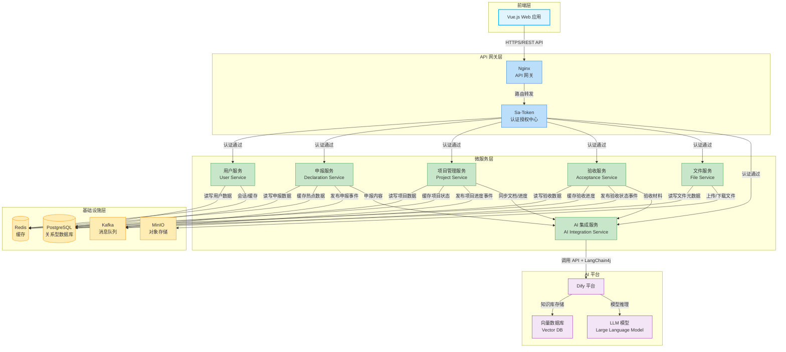
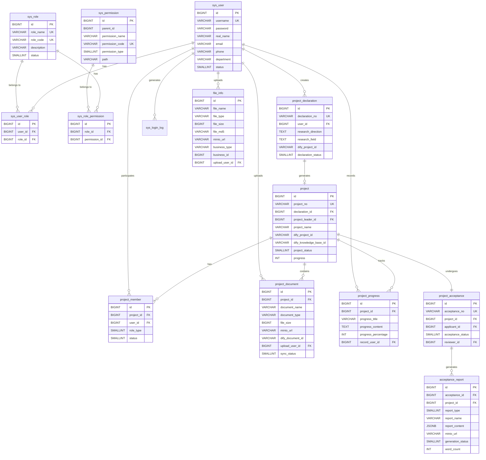
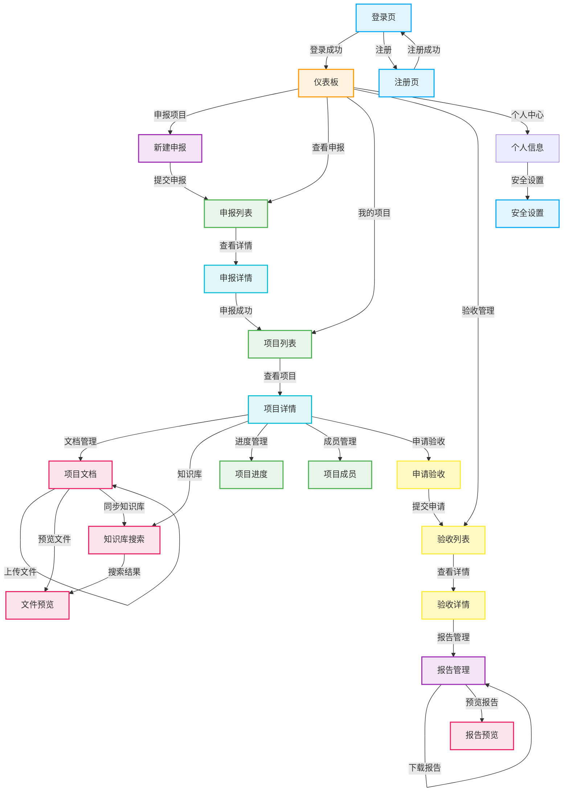
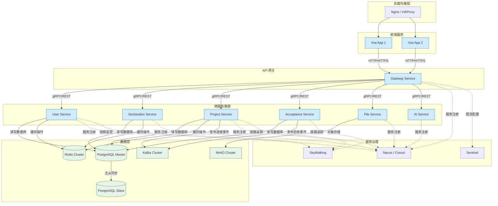

# 高校科研项目管理平台 - 开发文档

## 目录

- [1. 项目概述](#1-项目概述)
- [2. 核心功能模块](#2-核心功能模块)
- [3. 技术架构](#3-技术架构)
- [4. 数据库设计](#4-数据库设计)
- [5. 后端设计](#5-后端设计)
- [6. 前端设计](#6-前端设计)
- [7. 部署说明](#7-部署说明)

---

## 1. 项目概述

高校科研项目管理平台是一个基于微服务架构、前后端分离、DDD 领域驱动设计的智能化科研项目全生命周期管理系统。平台以 Dify 工作流为核心，实现科研项目从申报、执行到验收的智能化、自动化管理。

### 1.1 核心特性

- 🚀 **微服务架构**：模块化设计，服务独立部署，易于扩展
- 🎯 **DDD 领域驱动**：清晰的领域边界，高内聚低耦合
- 🤖 **AI 智能化**：集成 Dify 平台，实现智能工作流编排
- 📊 **全生命周期管理**：覆盖申报、执行、验收全流程
- 🔒 **安全可靠**：基于 Sa-Token 的权限认证体系

### 1.2 技术栈

#### 前端技术栈

- Vue.js 3.x - 渐进式 JavaScript 框架
- Vue Router 4.x - 官方路由管理器
- Pinia - 新一代状态管理
- Element Plus - Vue 3 组件库
- Axios - HTTP 客户端
- Vite - 前端构建工具

#### 后端技术栈

- Java 11 (LTS) - 编程语言
- Spring Boot 2.7.x - 应用框架
- Spring Cloud Alibaba - 微服务框架
- PostgreSQL 14+ - 关系型数据库
- Redis 6+ - 缓存与会话
- Apache Kafka 3.x - 消息队列
- Minio - 对象存储
- Sa-Token - 权限认证
- MyBatis-Plus 3.5.x - ORM 框架
- LangChain4j - LLM 集成框架

#### AI 平台

- Dify - 工作流编排与知识库管理
- Vector Database - 向量数据库（支持语义搜索）

---

## 2. 核心功能模块

### 2.1 用户管理模块

#### 功能描述

负责用户身份识别、权限分配与管理，确保系统安全与数据隔离。

#### 核心功能

- 用户注册与登录（支持学工号/教工号）
- 基于角色的访问控制（RBAC）
- 个人信息管理
- 用户权限管理
- 登录日志与审计

#### 角色定义

- **超级管理员**：系统配置、用户管理、全局权限
- **科研管理员**：项目审批、进度监督、成果管理
- **科研人员**：项目申报、执行、验收

### 2.2 申报模块

#### 功能描述

科研项目生命周期的起点，负责接收项目申报信息并触发 Dify 工作流。

#### 核心功能

- 项目申报信息填写（研究方向、研究领域）
- Dify 申报工作流触发
- 申报状态跟踪
- 历史申报记录查询
- 申报信息修改与撤回

### 2.3 执行模块（项目管理）

#### 功能描述

科研项目管理核心，提供项目数据、文献资料集中管理，充分利用 Dify 知识库能力。

#### 核心功能

- 项目列表与详情展示
- 多格式文件批量上传（doc/docx/xlsx/pdf/jpg/png 等）
- 文件在线预览
- Dify 知识库同步
- 知识库语义搜索
- 项目进度管理
- 项目团队协作
- 项目变更记录

### 2.4 验收模块

#### 功能描述

项目生命周期收尾阶段，自动化生成科技报告和自评报告。

#### 核心功能

- 验收申请发起
- 科技报告自动生成（支持百万字级别）
- 自评报告自动生成
- 报告在线预览与下载
- 验收状态跟踪
- 验收历史记录

---

## 3. 技术架构

### 3.1 总体架构

平台采用**微服务架构 + 前后端分离 + DDD 领域驱动设计**模式。



### 3.2 DDD 领域驱动设计

#### 领域划分

**用户领域（User Domain）**

- 用户聚合根：User
- 角色实体：Role
- 权限实体：Permission
- 值对象：UserProfile

**项目申报领域（Declaration Domain）**

- 申报聚合根：Declaration
- 值对象：ResearchDirection, ResearchField
- 领域服务：DeclarationWorkflowService

**项目管理领域（Project Domain）**

- 项目聚合根：Project
- 文档实体：Document
- 进度实体：Progress
- 值对象：ProjectStatus
- 领域服务：KnowledgeBaseService

**验收领域（Acceptance Domain）**

- 验收聚合根：Acceptance
- 报告实体：Report
- 值对象：ReportType, AcceptanceStatus
- 领域服务：ReportGenerationService

### 3.3 微服务拆分原则

1. **按业务能力拆分**：每个服务对应一个业务领域
2. **单一职责**：服务功能内聚，职责明确
3. **松耦合**：服务间通过 API/消息队列通信
4. **数据自治**：每个服务管理自己的数据库

---

## 4. 数据库设计

### 4.1 表结构设计

#### 4.1.1 用户服务表

**用户表（sys_user）**

```sql
CREATE TABLE sys_user (
    id BIGINT GENERATED BY DEFAULT AS IDENTITY PRIMARY KEY,
    username VARCHAR(50) NOT NULL,
    password VARCHAR(255) NOT NULL,
    real_name VARCHAR(50) NOT NULL,
    email VARCHAR(100),
    phone VARCHAR(20),
    avatar_url VARCHAR(500),
    department VARCHAR(100),
    title VARCHAR(50),
    status SMALLINT DEFAULT 1,
    is_deleted SMALLINT DEFAULT 0,
    created_by BIGINT,
    created_time TIMESTAMP DEFAULT CURRENT_TIMESTAMP,
    updated_by BIGINT,
    updated_time TIMESTAMP DEFAULT CURRENT_TIMESTAMP
);

-- 表注释
COMMENT ON TABLE sys_user IS '系统用户表';

-- 字段注释
COMMENT ON COLUMN sys_user.id IS '用户ID，主键，自增';
COMMENT ON COLUMN sys_user.username IS '用户名，唯一标识，用于登录';
COMMENT ON COLUMN sys_user.password IS '密码，加密存储';
COMMENT ON COLUMN sys_user.real_name IS '真实姓名';
COMMENT ON COLUMN sys_user.email IS '邮箱地址';
COMMENT ON COLUMN sys_user.phone IS '手机号码';
COMMENT ON COLUMN sys_user.avatar_url IS '头像URL';
COMMENT ON COLUMN sys_user.department IS '所属院系/部门';
COMMENT ON COLUMN sys_user.title IS '职称';
COMMENT ON COLUMN sys_user.status IS '用户状态：1=正常，0=禁用';
COMMENT ON COLUMN sys_user.is_deleted IS '逻辑删除标识：0=未删除，1=已删除';
COMMENT ON COLUMN sys_user.created_by IS '创建人ID';
COMMENT ON COLUMN sys_user.created_time IS '创建时间';
COMMENT ON COLUMN sys_user.updated_by IS '更新人ID';
COMMENT ON COLUMN sys_user.updated_time IS '更新时间';

-- 创建索引
CREATE UNIQUE INDEX uk_sys_user_username ON sys_user(username) WHERE is_deleted = 0;
CREATE INDEX idx_sys_user_email ON sys_user(email);
CREATE INDEX idx_sys_user_phone ON sys_user(phone);
CREATE INDEX idx_sys_user_status ON sys_user(status);
CREATE INDEX idx_sys_user_is_deleted ON sys_user(is_deleted);
CREATE INDEX idx_sys_user_created_time ON sys_user(created_time);
```

**角色表（sys_role）**

```sql
CREATE TABLE sys_role (
    id BIGINT GENERATED BY DEFAULT AS IDENTITY PRIMARY KEY,
    role_name VARCHAR(50) NOT NULL,
    role_code VARCHAR(50) NOT NULL,
    description VARCHAR(255),
    sort_order INT DEFAULT 0,
    status SMALLINT DEFAULT 1,
    is_deleted SMALLINT DEFAULT 0,
    created_by BIGINT,
    created_time TIMESTAMP DEFAULT CURRENT_TIMESTAMP,
    updated_by BIGINT,
    updated_time TIMESTAMP DEFAULT CURRENT_TIMESTAMP
);

-- 表注释
COMMENT ON TABLE sys_role IS '系统角色表';

-- 字段注释
COMMENT ON COLUMN sys_role.id IS '角色ID，主键，自增';
COMMENT ON COLUMN sys_role.role_name IS '角色名称，唯一标识';
COMMENT ON COLUMN sys_role.role_code IS '角色编码，唯一标识';
COMMENT ON COLUMN sys_role.description IS '角色描述';
COMMENT ON COLUMN sys_role.sort_order IS '排序';
COMMENT ON COLUMN sys_role.status IS '角色状态：1=启用，0=禁用';
COMMENT ON COLUMN sys_role.is_deleted IS '逻辑删除标识：0=未删除，1=已删除';
COMMENT ON COLUMN sys_role.created_by IS '创建人ID';
COMMENT ON COLUMN sys_role.created_time IS '创建时间';
COMMENT ON COLUMN sys_role.updated_by IS '更新人ID';
COMMENT ON COLUMN sys_role.updated_time IS '更新时间';

-- 创建索引
CREATE UNIQUE INDEX uk_sys_role_name ON sys_role(role_name) WHERE is_deleted = 0;
CREATE UNIQUE INDEX uk_sys_role_code ON sys_role(role_code) WHERE is_deleted = 0;
CREATE INDEX idx_sys_role_status ON sys_role(status);
CREATE INDEX idx_sys_role_is_deleted ON sys_role(is_deleted);
CREATE INDEX idx_sys_role_sort_order ON sys_role(sort_order);
```

**权限表（sys_permission）**

```sql
CREATE TABLE sys_permission (
    id BIGINT GENERATED BY DEFAULT AS IDENTITY PRIMARY KEY,
    parent_id BIGINT DEFAULT 0,
    permission_name VARCHAR(50) NOT NULL,
    permission_code VARCHAR(100) NOT NULL,
    permission_type SMALLINT NOT NULL,
    path VARCHAR(200),
    component VARCHAR(200),
    icon VARCHAR(100),
    sort_order INT DEFAULT 0,
    status SMALLINT DEFAULT 1,
    is_deleted SMALLINT DEFAULT 0,
    created_time TIMESTAMP DEFAULT CURRENT_TIMESTAMP,
    updated_time TIMESTAMP DEFAULT CURRENT_TIMESTAMP
);

-- 表注释
COMMENT ON TABLE sys_permission IS '系统权限表';

-- 字段注释
COMMENT ON COLUMN sys_permission.id IS '权限ID，主键，自增';
COMMENT ON COLUMN sys_permission.parent_id IS '父权限ID，0表示顶级权限';
COMMENT ON COLUMN sys_permission.permission_name IS '权限名称';
COMMENT ON COLUMN sys_permission.permission_code IS '权限编码，唯一标识';
COMMENT ON COLUMN sys_permission.permission_type IS '权限类型：1=菜单，2=按钮，3=API';
COMMENT ON COLUMN sys_permission.path IS '路由路径';
COMMENT ON COLUMN sys_permission.component IS '组件路径';
COMMENT ON COLUMN sys_permission.icon IS '图标';
COMMENT ON COLUMN sys_permission.sort_order IS '排序';
COMMENT ON COLUMN sys_permission.status IS '权限状态：1=启用，0=禁用';
COMMENT ON COLUMN sys_permission.is_deleted IS '逻辑删除标识：0=未删除，1=已删除';
COMMENT ON COLUMN sys_permission.created_time IS '创建时间';
COMMENT ON COLUMN sys_permission.updated_time IS '更新时间';

-- 创建索引
CREATE UNIQUE INDEX uk_sys_permission_code ON sys_permission(permission_code) WHERE is_deleted = 0;
CREATE INDEX idx_sys_permission_parent_id ON sys_permission(parent_id);
CREATE INDEX idx_sys_permission_type ON sys_permission(permission_type);
CREATE INDEX idx_sys_permission_status ON sys_permission(status);
CREATE INDEX idx_sys_permission_is_deleted ON sys_permission(is_deleted);
CREATE INDEX idx_sys_permission_sort_order ON sys_permission(sort_order);
```

**用户角色关联表（sys_user_role）**

```sql
CREATE TABLE sys_user_role (
    id BIGINT GENERATED BY DEFAULT AS IDENTITY PRIMARY KEY,
    user_id BIGINT NOT NULL,
    role_id BIGINT NOT NULL,
    is_deleted SMALLINT DEFAULT 0,
    created_time TIMESTAMP DEFAULT CURRENT_TIMESTAMP
);

-- 表注释
COMMENT ON TABLE sys_user_role IS '用户角色关联表';

-- 字段注释
COMMENT ON COLUMN sys_user_role.id IS '关联ID，主键，自增';
COMMENT ON COLUMN sys_user_role.user_id IS '用户ID，关联sys_user表';
COMMENT ON COLUMN sys_user_role.role_id IS '角色ID，关联sys_role表';
COMMENT ON COLUMN sys_user_role.is_deleted IS '逻辑删除标识：0=未删除，1=已删除';
COMMENT ON COLUMN sys_user_role.created_time IS '创建时间';

-- 创建索引
CREATE UNIQUE INDEX uk_sys_user_role ON sys_user_role(user_id, role_id) WHERE is_deleted = 0;
CREATE INDEX idx_sys_user_role_user_id ON sys_user_role(user_id);
CREATE INDEX idx_sys_user_role_role_id ON sys_user_role(role_id);
CREATE INDEX idx_sys_user_role_is_deleted ON sys_user_role(is_deleted);
```

**角色权限关联表（sys_role_permission）**

```sql
CREATE TABLE sys_role_permission (
    id BIGINT GENERATED BY DEFAULT AS IDENTITY PRIMARY KEY,
    role_id BIGINT NOT NULL,
    permission_id BIGINT NOT NULL,
    is_deleted SMALLINT DEFAULT 0,
    created_time TIMESTAMP DEFAULT CURRENT_TIMESTAMP
);

-- 表注释
COMMENT ON TABLE sys_role_permission IS '角色权限关联表';

-- 字段注释
COMMENT ON COLUMN sys_role_permission.id IS '关联ID，主键，自增';
COMMENT ON COLUMN sys_role_permission.role_id IS '角色ID，关联sys_role表';
COMMENT ON COLUMN sys_role_permission.permission_id IS '权限ID，关联sys_permission表';
COMMENT ON COLUMN sys_role_permission.is_deleted IS '逻辑删除标识：0=未删除，1=已删除';
COMMENT ON COLUMN sys_role_permission.created_time IS '创建时间';

-- 创建索引
CREATE UNIQUE INDEX uk_sys_role_permission ON sys_role_permission(role_id, permission_id) WHERE is_deleted = 0;
CREATE INDEX idx_sys_role_permission_role_id ON sys_role_permission(role_id);
CREATE INDEX idx_sys_role_permission_permission_id ON sys_role_permission(permission_id);
CREATE INDEX idx_sys_role_permission_is_deleted ON sys_role_permission(is_deleted);
```

**登录日志表（sys_login_log）**

```sql
CREATE TABLE sys_login_log (
    id BIGINT GENERATED BY DEFAULT AS IDENTITY PRIMARY KEY,
    user_id BIGINT,
    username VARCHAR(50),
    login_ip VARCHAR(50),
    login_location VARCHAR(100),
    browser VARCHAR(50),
    os VARCHAR(50),
    status SMALLINT,
    message VARCHAR(255),
    is_deleted SMALLINT DEFAULT 0,
    login_time TIMESTAMP DEFAULT CURRENT_TIMESTAMP
);

-- 表注释
COMMENT ON TABLE sys_login_log IS '用户登录日志表';

-- 字段注释
COMMENT ON COLUMN sys_login_log.id IS '日志ID，主键，自增';
COMMENT ON COLUMN sys_login_log.user_id IS '用户ID，关联sys_user表';
COMMENT ON COLUMN sys_login_log.username IS '用户名';
COMMENT ON COLUMN sys_login_log.login_ip IS '登录IP地址';
COMMENT ON COLUMN sys_login_log.login_location IS '登录地点';
COMMENT ON COLUMN sys_login_log.browser IS '浏览器信息';
COMMENT ON COLUMN sys_login_log.os IS '操作系统信息';
COMMENT ON COLUMN sys_login_log.status IS '登录状态：1=成功，0=失败';
COMMENT ON COLUMN sys_login_log.message IS '提示消息';
COMMENT ON COLUMN sys_login_log.is_deleted IS '逻辑删除标识：0=未删除，1=已删除';
COMMENT ON COLUMN sys_login_log.login_time IS '登录时间';

-- 创建索引
CREATE INDEX idx_sys_login_log_user_id ON sys_login_log(user_id);
CREATE INDEX idx_sys_login_log_username ON sys_login_log(username);
CREATE INDEX idx_sys_login_log_login_ip ON sys_login_log(login_ip);
CREATE INDEX idx_sys_login_log_status ON sys_login_log(status);
CREATE INDEX idx_sys_login_log_login_time ON sys_login_log(login_time);
CREATE INDEX idx_sys_login_log_is_deleted ON sys_login_log(is_deleted);
```

#### 4.1.2 申报服务表

**项目申报表（project_declaration）**

```sql
CREATE TABLE project_declaration (
    id BIGINT GENERATED BY DEFAULT AS IDENTITY PRIMARY KEY,
    declaration_no VARCHAR(50) NOT NULL,
    user_id BIGINT NOT NULL,
    research_direction TEXT NOT NULL,
    research_field TEXT NOT NULL,
    dify_project_id VARCHAR(100),
    dify_workflow_id VARCHAR(100),
    declaration_status SMALLINT DEFAULT 0,
    workflow_result TEXT,
    failure_reason VARCHAR(500),
    is_deleted SMALLINT DEFAULT 0,
    created_time TIMESTAMP DEFAULT CURRENT_TIMESTAMP,
    updated_time TIMESTAMP DEFAULT CURRENT_TIMESTAMP,
    submitted_time TIMESTAMP,
    approved_time TIMESTAMP
);

-- 表注释
COMMENT ON TABLE project_declaration IS '项目申报表';

-- 字段注释
COMMENT ON COLUMN project_declaration.id IS '申报ID，主键，自增';
COMMENT ON COLUMN project_declaration.declaration_no IS '申报编号，唯一标识';
COMMENT ON COLUMN project_declaration.user_id IS '申报人ID，关联sys_user表';
COMMENT ON COLUMN project_declaration.research_direction IS '研究方向';
COMMENT ON COLUMN project_declaration.research_field IS '研究领域';
COMMENT ON COLUMN project_declaration.dify_project_id IS 'Dify项目唯一标识';
COMMENT ON COLUMN project_declaration.dify_workflow_id IS 'Dify工作流ID';
COMMENT ON COLUMN project_declaration.declaration_status IS '申报状态：0=草稿，1=申报中，2=申报成功，3=申报失败，4=已撤回';
COMMENT ON COLUMN project_declaration.workflow_result IS 'Dify工作流返回结果（JSON格式）';
COMMENT ON COLUMN project_declaration.failure_reason IS '失败原因';
COMMENT ON COLUMN project_declaration.is_deleted IS '逻辑删除标识：0=未删除，1=已删除';
COMMENT ON COLUMN project_declaration.created_time IS '创建时间';
COMMENT ON COLUMN project_declaration.updated_time IS '更新时间';
COMMENT ON COLUMN project_declaration.submitted_time IS '提交时间';
COMMENT ON COLUMN project_declaration.approved_time IS '审批通过时间';

-- 创建索引
CREATE UNIQUE INDEX uk_project_declaration_no ON project_declaration(declaration_no) WHERE is_deleted = 0;
CREATE INDEX idx_project_declaration_user_id ON project_declaration(user_id);
CREATE INDEX idx_project_declaration_status ON project_declaration(declaration_status);
CREATE INDEX idx_project_declaration_is_deleted ON project_declaration(is_deleted);
CREATE INDEX idx_project_declaration_created_time ON project_declaration(created_time);
```

#### 4.1.3 项目管理服务表

**项目表（project）**

```sql
CREATE TABLE project (
    id BIGINT GENERATED BY DEFAULT AS IDENTITY PRIMARY KEY,
    project_no VARCHAR(50) NOT NULL,
    declaration_id BIGINT,
    project_name VARCHAR(200) NOT NULL,
    project_leader_id BIGINT NOT NULL,
    research_direction TEXT,
    research_field TEXT,
    dify_project_id VARCHAR(100),
    dify_knowledge_base_id VARCHAR(100),
    project_status SMALLINT DEFAULT 0,
    start_date DATE,
    end_date DATE,
    actual_end_date DATE,
    progress INT DEFAULT 0,
    description TEXT,
    is_deleted SMALLINT DEFAULT 0,
    created_by BIGINT,
    created_time TIMESTAMP DEFAULT CURRENT_TIMESTAMP,
    updated_by BIGINT,
    updated_time TIMESTAMP DEFAULT CURRENT_TIMESTAMP
);

-- 表注释
COMMENT ON TABLE project IS '项目表';

-- 字段注释
COMMENT ON COLUMN project.id IS '项目ID，主键，自增';
COMMENT ON COLUMN project.project_no IS '项目编号，唯一标识';
COMMENT ON COLUMN project.declaration_id IS '关联申报ID，关联project_declaration表';
COMMENT ON COLUMN project.project_name IS '项目名称';
COMMENT ON COLUMN project.project_leader_id IS '项目负责人ID，关联sys_user表';
COMMENT ON COLUMN project.research_direction IS '研究方向';
COMMENT ON COLUMN project.research_field IS '研究领域';
COMMENT ON COLUMN project.dify_project_id IS 'Dify项目ID';
COMMENT ON COLUMN project.dify_knowledge_base_id IS 'Dify知识库ID';
COMMENT ON COLUMN project.project_status IS '项目状态：0=待启动，1=进行中，2=已暂停，3=已完成，4=已终止';
COMMENT ON COLUMN project.start_date IS '开始日期';
COMMENT ON COLUMN project.end_date IS '结束日期';
COMMENT ON COLUMN project.actual_end_date IS '实际结束日期';
COMMENT ON COLUMN project.progress IS '项目进度（百分比）';
COMMENT ON COLUMN project.description IS '项目描述';
COMMENT ON COLUMN project.is_deleted IS '逻辑删除标识：0=未删除，1=已删除';
COMMENT ON COLUMN project.created_by IS '创建人ID';
COMMENT ON COLUMN project.created_time IS '创建时间';
COMMENT ON COLUMN project.updated_by IS '更新人ID';
COMMENT ON COLUMN project.updated_time IS '更新时间';

-- 创建索引
CREATE UNIQUE INDEX uk_project_no ON project(project_no) WHERE is_deleted = 0;
CREATE INDEX idx_project_declaration_id ON project(declaration_id);
CREATE INDEX idx_project_leader_id ON project(project_leader_id);
CREATE INDEX idx_project_status ON project(project_status);
CREATE INDEX idx_project_is_deleted ON project(is_deleted);
CREATE INDEX idx_project_created_time ON project(created_time);
```

**项目成员表（project_member）**

```sql
CREATE TABLE project_member (
    id BIGINT GENERATED BY DEFAULT AS IDENTITY PRIMARY KEY,
    project_id BIGINT NOT NULL,
    user_id BIGINT NOT NULL,
    role_type SMALLINT,
    join_time TIMESTAMP DEFAULT CURRENT_TIMESTAMP,
    leave_time TIMESTAMP,
    status SMALLINT DEFAULT 1,
    is_deleted SMALLINT DEFAULT 0,
    created_time TIMESTAMP DEFAULT CURRENT_TIMESTAMP
);

-- 表注释
COMMENT ON TABLE project_member IS '项目成员表';

-- 字段注释
COMMENT ON COLUMN project_member.id IS '成员ID，主键，自增';
COMMENT ON COLUMN project_member.project_id IS '项目ID，关联project表';
COMMENT ON COLUMN project_member.user_id IS '成员用户ID，关联sys_user表';
COMMENT ON COLUMN project_member.role_type IS '角色类型：1=负责人，2=核心成员，3=普通成员';
COMMENT ON COLUMN project_member.join_time IS '加入时间';
COMMENT ON COLUMN project_member.leave_time IS '离开时间';
COMMENT ON COLUMN project_member.status IS '成员状态：1=正常，0=已移除';
COMMENT ON COLUMN project_member.is_deleted IS '逻辑删除标识：0=未删除，1=已删除';
COMMENT ON COLUMN project_member.created_time IS '创建时间';

-- 创建索引
CREATE UNIQUE INDEX uk_project_member ON project_member(project_id, user_id) WHERE is_deleted = 0;
CREATE INDEX idx_project_member_project_id ON project_member(project_id);
CREATE INDEX idx_project_member_user_id ON project_member(user_id);
CREATE INDEX idx_project_member_role_type ON project_member(role_type);
CREATE INDEX idx_project_member_status ON project_member(status);
CREATE INDEX idx_project_member_is_deleted ON project_member(is_deleted);
```

**项目文档表（project_document）**

```sql
CREATE TABLE project_document (
    id BIGINT GENERATED BY DEFAULT AS IDENTITY PRIMARY KEY,
    project_id BIGINT NOT NULL,
    document_name VARCHAR(255) NOT NULL,
    document_type VARCHAR(50),
    file_size BIGINT,
    minio_bucket VARCHAR(100),
    minio_object_name VARCHAR(500),
    minio_url VARCHAR(1000),
    dify_document_id VARCHAR(100),
    upload_user_id BIGINT,
    document_status SMALLINT DEFAULT 1,
    sync_status SMALLINT DEFAULT 0,
    sync_error_msg TEXT,
    is_deleted SMALLINT DEFAULT 0,
    created_time TIMESTAMP DEFAULT CURRENT_TIMESTAMP,
    updated_time TIMESTAMP DEFAULT CURRENT_TIMESTAMP
);

-- 表注释
COMMENT ON TABLE project_document IS '项目文档表';

-- 字段注释
COMMENT ON COLUMN project_document.id IS '文档ID，主键，自增';
COMMENT ON COLUMN project_document.project_id IS '项目ID，关联project表';
COMMENT ON COLUMN project_document.document_name IS '文档名称';
COMMENT ON COLUMN project_document.document_type IS '文档类型：doc/docx/xlsx/pdf/jpg/png等';
COMMENT ON COLUMN project_document.file_size IS '文件大小（字节）';
COMMENT ON COLUMN project_document.minio_bucket IS 'Minio存储桶';
COMMENT ON COLUMN project_document.minio_object_name IS 'Minio对象名称';
COMMENT ON COLUMN project_document.minio_url IS 'Minio访问URL';
COMMENT ON COLUMN project_document.dify_document_id IS 'Dify知识库文档ID';
COMMENT ON COLUMN project_document.upload_user_id IS '上传用户ID，关联sys_user表';
COMMENT ON COLUMN project_document.document_status IS '文档状态：0=已删除，1=正常，2=同步中，3=同步失败';
COMMENT ON COLUMN project_document.sync_status IS '同步状态：0=未同步，1=已同步，2=同步失败';
COMMENT ON COLUMN project_document.sync_error_msg IS '同步错误信息';
COMMENT ON COLUMN project_document.is_deleted IS '逻辑删除标识：0=未删除，1=已删除';
COMMENT ON COLUMN project_document.created_time IS '创建时间';
COMMENT ON COLUMN project_document.updated_time IS '更新时间';

-- 创建索引
CREATE INDEX idx_project_document_project ON project_document(project_id);
CREATE INDEX idx_project_document_upload_user ON project_document(upload_user_id);
CREATE INDEX idx_project_document_type ON project_document(document_type);
CREATE INDEX idx_project_document_status ON project_document(document_status);
CREATE INDEX idx_project_document_sync_status ON project_document(sync_status);
CREATE INDEX idx_project_document_is_deleted ON project_document(is_deleted);
CREATE INDEX idx_project_document_created_time ON project_document(created_time);
```

**项目进度表（project_progress）**

```sql
CREATE TABLE project_progress (
    id BIGINT GENERATED BY DEFAULT AS IDENTITY PRIMARY KEY,
    project_id BIGINT NOT NULL,
    progress_title VARCHAR(200) NOT NULL,
    progress_content TEXT,
    progress_percentage INT,
    milestone_flag SMALLINT DEFAULT 0,
    record_user_id BIGINT,
    record_time TIMESTAMP DEFAULT CURRENT_TIMESTAMP,
    is_deleted SMALLINT DEFAULT 0,
    created_time TIMESTAMP DEFAULT CURRENT_TIMESTAMP
);

-- 表注释
COMMENT ON TABLE project_progress IS '项目进度表';

-- 字段注释
COMMENT ON COLUMN project_progress.id IS '进度ID，主键，自增';
COMMENT ON COLUMN project_progress.project_id IS '项目ID，关联project表';
COMMENT ON COLUMN project_progress.progress_title IS '进度标题';
COMMENT ON COLUMN project_progress.progress_content IS '进度内容';
COMMENT ON COLUMN project_progress.progress_percentage IS '进度百分比';
COMMENT ON COLUMN project_progress.milestone_flag IS '是否里程碑：0=否，1=是';
COMMENT ON COLUMN project_progress.record_user_id IS '记录人ID，关联sys_user表';
COMMENT ON COLUMN project_progress.record_time IS '记录时间';
COMMENT ON COLUMN project_progress.is_deleted IS '逻辑删除标识：0=未删除，1=已删除';
COMMENT ON COLUMN project_progress.created_time IS '创建时间';

-- 创建索引
CREATE INDEX idx_project_progress_project ON project_progress(project_id);
CREATE INDEX idx_project_progress_record_user ON project_progress(record_user_id);
CREATE INDEX idx_project_progress_milestone ON project_progress(milestone_flag);
CREATE INDEX idx_project_progress_record_time ON project_progress(record_time);
CREATE INDEX idx_project_progress_is_deleted ON project_progress(is_deleted);
```

#### 4.1.4 验收服务表

**项目验收表（project_acceptance）**

```sql
CREATE TABLE project_acceptance (
    id BIGINT GENERATED BY DEFAULT AS IDENTITY PRIMARY KEY,
    acceptance_no VARCHAR(50) NOT NULL,
    project_id BIGINT NOT NULL,
    applicant_id BIGINT NOT NULL,
    dify_workflow_id VARCHAR(100),
    acceptance_status SMALLINT DEFAULT 0,
    apply_time TIMESTAMP,
    submit_time TIMESTAMP,
    review_time TIMESTAMP,
    reviewer_id BIGINT,
    review_comment TEXT,
    is_deleted SMALLINT DEFAULT 0,
    created_time TIMESTAMP DEFAULT CURRENT_TIMESTAMP,
    updated_time TIMESTAMP DEFAULT CURRENT_TIMESTAMP
);

-- 表注释
COMMENT ON TABLE project_acceptance IS '项目验收表';

-- 字段注释
COMMENT ON COLUMN project_acceptance.id IS '验收ID，主键，自增';
COMMENT ON COLUMN project_acceptance.acceptance_no IS '验收编号，唯一标识';
COMMENT ON COLUMN project_acceptance.project_id IS '项目ID，关联project表';
COMMENT ON COLUMN project_acceptance.applicant_id IS '申请人ID，关联sys_user表';
COMMENT ON COLUMN project_acceptance.dify_workflow_id IS 'Dify工作流ID';
COMMENT ON COLUMN project_acceptance.acceptance_status IS '验收状态：0=待生成报告，1=报告生成中，2=待提交，3=审核中，4=通过，5=未通过';
COMMENT ON COLUMN project_acceptance.apply_time IS '申请时间';
COMMENT ON COLUMN project_acceptance.submit_time IS '提交时间';
COMMENT ON COLUMN project_acceptance.review_time IS '审核时间';
COMMENT ON COLUMN project_acceptance.reviewer_id IS '审核人ID，关联sys_user表';
COMMENT ON COLUMN project_acceptance.review_comment IS '审核意见';
COMMENT ON COLUMN project_acceptance.is_deleted IS '逻辑删除标识：0=未删除，1=已删除';
COMMENT ON COLUMN project_acceptance.created_time IS '创建时间';
COMMENT ON COLUMN project_acceptance.updated_time IS '更新时间';

-- 创建索引
CREATE UNIQUE INDEX uk_project_acceptance_no ON project_acceptance(acceptance_no) WHERE is_deleted = 0;
CREATE INDEX idx_project_acceptance_project_id ON project_acceptance(project_id);
CREATE INDEX idx_project_acceptance_applicant_id ON project_acceptance(applicant_id);
CREATE INDEX idx_project_acceptance_reviewer_id ON project_acceptance(reviewer_id);
CREATE INDEX idx_project_acceptance_status ON project_acceptance(acceptance_status);
CREATE INDEX idx_project_acceptance_apply_time ON project_acceptance(apply_time);
CREATE INDEX idx_project_acceptance_is_deleted ON project_acceptance(is_deleted);
```

**验收报告表（acceptance_report）**

```sql
CREATE TABLE acceptance_report (
    id BIGINT GENERATED BY DEFAULT AS IDENTITY PRIMARY KEY,
    acceptance_id BIGINT NOT NULL,
    project_id BIGINT NOT NULL,
    report_type SMALLINT NOT NULL,
    report_name VARCHAR(255) NOT NULL,
    report_content JSONB,
    minio_bucket VARCHAR(100),
    minio_object_name VARCHAR(500),
    minio_url VARCHAR(1000),
    file_format VARCHAR(20),
    file_size BIGINT,
    word_count INT,
    generation_status SMALLINT DEFAULT 0,
    generation_error TEXT,
    dify_task_id VARCHAR(100),
    generated_by BIGINT,
    generated_time TIMESTAMP,
    is_deleted SMALLINT DEFAULT 0,
    created_time TIMESTAMP DEFAULT CURRENT_TIMESTAMP,
    updated_time TIMESTAMP DEFAULT CURRENT_TIMESTAMP
);

-- 表注释
COMMENT ON TABLE acceptance_report IS '验收报告表';

-- 字段注释
COMMENT ON COLUMN acceptance_report.id IS '报告ID，主键，自增';
COMMENT ON COLUMN acceptance_report.acceptance_id IS '验收ID，关联project_acceptance表';
COMMENT ON COLUMN acceptance_report.project_id IS '项目ID，关联project表';
COMMENT ON COLUMN acceptance_report.report_type IS '报告类型：1=科技报告，2=自评报告';
COMMENT ON COLUMN acceptance_report.report_name IS '报告名称';
COMMENT ON COLUMN acceptance_report.report_content IS '报告内容（结构化JSON）';
COMMENT ON COLUMN acceptance_report.minio_bucket IS 'Minio存储桶';
COMMENT ON COLUMN acceptance_report.minio_object_name IS 'Minio对象名称';
COMMENT ON COLUMN acceptance_report.minio_url IS 'Minio访问URL';
COMMENT ON COLUMN acceptance_report.file_format IS '文件格式：pdf/docx';
COMMENT ON COLUMN acceptance_report.file_size IS '文件大小（字节）';
COMMENT ON COLUMN acceptance_report.word_count IS '字数统计';
COMMENT ON COLUMN acceptance_report.generation_status IS '生成状态：0=待生成，1=生成中，2=生成成功，3=生成失败';
COMMENT ON COLUMN acceptance_report.generation_error IS '生成错误信息';
COMMENT ON COLUMN acceptance_report.dify_task_id IS 'Dify任务ID';
COMMENT ON COLUMN acceptance_report.generated_by IS '生成人ID，关联sys_user表';
COMMENT ON COLUMN acceptance_report.generated_time IS '生成时间';
COMMENT ON COLUMN acceptance_report.is_deleted IS '逻辑删除标识：0=未删除，1=已删除';
COMMENT ON COLUMN acceptance_report.created_time IS '创建时间';
COMMENT ON COLUMN acceptance_report.updated_time IS '更新时间';

-- 创建索引
CREATE INDEX idx_acceptance_report_acceptance ON acceptance_report(acceptance_id);
CREATE INDEX idx_acceptance_report_project ON acceptance_report(project_id);
CREATE INDEX idx_acceptance_report_type ON acceptance_report(report_type);
CREATE INDEX idx_acceptance_report_status ON acceptance_report(generation_status);
CREATE INDEX idx_acceptance_report_generated_by ON acceptance_report(generated_by);
CREATE INDEX idx_acceptance_report_generated_time ON acceptance_report(generated_time);
CREATE INDEX idx_acceptance_report_is_deleted ON acceptance_report(is_deleted);
```

#### 4.1.5 文件服务表

**文件信息表（file_info）**

```sql
CREATE TABLE file_info (
    id BIGINT GENERATED BY DEFAULT AS IDENTITY PRIMARY KEY,
    file_name VARCHAR(255) NOT NULL,
    file_type VARCHAR(50),
    file_size BIGINT,
    file_md5 VARCHAR(64),
    minio_bucket VARCHAR(100),
    minio_object_name VARCHAR(500),
    minio_url VARCHAR(1000),
    business_type VARCHAR(50),
    business_id BIGINT,
    upload_user_id BIGINT,
    is_deleted SMALLINT DEFAULT 0,
    created_time TIMESTAMP DEFAULT CURRENT_TIMESTAMP,
    updated_time TIMESTAMP DEFAULT CURRENT_TIMESTAMP
);

-- 表注释
COMMENT ON TABLE file_info IS '文件信息表';

-- 字段注释
COMMENT ON COLUMN file_info.id IS '文件ID，主键，自增';
COMMENT ON COLUMN file_info.file_name IS '文件名';
COMMENT ON COLUMN file_info.file_type IS '文件类型';
COMMENT ON COLUMN file_info.file_size IS '文件大小（字节）';
COMMENT ON COLUMN file_info.file_md5 IS '文件MD5';
COMMENT ON COLUMN file_info.minio_bucket IS 'Minio存储桶';
COMMENT ON COLUMN file_info.minio_object_name IS 'Minio对象名称';
COMMENT ON COLUMN file_info.minio_url IS 'Minio访问URL';
COMMENT ON COLUMN file_info.business_type IS '业务类型：project_doc/report/avatar等';
COMMENT ON COLUMN file_info.business_id IS '业务ID';
COMMENT ON COLUMN file_info.upload_user_id IS '上传用户ID，关联sys_user表';
COMMENT ON COLUMN file_info.is_deleted IS '逻辑删除标识：0=未删除，1=已删除';
COMMENT ON COLUMN file_info.created_time IS '创建时间';
COMMENT ON COLUMN file_info.updated_time IS '更新时间';

-- 创建索引
CREATE INDEX idx_file_info_md5 ON file_info(file_md5);
CREATE INDEX idx_file_info_business ON file_info(business_type, business_id);
CREATE INDEX idx_file_info_upload_user ON file_info(upload_user_id);
CREATE INDEX idx_file_info_type ON file_info(file_type);
CREATE INDEX idx_file_info_is_deleted ON file_info(is_deleted);
CREATE INDEX idx_file_info_created_time ON file_info(created_time);
```

#### 4.1.6 系统配置表

**系统配置表（sys_config）**

```sql
CREATE TABLE sys_config (
    id BIGINT GENERATED BY DEFAULT AS IDENTITY PRIMARY KEY,
    config_key VARCHAR(100) NOT NULL,
    config_value TEXT,
    config_type VARCHAR(50),
    description VARCHAR(255),
    is_encrypted SMALLINT DEFAULT 0,
    is_deleted SMALLINT DEFAULT 0,
    created_time TIMESTAMP DEFAULT CURRENT_TIMESTAMP,
    updated_time TIMESTAMP DEFAULT CURRENT_TIMESTAMP
);

-- 表注释
COMMENT ON TABLE sys_config IS '系统配置表';

-- 字段注释
COMMENT ON COLUMN sys_config.id IS '配置ID，主键，自增';
COMMENT ON COLUMN sys_config.config_key IS '配置键，唯一标识';
COMMENT ON COLUMN sys_config.config_value IS '配置值';
COMMENT ON COLUMN sys_config.config_type IS '配置类型：string/number/json/boolean';
COMMENT ON COLUMN sys_config.description IS '配置描述';
COMMENT ON COLUMN sys_config.is_encrypted IS '是否加密：0=否，1=是';
COMMENT ON COLUMN sys_config.is_deleted IS '逻辑删除标识：0=未删除，1=已删除';
COMMENT ON COLUMN sys_config.created_time IS '创建时间';
COMMENT ON COLUMN sys_config.updated_time IS '更新时间';

-- 创建索引
CREATE UNIQUE INDEX uk_sys_config_key ON sys_config(config_key) WHERE is_deleted = 0;
CREATE INDEX idx_sys_config_type ON sys_config(config_type);
CREATE INDEX idx_sys_config_is_deleted ON sys_config(is_deleted);
```

**Dify 配置表（dify_config）**

```sql
CREATE TABLE dify_config (
    id BIGINT GENERATED BY DEFAULT AS IDENTITY PRIMARY KEY,
    config_name VARCHAR(100) NOT NULL,
    workflow_type VARCHAR(50),
    api_endpoint VARCHAR(500) NOT NULL,
    api_key VARCHAR(255) NOT NULL,
    knowledge_base_id VARCHAR(100),
    model_config JSONB,
    status SMALLINT DEFAULT 1,
    is_deleted SMALLINT DEFAULT 0,
    created_time TIMESTAMP DEFAULT CURRENT_TIMESTAMP,
    updated_time TIMESTAMP DEFAULT CURRENT_TIMESTAMP
);

-- 表注释
COMMENT ON TABLE dify_config IS 'Dify配置表';

-- 字段注释
COMMENT ON COLUMN dify_config.id IS '配置ID，主键，自增';
COMMENT ON COLUMN dify_config.config_name IS '配置名称';
COMMENT ON COLUMN dify_config.workflow_type IS '工作流类型：declaration/report_tech/report_self';
COMMENT ON COLUMN dify_config.api_endpoint IS 'API端点';
COMMENT ON COLUMN dify_config.api_key IS 'API密钥（加密）';
COMMENT ON COLUMN dify_config.knowledge_base_id IS '知识库ID';
COMMENT ON COLUMN dify_config.model_config IS '模型配置（JSON）';
COMMENT ON COLUMN dify_config.status IS '状态：0=禁用，1=启用';
COMMENT ON COLUMN dify_config.is_deleted IS '逻辑删除标识：0=未删除，1=已删除';
COMMENT ON COLUMN dify_config.created_time IS '创建时间';
COMMENT ON COLUMN dify_config.updated_time IS '更新时间';

-- 创建索引
CREATE UNIQUE INDEX uk_dify_config_name ON dify_config(config_name) WHERE is_deleted = 0;
CREATE INDEX idx_dify_config_workflow_type ON dify_config(workflow_type);
CREATE INDEX idx_dify_config_status ON dify_config(status);
CREATE INDEX idx_dify_config_is_deleted ON dify_config(is_deleted);
```

### 4.2 数据库表关系图



### 4.3 表关系说明

#### 用户权限关系

- `sys_user` 与 `sys_role` 多对多关系，通过 `sys_user_role` 关联
- `sys_role` 与 `sys_permission` 多对多关系，通过 `sys_role_permission` 关联
- 实现 RBAC（基于角色的访问控制）模型

#### 申报与项目关系

- `project_declaration` 与 `project` 一对一关系
- 申报成功后生成项目记录
- 通过 `declaration_id` 关联

#### 项目核心关系

- `project` 与 `project_member` 一对多关系（项目包含多个成员）
- `project` 与 `project_document` 一对多关系（项目包含多个文档）
- `project` 与 `project_progress` 一对多关系（项目有多条进度记录）
- `project` 与 `project_acceptance` 一对一关系（项目进行一次验收）

#### 验收与报告关系

- `project_acceptance` 与 `acceptance_report` 一对多关系
- 一次验收可以生成多个报告（科技报告、自评报告）

#### 用户关联关系

- `sys_user` 作为项目负责人、成员、文档上传者、进度记录者等多种角色
- 通过不同外键字段关联到各业务表

#### 文件管理

- `file_info` 通过 `business_type` 和 `business_id` 关联不同业务场景
- 支持文件 MD5 去重
- 统一管理所有文件的 Minio 存储信息

---

## 5. 后端设计

### 5.1 DDD 分层架构

采用经典的 DDD 四层架构：接口层（Interfaces）、应用层（Application）、领域层（Domain）、基础设施层（Infrastructure）。

```
sci-z-server/
├── pom.xml
└── src/main/
    ├── java/com/sciz/server/
    │   ├── ServerApplication.java                    # 应用启动类
    │   │
    │   ├── interfaces/                                 # 接口层（用户接口层）
    │   │   ├── controller/                            # REST 控制器
    │   │   │   ├── user/                              # 用户模块控制器
    │   │   │   │   ├── UserController.java            # 用户管理
    │   │   │   │   ├── RoleController.java            # 角色管理
    │   │   │   │   ├── PermissionController.java      # 权限管理
    │   │   │   │   └── AuthController.java            # 认证授权
    │   │   │   ├── declaration/                       # 申报模块控制器
    │   │   │   │   └── DeclarationController.java     # 项目申报管理
    │   │   │   ├── project/                           # 项目管理模块控制器
    │   │   │   │   ├── ProjectController.java         # 项目管理
    │   │   │   │   ├── ProjectMemberController.java   # 项目成员管理
    │   │   │   │   ├── ProjectDocumentController.java # 项目文档管理
    │   │   │   │   ├── ProjectProgressController.java # 项目进度管理
    │   │   │   │   └── KnowledgeBaseController.java   # 知识库搜索
    │   │   │   ├── acceptance/                        # 验收模块控制器
    │   │   │   │   ├── AcceptanceController.java      # 验收管理
    │   │   │   │   └── ReportController.java          # 报告管理
    │   │   │   └── file/                              # 文件模块控制器
    │   │   │       └── FileController.java            # 文件管理
    │   │   ├── assembler/                             # 接口层转换器（DTO <-> VO）
    │   │   │   ├── UserAssembler.java
    │   │   │   ├── DeclarationAssembler.java
    │   │   │   ├── ProjectAssembler.java
    │   │   │   └── AcceptanceAssembler.java
    │   │   ├── dto/                                   # 数据传输对象
    │   │   │   ├── request/                           # 请求 DTO
    │   │   │   │   ├── user/
    │   │   │   │   │   ├── UserRegisterRequest.java
    │   │   │   │   │   ├── UserLoginRequest.java
    │   │   │   │   │   └── UserUpdateRequest.java
    │   │   │   │   ├── declaration/
    │   │   │   │   │   └── DeclarationSubmitRequest.java
    │   │   │   │   ├── project/
    │   │   │   │   │   ├── ProjectCreateRequest.java
    │   │   │   │   │   ├── ProjectUpdateRequest.java
    │   │   │   │   │   ├── MemberAddRequest.java
    │   │   │   │   │   ├── ProgressAddRequest.java
    │   │   │   │   │   └── DocumentSearchRequest.java
    │   │   │   │   └── acceptance/
    │   │   │   │       ├── AcceptanceApplyRequest.java
    │   │   │   │       └── ReportGenerateRequest.java
    │   │   │   └── response/                          # 响应 DTO
    │   │   │       ├── user/
    │   │   │       │   ├── UserInfoResponse.java
    │   │   │       │   └── LoginResponse.java
    │   │   │       ├── declaration/
    │   │   │       │   ├── DeclarationDetailResponse.java
    │   │   │       │   └── DeclarationListResponse.java
    │   │   │       ├── project/
    │   │   │       │   ├── ProjectDetailResponse.java
    │   │   │       │   ├── ProjectListResponse.java
    │   │   │       │   ├── DocumentListResponse.java
    │   │   │       │   ├── SearchResultResponse.java
    │   │   │       │   └── ProgressListResponse.java
    │   │   │       └── acceptance/
    │   │   │           ├── AcceptanceDetailResponse.java
    │   │   │           ├── ReportStatusResponse.java
    │   │   │           └── ReportListResponse.java
    │   │   └── facade/                                # 门面接口（对外暴露）
    │   │       ├── UserFacade.java
    │   │       ├── DeclarationFacade.java
    │   │       ├── ProjectFacade.java
    │   │       └── AcceptanceFacade.java
    │   │
    │   ├── application/                               # 应用层（用例编排）
    │   │   ├── service/                              # 应用服务
    │   │   │   ├── user/                             # 用户应用服务
    │   │   │   │   ├── UserApplicationService.java   # 用户管理应用服务
    │   │   │   │   ├── AuthApplicationService.java   # 认证授权应用服务
    │   │   │   │   └── RoleApplicationService.java   # 角色权限应用服务
    │   │   │   ├── declaration/                      # 申报应用服务
    │   │   │   │   └── DeclarationApplicationService.java
    │   │   │   ├── project/                          # 项目应用服务
    │   │   │   │   ├── ProjectApplicationService.java
    │   │   │   │   ├── ProjectMemberApplicationService.java
    │   │   │   │   ├── ProjectDocumentApplicationService.java
    │   │   │   │   ├── ProjectProgressApplicationService.java
    │   │   │   │   └── KnowledgeBaseApplicationService.java
    │   │   │   ├── acceptance/                       # 验收应用服务
    │   │   │   │   ├── AcceptanceApplicationService.java
    │   │   │   │   └── ReportApplicationService.java
    │   │   │   └── file/                             # 文件应用服务
    │   │   │       └── FileApplicationService.java
    │   │   ├── command/                              # 命令对象（写操作）
    │   │   │   ├── user/
    │   │   │   │   ├── CreateUserCommand.java
    │   │   │   │   └── UpdateUserCommand.java
    │   │   │   ├── declaration/
    │   │   │   │   └── SubmitDeclarationCommand.java
    │   │   │   ├── project/
    │   │   │   │   ├── CreateProjectCommand.java
    │   │   │   │   ├── UpdateProjectCommand.java
    │   │   │   │   ├── AddMemberCommand.java
    │   │   │   │   ├── UploadDocumentCommand.java
    │   │   │   │   └── AddProgressCommand.java
    │   │   │   └── acceptance/
    │   │   │       ├── ApplyAcceptanceCommand.java
    │   │   │       └── GenerateReportCommand.java
    │   │   ├── query/                                # 查询对象（读操作）
    │   │   │   ├── user/
    │   │   │   │   ├── UserQuery.java
    │   │   │   │   └── RoleQuery.java
    │   │   │   ├── declaration/
    │   │   │   │   └── DeclarationQuery.java
    │   │   │   ├── project/
    │   │   │   │   ├── ProjectQuery.java
    │   │   │   │   ├── DocumentQuery.java
    │   │   │   │   └── ProgressQuery.java
    │   │   │   └── acceptance/
    │   │   │       ├── AcceptanceQuery.java
    │   │   │       └── ReportQuery.java
    │   │   ├── event/                                # 应用事件（跨聚合协调）
    │   │   │   ├── handler/                          # 事件处理器
    │   │   │   │   ├── DeclarationEventHandler.java
    │   │   │   │   ├── ProjectEventHandler.java
    │   │   │   │   └── AcceptanceEventHandler.java
    │   │   │   └── publisher/                        # 事件发布器
    │   │   │       └── DomainEventPublisher.java
    │   │   └── assembler/                            # 应用层转换器（Command/Query <-> Domain）
    │   │       ├── UserApplicationAssembler.java
    │   │       ├── DeclarationApplicationAssembler.java
    │   │       ├── ProjectApplicationAssembler.java
    │   │       └── AcceptanceApplicationAssembler.java
    │   │
    │   ├── domain/                                    # 领域层（核心业务逻辑）
    │   │   ├── user/                                 # 用户领域
    │   │   │   ├── aggregate/                        # 聚合根
    │   │   │   │   └── User.java                     # 用户聚合根
    │   │   │   ├── entity/                           # 实体
    │   │   │   │   ├── Role.java                     # 角色实体
    │   │   │   │   └── Permission.java               # 权限实体
    │   │   │   ├── valueobject/                      # 值对象
    │   │   │   │   ├── UserProfile.java              # 用户档案
    │   │   │   │   ├── UserStatus.java               # 用户状态
    │   │   │   │   └── Password.java                 # 密码值对象
    │   │   │   ├── service/                          # 领域服务
    │   │   │   │   ├── UserDomainService.java        # 用户领域服务
    │   │   │   │   ├── AuthenticationService.java    # 认证领域服务
    │   │   │   │   └── PermissionService.java        # 权限领域服务
    │   │   │   └── repository/                       # 仓储接口
    │   │   │       ├── UserRepository.java
    │   │   │       ├── RoleRepository.java
    │   │   │       └── PermissionRepository.java
    │   │   ├── declaration/                          # 申报领域
    │   │   │   ├── aggregate/
    │   │   │   │   └── Declaration.java              # 申报聚合根
    │   │   │   ├── valueobject/
    │   │   │   │   ├── ResearchDirection.java        # 研究方向
    │   │   │   │   ├── ResearchField.java            # 研究领域
    │   │   │   │   ├── DeclarationStatus.java        # 申报状态
    │   │   │   │   └── DifyWorkflowResult.java       # Dify 工作流结果
    │   │   │   ├── service/
    │   │   │   │   ├── DeclarationDomainService.java # 申报领域服务
    │   │   │   │   └── DeclarationWorkflowService.java # 申报工作流服务
    │   │   │   └── repository/
    │   │   │       └── DeclarationRepository.java
    │   │   ├── project/                              # 项目管理领域
    │   │   │   ├── aggregate/
    │   │   │   │   └── Project.java                  # 项目聚合根
    │   │   │   ├── entity/
    │   │   │   │   ├── ProjectMember.java            # 项目成员实体
    │   │   │   │   ├── ProjectDocument.java          # 项目文档实体
    │   │   │   │   └── ProjectProgress.java          # 项目进度实体
    │   │   │   ├── valueobject/
    │   │   │   │   ├── ProjectStatus.java            # 项目状态
    │   │   │   │   ├── ProjectInfo.java              # 项目信息
    │   │   │   │   ├── MemberRole.java               # 成员角色
    │   │   │   │   ├── DocumentMetadata.java         # 文档元数据
    │   │   │   │   ├── ProgressInfo.java             # 进度信息
    │   │   │   │   └── DifyKnowledgeBaseId.java      # Dify 知识库 ID
    │   │   │   ├── service/
    │   │   │   │   ├── ProjectDomainService.java     # 项目领域服务
    │   │   │   │   ├── MemberManagementService.java  # 成员管理服务
    │   │   │   │   ├── DocumentManagementService.java # 文档管理服务
    │   │   │   │   ├── ProgressTrackingService.java  # 进度跟踪服务
    │   │   │   │   └── KnowledgeBaseService.java     # 知识库服务
    │   │   │   └── repository/
    │   │   │       ├── ProjectRepository.java
    │   │   │       ├── ProjectMemberRepository.java
    │   │   │       ├── ProjectDocumentRepository.java
    │   │   │       └── ProjectProgressRepository.java
    │   │   ├── acceptance/                           # 验收领域
    │   │   │   ├── aggregate/
    │   │   │   │   └── Acceptance.java               # 验收聚合根
    │   │   │   ├── entity/
    │   │   │   │   └── Report.java                   # 报告实体
    │   │   │   ├── valueobject/
    │   │   │   │   ├── AcceptanceStatus.java         # 验收状态
    │   │   │   │   ├── ReportType.java               # 报告类型
    │   │   │   │   ├── ReportContent.java            # 报告内容
    │   │   │   │   ├── ReportMetadata.java           # 报告元数据
    │   │   │   │   └── GenerationStatus.java         # 生成状态
    │   │   │   ├── service/
    │   │   │   │   ├── AcceptanceDomainService.java  # 验收领域服务
    │   │   │   │   └── ReportGenerationService.java  # 报告生成服务
    │   │   │   └── repository/
    │   │   │       ├── AcceptanceRepository.java
    │   │   │       └── ReportRepository.java
    │   │   ├── file/                                 # 文件管理领域
    │   │   │   ├── aggregate/
    │   │   │   │   └── FileInfo.java                 # 文件信息聚合根
    │   │   │   ├── valueobject/
    │   │   │   │   ├── FileMetadata.java             # 文件元数据
    │   │   │   │   ├── FileType.java                 # 文件类型
    │   │   │   │   ├── FileSize.java                 # 文件大小
    │   │   │   │   └── MinioObjectInfo.java          # Minio 对象信息
    │   │   │   ├── service/
    │   │   │   │   ├── FileStorageService.java       # 文件存储服务
    │   │   │   │   └── FilePreviewService.java       # 文件预览服务
    │   │   │   └── repository/
    │   │   │       └── FileRepository.java
    │   │   └── shared/                               # 共享领域（跨领域）
    │   │       ├── valueobject/                      # 共享值对象
    │   │       │   ├── UserId.java
    │   │       │   ├── ProjectId.java
    │   │       │   ├── DeclarationId.java
    │   │       │   ├── AcceptanceId.java
    │   │       │   ├── DateRange.java
    │   │       │   └── AuditInfo.java                # 审计信息
    │   │       ├── event/                            # 领域事件
    │   │       │   ├── DeclarationApprovedEvent.java # 申报通过事件
    │   │       │   ├── DocumentUploadedEvent.java    # 文档上传事件
    │   │       │   ├── ProjectCompletedEvent.java    # 项目完成事件
    │   │       │   └── ReportGeneratedEvent.java     # 报告生成事件
    │   │       └── exception/                        # 领域异常
    │   │           ├── DomainException.java
    │   │           ├── UserNotFoundException.java
    │   │           ├── PermissionDeniedException.java
    │   │           ├── ProjectNotFoundException.java
    │   │           └── InvalidOperationException.java
    │   │
    │   ├── infrastructure/                            # 基础设施层（技术实现）
    │   │   ├── config/                               # 配置类
    │   │   │   ├── database/
    │   │   │   │   ├── DataSourceConfig.java         # 数据源配置
    │   │   │   │   ├── MyBatisPlusConfig.java        # MyBatis-Plus 配置
    │   │   │   │   └── TransactionConfig.java        # 事务配置
    │   │   │   ├── cache/
    │   │   │   │   ├── RedisConfig.java              # Redis 配置
    │   │   │   │   └── CacheConfig.java              # 缓存配置
    │   │   │   ├── mq/
    │   │   │   │   ├── KafkaConfig.java              # Kafka 配置
    │   │   │   │   └── KafkaTopicConfig.java         # Kafka Topic 配置
    │   │   │   ├── security/
    │   │   │   │   ├── SaTokenConfig.java            # Sa-Token 配置
    │   │   │   │   └── SecurityConfig.java           # 安全配置
    │   │   │   ├── storage/
    │   │   │   │   └── MinioConfig.java              # Minio 配置
    │   │   │   ├── ai/
    │   │   │   │   ├── DifyConfig.java               # Dify 配置
    │   │   │   │   └── LangChain4jConfig.java        # LangChain4j 配置
    │   │   │   └── web/
    │   │   │       ├── WebMvcConfig.java             # Spring MVC 配置
    │   │   │       └── CorsConfig.java               # 跨域配置
    │   │   ├── persistence/                          # 持久化实现
    │   │   │   ├── mapper/                           # MyBatis-Plus Mapper
    │   │   │   │   ├── UserMapper.java
    │   │   │   │   ├── RoleMapper.java
    │   │   │   │   ├── PermissionMapper.java
    │   │   │   │   ├── DeclarationMapper.java
    │   │   │   │   ├── ProjectMapper.java
    │   │   │   │   ├── ProjectMemberMapper.java
    │   │   │   │   ├── ProjectDocumentMapper.java
    │   │   │   │   ├── ProjectProgressMapper.java
    │   │   │   │   ├── AcceptanceMapper.java
    │   │   │   │   ├── ReportMapper.java
    │   │   │   │   └── FileInfoMapper.java
    │   │   │   ├── po/                               # 持久化对象（数据库实体）
    │   │   │   │   ├── UserPO.java
    │   │   │   │   ├── RolePO.java
    │   │   │   │   ├── PermissionPO.java
    │   │   │   │   ├── DeclarationPO.java
    │   │   │   │   ├── ProjectPO.java
    │   │   │   │   ├── ProjectMemberPO.java
    │   │   │   │   ├── ProjectDocumentPO.java
    │   │   │   │   ├── ProjectProgressPO.java
    │   │   │   │   ├── AcceptancePO.java
    │   │   │   │   ├── ReportPO.java
    │   │   │   │   └── FileInfoPO.java
    │   │   │   ├── converter/                        # 转换器（PO <-> Domain）
    │   │   │   │   ├── UserConverter.java
    │   │   │   │   ├── DeclarationConverter.java
    │   │   │   │   ├── ProjectConverter.java
    │   │   │   │   └── AcceptanceConverter.java
    │   │   │   └── repository/                       # 仓储实现
    │   │   │       ├── UserRepositoryImpl.java
    │   │   │       ├── RoleRepositoryImpl.java
    │   │   │       ├── DeclarationRepositoryImpl.java
    │   │   │       ├── ProjectRepositoryImpl.java
    │   │   │       ├── ProjectMemberRepositoryImpl.java
    │   │   │       ├── ProjectDocumentRepositoryImpl.java
    │   │   │       ├── AcceptanceRepositoryImpl.java
    │   │   │       ├── ReportRepositoryImpl.java
    │   │   │       └── FileRepositoryImpl.java
    │   │   ├── integration/                          # 外部系统集成
    │   │   │   ├── dify/                             # Dify 集成
    │   │   │   │   ├── DifyClient.java               # Dify 客户端
    │   │   │   │   ├── DifyWorkflowClient.java       # 工作流客户端
    │   │   │   │   ├── DifyKnowledgeBaseClient.java  # 知识库客户端
    │   │   │   │   ├── dto/                          # Dify DTO
    │   │   │   │   │   ├── WorkflowRequest.java
    │   │   │   │   │   ├── WorkflowResponse.java
    │   │   │   │   │   ├── KnowledgeBaseRequest.java
    │   │   │   │   │   └── KnowledgeBaseResponse.java
    │   │   │   │   └── adapter/                      # Dify 适配器
    │   │   │   │       ├── DeclarationWorkflowAdapter.java
    │   │   │   │       ├── ReportWorkflowAdapter.java
    │   │   │   │       └── KnowledgeBaseAdapter.java
    │   │   │   ├── minio/                            # Minio 集成
    │   │   │   │   ├── MinioClient.java              # Minio 客户端
    │   │   │   │   ├── MinioStorageService.java      # 存储服务实现
    │   │   │   │   └── dto/
    │   │   │   │       ├── UploadRequest.java
    │   │   │   │       └── UploadResponse.java
    │   │   │   └── kafka/                            # Kafka 集成
    │   │   │       ├── producer/                     # 生产者
    │   │   │       │   └── EventProducer.java
    │   │   │       └── consumer/                     # 消费者
    │   │   │           ├── DeclarationEventConsumer.java
    │   │   │           ├── DocumentEventConsumer.java
    │   │   │           └── ReportEventConsumer.java
    │   │   └── common/                               # 基础设施公共组件
    │   │       ├── aspect/                           # AOP 切面
    │   │       │   ├── LogAspect.java                # 日志切面
    │   │       │   ├── PermissionAspect.java         # 权限切面
    │   │       │   └── TransactionAspect.java        # 事务切面
    │   │       ├── interceptor/                      # 拦截器
    │   │       │   ├── AuthInterceptor.java          # 认证拦截器
    │   │       │   └── RateLimitInterceptor.java     # 限流拦截器
    │   │       ├── filter/                           # 过滤器
    │   │       │   ├── AuthFilter.java               # 认证过滤器
    │   │       │   └── CorsFilter.java               # 跨域过滤器
    │   │       └── handler/                          # 处理器
    │   │           ├── GlobalExceptionHandler.java   # 全局异常处理器
    │   │           └── ResponseHandler.java          # 响应处理器
    │   │
    │   └── shared/                                    # 共享内核（跨层共享）
    │       ├── result/                               # 统一返回结果
    │       │   ├── Result.java                       # 统一结果类
    │       │   ├── PageResult.java                   # 分页结果类
    │       │   └── ResultCode.java                   # 结果码枚举
    │       ├── exception/                            # 全局异常
    │       │   ├── BusinessException.java            # 业务异常
    │       │   ├── SystemException.java              # 系统异常
    │       │   └── ExceptionCode.java                # 异常码枚举
    │       ├── constant/                             # 常量定义
    │       │   ├── SystemConstants.java              # 系统常量
    │       │   ├── CacheConstants.java               # 缓存常量
    │       │   └── KafkaTopicConstants.java          # Kafka Topic 常量
    │       ├── enums/                                # 枚举定义
    │       │   ├── UserStatus.java                   # 用户状态
    │       │   ├── DeclarationStatus.java            # 申报状态
    │       │   ├── ProjectStatus.java                # 项目状态
    │       │   ├── AcceptanceStatus.java             # 验收状态
    │       │   └── ReportType.java                   # 报告类型
    │       └── util/                                 # 工具类
    │           ├── JsonUtil.java                     # JSON 工具
    │           ├── DateUtil.java                     # 日期工具
    │           ├── StringUtil.java                   # 字符串工具
    │           ├── EncryptUtil.java                  # 加密工具
    │           └── IdGenerator.java                  # ID 生成器
    │
    └── resources/
        ├── application.yml                            # 主配置文件
        ├── application-dev.yml                        # 开发环境配置
        ├── application-test.yml                       # 测试环境配置
        ├── application-prod.yml                       # 生产环境配置
        ├── mapper/                                    # MyBatis XML 映射文件
        │   ├── UserMapper.xml
        │   ├── DeclarationMapper.xml
        │   ├── ProjectMapper.xml
        │   └── AcceptanceMapper.xml
        ├── db/                                        # 数据库脚本
        │   ├── migration/                            # 数据库迁移脚本
        │   │   ├── V1__init_user_tables.sql
        │   │   ├── V2__init_declaration_tables.sql
        │   │   ├── V3__init_project_tables.sql
        │   │   └── V4__init_acceptance_tables.sql
        │   └── seed/                                 # 初始数据
        │       └── init_data.sql
        ├── logback-spring.xml                         # 日志配置
        └── static/                                    # 静态资源
```

#### DDD 分层职责说明

**接口层（Interfaces Layer）**

- **职责**：处理用户请求、参数校验、权限验证、响应返回
- **核心组件**：
  - Controller：RESTful API 端点
  - DTO：数据传输对象（Request/Response）
  - Assembler：DTO 与领域模型的转换
  - Facade：对外暴露的门面接口

**应用层（Application Layer）**

- **职责**：业务用例编排、事务管理、跨聚合协调
- **核心组件**：
  - ApplicationService：应用服务，协调多个领域服务完成业务用例
  - Command：命令对象，封装写操作
  - Query：查询对象，封装读操作
  - EventHandler：处理领域事件

**领域层（Domain Layer）**

- **职责**：核心业务逻辑、业务规则、领域模型
- **核心组件**：
  - Aggregate：聚合根，保证业务一致性边界
  - Entity：实体，具有唯一标识的领域对象
  - ValueObject：值对象，无标识的不可变对象
  - DomainService：领域服务，跨实体的业务逻辑
  - Repository：仓储接口，定义数据访问契约

**基础设施层（Infrastructure Layer）**

- **职责**：技术实现、外部集成、数据持久化
- **核心组件**：
  - RepositoryImpl：仓储实现
  - Mapper：MyBatis 数据访问
  - PO：持久化对象
  - Integration：外部系统集成（Dify、Minio、Kafka）
  - Config：各种技术配置

#### 领域模型与功能模块映射

| 领域模型           | 功能模块     | 核心聚合根  | 主要领域服务               |
| ------------------ | ------------ | ----------- | -------------------------- |
| User Domain        | 用户管理模块 | User        | AuthenticationService      |
| Declaration Domain | 申报模块     | Declaration | DeclarationWorkflowService |
| Project Domain     | 项目管理模块 | Project     | KnowledgeBaseService       |
| Acceptance Domain  | 验收模块     | Acceptance  | ReportGenerationService    |
| File Domain        | 文件管理模块 | FileInfo    | FileStorageService         |

#### 依赖关系

```
Interfaces → Application → Domain ← Infrastructure
                            ↑
                         Shared
```

- 接口层依赖应用层
- 应用层依赖领域层
- 基础设施层实现领域层定义的接口（依赖倒置）
- 所有层都可以依赖共享内核

### 5.2 后端 API 接口设计

#### 5.2.1 用户服务 API

**基础路径：** `/api/v1/user`

| 接口路径    | 方法 | 功能             | 权限   |
| ----------- | ---- | ---------------- | ------ |
| `/register` | POST | 用户注册         | 公开   |
| `/login`    | POST | 用户登录         | 公开   |
| `/logout`   | POST | 用户登出         | 需登录 |
| `/info`     | GET  | 获取当前用户信息 | 需登录 |
| `/update`   | PUT  | 更新用户信息     | 需登录 |
| `/password` | PUT  | 修改密码         | 需登录 |
| `/avatar`   | POST | 上传头像         | 需登录 |

**用户注册接口**

```json
POST /api/v1/user/register
Request:
{
  "username": "20230001",
  "password": "123456",
  "realName": "张三",
  "email": "zhangsan@university.edu.cn",
  "phone": "13800138000",
  "department": "计算机学院"
}

Response:
{
  "code": 200,
  "message": "注册成功",
  "data": {
    "userId": 1,
    "username": "20230001"
  }
}
```

**用户登录接口**

```json
POST /api/v1/user/login
Request:
{
  "username": "20230001",
  "password": "123456"
}

Response:
{
  "code": 200,
  "message": "登录成功",
  "data": {
    "token": "eyJhbGciOiJIUzI1NiIsInR5cCI6IkpXVCJ9...",
    "userInfo": {
      "userId": 1,
      "username": "20230001",
      "realName": "张三",
      "department": "计算机学院",
      "roles": ["researcher"]
    }
  }
}
```

#### 5.2.2 申报服务 API

**基础路径：** `/api/v1/declaration`

| 接口路径         | 方法 | 功能         | 权限     |
| ---------------- | ---- | ------------ | -------- |
| `/submit`        | POST | 提交项目申报 | 科研人员 |
| `/list`          | GET  | 获取申报列表 | 科研人员 |
| `/detail/{id}`   | GET  | 获取申报详情 | 科研人员 |
| `/withdraw/{id}` | PUT  | 撤回申报     | 科研人员 |
| `/status/{id}`   | GET  | 查询申报状态 | 科研人员 |

**提交项目申报接口**

```json
POST /api/v1/declaration/submit
Request:
{
  "researchDirection": "人工智能在医疗影像诊断中的应用研究",
  "researchField": "计算机科学与技术、医学影像学、人工智能"
}

Response:
{
  "code": 200,
  "message": "申报提交成功",
  "data": {
    "declarationId": 1001,
    "declarationNo": "DECL-2025-001",
    "status": 1,
    "difyProjectId": "dify_proj_abc123"
  }
}
```

#### 5.2.3 项目管理服务 API

**基础路径：** `/api/v1/project`

| 接口路径          | 方法   | 功能         | 权限       |
| ----------------- | ------ | ------------ | ---------- |
| `/list`           | GET    | 获取项目列表 | 科研人员   |
| `/detail/{id}`    | GET    | 获取项目详情 | 科研人员   |
| `/create`         | POST   | 创建项目     | 科研管理员 |
| `/update/{id}`    | PUT    | 更新项目信息 | 项目负责人 |
| `/members/{id}`   | GET    | 获取项目成员 | 项目成员   |
| `/members/add`    | POST   | 添加项目成员 | 项目负责人 |
| `/members/remove` | DELETE | 移除项目成员 | 项目负责人 |
| `/progress/{id}`  | GET    | 获取项目进度 | 项目成员   |
| `/progress/add`   | POST   | 添加进度记录 | 项目成员   |

**文档管理 API**

**基础路径：** `/api/v1/project/document`

| 接口路径            | 方法   | 功能         | 权限          |
| ------------------- | ------ | ------------ | ------------- |
| `/upload`           | POST   | 上传文档     | 项目成员      |
| `/list/{projectId}` | GET    | 获取文档列表 | 项目成员      |
| `/preview/{id}`     | GET    | 获取预览链接 | 项目成员      |
| `/download/{id}`    | GET    | 下载文档     | 项目成员      |
| `/delete/{id}`      | DELETE | 删除文档     | 上传者/负责人 |
| `/search`           | POST   | 知识库搜索   | 项目成员      |

**上传文档接口**

```json
POST /api/v1/project/document/upload
Content-Type: multipart/form-data
Request:
{
  "projectId": 1,
  "files": [File, File, ...]
}

Response:
{
  "code": 200,
  "message": "上传成功",
  "data": {
    "successCount": 3,
    "failCount": 0,
    "documents": [
      {
        "documentId": 101,
        "documentName": "研究报告.pdf",
        "fileSize": 2048576,
        "uploadTime": "2025-10-10T10:30:00"
      }
    ]
  }
}
```

**知识库搜索接口**

```json
POST /api/v1/project/document/search
Request:
{
  "projectId": 1,
  "keyword": "深度学习算法",
  "searchType": "semantic",
  "limit": 10
}

Response:
{
  "code": 200,
  "message": "搜索成功",
  "data": {
    "total": 5,
    "results": [
      {
        "documentId": 101,
        "documentName": "深度学习研究报告.pdf",
        "relevanceScore": 0.95,
        "snippet": "...深度学习算法在图像识别领域的应用...",
        "uploadTime": "2025-09-15T14:20:00"
      }
    ]
  }
}
```

#### 5.2.4 验收服务 API

**基础路径：** `/api/v1/acceptance`

| 接口路径                      | 方法 | 功能         | 权限       |
| ----------------------------- | ---- | ------------ | ---------- |
| `/apply`                      | POST | 申请验收     | 项目负责人 |
| `/list`                       | GET  | 获取验收列表 | 科研人员   |
| `/detail/{id}`                | GET  | 获取验收详情 | 科研人员   |
| `/report/generate`            | POST | 生成报告     | 项目负责人 |
| `/report/list/{acceptanceId}` | GET  | 获取报告列表 | 项目负责人 |
| `/report/preview/{id}`        | GET  | 预览报告     | 项目负责人 |
| `/report/download/{id}`       | GET  | 下载报告     | 项目负责人 |
| `/submit/{id}`                | PUT  | 提交验收     | 项目负责人 |
| `/review/{id}`                | PUT  | 审核验收     | 科研管理员 |

**生成报告接口**

```json
POST /api/v1/acceptance/report/generate
Request:
{
  "acceptanceId": 1,
  "projectId": 1,
  "reportType": 1,
  "reportConfig": {
    "includeAllDocuments": true,
    "dateRange": {
      "startDate": "2024-01-01",
      "endDate": "2025-10-10"
    }
  }
}

Response:
{
  "code": 200,
  "message": "报告生成任务已提交",
  "data": {
    "reportId": 1001,
    "taskId": "task_abc123",
    "status": 1,
    "estimatedTime": 300
  }
}
```

**查询报告生成状态接口**

```json
GET /api/v1/acceptance/report/status/{reportId}
Response:
{
  "code": 200,
  "message": "查询成功",
  "data": {
    "reportId": 1001,
    "status": 2,
    "progress": 100,
    "wordCount": 1250000,
    "generatedTime": "2025-10-10T15:30:00",
    "downloadUrl": "https://minio.sciz.edu.cn/reports/tech_report_1001.pdf"
  }
}
```

#### 5.2.5 AI 集成服务 API

**基础路径：** `/api/v1/ai`

| 接口路径                    | 方法 | 功能             | 权限     |
| --------------------------- | ---- | ---------------- | -------- |
| `/workflow/execute`         | POST | 执行 Dify 工作流 | 内部服务 |
| `/knowledge/sync`           | POST | 同步知识库       | 内部服务 |
| `/knowledge/search`         | POST | 搜索知识库       | 内部服务 |
| `/workflow/status/{taskId}` | GET  | 查询工作流状态   | 内部服务 |

### 5.3 统一响应格式

```json
{
  "code": 200,
  "message": "操作成功",
  "data": {},
  "timestamp": "2025-10-10T10:30:00",
  "traceId": "abc123def456"
}
```

**状态码规范：**

- `200`：成功
- `400`：请求参数错误
- `401`：未授权
- `403`：无权限
- `404`：资源不存在
- `500`：服务器内部错误
- `503`：服务不可用

---

## 6. 前端设计

### 6.1 前端项目结构

```
sci-z-web/
├── public/
│   ├── favicon.ico
│   └── index.html
├── src/
│   ├── api/                      # API 接口
│   │   ├── user.js              # 用户相关
│   │   ├── declaration.js       # 申报相关
│   │   ├── project.js           # 项目相关
│   │   ├── document.js          # 文档相关
│   │   ├── acceptance.js        # 验收相关
│   │   └── index.js             # API 统一导出
│   ├── assets/                   # 静态资源
│   │   ├── images/              # 图片
│   │   ├── styles/              # 全局样式
│   │   │   ├── variables.scss   # SCSS 变量
│   │   │   ├── mixins.scss      # SCSS 混入
│   │   │   └── common.scss      # 通用样式
│   │   └── icons/               # 图标
│   ├── components/               # 公共组件
│   │   ├── Layout/              # 布局组件
│   │   │   ├── Header.vue
│   │   │   ├── Sidebar.vue
│   │   │   ├── Footer.vue
│   │   │   └── MainLayout.vue
│   │   ├── FileUpload/          # 文件上传组件
│   │   │   ├── FileUpload.vue
│   │   │   └── FileList.vue
│   │   ├── FilePreview/         # 文件预览组件
│   │   │   └── FilePreview.vue
│   │   ├── SearchBox/           # 搜索框组件
│   │   │   └── SearchBox.vue
│   │   ├── StatusTag/           # 状态标签组件
│   │   │   └── StatusTag.vue
│   │   └── Common/              # 通用组件
│   │       ├── Pagination.vue
│   │       ├── Dialog.vue
│   │       └── Loading.vue
│   ├── composables/              # 组合式函数
│   │   ├── useAuth.js           # 认证相关
│   │   ├── useUpload.js         # 上传相关
│   │   ├── useSearch.js         # 搜索相关
│   │   └── useTable.js          # 表格相关
│   ├── directives/               # 自定义指令
│   │   ├── permission.js        # 权限指令
│   │   └── loading.js           # 加载指令
│   ├── router/                   # 路由配置
│   │   ├── index.js             # 路由主文件
│   │   ├── modules/             # 路由模块
│   │   │   ├── user.js
│   │   │   ├── declaration.js
│   │   │   ├── project.js
│   │   │   └── acceptance.js
│   │   └── guards.js            # 路由守卫
│   ├── store/                    # 状态管理（Pinia）
│   │   ├── index.js             # Store 入口
│   │   ├── modules/             # Store 模块
│   │   │   ├── user.js          # 用户状态
│   │   │   ├── app.js           # 应用状态
│   │   │   ├── project.js       # 项目状态
│   │   │   └── permission.js    # 权限状态
│   │   └── types.js             # 类型定义
│   ├── utils/                    # 工具函数
│   │   ├── request.js           # Axios 封装
│   │   ├── auth.js              # 认证工具
│   │   ├── validate.js          # 表单验证
│   │   ├── date.js              # 日期处理
│   │   ├── file.js              # 文件处理
│   │   └── constants.js         # 常量定义
│   ├── views/                    # 页面视图
│   │   ├── Login/               # 登录页
│   │   │   └── index.vue
│   │   ├── Register/            # 注册页
│   │   │   └── index.vue
│   │   ├── Dashboard/           # 仪表板
│   │   │   └── index.vue
│   │   ├── User/                # 用户中心
│   │   │   ├── Profile.vue      # 个人信息
│   │   │   └── Security.vue     # 安全设置
│   │   ├── Declaration/         # 申报模块
│   │   │   ├── List.vue         # 申报列表
│   │   │   ├── Create.vue       # 新建申报
│   │   │   └── Detail.vue       # 申报详情
│   │   ├── Project/             # 项目模块
│   │   │   ├── List.vue         # 项目列表
│   │   │   ├── Detail.vue       # 项目详情
│   │   │   ├── Documents.vue    # 项目文档
│   │   │   ├── Progress.vue     # 项目进度
│   │   │   ├── Members.vue      # 项目成员
│   │   │   └── KnowledgeBase.vue # 知识库搜索
│   │   ├── Acceptance/          # 验收模块
│   │   │   ├── List.vue         # 验收列表
│   │   │   ├── Apply.vue        # 申请验收
│   │   │   ├── Detail.vue       # 验收详情
│   │   │   └── Reports.vue      # 报告管理
│   │   └── Error/               # 错误页
│   │       ├── 403.vue
│   │       └── 404.vue
│   ├── App.vue                   # 根组件
│   └── main.js                   # 入口文件
├── .env.development              # 开发环境配置
├── .env.production               # 生产环境配置
├── .eslintrc.js                  # ESLint 配置
├── .prettierrc.js                # Prettier 配置
├── vite.config.js                # Vite 配置
└── package.json                  # 项目依赖
```

### 6.2 前端功能模块

#### 6.2.1 页面列表

| 模块 | 页面名称   | 路由路径                       | 功能描述             |
| ---- | ---------- | ------------------------------ | -------------------- |
| 认证 | 登录页     | `/login`                       | 用户登录             |
| 认证 | 注册页     | `/register`                    | 用户注册             |
| 首页 | 仪表板     | `/dashboard`                   | 数据概览、快捷入口   |
| 用户 | 个人信息   | `/user/profile`                | 查看/编辑个人信息    |
| 用户 | 安全设置   | `/user/security`               | 修改密码、登录日志   |
| 申报 | 申报列表   | `/declaration/list`            | 查看申报历史         |
| 申报 | 新建申报   | `/declaration/create`          | 填写并提交申报       |
| 申报 | 申报详情   | `/declaration/detail/:id`      | 查看申报详情与状态   |
| 项目 | 项目列表   | `/project/list`                | 查看所有项目         |
| 项目 | 项目详情   | `/project/detail/:id`          | 查看项目基本信息     |
| 项目 | 项目文档   | `/project/:id/documents`       | 文档上传、列表、预览 |
| 项目 | 知识库搜索 | `/project/:id/knowledge`       | 搜索项目知识库       |
| 项目 | 项目进度   | `/project/:id/progress`        | 查看/添加进度记录    |
| 项目 | 项目成员   | `/project/:id/members`         | 管理项目成员         |
| 验收 | 验收列表   | `/acceptance/list`             | 查看验收记录         |
| 验收 | 申请验收   | `/acceptance/apply/:projectId` | 发起验收申请         |
| 验收 | 验收详情   | `/acceptance/detail/:id`       | 查看验收状态         |
| 验收 | 报告管理   | `/acceptance/:id/reports`      | 生成、预览、下载报告 |
| 错误 | 403 页面   | `/403`                         | 无权限提示           |
| 错误 | 404 页面   | `/404`                         | 页面不存在           |

#### 6.2.2 页面业务流转关系图



### 6.3 核心页面设计说明

#### 6.3.1 仪表板（Dashboard）

**功能要点：**

- 数据统计卡片（项目总数、进行中项目、待验收项目、已完成项目）
- 最近申报列表
- 项目进度概览
- 待办事项提醒
- 快捷操作入口

#### 6.3.2 新建申报（Declaration Create）

**功能要点：**

- 研究方向输入框（支持富文本）
- 研究领域输入框（支持标签输入）
- 表单验证
- 提交后实时显示 Dify 工作流执行状态
- 支持保存草稿

#### 6.3.3 项目文档（Project Documents）

**功能要点：**

- 文件拖拽上传区域
- 支持多文件批量上传
- 文件列表展示（表格形式）
- 文件类型图标区分
- 文件预览功能
- 文件下载
- 文件删除（带权限控制）
- 上传进度条
- 同步到 Dify 知识库状态显示

#### 6.3.4 知识库搜索（Knowledge Base）

**功能要点：**

- 搜索框（支持关键词、语义搜索）
- 搜索结果列表
- 高亮显示匹配内容
- 相关度评分展示
- 点击结果跳转文件预览
- 搜索历史记录

#### 6.3.5 报告管理（Reports）

**功能要点：**

- 报告类型选择（科技报告、自评报告）
- 生成报告按钮
- 报告生成进度条
- 实时显示生成状态
- 报告列表
- 报告预览（支持 PDF、Word）
- 报告下载
- 报告字数统计

### 6.4 UI/UX 设计规范

#### 颜色规范（高校科研风格）

- 主色调 Primary：`#1E3A8A`（学术蓝／Indigo 800，用于品牌色、主按钮、选中态）
- 辅色 Accent：`#0EA5E9`（科研活力蓝／Sky 500，用于链接、次级按钮、强调信息）
- 信息色 Info：`#2563EB`（信息提示/标签）
- 成功色 Success：`#16A34A`（通过/成功状态）
- 警告色 Warning：`#F59E0B`（提醒/警告状态）
- 错误色 Error：`#DC2626`（错误/危险操作）
- 背景色 Background：`#F7F9FC`（低饱和明亮背景，提升学术氛围与阅读舒适度）
- 表面色 Surface：`#FFFFFF`（卡片、内容容器）
- 边框/分隔线 Border：`#E5E7EB`
- 文字主色 Text Primary：`#111827`
- 文字次色 Text Secondary：`#4B5563`
- 辅助文字 Text Tertiary：`#6B7280`
- 高亮/选中 Hover/Selected：`#EEF2FF`（轻柔高亮，不刺眼）
- 禁用 Disabled：`#9CA3AF`

使用建议：

- 页面大背景采用 Background，卡片/表格等容器使用 Surface，并配合轻边框与细阴影增强层次感。
- 交互主按钮与关键导航采用 Primary，链接与次要交互用 Accent；避免同屏使用过多饱和色。
- 语义色仅用于状态与反馈（成功/警告/错误/信息），不要替代品牌主色。
- 图表配色以主色系（Indigo/Sky）展开类目色，保证科研场景的克制与专业感。

#### 组件规范

- 使用 Element Plus 组件库
- 统一的表单样式
- 统一的表格样式
- 统一的按钮风格
- 统一的卡片样式

#### 交互规范

- 所有异步操作显示 Loading 状态
- 操作成功/失败给予明确提示
- 危险操作需二次确认
- 表单验证实时反馈
- 支持键盘快捷键操作

---

## 7. 部署说明

### 7.1 环境要求

**后端环境：**

- JDK 11+
- Maven 3.6+
- PostgreSQL 14+
- Redis 6+
- Kafka 3.x
- Minio

**前端环境：**

- Node.js 16+
- npm 8+ 或 yarn 1.22+

### 7.2 部署架构



### 7.3 部署步骤

#### 7.3.1 基础设施部署

1. **PostgreSQL 部署**

```bash
# 使用 Docker Compose
docker-compose up -d postgres
```

2. **Redis 部署**

```bash
docker-compose up -d redis
```

3. **Kafka 部署**

```bash
docker-compose up -d kafka
```

4. **Minio 部署**

```bash
docker-compose up -d minio
```

#### 7.3.2 后端服务部署

1. **编译打包**

```bash
mvn clean package -Dmaven.test.skip=true
```

2. **启动服务**

```bash
java -jar gateway-service.jar
java -jar user-service.jar
java -jar declaration-service.jar
java -jar project-service.jar
java -jar acceptance-service.jar
java -jar file-service.jar
java -jar ai-integration-service.jar
```

#### 7.3.3 前端部署

1. **构建生产版本**

```bash
npm run build
```

2. **Nginx 配置**

```nginx
server {
    listen 80;
    server_name sciz.edu.cn;

    location / {
        root /usr/share/nginx/html;
        index index.html;
        try_files $uri $uri/ /index.html;
    }

    location /api {
        proxy_pass http://gateway:8080;
        proxy_set_header Host $host;
        proxy_set_header X-Real-IP $remote_addr;
    }
}
```

### 7.4 配置说明

#### 7.4.1 数据库配置

```yaml
spring:
  datasource:
    url: jdbc:postgresql://localhost:5432/sciz_platform
    username: postgres
    password: your_password
    driver-class-name: org.postgresql.Driver
```

#### 7.4.2 Redis 配置

```yaml
spring:
  redis:
    host: localhost
    port: 6379
    password: your_password
    database: 0
```

#### 7.4.3 Minio 配置

```yaml
minio:
  endpoint: http://localhost:9000
  access-key: minioadmin
  secret-key: minioadmin
  bucket-name: sciz-files
```

#### 7.4.4 Dify 配置

```yaml
dify:
  api:
    base-url: https://api.dify.ai/v1
    api-key: your_dify_api_key
  workflows:
    declaration: workflow_id_1
    tech-report: workflow_id_2
    self-report: workflow_id_3
  knowledge-base:
    base-id: knowledge_base_id
```

---

## 附录

### A. 开发规范

#### A.1 代码规范

- 遵循阿里巴巴 Java 开发手册
- 前端遵循 Vue.js 官方风格指南
- 使用 ESLint + Prettier 统一代码风格

#### A.2 Git 提交规范

```
feat: 新功能
fix: 修复 bug
docs: 文档更新
style: 代码格式调整
refactor: 重构
test: 测试相关
chore: 构建/工具链相关
```

#### A.3 日志规范

- 使用 SLF4J + Logback
- 日志级别：ERROR、WARN、INFO、DEBUG
- 关键业务操作必须记录日志

### B. 测试策略

#### B.1 单元测试

- 使用 JUnit 5 + Mockito
- 代码覆盖率要求 > 70%

#### B.2 集成测试

- 使用 Spring Boot Test
- 测试服务间调用

#### B.3 前端测试

- 使用 Vitest + Vue Test Utils
- 组件单元测试

### C. 监控与运维

#### C.1 应用监控

- 使用 Spring Boot Actuator
- 集成 Prometheus + Grafana

#### C.2 日志收集

- 使用 ELK Stack（Elasticsearch + Logstash + Kibana）

#### C.3 链路追踪

- 使用 SkyWalking 或 Zipkin

---

## 联系方式

- 项目负责人：[负责人姓名]
- 技术支持：support@sciz.edu.cn
- 项目地址：https://github.com/sciz-platform/sci-z-web

---

**文档版本：** v1.0.0  
**最后更新：** 2025-10-10  
**维护团队：** Sci-Z Platform Development Team
