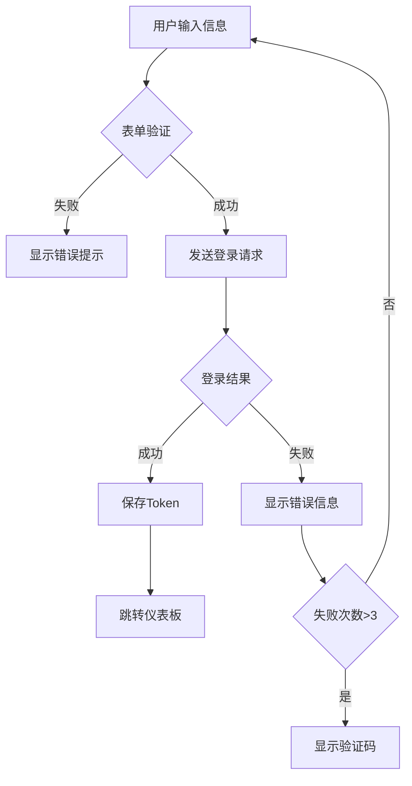

# 高校科研项目管理平台 - 前端技术文档

> 📌 **文档版本**: v1.0  
> 📅 **更新日期**: 2025-01-21  
> 🎯 **目标**: 基于原型图的完整前端开发指南，包含所有模块的字段定义、交互逻辑和数据库表结构设计

---

## 📋 目录

1. [项目概述](#-项目概述)
2. [设计规范](#-设计规范)
3. [通用组件](#-通用组件)
4. [页面路由](#️-页面路由)
5. [认证模块](#-认证模块)
6. [仪表板模块](#-仪表板模块)
7. [申报模块](#-申报模块)
8. [项目模块](#-项目模块)
9. [文件管理架构](#-文件管理架构)
10. [验收模块（报告管理）](#-验收模块报告管理)
11. [知识库模块](#-知识库模块)
12. [AI 助手模块](#-ai-助手模块)
13. [用户中心模块](#-用户中心模块)
14. [系统管理模块](#️-系统管理模块)
15. [完整数据库建表 SQL](#-完整数据库建表-sql)
16. [API 接口规范](#-api-接口规范)

---

## 📦 项目概述

### 技术栈

```json
{
  "framework": "Vue 3",
  "ui_library": "Element Plus 2.3.14",
  "build_tool": "Vite",
  "state_management": "Vue Composition API (reactive/ref)",
  "router": "Vue Router 4",
  "http_client": "Axios",
  "file_storage": "MinIO",
  "ai_service": "Dify",
  "language": "JavaScript"
}
```

### 项目结构

```
sci-z-web/
├── public/
│   ├── favicon.ico
│   └── index.html
├── src/
│   ├── api/                      # API 接口
│   │   ├── auth.js              # 认证相关
│   │   ├── user.js              # 用户中心相关
│   │   ├── declaration.js       # 申报相关
│   │   ├── project.js           # 项目相关
│   │   ├── report.js            # 报告管理相关
│   │   ├── file.js              # 文件管理相关
│   │   ├── knowledge.js         # 知识库相关
│   │   ├── ai.js                # AI助手相关
│   │   ├── system.js            # 系统管理相关
│   │   └── index.js             # API 统一导出
│   ├── assets/                   # 静态资源
│   │   ├── images/              # 图片
│   │   ├── styles/              # 全局样式
│   │   │   ├── variables.scss   # SCSS 变量
│   │   │   ├── mixins.scss      # SCSS 混入
│   │   │   └── common.scss      # 通用样式
│   │   └── icons/               # 图标
│   ├── components/               # 公共组件
│   │   ├── Layout/              # 布局组件
│   │   │   ├── Header.vue
│   │   │   ├── Sidebar.vue
│   │   │   ├── Footer.vue
│   │   │   └── MainLayout.vue
│   │   ├── FileUpload/          # 文件上传组件
│   │   │   ├── FileUpload.vue
│   │   │   └── FileList.vue
│   │   ├── FilePreview/         # 文件预览组件
│   │   │   └── FilePreview.vue
│   │   ├── SearchBox/           # 搜索框组件
│   │   │   └── SearchBox.vue
│   │   ├── StatusTag/           # 状态标签组件
│   │   │   └── StatusTag.vue
│   │   └── Common/              # 通用组件
│   │       ├── Pagination.vue
│   │       ├── Dialog.vue
│   │       └── Loading.vue
│   ├── composables/              # 组合式函数
│   │   ├── useAuth.js           # 认证相关
│   │   ├── useUpload.js         # 上传相关
│   │   ├── useSearch.js         # 搜索相关
│   │   └── useTable.js          # 表格相关
│   ├── directives/               # 自定义指令
│   │   ├── permission.js        # 权限指令
│   │   └── loading.js           # 加载指令
│   ├── router/                   # 路由配置
│   │   ├── index.js             # 路由主文件
│   │   ├── modules/             # 路由模块
│   │   │   ├── auth.js          # 认证路由
│   │   │   ├── user.js          # 用户中心路由
│   │   │   ├── declaration.js   # 申报路由
│   │   │   ├── project.js       # 项目路由
│   │   │   ├── report.js        # 报告管理路由
│   │   │   ├── knowledge.js     # 知识库路由
│   │   │   ├── ai.js            # AI助手路由
│   │   │   └── system.js        # 系统管理路由
│   │   └── guards.js            # 路由守卫
│   ├── store/                    # 状态管理（Pinia）
│   │   ├── index.js             # Store 入口
│   │   ├── modules/             # Store 模块
│   │   │   ├── auth.js          # 认证状态
│   │   │   ├── user.js          # 用户状态
│   │   │   ├── app.js           # 应用状态
│   │   │   ├── declaration.js   # 申报状态
│   │   │   ├── project.js       # 项目状态
│   │   │   ├── report.js        # 报告状态
│   │   │   ├── knowledge.js     # 知识库状态
│   │   │   ├── ai.js            # AI助手状态
│   │   │   ├── permission.js    # 权限状态
│   │   │   └── system.js        # 系统管理状态
│   │   └── types.js             # 类型定义
│   ├── utils/                    # 工具函数
│   │   ├── request.js           # Axios 封装
│   │   ├── auth.js              # 认证工具
│   │   ├── validate.js          # 表单验证
│   │   ├── date.js              # 日期处理
│   │   ├── file.js              # 文件处理
│   │   └── constants.js         # 常量定义
│   ├── views/                    # 页面视图
│   │   ├── Login/               # 登录页
│   │   │   └── index.vue
│   │   ├── Register/            # 注册页
│   │   │   └── index.vue
│   │   ├── Dashboard/           # 仪表板
│   │   │   └── index.vue
│   │   ├── User/                # 用户中心
│   │   │   ├── Profile.vue      # 个人信息
│   │   │   └── Security.vue     # 安全设置
│   │   ├── Declaration/         # 申报模块
│   │   │   ├── List.vue         # 申报列表
│   │   │   ├── Create.vue       # 新建申报
│   │   │   └── Detail.vue       # 申报详情
│   │   ├── Project/             # 项目模块
│   │   │   ├── List.vue         # 项目列表
│   │   │   ├── Detail.vue       # 项目详情
│   │   │   ├── Documents.vue    # 项目文档
│   │   │   ├── Progress.vue     # 项目进度
│   │   │   ├── Members.vue      # 项目成员
│   │   │   └── KnowledgeBase.vue # 知识库搜索
│   │   ├── Acceptance/          # 验收模块
│   │   │   ├── List.vue         # 验收列表
│   │   │   ├── Apply.vue        # 申请验收
│   │   │   ├── Detail.vue       # 验收详情
│   │   │   └── Reports.vue      # 报告管理
│   │   ├── AI/                  # AI助手模块
│   │   │   └── Chat.vue         # AI对话
│   │   ├── Knowledge/           # 知识库管理模块
│   │   │   ├── List.vue         # 知识库列表
│   │   │   ├── Detail.vue       # 知识库详情
│   │   │   └── Folder.vue       # 文件夹管理
│   │   ├── System/              # 系统管理模块
│   │   │   ├── User.vue         # 用户管理
│   │   │   ├── Role.vue         # 角色权限管理
│   │   │   ├── Config.vue       # 系统配置
│   │   │   └── Logs.vue         # 日志管理
│   │   └── Error/               # 错误页
│   │       ├── 403.vue
│   │       └── 404.vue
│   ├── App.vue                   # 根组件
│   └── main.js                   # 入口文件
├── .env.development              # 开发环境配置
├── .env.production               # 生产环境配置
├── .eslintrc.js                  # ESLint 配置
├── .prettierrc.js                # Prettier 配置
├── vite.config.js                # Vite 配置
└── package.json                  # 项目依赖
```

---

## 🎨 设计规范

### 颜色系统

#### 主色调

```css
:root {
  /* 主色调 - 深蓝色系 (学术蓝) */
  --color-primary: #1e3a8a;
  --color-primary-light: #2563eb;
  --color-primary-lighter: #3b82f6;
  --color-primary-lightest: #60a5fa;
  --color-primary-dark: #1e40af;

  /* 辅助色 - 皇家蓝色系 (优雅蓝) */
  --color-accent: #4169e1;
  --color-accent-light: #6b8cff;
  --color-accent-dark: #2952cc;

  /* 功能色 */
  --color-info: #2563eb;
  --color-success: #16a34a;
  --color-warning: #f59e0b;
  --color-error: #dc2626;

  /* 中性色 */
  --bg: #f7f9fc;
  --surface: #ffffff;
  --border: #e5e7eb;
  --text: #111827;
  --text-2: #4b5563;
  --text-3: #6b7280;
  --hover: #eef2ff;
  --disabled: #9ca3af;

  /* 其他 */
  --radius: 8px;
  --gap: 16px;
}
```

#### 颜色使用规范

| 场景          | 颜色      | 使用场景                         |
| ------------- | --------- | -------------------------------- |
| 主要按钮      | `#1E3A8A` | 提交、保存、确认操作             |
| 链接/悬浮     | `#4169E1` | 文字链接、鼠标悬浮状态、次级按钮 |
| 成功提示      | `#16A34A` | 操作成功、完成状态               |
| 警告提示      | `#F59E0B` | 需要注意的信息                   |
| 错误提示      | `#DC2626` | 错误信息、删除操作               |
| 信息提示      | `#2563EB` | 一般性信息提示                   |
| 高亮/交互反馈 | `#6B8CFF` | 卡片悬浮、选中高亮、交互状态     |

### 字体系统

```css
body {
  font-family: Inter, system-ui, -apple-system, Segoe UI, Roboto, PingFang SC, Microsoft
      YaHei, sans-serif;
  font-size: 14px;
  line-height: 1.5;
  color: #111827;
}

/* 标题字体 */
h1 {
  font-size: 24px;
  font-weight: 600;
}
h2 {
  font-size: 20px;
  font-weight: 600;
}
h3 {
  font-size: 18px;
  font-weight: 600;
}
h4 {
  font-size: 16px;
  font-weight: 600;
}
h5 {
  font-size: 14px;
  font-weight: 600;
}

/* 正文字体 */
.text-lg {
  font-size: 16px;
}
.text-base {
  font-size: 14px;
}
.text-sm {
  font-size: 12px;
}
.text-xs {
  font-size: 10px;
}
```

### 按钮样式

```css
/* 主要按钮 */
.el-button--primary {
  background-color: #1e3a8a;
  border-color: #1e3a8a;
  color: #ffffff;
}

.el-button--primary:hover {
  background-color: #1e40af;
  border-color: #1e40af;
  transform: translateY(-1px);
  box-shadow: 0 4px 12px rgba(30, 58, 138, 0.3);
}

/* 次要按钮 */
.el-button--default {
  background-color: #ffffff;
  border-color: #d1d5db;
  color: #6b7280;
}

.el-button--default:hover {
  background-color: #f9fafb;
  border-color: #9ca3af;
  color: #374151;
}

/* 文本按钮 */
.el-button--text {
  color: #4169e1;
}

.el-button--text:hover {
  color: #2952cc;
  background-color: #eef2ff;
}

/* 危险按钮 */
.el-button--danger {
  background-color: #dc2626;
  border-color: #dc2626;
  color: #ffffff;
}
```

### 卡片样式

```css
.card {
  background: #ffffff;
  border: 1px solid #e5e7eb;
  border-radius: 8px;
  padding: 16px;
  box-shadow: 0 1px 2px rgba(0, 0, 0, 0.04);
  transition: all 0.3s ease;
}

.card:hover {
  box-shadow: 0 4px 12px rgba(0, 0, 0, 0.08);
  transform: translateY(-2px);
}
```

### 表单样式

```css
.el-form-item__label {
  color: #374151;
  font-weight: 500;
  font-size: 14px;
}

.el-input__inner {
  border-color: #e5e7eb;
  color: #1f2937;
}

.el-input__inner:focus {
  border-color: #1e3a8a;
  box-shadow: 0 0 0 2px rgba(30, 58, 138, 0.2);
}

.el-input__inner::placeholder {
  color: #9ca3af;
}
```

### 弹窗样式

```css
.el-dialog {
  border-radius: 12px;
  overflow: hidden;
  box-shadow: 0 8px 32px rgba(0, 0, 0, 0.12);
}

.el-dialog__header {
  padding: 20px 24px 16px;
  border-bottom: 1px solid #f0f0f0;
  background: #ffffff;
}

.el-dialog__title {
  font-size: 16px;
  font-weight: 600;
  color: #1e3a8a;
}

.el-dialog__body {
  padding: 20px 24px;
  background: #ffffff;
}

.el-dialog__footer {
  padding: 16px 24px 20px;
  background: #ffffff;
}
```

### 消息提示样式

```css
.el-message-box {
  border-radius: 12px;
  box-shadow: 0 8px 32px rgba(0, 0, 0, 0.12);
}

.el-message-box__title {
  font-size: 16px;
  font-weight: 600;
  color: #1f2937;
}

.el-message-box__message {
  font-size: 14px;
  color: #374151;
}
```

---

## 🧩 通用组件

### 1. 布局组件 (原型壳-布局.html)

#### 功能描述

全局布局框架，包含顶部导航、侧边栏菜单和内容区域。

#### 组件结构

```vue
<template>
  <div class="layout">
    <!-- 顶部导航栏 -->
    <div class="header">
      <div class="logo">
        
        高校科研管理平台
      </div>
      <div class="header-right">
        <el-dropdown @command="handleCommand">
          <span class="user-info">
            <el-avatar :size="32" />
            <span>{{ username }}</span>
          </span>
          <template #dropdown>
            <el-dropdown-menu>
              <el-dropdown-item command="profile">个人中心</el-dropdown-item>
              <el-dropdown-item command="logout" divided
                >退出登录</el-dropdown-item
              >
            </el-dropdown-menu>
          </template>
        </el-dropdown>
      </div>
    </div>

    <!-- 主体区域 -->
    <div class="main">
      <!-- 侧边栏 -->
      <div class="sidebar" :class="{ collapsed: collapsed }">
        <el-menu
          :default-active="activeMenu"
          :collapse="collapsed"
          @select="handleMenuSelect"
        >
          <!-- 菜单项... -->
        </el-menu>
        <div class="menu-toggle-btn" @click="toggleMenu">
          <el-icon>
            <component :is="collapsed ? 'Expand' : 'Fold'" />
          </el-icon>
        </div>
      </div>

      <!-- 内容区 -->
      <div class="content">
        <div class="breadcrumb">
          <el-breadcrumb separator="/">
            <el-breadcrumb-item>首页</el-breadcrumb-item>
            <el-breadcrumb-item v-for="item in breadcrumbs" :key="item">
              {{ item }}
            </el-breadcrumb-item>
          </el-breadcrumb>
        </div>
        <div class="page-content">
          <router-view />
        </div>
      </div>
    </div>
  </div>
</template>
```

#### 数据字段

| 字段名        | 类型    | 说明             |
| ------------- | ------- | ---------------- |
| `activeMenu`  | String  | 当前激活的菜单项 |
| `collapsed`   | Boolean | 侧边栏折叠状态   |
| `currentPage` | String  | 当前页面路径     |
| `breadcrumbs` | Array   | 面包屑导航数组   |
| `username`    | String  | 当前登录用户名   |

#### 菜单配置

```javascript
const menuMap = {
  dashboard: {
    page: "/dashboard",
    breadcrumb: ["仪表板"],
  },
  "declaration/list": {
    page: "/declaration/list",
    breadcrumb: ["申报管理", "申报列表"],
  },
  "project/list": {
    page: "/project/list",
    breadcrumb: ["项目管理", "项目列表"],
  },
  // ... 其他菜单项
};
```

#### 页面跳转实现

```javascript
// 使用postMessage进行iframe页面跳转
window.parent.postMessage(
  {
    type: "navigate",
    path: "project/list",
  },
  "*"
);

// 监听消息
window.addEventListener("message", (event) => {
  if (event.data && event.data.type === "navigate") {
    handleMenuSelect(event.data.path);
  }
});
```

### 2. 分页组件 (组件-分页.html)

#### 功能描述

通用分页组件，支持页码导航、每页数量选择、快速跳转。

#### 组件 Props

| 参数         | 类型   | 默认值         | 说明             |
| ------------ | ------ | -------------- | ---------------- |
| `current`    | Number | 1              | 当前页码         |
| `pageSize`   | Number | 10             | 每页显示数量     |
| `total`      | Number | 0              | 总记录数         |
| `pageSizes`  | Array  | [10,20,50,100] | 每页显示数量选项 |
| `pagerCount` | Number | 7              | 显示的页码数量   |

#### 组件 Events

| 事件名           | 参数 | 说明               |
| ---------------- | ---- | ------------------ |
| `current-change` | page | 页码改变时触发     |
| `size-change`    | size | 每页数量改变时触发 |

#### 使用示例

```vue
<template>
  <div class="pagination-container">
    <!-- 分页信息 -->
    <div class="pagination-info">共 {{ total }} 条记录</div>

    <!-- 每页显示数量 -->
    <div class="page-size-selector">
      每页显示
      <select v-model="pageSize" @change="handlePageSizeChange">
        <option v-for="size in pageSizes" :key="size" :value="size">
          {{ size }} 条
        </option>
      </select>
    </div>

    <!-- 页码按钮 -->
    <div class="page-nav">
      <a
        v-for="page in visiblePages"
        :key="page"
        class="page-btn"
        :class="{ active: currentPage === page }"
        @click="handlePageChange(page)"
      >
        {{ page }}
      </a>
    </div>

    <!-- 快速跳转 -->
    <div class="page-jumper">
      跳至
      <input
        v-model.number="jumpPage"
        type="number"
        @keyup.enter="handleJump"
      />
      页
      <button class="jump-btn" @click="handleJump">确定</button>
    </div>
  </div>
</template>
```

### 3. 表格组件 (组件-通用表格.html)

#### 功能描述

通用数据表格组件，支持搜索、排序、分页。

#### 使用示例

```vue
<template>
  <div class="card">
    <!-- 搜索表单 -->
    <div class="search-form">
      <el-form :inline="true" :model="searchForm">
        <el-form-item label="关键词">
          <el-input v-model="searchForm.keyword" placeholder="请输入" />
        </el-form-item>
        <el-form-item label="状态">
          <el-select v-model="searchForm.status">
            <el-option label="全部" value="" />
            <el-option label="进行中" value="1" />
            <el-option label="已完成" value="2" />
          </el-select>
        </el-form-item>
        <el-form-item>
          <el-button type="primary" @click="handleSearch">查询</el-button>
          <el-button @click="handleReset">重置</el-button>
        </el-form-item>
      </el-form>
    </div>

    <!-- 数据表格 -->
    <el-table :data="tableData" style="width: 100%">
      <el-table-column prop="id" label="ID" width="80" />
      <el-table-column prop="name" label="名称" />
      <el-table-column prop="status" label="状态" width="120" />
      <el-table-column label="操作" width="160">
        <template #default="{ row }">
          <el-button text type="primary" @click="handleEdit(row)">
            编辑
          </el-button>
          <el-popconfirm title="确认删除？" @confirm="handleDelete(row)">
            <template #reference>
              <el-button text type="danger">删除</el-button>
            </template>
          </el-popconfirm>
        </template>
      </el-table-column>
    </el-table>

    <!-- 分页 -->
    <Pagination
      v-model:current="pagination.current"
      v-model:pageSize="pagination.size"
      :total="pagination.total"
      @current-change="loadData"
      @size-change="loadData"
    />
  </div>
</template>
```

### 4. 表单组件 (组件-通用表单.html)

#### 功能描述

通用表单组件，支持各种输入类型、验证规则。

#### 表单类型

- **文本输入**: `el-input`
- **多行文本**: `el-input type="textarea"`
- **数字输入**: `el-input-number`
- **选择器**: `el-select`
- **日期选择**: `el-date-picker`
- **时间选择**: `el-time-picker`
- **日期范围**: `el-date-picker type="daterange"`
- **开关**: `el-switch`
- **单选**: `el-radio-group`
- **多选**: `el-checkbox-group`
- **文件上传**: `el-upload`
- **富文本**: 自定义编辑器

#### 验证规则

```javascript
const rules = {
  name: [
    { required: true, message: "请输入名称", trigger: "blur" },
    { min: 2, max: 100, message: "长度在 2 到 100 个字符", trigger: "blur" },
  ],
  email: [
    { required: true, message: "请输入邮箱", trigger: "blur" },
    { type: "email", message: "请输入正确的邮箱格式", trigger: "blur" },
  ],
  phone: [
    { required: true, message: "请输入手机号", trigger: "blur" },
    {
      pattern: /^1[3-9]\d{9}$/,
      message: "请输入正确的手机号",
      trigger: "blur",
    },
  ],
};
```

---

## 🛣️ 页面路由

### 路由配置表

| 路径                      | 组件                     | 名称       | 权限                      | 说明           |
| ------------------------- | ------------------------ | ---------- | ------------------------- | -------------- |
| `/login`                  | `auth/Login.vue`         | 登录       | 公开                      | 用户登录页面   |
| `/register`               | `auth/Register.vue`      | 注册       | 公开                      | 用户注册页面   |
| `/reset-password`         | `auth/ResetPassword.vue` | 重置密码   | 公开                      | 密码重置页面   |
| `/dashboard`              | `dashboard/Index.vue`    | 仪表板     | `menu:dashboard:view`     | 数据统计仪表板 |
| `/declaration/list`       | `declaration/List.vue`   | 申报列表   | `menu:declaration:list`   | 申报列表页面   |
| `/declaration/create`     | `declaration/Create.vue` | 新建申报   | `menu:declaration:create` | 新建申报页面   |
| `/declaration/detail/:id` | `declaration/Detail.vue` | 申报详情   | `menu:declaration:detail` | 申报详情页面   |
| `/project/list`           | `project/List.vue`       | 项目列表   | `menu:project:list`       | 项目列表页面   |
| `/project/detail/:id`     | `project/Detail.vue`     | 项目详情   | `menu:project:detail`     | 项目详情页面   |
| `/project/progress/:id`   | `project/Progress.vue`   | 项目进度   | `menu:project:progress`   | 项目进度页面   |
| `/report/list`            | `report/List.vue`        | 报告列表   | `menu:report:list`        | 报告管理列表   |
| `/report/generate`        | `report/Generate.vue`    | 报告生成   | `menu:report:generate`    | 生成报告页面   |
| `/knowledge/list`         | `knowledge/List.vue`     | 知识库列表 | `menu:knowledge:list`     | 知识库列表页面 |
| `/knowledge/detail/:id`   | `knowledge/Detail.vue`   | 知识库详情 | `menu:knowledge:detail`   | 知识库详情页面 |
| `/ai/chat`                | `ai/Chat.vue`            | AI 对话    | `menu:ai:chat`            | AI 助手对话    |
| `/ai/knowledge`           | `ai/Knowledge.vue`       | 知识库     | `menu:ai:knowledge`       | 知识库搜索     |
| `/user/profile`           | `user/Profile.vue`       | 个人信息   | `menu:user:profile`       | 个人信息管理   |
| `/user/security`          | `user/Security.vue`      | 安全设置   | `menu:user:security`      | 安全设置页面   |
| `/system/user`            | `system/User.vue`        | 用户管理   | `menu:system:user`        | 用户管理页面   |
| `/system/role`            | `system/Role.vue`        | 角色权限   | `menu:system:role`        | 角色权限管理   |
| `/system/config`          | `system/Config.vue`      | 系统配置   | `menu:system:config`      | 系统配置页面   |
| `/system/logs`            | `system/Logs.vue`        | 日志管理   | `menu:system:logs`        | 系统日志查看   |

### 路由守卫

```javascript
router.beforeEach((to, from, next) => {
  const token = localStorage.getItem("auth_token");
  const publicPages = ["/login", "/register", "/reset-password"];
  const authRequired = !publicPages.includes(to.path);

  if (authRequired && !token) {
    return next("/login");
  }

  // 权限验证
  if (to.meta.permission) {
    const hasPermission = checkPermission(to.meta.permission);
    if (!hasPermission) {
      ElMessage.error("无权限访问该页面");
      return next(from.path);
    }
  }

  next();
});
```

---

## 🔐 认证模块

### 1. 登录页面 (`登录.html`)

#### 页面功能

- 用户身份验证
- 记住登录状态
- 密码显示/隐藏切换
- 跳转注册/重置密码

#### 数据字段

| 字段名       | 类型    | 必填 | 长度 | 验证规则 | 说明               |
| ------------ | ------- | ---- | ---- | -------- | ------------------ |
| `username`   | String  | ✓    | 3-50 | -        | 用户名/学工号/邮箱 |
| `password`   | String  | ✓    | 6-20 | -        | 登录密码           |
| `captcha`    | String  | ✗    | 4    | -        | 图形验证码(可选)   |
| `rememberMe` | Boolean | ✗    | -    | -        | 7 天免登录         |

#### 表单验证

```javascript
const loginRules = {
  username: [
    { required: true, message: "请输入用户名", trigger: "blur" },
    { min: 3, max: 50, message: "长度在 3 到 50 个字符", trigger: "blur" },
  ],
  password: [
    { required: true, message: "请输入密码", trigger: "blur" },
    { min: 6, max: 20, message: "长度在 6 到 20 个字符", trigger: "blur" },
  ],
};
```

#### 交互流程



#### API 接口

**POST** `/api/auth/login`

请求参数:

```json
{
  "username": "zhangsan",
  "password": "password123",
  "captcha": "ABCD",
  "rememberMe": true
}
```

响应数据:

```json
{
  "code": 200,
  "message": "登录成功",
  "data": {
    "token": "eyJhbGciOiJIUzI1NiIsInR5cCI6IkpXVCJ9...",
    "userId": 1,
    "username": "zhangsan",
    "realName": "张三",
    "avatar": "https://example.com/avatar.jpg",
    "permissions": ["menu:dashboard:view", "menu:project:list"],
    "roles": ["teacher"]
  }
}
```

#### 数据库表: `sys_user`

| 字段名            | 类型     | 长度 | 非空 | 默认值            | 说明                        |
| ----------------- | -------- | ---- | ---- | ----------------- | --------------------------- |
| `id`              | BIGINT   | -    | ✓    | AUTO              | 用户 ID(主键)               |
| `username`        | VARCHAR  | 50   | ✓    | -                 | 用户名(唯一)                |
| `password`        | VARCHAR  | 255  | ✓    | -                 | 密码(加密)                  |
| `real_name`       | VARCHAR  | 50   | ✓    | -                 | 真实姓名                    |
| `email`           | VARCHAR  | 100  | ✗    | NULL              | 邮箱                        |
| `phone`           | VARCHAR  | 20   | ✗    | NULL              | 手机号                      |
| `avatar`          | VARCHAR  | 255  | ✗    | NULL              | 头像 URL                    |
| `department_id`   | BIGINT   | -    | ✗    | NULL              | 所属部门 ID                 |
| `status`          | TINYINT  | -    | ✓    | 1                 | 状态(0:禁用,1:启用)         |
| `login_count`     | INT      | -    | ✓    | 0                 | 登录次数                    |
| `last_login_time` | DATETIME | -    | ✗    | NULL              | 最后登录时间                |
| `last_login_ip`   | VARCHAR  | 50   | ✗    | NULL              | 最后登录 IP                 |
| `create_time`     | DATETIME | -    | ✓    | CURRENT_TIMESTAMP | 创建时间                    |
| `update_time`     | DATETIME | -    | ✓    | CURRENT_TIMESTAMP | 更新时间                    |
| `deleted`         | TINYINT  | -    | ✓    | 0                 | 删除标记(0:未删除,1:已删除) |

**索引**:

- PRIMARY KEY (`id`)
- UNIQUE KEY `uk_username` (`username`)
- KEY `idx_email` (`email`)
- KEY `idx_phone` (`phone`)
- KEY `idx_department` (`department_id`)

### 2. 注册页面 (`注册.html`)

#### 页面功能

- 新用户注册
- 邮箱/手机验证
- 密码强度检测
- 用户名唯一性验证

#### 数据字段

| 字段名            | 类型   | 必填 | 长度 | 验证规则   | 说明          |
| ----------------- | ------ | ---- | ---- | ---------- | ------------- |
| `username`        | String | ✓    | 3-50 | 唯一性     | 用户名/学工号 |
| `password`        | String | ✓    | 6-20 | 强度检测   | 登录密码      |
| `confirmPassword` | String | ✓    | 6-20 | 与密码一致 | 确认密码      |
| `realName`        | String | ✓    | 2-10 | 中文       | 真实姓名      |
| `email`           | String | ✓    | -    | 邮箱格式   | 邮箱地址      |
| `phone`           | String | ✓    | 11   | 手机格式   | 手机号码      |
| `department`      | String | ✓    | -    | -          | 所属院系      |
| `verifyCode`      | String | ✓    | 6    | -          | 验证码        |

#### 表单验证

```javascript
const registerRules = {
  username: [
    { required: true, message: "请输入用户名", trigger: "blur" },
    { min: 3, max: 50, message: "长度在 3 到 50 个字符", trigger: "blur" },
    { validator: checkUsernameUnique, trigger: "blur" }, // 异步验证
  ],
  password: [
    { required: true, message: "请输入密码", trigger: "blur" },
    { min: 6, max: 20, message: "长度在 6 到 20 个字符", trigger: "blur" },
    { validator: checkPasswordStrength, trigger: "blur" },
  ],
  confirmPassword: [
    { required: true, message: "请确认密码", trigger: "blur" },
    {
      validator: (rule, value, callback) => {
        if (value !== form.password) {
          callback(new Error("两次输入密码不一致"));
        } else {
          callback();
        }
      },
      trigger: "blur",
    },
  ],
  email: [
    { required: true, message: "请输入邮箱", trigger: "blur" },
    { type: "email", message: "请输入正确的邮箱格式", trigger: "blur" },
  ],
  phone: [
    { required: true, message: "请输入手机号", trigger: "blur" },
    {
      pattern: /^1[3-9]\d{9}$/,
      message: "请输入正确的手机号",
      trigger: "blur",
    },
  ],
};
```

#### 密码强度检测

```javascript
function checkPasswordStrength(password) {
  let strength = 0;

  // 长度检测
  if (password.length >= 8) strength++;
  if (password.length >= 12) strength++;

  // 包含数字
  if (/\d/.test(password)) strength++;

  // 包含小写字母
  if (/[a-z]/.test(password)) strength++;

  // 包含大写字母
  if (/[A-Z]/.test(password)) strength++;

  // 包含特殊字符
  if (/[^a-zA-Z0-9]/.test(password)) strength++;

  // 返回强度级别
  if (strength <= 2) return { level: "weak", text: "弱", color: "#F56C6C" };
  if (strength <= 4) return { level: "medium", text: "中", color: "#E6A23C" };
  return { level: "strong", text: "强", color: "#67C23A" };
}
```

#### API 接口

**POST** `/api/auth/register`

请求参数:

```json
{
  "username": "zhangsan",
  "password": "Pass123!",
  "realName": "张三",
  "email": "zhangsan@example.com",
  "phone": "13800138000",
  "department": "计算机学院",
  "verifyCode": "123456"
}
```

响应数据:

```json
{
  "code": 200,
  "message": "注册成功",
  "data": {
    "userId": 1,
    "username": "zhangsan"
  }
}
```

### 3. 重置密码页面 (`重置密码.html`)

#### 页面功能

- 通过邮箱/手机重置密码
- 验证码验证
- 新密码设置

#### 数据字段

| 字段名            | 类型   | 必填 | 说明     |
| ----------------- | ------ | ---- | -------- |
| `email`           | String | ✓    | 注册邮箱 |
| `verifyCode`      | String | ✓    | 验证码   |
| `newPassword`     | String | ✓    | 新密码   |
| `confirmPassword` | String | ✓    | 确认密码 |

#### API 接口

**POST** `/api/auth/reset-password`

请求参数:

```json
{
  "email": "zhangsan@example.com",
  "verifyCode": "123456",
  "newPassword": "NewPass123!"
}
```

---

## 📊 仪表板模块

### 统计卡片

根据 `仪表板.html` 分析，仪表板包含以下核心功能：

#### 数据字段

```javascript
const stats = reactive([
  {
    type: "total",
    icon: "📁",
    label: "项目总数",
    value: 24,
    changePercent: 12,
    trend: "up",
  },
  {
    type: "inProgress",
    icon: "⏳",
    label: "进行中",
    value: 12,
  },
  {
    type: "pending",
    icon: "⚠️",
    label: "待验收",
    value: 5,
  },
  {
    type: "completed",
    icon: "✓",
    label: "已完成",
    value: 7,
  },
]);
```

### 数据库表需求

**表名**: `dashboard_stats`

- `id`: BIGINT PRIMARY KEY
- `stat_date`: DATE - 统计日期
- `total_projects`: INT - 项目总数
- `in_progress_projects`: INT - 进行中项目
- `pending_acceptance`: INT - 待验收项目
- `completed_projects`: INT - 已完成项目
- `create_time`: DATETIME

---

## 📝 申报模块

### 核心数据表: `declaration`

| 字段名                  | 类型     | 长度 | 非空 | 默认值                                        | 说明                  |
| ----------------------- | -------- | ---- | ---- | --------------------------------------------- | --------------------- |
| `id`                    | BIGINT   | -    | ✓    | AUTO                                          | 主键                  |
| `number`                | VARCHAR  | 50   | ✓    | -                                             | 申报编号(唯一)        |
| `applicant_id`          | BIGINT   | -    | ✓    | -                                             | 申报人 ID             |
| `applicant_name`        | VARCHAR  | 50   | ✓    | -                                             | 申报人姓名            |
| `department`            | VARCHAR  | 100  | ✓    | -                                             | 课题发布部门          |
| `project_leader`        | VARCHAR  | 50   | ✓    | -                                             | 项目负责人            |
| `document_publish_time` | DATE     | -    | ✗    | NULL                                          | 红头文件发布时间      |
| `project_start_time`    | DATE     | -    | ✗    | NULL                                          | 项目开始时间          |
| `project_end_time`      | DATE     | -    | ✗    | NULL                                          | 项目结束时间          |
| `research_direction`    | TEXT     | -    | ✓    | -                                             | 研究方向(富文本 HTML) |
| `research_fields`       | JSON     | -    | ✗    | NULL                                          | 研究领域(JSON 数组)   |
| `research_topic`        | VARCHAR  | 500  | ✗    | NULL                                          | 研究课题              |
| `content_summary`       | TEXT     | -    | ✗    | NULL                                          | 研究内容摘要          |
| `workflow_id`           | VARCHAR  | 50   | ✗    | NULL                                          | Dify 工作流 ID        |
| `workflow_status`       | VARCHAR  | 20   | ✓    | 'pending'                                     | 工作流状态            |
| `workflow_result`       | JSON     | -    | ✗    | NULL                                          | 工作流执行结果(JSON)  |
| `status`                | VARCHAR  | 20   | ✓    | 'pending'                                     | 申报状态              |
| `submit_time`           | DATETIME | -    | ✗    | NULL                                          | 提交时间              |
| `create_time`           | DATETIME | -    | ✓    | CURRENT_TIMESTAMP                             | 创建时间              |
| `update_time`           | DATETIME | -    | ✓    | CURRENT_TIMESTAMP ON UPDATE CURRENT_TIMESTAMP | 更新时间              |
| `deleted`               | TINYINT  | -    | ✓    | 0                                             | 软删除标记            |

**索引**:

```sql
PRIMARY KEY (`id`)
UNIQUE KEY `uk_number` (`number`)
KEY `idx_applicant` (`applicant_id`)
KEY `idx_status` (`status`)
KEY `idx_submit_time` (`submit_time`)
KEY `idx_deleted` (`deleted`)
```

**状态枚举**: `pending`(申报中), `success`(申报成功), `failed`(申报失败)

### 工作流模板表: `sys_workflow_template`

| 字段名             | 类型     | 长度 | 非空 | 说明                    |
| ------------------ | -------- | ---- | ---- | ----------------------- |
| `id`               | BIGINT   | -    | ✓    | 主键                    |
| `name`             | VARCHAR  | 100  | ✓    | 工作流名称              |
| `description`      | TEXT     | -    | ✗    | 工作流描述              |
| `dify_workflow_id` | VARCHAR  | 100  | ✗    | Dify 工作流 ID          |
| `category`         | VARCHAR  | 50   | ✓    | 工作流分类              |
| `is_active`        | TINYINT  | -    | ✓    | 是否启用(0:禁用,1:启用) |
| `sort_order`       | INT      | -    | ✓    | 排序号                  |
| `create_time`      | DATETIME | -    | ✓    | 创建时间                |
| `update_time`      | DATETIME | -    | ✓    | 更新时间                |
| `deleted`          | TINYINT  | -    | ✓    | 软删除标记              |

**索引**:

```sql
PRIMARY KEY (`id`)
KEY `idx_category` (`category`)
KEY `idx_active` (`is_active`)
KEY `idx_deleted` (`deleted`)
```

---

## 📁 项目模块

### 核心数据表: `project`

| 字段名              | 类型     | 长度 | 非空 | 默认值                                        | 说明              |
| ------------------- | -------- | ---- | ---- | --------------------------------------------- | ----------------- |
| `id`                | BIGINT   | -    | ✓    | AUTO                                          | 主键              |
| `number`            | VARCHAR  | 50   | ✓    | -                                             | 项目编号(唯一)    |
| `name`              | VARCHAR  | 200  | ✓    | -                                             | 项目名称          |
| `description`       | TEXT     | -    | ✗    | NULL                                          | 项目描述          |
| `declaration_id`    | BIGINT   | -    | ✓    | -                                             | 关联申报 ID       |
| `budget`            | DECIMAL  | 15,2 | ✗    | 0.00                                          | 项目预算(元)      |
| `progress`          | TINYINT  | -    | ✓    | 0                                             | 进度百分比(0-100) |
| `status`            | VARCHAR  | 20   | ✓    | 'pending'                                     | 项目状态          |
| `dify_knowledge_id` | VARCHAR  | 100  | ✗    | NULL                                          | Dify 知识库 ID    |
| `create_time`       | DATETIME | -    | ✓    | CURRENT_TIMESTAMP                             | 创建时间          |
| `update_time`       | DATETIME | -    | ✓    | CURRENT_TIMESTAMP ON UPDATE CURRENT_TIMESTAMP | 更新时间          |
| `deleted`           | TINYINT  | -    | ✓    | 0                                             | 软删除标记        |

**索引**:

```sql
PRIMARY KEY (`id`)
UNIQUE KEY `uk_number` (`number`)
KEY `idx_manager` (`manager_id`)
KEY `idx_status` (`status`)
KEY `idx_declaration` (`declaration_id`)
KEY `idx_deleted` (`deleted`)
```

**状态枚举**: `pending`(未开始), `in_progress`(进行中), `completed`(已完成), `delayed`(已延期), `paused`(暂停), `terminated`(已终止)

### 设计说明

**数据关联策略**: 项目表通过 `declaration_id` 关联申报表，基础信息（负责人、部门、研究方向、时间等）从申报表查询，避免数据冗余。

**可编辑字段**: 项目创建后，只能编辑以下字段：

- `description` - 项目描述
- `budget` - 项目预算
- `members` - 项目成员
- `milestones` - 项目里程碑

**数据一致性**: 项目的基础信息与申报表保持一致，确保数据来源的唯一性和准确性。

## 📎 文件管理架构

### 设计理念

**统一文件管理**: 所有文件上传都通过统一的附件表管理，避免重复设计  
**灵活关联**: 通过关联表支持文件与多个业务对象的关联  
**MinIO 集成**: 与 MinIO 文件服务器深度集成，支持文件去重  
**Dify 集成**: 支持文件自动同步到 Dify 知识库

### 使用场景

| 业务场景 | 关联类型      | 附件类型   | 说明                     |
| -------- | ------------- | ---------- | ------------------------ |
| 项目文档 | `project`     | `document` | 项目相关文档、图片、视频 |
| 申报材料 | `declaration` | `document` | 申报相关文件、证明材料   |
| 验收报告 | `acceptance`  | `document` | 验收报告、附件材料       |
| 用户头像 | `user`        | `image`    | 用户头像、个人资料图片   |
| 系统配置 | `system`      | `other`    | 系统配置文件、模板文件   |

### 文件服务集成

**MinIO 存储**:

- 文件去重：通过 MD5 哈希值避免重复存储
- 路径管理：统一的文件存储路径规范
- 访问控制：支持公开/私有文件访问控制

**Dify 知识库**:

- 自动同步：文件上传后自动同步到 Dify
- 文档解析：支持 PDF、Word 等文档内容提取
- 知识检索：文件内容可用于 AI 问答

### 架构优势

**1. 统一管理**:

- 所有文件通过统一表管理，避免数据冗余
- 统一的文件服务接口，便于维护
- 统一的权限控制和访问管理

**2. 灵活关联**:

- 一个文件可以关联多个业务对象
- 支持文件在不同业务场景间复用
- 便于文件的生命周期管理

**3. 性能优化**:

- 文件去重：相同文件只存储一份
- 索引优化：支持按类型、关联对象快速查询
- 缓存机制：支持文件预览缓存

**4. 扩展性强**:

- 支持多种文件类型和业务场景
- 易于集成第三方文件服务
- 支持文件版本管理和历史记录

### 通用附件表: `sys_attachment`

| 字段名           | 类型     | 长度 | 非空 | 说明                      |
| ---------------- | -------- | ---- | ---- | ------------------------- |
| `id`             | BIGINT   | -    | ✓    | 主键                      |
| `file_name`      | VARCHAR  | 255  | ✓    | 文件名称                  |
| `original_name`  | VARCHAR  | 255  | ✓    | 原始文件名                |
| `file_type`      | VARCHAR  | 20   | ✓    | 文件类型(PDF/DOCX/IMG 等) |
| `file_extension` | VARCHAR  | 10   | ✓    | 文件扩展名                |
| `file_size`      | BIGINT   | -    | ✓    | 文件大小(字节)            |
| `file_url`       | VARCHAR  | 500  | ✓    | MinIO 文件 URL            |
| `file_path`      | VARCHAR  | 500  | ✓    | MinIO 存储路径            |
| `mime_type`      | VARCHAR  | 100  | ✓    | MIME 类型                 |
| `md5_hash`       | VARCHAR  | 32   | ✓    | 文件 MD5 哈希值           |
| `uploader_id`    | BIGINT   | -    | ✓    | 上传人 ID                 |
| `uploader_name`  | VARCHAR  | 50   | ✓    | 上传人姓名                |
| `upload_time`    | DATETIME | -    | ✓    | 上传时间                  |
| `download_count` | INT      | -    | ✓    | 下载次数                  |
| `is_public`      | TINYINT  | -    | ✓    | 是否公开(0:私有,1:公开)   |
| `dify_doc_id`    | VARCHAR  | 100  | ✗    | Dify 文档 ID              |
| `create_time`    | DATETIME | -    | ✓    | 创建时间                  |
| `deleted`        | TINYINT  | -    | ✓    | 软删除标记                |

**索引**:

```sql
PRIMARY KEY (`id`)
KEY `idx_uploader` (`uploader_id`)
KEY `idx_type` (`file_type`)
KEY `idx_hash` (`md5_hash`)
KEY `idx_public` (`is_public`)
KEY `idx_deleted` (`deleted`)
```

### 附件关联表: `sys_attachment_relation`

| 字段名            | 类型     | 长度 | 非空 | 说明                                          |
| ----------------- | -------- | ---- | ---- | --------------------------------------------- |
| `id`              | BIGINT   | -    | ✓    | 主键                                          |
| `attachment_id`   | BIGINT   | -    | ✓    | 附件 ID                                       |
| `relation_type`   | VARCHAR  | 20   | ✓    | 关联类型(project/declaration/acceptance/user) |
| `relation_id`     | BIGINT   | -    | ✓    | 关联对象 ID                                   |
| `relation_name`   | VARCHAR  | 100  | ✗    | 关联对象名称                                  |
| `attachment_type` | VARCHAR  | 20   | ✓    | 附件类型(document/image/video/other)          |
| `sort_order`      | INT      | -    | ✓    | 排序号                                        |
| `create_time`     | DATETIME | -    | ✓    | 创建时间                                      |
| `deleted`         | TINYINT  | -    | ✓    | 软删除标记                                    |

**索引**:

```sql
PRIMARY KEY (`id`)
KEY `idx_attachment` (`attachment_id`)
KEY `idx_relation` (`relation_type`, `relation_id`)
KEY `idx_type` (`attachment_type`)
KEY `idx_deleted` (`deleted`)
```

### 关联表: `project_member`

| 字段名        | 类型     | 长度 | 非空 | 说明                                                   |
| ------------- | -------- | ---- | ---- | ------------------------------------------------------ |
| `id`          | BIGINT   | -    | ✓    | 主键                                                   |
| `project_id`  | BIGINT   | -    | ✓    | 项目 ID                                                |
| `user_id`     | BIGINT   | -    | ✓    | 用户 ID                                                |
| `user_name`   | VARCHAR  | 50   | ✓    | 用户姓名                                               |
| `role`        | VARCHAR  | 20   | ✓    | 角色(manager:项目负责人/core:核心成员/member:普通成员) |
| `join_time`   | DATETIME | -    | ✓    | 加入时间                                               |
| `create_time` | DATETIME | -    | ✓    | 创建时间                                               |
| `deleted`     | TINYINT  | -    | ✓    | 软删除标记                                             |

**索引**:

```sql
PRIMARY KEY (`id`)
UNIQUE KEY `uk_project_user` (`project_id`, `user_id`)
KEY `idx_user` (`user_id`)
KEY `idx_deleted` (`deleted`)
```

### 关联表: `project_progress`

| 字段名                 | 类型     | 长度 | 非空 | 说明                  |
| ---------------------- | -------- | ---- | ---- | --------------------- |
| `id`                   | BIGINT   | -    | ✓    | 主键                  |
| `project_id`           | BIGINT   | -    | ✓    | 项目 ID               |
| `title`                | VARCHAR  | 200  | ✓    | 进度标题/里程碑名称   |
| `content`              | TEXT     | -    | ✗    | 进度内容/里程碑描述   |
| `progress`             | TINYINT  | -    | ✓    | 进度百分比(0-100)     |
| `is_milestone`         | TINYINT  | -    | ✓    | 是否里程碑(0:否,1:是) |
| `milestone_start_time` | DATE     | -    | ✗    | 里程碑开始时间        |
| `milestone_end_time`   | DATE     | -    | ✗    | 里程碑结束时间        |
| `recorder_id`          | BIGINT   | -    | ✓    | 记录人 ID             |
| `recorder_name`        | VARCHAR  | 50   | ✓    | 记录人姓名            |
| `record_time`          | DATETIME | -    | ✓    | 记录时间              |
| `create_time`          | DATETIME | -    | ✓    | 创建时间              |
| `deleted`              | TINYINT  | -    | ✓    | 软删除标记            |

**索引**:

```sql
PRIMARY KEY (`id`)
KEY `idx_project` (`project_id`)
KEY `idx_milestone` (`is_milestone`)
KEY `idx_deleted` (`deleted`)
```

---

## ✅ 验收模块（报告管理）

### 模块设计理念

**核心功能**: 基于 Dify 工作流自动生成项目科技报告和自评报告

**设计原则**:

1. **简化流程**: 当前阶段无需审核流程，用户生成报告后可直接查看和下载
2. **统一文件管理**: 报告导出文件通过 `sys_attachment` 表统一管理，支持多格式（PDF、Word、Markdown）
3. **易于扩展**: 新增导出格式无需修改表结构，只需扩展导出逻辑
4. **状态跟踪**: 实时跟踪 Dify 工作流的生成进度和状态

### 核心数据表: `report_management`

| 字段名                 | 类型     | 长度 | 非空 | 默认值                                        | 说明                                      |
| ---------------------- | -------- | ---- | ---- | --------------------------------------------- | ----------------------------------------- |
| `id`                   | BIGINT   | -    | ✓    | AUTO                                          | 主键                                      |
| `number`               | VARCHAR  | 50   | ✓    | -                                             | 报告编号(唯一)                            |
| `project_id`           | BIGINT   | -    | ✓    | -                                             | 项目 ID                                   |
| `project_name`         | VARCHAR  | 200  | ✓    | -                                             | 项目名称                                  |
| `project_code`         | VARCHAR  | 50   | ✗    | NULL                                          | 项目编号                                  |
| `project_knowledge_id` | VARCHAR  | 100  | ✗    | NULL                                          | 项目知识库 ID                             |
| `report_type`          | VARCHAR  | 20   | ✓    | -                                             | 报告类型(tech=科技报告/self=自评报告)     |
| `creator_id`           | BIGINT   | -    | ✓    | -                                             | 创建人 ID                                 |
| `creator_name`         | VARCHAR  | 50   | ✓    | -                                             | 创建人姓名                                |
| `summary`              | TEXT     | -    | ✗    | NULL                                          | 报告摘要                                  |
| `status`               | VARCHAR  | 20   | ✓    | 'pending'                                     | 状态(pending/generating/completed/failed) |
| `create_time`          | DATETIME | -    | ✓    | CURRENT_TIMESTAMP                             | 创建时间                                  |
| `generate_time`        | DATETIME | -    | ✗    | NULL                                          | 生成完成时间                              |
| `update_time`          | DATETIME | -    | ✓    | CURRENT_TIMESTAMP ON UPDATE CURRENT_TIMESTAMP | 更新时间                                  |
| `deleted`              | TINYINT  | -    | ✓    | 0                                             | 软删除标记                                |

**索引**:

```sql
PRIMARY KEY (`id`)
UNIQUE KEY `uk_number` (`number`)
KEY `idx_project` (`project_id`)
KEY `idx_creator` (`creator_id`)
KEY `idx_type` (`report_type`)
KEY `idx_status` (`status`)
KEY `idx_create_time` (`create_time`)
KEY `idx_deleted` (`deleted`)
```

**状态枚举**:

- `pending` - 待生成（用户刚创建，还未开始生成）
- `generating` - 生成中（Dify 工作流正在生成）
- `completed` - 已完成（报告生成成功）
- `failed` - 生成失败（Dify 工作流异常）

#### 设计说明

**当前业务流程**:

1. 用户点击"生成新报告"，选择项目
2. 配置报告参数（报告类型、风格、详细程度）
3. 触发 Dify 工作流，实时显示生成进度
4. 报告生成完成后，用户可在线预览、导出多种格式

**与附件系统的集成**:

- 报告导出文件通过 `sys_attachment` 表存储
- 通过 `sys_attachment_relation` 表关联（`relation_type='report'`）
- 支持 PDF、Word、Markdown 等多种格式
- 未来新增格式无需修改表结构

**表结构优势**:

1. **简化清晰**: 移除了审核流程相关字段，聚焦报告生成功能
2. **可扩展性**: 导出文件通过附件系统管理，易于扩展新格式
3. **统一管理**: 所有文件通过统一的文件管理系统，避免重复设计
4. **性能优化**: 报告内容与导出文件分离，查询列表时无需加载大文本

### 报告生成配置表: `report_generation_config`

| 字段名                 | 类型     | 长度 | 非空 | 说明                                             |
| ---------------------- | -------- | ---- | ---- | ------------------------------------------------ |
| `id`                   | BIGINT   | -    | ✓    | 主键                                             |
| `report_id`            | BIGINT   | -    | ✓    | 报告 ID（关联 report_management）                |
| `report_style`         | VARCHAR  | 20   | ✓    | 报告风格(formal=正式/academic=学术/concise=简洁) |
| `detail_level`         | VARCHAR  | 20   | ✓    | 详细程度(brief=简要/standard=标准/detailed=详细) |
| `special_requirements` | TEXT     | -    | ✗    | 特殊要求                                         |
| `generate_status`      | VARCHAR  | 20   | ✓    | 生成状态(pending/generating/success/failed)      |
| `progress`             | INT      | -    | ✓    | 生成进度(0-100)                                  |
| `estimated_time`       | INT      | -    | ✗    | 预计剩余时间(秒)                                 |
| `error_message`        | TEXT     | -    | ✗    | 错误信息                                         |
| `dify_task_id`         | VARCHAR  | 100  | ✗    | Dify 任务 ID                                     |
| `create_time`          | DATETIME | -    | ✓    | 创建时间                                         |
| `generate_start_time`  | DATETIME | -    | ✗    | 开始生成时间                                     |
| `generate_end_time`    | DATETIME | -    | ✗    | 生成完成时间                                     |
| `deleted`              | TINYINT  | -    | ✓    | 软删除标记                                       |

**索引**:

```sql
PRIMARY KEY (`id`)
KEY `idx_report` (`report_id`)
KEY `idx_status` (`generate_status`)
KEY `idx_task` (`dify_task_id`)
KEY `idx_deleted` (`deleted`)
```

**字段说明**:

- `progress`: 实时跟踪 Dify 工作流生成进度（0-100%）
- `estimated_time`: Dify 返回的预计剩余时间，用于前端显示
- `dify_task_id`: Dify 工作流返回的任务标识，用于查询任务状态

### 报告内容表: `report_content`

| 字段名           | 类型     | 长度 | 非空 | 说明                              |
| ---------------- | -------- | ---- | ---- | --------------------------------- |
| `id`             | BIGINT   | -    | ✓    | 主键                              |
| `report_id`      | BIGINT   | -    | ✓    | 报告 ID（关联 report_management） |
| `title`          | VARCHAR  | 255  | ✓    | 报告标题                          |
| `content`        | LONGTEXT | -    | ✓    | 报告 HTML 内容                    |
| `word_count`     | INT      | -    | ✓    | 字数统计                          |
| `ref_docs_count` | INT      | -    | ✓    | 引用文档数量                      |
| `create_time`    | DATETIME | -    | ✓    | 创建时间                          |
| `update_time`    | DATETIME | -    | ✓    | 更新时间                          |
| `deleted`        | TINYINT  | -    | ✓    | 软删除标记                        |

**索引**:

```sql
PRIMARY KEY (`id`)
KEY `idx_report` (`report_id`)
KEY `idx_deleted` (`deleted`)
```

**字段说明**:

- `content`: 存储 Dify 生成的 HTML 格式报告内容，用于在线预览（支持百万字级别，LONGTEXT 最大 4GB）
- `ref_docs_count`: 报告引用的文档数量，从 Dify 知识库获取
- ❌ **移除了导出文件相关字段**：`file_url`、`file_size`等字段不再存储，改用附件系统管理

**报告导出文件管理**:

报告导出文件（PDF、Word、Markdown）通过以下方式存储：

1. **存储**: 上传到 MinIO，记录到 `sys_attachment` 表
2. **关联**: 通过 `sys_attachment_relation` 表关联
   - `relation_type` = `'report'`（新增类型）
   - `relation_id` = `report_id`
   - `attachment_type` = `'export'`（新增类型）
3. **扩展**: 新增导出格式时，无需修改表结构，只需：
   - 增加导出逻辑
   - 创建新的附件记录即可

**查询报告及其导出文件示例**:

```sql
SELECT
  rm.id,
  rm.project_name,
  rm.report_type,
  rc.word_count,
  rc.ref_docs_count,
  sa.file_type,
  sa.file_url,
  sa.file_size
FROM report_management rm
LEFT JOIN report_content rc ON rm.id = rc.report_id
LEFT JOIN sys_attachment_relation sar
  ON sar.relation_type = 'report'
  AND sar.relation_id = rm.id
  AND sar.attachment_type = 'export'
LEFT JOIN sys_attachment sa
  ON sa.id = sar.attachment_id
  AND sa.deleted = 0
WHERE rm.deleted = 0;
```

### 附件关联类型扩展

为支持报告导出文件管理，需要扩展现有附件系统的枚举值：

**`sys_attachment_relation.relation_type` 扩展**:

```
现有: project, declaration, acceptance, user
新增: report (报告导出文件)
```

**`sys_attachment_relation.attachment_type` 扩展**:

```
现有: document, image, video, other
新增: export (报告导出文件)
```

### 表关系图

```
report_management (报告主表)
    ↓ 1:1
report_generation_config (生成配置)
    ↓ 1:1
report_content (报告内容)
    ↓ 1:N
sys_attachment_relation (附件关联)
    ↓ N:1
sys_attachment (附件文件)
```

### 项目模块 API 规范

#### 项目列表查询

```http
GET /api/projects
```

**查询参数**:

- `keyword` - 关键词搜索（项目名称或编号）
- `status` - 状态筛选
- `start_date` - 开始日期
- `end_date` - 结束日期
- `page` - 页码
- `size` - 每页数量

**响应示例**:

```json
{
  "code": 200,
  "data": {
    "list": [
      {
        "id": 1,
        "number": "PRJ-2024-001",
        "name": "基于人工智能的智能诊断系统研究",
        "status": "in_progress",
        "progress": 65,
        "declaration_info": {
          "applicant_name": "张教授",
          "start_time": "2024-01-15",
          "end_time": "2024-06-30"
        }
      }
    ],
    "total": 1,
    "page": 1,
    "size": 10
  }
}
```

#### 项目详情查询

```http
GET /api/projects/{id}
```

**响应示例**:

```json
{
  "code": 200,
  "data": {
    "id": 1,
    "number": "PRJ-2024-001",
    "name": "基于人工智能的智能诊断系统研究",
    "description": "本项目旨在开发一套基于深度学习的智能诊断系统...",
    "declaration_id": 1,
    "budget": 120000.0,
    "progress": 65,
    "status": "in_progress",
    "declaration_info": {
      "applicant_id": 1,
      "applicant_name": "张教授",
      "department": "科委",
      "research_direction": "基于深度学习的智能制造关键技术研究...",
      "start_time": "2024-01-15",
      "end_time": "2024-06-30"
    },
    "members": [
      {
        "id": 1,
        "user_id": 1,
        "user_name": "张教授",
        "role": "manager",
        "join_time": "2024-01-15"
      }
    ]
  }
}
```

#### 项目编辑

```http
PUT /api/projects/{id}
```

**请求体**:

```json
{
  "description": "项目描述",
  "budget": 120000.0,
  "members": [
    {
      "user_id": 1,
      "role": "manager"
    }
  ]
}
```

#### 项目里程碑管理

```http
GET /api/projects/{id}/milestones
POST /api/projects/{id}/milestones
PUT /api/projects/{id}/milestones/{milestone_id}
DELETE /api/projects/{id}/milestones/{milestone_id}
```

**里程碑创建请求**:

```json
{
  "title": "项目启动",
  "content": "项目启动阶段",
  "milestone_start_time": "2024-01-15",
  "milestone_end_time": "2024-01-31",
  "progress": 0
}
```

#### 里程碑文档管理

```http
POST /api/projects/{id}/milestones/{milestone_id}/documents
GET /api/projects/{id}/milestones/{milestone_id}/documents
DELETE /api/projects/{id}/milestones/{milestone_id}/documents/{doc_id}
```

**文档上传响应**:

```json
{
  "code": 200,
  "data": {
    "id": 1,
    "file_name": "项目启动会议纪要.pdf",
    "file_type": "PDF",
    "file_size": 1258291,
    "uploader_name": "张教授",
    "upload_time": "2024-01-15T10:00:00Z",
    "preview_url": "/api/attachments/1/preview",
    "download_url": "/api/attachments/1/download"
  }
}
```

#### 项目进度查询

```http
GET /api/projects/{id}/progress
```

**响应示例**:

```json
{
  "code": 200,
  "data": {
    "project_info": {
      "name": "基于人工智能的智能诊断系统研究",
      "number": "PRJ-2024-001",
      "manager": "张教授",
      "status": "in_progress"
    },
    "statistics": {
      "completed": 0,
      "in_progress": 1,
      "not_started": 4,
      "delayed": 0
    },
    "overall_progress": {
      "percentage": 55,
      "start_time": "2024-01-15",
      "end_time": "2024-06-30"
    },
    "milestones": [
      {
        "id": 1,
        "title": "项目启动",
        "description": "项目启动阶段,完成建设方案的制定、审核和备案工作",
        "start_time": "2024-01-15",
        "end_time": "2024-01-31",
        "progress": 100,
        "status": "completed"
      }
    ]
  }
}
```

---

## 📚 知识库模块

### 设计理念

**独立知识库管理**: 支持创建独立的知识库，不依赖特定业务模块  
**项目关联**: 知识库可以关联到具体项目，形成项目专属知识库  
**文件夹结构**: 支持多级文件夹管理，便于文件分类组织  
**文件管理**: 支持文件重命名、删除、移动等操作  
**AI 问答**: 基于知识库内容进行智能问答，支持多模型选择

### 功能特性

| 功能模块   | 说明                                   | 技术实现                         |
| ---------- | -------------------------------------- | -------------------------------- |
| 知识库创建 | 支持独立创建或关联项目创建             | `sys_knowledge_base` 表          |
| 文件夹管理 | 多级文件夹结构，支持创建、重命名、删除 | `sys_knowledge_folder` 表        |
| 文件管理   | 文件上传、重命名、删除、移动           | `sys_knowledge_file_relation` 表 |
| 文件存储   | 统一文件管理，避免重复存储             | `sys_attachment` 表              |
| AI 问答    | 实时调用 Dify 工作流进行问答           | 直接调用 Dify API                |
| Dify 集成  | 自动同步到 Dify 知识库                 | `dify_kb_id` 字段                |

### 核心数据表: `sys_knowledge_base`

| 字段名         | 类型     | 长度 | 非空 | 说明                    |
| -------------- | -------- | ---- | ---- | ----------------------- |
| `id`           | BIGINT   | -    | ✓    | 主键                    |
| `name`         | VARCHAR  | 200  | ✓    | 知识库名称              |
| `description`  | TEXT     | -    | ✗    | 知识库描述              |
| `owner_id`     | BIGINT   | -    | ✓    | 创建人 ID               |
| `owner_name`   | VARCHAR  | 50   | ✓    | 创建人姓名              |
| `project_id`   | BIGINT   | -    | ✗    | 关联项目 ID             |
| `project_name` | VARCHAR  | 200  | ✗    | 关联项目名称            |
| `dify_kb_id`   | VARCHAR  | 100  | ✗    | Dify 知识库 ID          |
| `is_shared`    | TINYINT  | -    | ✓    | 是否共享(0:私有,1:共享) |
| `status`       | VARCHAR  | 20   | ✓    | 状态(active/inactive)   |
| `file_count`   | INT      | -    | ✓    | 文件数量                |
| `folder_count` | INT      | -    | ✓    | 文件夹数量              |
| `create_time`  | DATETIME | -    | ✓    | 创建时间                |
| `update_time`  | DATETIME | -    | ✓    | 更新时间                |
| `deleted`      | TINYINT  | -    | ✓    | 软删除标记              |

**索引**:

```sql
PRIMARY KEY (`id`)
KEY `idx_owner` (`owner_id`)
KEY `idx_project` (`project_id`)
KEY `idx_shared` (`is_shared`)
KEY `idx_status` (`status`)
KEY `idx_deleted` (`deleted`)
```

### 知识库文件夹表: `sys_knowledge_folder`

| 字段名         | 类型     | 长度 | 非空 | 说明                    |
| -------------- | -------- | ---- | ---- | ----------------------- |
| `id`           | BIGINT   | -    | ✓    | 主键                    |
| `knowledge_id` | BIGINT   | -    | ✓    | 知识库 ID               |
| `parent_id`    | BIGINT   | -    | ✓    | 父文件夹 ID(0 为根目录) |
| `folder_name`  | VARCHAR  | 200  | ✓    | 文件夹名称              |
| `folder_path`  | VARCHAR  | 500  | ✓    | 文件夹路径              |
| `sort_order`   | INT      | -    | ✓    | 排序号                  |
| `creator_id`   | BIGINT   | -    | ✓    | 创建人 ID               |
| `creator_name` | VARCHAR  | 50   | ✓    | 创建人姓名              |
| `create_time`  | DATETIME | -    | ✓    | 创建时间                |
| `deleted`      | TINYINT  | -    | ✓    | 软删除标记              |

**索引**:

```sql
PRIMARY KEY (`id`)
KEY `idx_knowledge` (`knowledge_id`)
KEY `idx_parent` (`parent_id`)
KEY `idx_path` (`folder_path`)
KEY `idx_deleted` (`deleted`)
```

### 知识库文件关联表: `sys_knowledge_file_relation`

| 字段名          | 类型     | 长度 | 非空 | 说明                  |
| --------------- | -------- | ---- | ---- | --------------------- |
| `id`            | BIGINT   | -    | ✓    | 主键                  |
| `knowledge_id`  | BIGINT   | -    | ✓    | 知识库 ID             |
| `folder_id`     | BIGINT   | -    | ✓    | 文件夹 ID(0 为根目录) |
| `attachment_id` | BIGINT   | -    | ✓    | 附件 ID               |
| `file_name`     | VARCHAR  | 255  | ✓    | 文件显示名称          |
| `sort_order`    | INT      | -    | ✓    | 排序号                |
| `create_time`   | DATETIME | -    | ✓    | 创建时间              |
| `deleted`       | TINYINT  | -    | ✓    | 软删除标记            |

**索引**:

```sql
PRIMARY KEY (`id`)
KEY `idx_knowledge` (`knowledge_id`)
KEY `idx_folder` (`folder_id`)
KEY `idx_attachment` (`attachment_id`)
KEY `idx_deleted` (`deleted`)
```

**设计说明**:

- **文件管理**: 通过 `sys_attachment` 表统一管理所有文件
- **关联管理**: 通过 `sys_knowledge_file_relation` 表管理知识库与文件的关联关系
- **文件夹支持**: 支持文件在知识库中的文件夹分类
- **显示名称**: 支持在知识库中自定义文件显示名称
- **排序管理**: 支持文件在文件夹中的排序

**问答功能**:

- **实时问答**: 直接调用 Dify 工作流进行实时问答
- **无本地存储**: 不存储问答记录，由 Dify 系统管理
- **工作流集成**: 通过 `dify_kb_id` 字段关联 Dify 知识库

---

## 🤖 AI 助手模块

### 核心数据表: `ai_conversation`

| 字段名                 | 类型     | 长度 | 非空 | 说明         |
| ---------------------- | -------- | ---- | ---- | ------------ |
| `id`                   | BIGINT   | -    | ✓    | 主键         |
| `user_id`              | BIGINT   | -    | ✓    | 用户 ID      |
| `title`                | VARCHAR  | 255  | ✓    | 会话标题     |
| `dify_conversation_id` | VARCHAR  | 100  | ✗    | Dify 会话 ID |
| `create_time`          | DATETIME | -    | ✓    | 创建时间     |
| `update_time`          | DATETIME | -    | ✓    | 更新时间     |
| `deleted`              | TINYINT  | -    | ✓    | 软删除标记   |

**索引**:

```sql
PRIMARY KEY (`id`)
KEY `idx_user` (`user_id`)
KEY `idx_deleted` (`deleted`)
```

### 关联表: `ai_message`

| 字段名            | 类型     | 长度 | 非空 | 说明                 |
| ----------------- | -------- | ---- | ---- | -------------------- |
| `id`              | BIGINT   | -    | ✓    | 主键                 |
| `conversation_id` | BIGINT   | -    | ✓    | 会话 ID              |
| `role`            | VARCHAR  | 10   | ✓    | 角色(user/assistant) |
| `content`         | TEXT     | -    | ✓    | 消息内容             |
| `dify_message_id` | VARCHAR  | 100  | ✗    | Dify 消息 ID         |
| `sources`         | JSON     | -    | ✗    | 知识来源(JSON 数组)  |
| `confidence`      | DECIMAL  | 5,2  | ✗    | 置信度(0-100)        |
| `send_time`       | DATETIME | -    | ✓    | 发送时间             |
| `create_time`     | DATETIME | -    | ✓    | 创建时间             |
| `deleted`         | TINYINT  | -    | ✓    | 软删除标记           |

**索引**:

```sql
PRIMARY KEY (`id`)
KEY `idx_conversation` (`conversation_id`)
KEY `idx_role` (`role`)
KEY `idx_time` (`send_time`)
KEY `idx_deleted` (`deleted`)
```

---

## 👤 用户中心模块

### 核心设计理念

**通用化设计**: 支持多行业（教育、医疗、电力等）的用户管理，通过行业配置实现字段标签的动态化。

### 交互设计优化建议

#### **1. 动态字段标签**

- **问题**: 当前 HTML 中硬编码了"学工号"、"所属院系"、"角色"等学校特定标签
- **解决方案**: 通过 `sys_industry_config` 表动态获取字段标签
- **实现**: 前端根据用户所属行业类型，动态显示对应的字段标签

#### **2. 动态下拉选项**

- **问题**: 部门选项硬编码为学校院系
- **解决方案**: 根据 `industry_type` 从 `sys_department` 表动态加载部门列表
- **实现**: 前端根据行业类型筛选对应的部门数据

#### **3. 角色权限动态化**

- **问题**: 权限树硬编码为科研管理相关功能
- **解决方案**: 权限数据按行业类型分类存储
- **实现**: 根据用户行业类型加载对应的权限树结构

#### **4. 用户扩展属性**

- **问题**: 不同行业需要不同的用户属性（如医疗行业需要"执业证书号"）
- **解决方案**: 通过 `sys_user_profile` 表支持动态用户属性
- **实现**: 前端根据行业配置动态渲染用户属性表单

### 数据表: `sys_industry_config`

| 字段名              | 类型     | 长度 | 非空 | 说明                              |
| ------------------- | -------- | ---- | ---- | --------------------------------- |
| `id`                | BIGINT   | -    | ✓    | 主键                              |
| `industry_type`     | VARCHAR  | 50   | ✓    | 行业类型(education/medical/power) |
| `industry_name`     | VARCHAR  | 100  | ✓    | 行业名称                          |
| `department_label`  | VARCHAR  | 50   | ✓    | 部门标签(院系/科室/部门)          |
| `role_label`        | VARCHAR  | 50   | ✓    | 角色标签(角色/职务/岗位)          |
| `employee_id_label` | VARCHAR  | 50   | ✓    | 员工 ID 标签(学工号/工号/员工号)  |
| `is_active`         | TINYINT  | -    | ✓    | 是否启用(0:禁用,1:启用)           |
| `create_time`       | DATETIME | -    | ✓    | 创建时间                          |

**索引**:

```sql
PRIMARY KEY (`id`)
UNIQUE KEY `uk_industry` (`industry_type`)
```

### 数据表: `sys_department`

| 字段名            | 类型     | 长度 | 非空 | 说明                |
| ----------------- | -------- | ---- | ---- | ------------------- |
| `id`              | BIGINT   | -    | ✓    | 主键                |
| `parent_id`       | BIGINT   | -    | ✓    | 父部门 ID(0 为顶级) |
| `department_name` | VARCHAR  | 100  | ✓    | 部门名称            |
| `department_code` | VARCHAR  | 50   | ✓    | 部门编码            |
| `industry_type`   | VARCHAR  | 50   | ✓    | 行业类型            |
| `level`           | INT      | -    | ✓    | 部门层级            |
| `sort_order`      | INT      | -    | ✓    | 排序号              |
| `status`          | TINYINT  | -    | ✓    | 状态(0:禁用,1:启用) |
| `create_time`     | DATETIME | -    | ✓    | 创建时间            |
| `deleted`         | TINYINT  | -    | ✓    | 软删除标记          |

**索引**:

```sql
PRIMARY KEY (`id`)
KEY `idx_parent` (`parent_id`)
KEY `idx_industry` (`industry_type`)
KEY `idx_deleted` (`deleted`)
```

### 数据表: `sys_user_profile`

| 字段名            | 类型     | 长度 | 非空 | 说明                              |
| ----------------- | -------- | ---- | ---- | --------------------------------- |
| `id`              | BIGINT   | -    | ✓    | 主键                              |
| `user_id`         | BIGINT   | -    | ✓    | 用户 ID                           |
| `attribute_name`  | VARCHAR  | 50   | ✓    | 属性名称                          |
| `attribute_value` | VARCHAR  | 255  | ✗    | 属性值                            |
| `attribute_type`  | VARCHAR  | 20   | ✓    | 属性类型(text/select/number/date) |
| `is_required`     | TINYINT  | -    | ✓    | 是否必填(0:否,1:是)               |
| `sort_order`      | INT      | -    | ✓    | 排序号                            |
| `create_time`     | DATETIME | -    | ✓    | 创建时间                          |
| `update_time`     | DATETIME | -    | ✓    | 更新时间                          |

**索引**:

```sql
PRIMARY KEY (`id`)
UNIQUE KEY `uk_user_attribute` (`user_id`, `attribute_name`)
KEY `idx_user` (`user_id`)
```

### 数据表: `sys_login_log`

| 字段名           | 类型     | 长度 | 非空 | 说明                    |
| ---------------- | -------- | ---- | ---- | ----------------------- |
| `id`             | BIGINT   | -    | ✓    | 主键                    |
| `user_id`        | BIGINT   | -    | ✓    | 用户 ID                 |
| `username`       | VARCHAR  | 50   | ✓    | 用户名                  |
| `login_time`     | DATETIME | -    | ✓    | 登录时间                |
| `login_ip`       | VARCHAR  | 50   | ✓    | 登录 IP                 |
| `login_location` | VARCHAR  | 100  | ✗    | 登录地点                |
| `browser`        | VARCHAR  | 100  | ✗    | 浏览器信息              |
| `os`             | VARCHAR  | 100  | ✗    | 操作系统                |
| `status`         | TINYINT  | -    | ✓    | 登录状态(0:失败,1:成功) |
| `message`        | VARCHAR  | 255  | ✗    | 提示消息                |
| `create_time`    | DATETIME | -    | ✓    | 创建时间                |

**索引**:

```sql
PRIMARY KEY (`id`)
KEY `idx_user` (`user_id`)
KEY `idx_time` (`login_time`)
KEY `idx_status` (`status`)
```

---

## ⚙️ 系统管理模块

### 核心设计理念

**通用化设计**: 支持多行业的角色权限管理，通过行业类型实现权限的动态配置。

### 交互设计优化建议

#### **1. 行业切换功能**

- **问题**: 当前系统固定为教育行业
- **解决方案**: 添加行业切换功能，支持多行业切换
- **实现**: 在系统配置中添加行业选择器，切换后重新加载对应的数据

#### **2. 动态权限树**

- **问题**: 权限树硬编码为科研管理功能
- **解决方案**: 根据行业类型动态加载权限树
- **实现**: 前端根据当前行业类型，从 `sys_permission` 表筛选对应权限

#### **3. 角色模板化**

- **问题**: 角色创建需要手动配置所有权限
- **解决方案**: 提供行业角色模板，快速创建标准角色
- **实现**: 预设各行业的标准角色模板（如教育行业：管理员、教师、学生）

#### **4. 部门层级管理**

- **问题**: 不同行业的部门结构差异很大
- **解决方案**: 支持多层级部门结构，按行业分类管理
- **实现**: 部门树形结构，支持无限层级，按行业类型隔离

### 数据表: `sys_role`

| 字段名          | 类型     | 长度 | 非空 | 说明                             |
| --------------- | -------- | ---- | ---- | -------------------------------- |
| `id`            | BIGINT   | -    | ✓    | 主键                             |
| `role_name`     | VARCHAR  | 50   | ✓    | 角色名称                         |
| `role_code`     | VARCHAR  | 50   | ✓    | 角色编码                         |
| `industry_type` | VARCHAR  | 50   | ✓    | 行业类型                         |
| `role_type`     | VARCHAR  | 20   | ✓    | 角色类型(system/business/custom) |
| `description`   | VARCHAR  | 255  | ✗    | 角色描述                         |
| `sort_order`    | INT      | -    | ✓    | 排序号                           |
| `status`        | TINYINT  | -    | ✓    | 状态(0:禁用,1:启用)              |
| `create_time`   | DATETIME | -    | ✓    | 创建时间                         |
| `update_time`   | DATETIME | -    | ✓    | 更新时间                         |
| `deleted`       | TINYINT  | -    | ✓    | 软删除标记                       |

**索引**:

```sql
PRIMARY KEY (`id`)
UNIQUE KEY `uk_code_industry` (`role_code`, `industry_type`)
KEY `idx_industry` (`industry_type`)
KEY `idx_deleted` (`deleted`)
```

### 数据表: `sys_permission`

| 字段名            | 类型     | 长度 | 非空 | 说明                      |
| ----------------- | -------- | ---- | ---- | ------------------------- |
| `id`              | BIGINT   | -    | ✓    | 主键                      |
| `parent_id`       | BIGINT   | -    | ✓    | 父权限 ID(0 为顶级)       |
| `permission_name` | VARCHAR  | 100  | ✓    | 权限名称                  |
| `permission_code` | VARCHAR  | 100  | ✓    | 权限编码                  |
| `industry_type`   | VARCHAR  | 50   | ✓    | 行业类型(支持多行业)      |
| `permission_type` | VARCHAR  | 20   | ✓    | 权限类型(menu/button/api) |
| `route_path`      | VARCHAR  | 255  | ✗    | 路由路径                  |
| `component`       | VARCHAR  | 255  | ✗    | 组件路径                  |
| `icon`            | VARCHAR  | 50   | ✗    | 图标                      |
| `sort_order`      | INT      | -    | ✓    | 排序号                    |
| `status`          | TINYINT  | -    | ✓    | 状态(0:禁用,1:启用)       |
| `create_time`     | DATETIME | -    | ✓    | 创建时间                  |
| `update_time`     | DATETIME | -    | ✓    | 更新时间                  |
| `deleted`         | TINYINT  | -    | ✓    | 软删除标记                |

**索引**:

```sql
PRIMARY KEY (`id`)
UNIQUE KEY `uk_code_industry` (`permission_code`, `industry_type`)
KEY `idx_parent` (`parent_id`)
KEY `idx_industry` (`industry_type`)
KEY `idx_type` (`permission_type`)
KEY `idx_deleted` (`deleted`)
```

### 关联表: `sys_role_permission`

| 字段名          | 类型     | 长度 | 非空 | 说明     |
| --------------- | -------- | ---- | ---- | -------- |
| `id`            | BIGINT   | -    | ✓    | 主键     |
| `role_id`       | BIGINT   | -    | ✓    | 角色 ID  |
| `permission_id` | BIGINT   | -    | ✓    | 权限 ID  |
| `create_time`   | DATETIME | -    | ✓    | 创建时间 |

**索引**:

```sql
PRIMARY KEY (`id`)
UNIQUE KEY `uk_role_permission` (`role_id`, `permission_id`)
KEY `idx_permission` (`permission_id`)
```

### 关联表: `sys_user_role`

| 字段名        | 类型     | 长度 | 非空 | 说明     |
| ------------- | -------- | ---- | ---- | -------- |
| `id`          | BIGINT   | -    | ✓    | 主键     |
| `user_id`     | BIGINT   | -    | ✓    | 用户 ID  |
| `role_id`     | BIGINT   | -    | ✓    | 角色 ID  |
| `create_time` | DATETIME | -    | ✓    | 创建时间 |

**索引**:

```sql
PRIMARY KEY (`id`)
UNIQUE KEY `uk_user_role` (`user_id`, `role_id`)
KEY `idx_role` (`role_id`)
```

### 数据表: `sys_config`

| 字段名         | 类型     | 长度 | 非空 | 说明                               |
| -------------- | -------- | ---- | ---- | ---------------------------------- |
| `id`           | BIGINT   | -    | ✓    | 主键                               |
| `config_key`   | VARCHAR  | 100  | ✓    | 配置键(唯一)                       |
| `config_value` | TEXT     | -    | ✓    | 配置值                             |
| `config_type`  | VARCHAR  | 20   | ✓    | 值类型(string/number/json/boolean) |
| `is_encrypted` | TINYINT  | -    | ✓    | 是否加密(0:否,1:是)                |
| `description`  | VARCHAR  | 255  | ✗    | 配置描述                           |
| `create_time`  | DATETIME | -    | ✓    | 创建时间                           |
| `update_time`  | DATETIME | -    | ✓    | 更新时间                           |
| `deleted`      | TINYINT  | -    | ✓    | 软删除标记                         |

**索引**:

```sql
PRIMARY KEY (`id`)
UNIQUE KEY `uk_key` (`config_key`)
KEY `idx_deleted` (`deleted`)
```

### 数据表: `sys_operation_log`

| 字段名            | 类型     | 长度 | 非空 | 说明                    |
| ----------------- | -------- | ---- | ---- | ----------------------- |
| `id`              | BIGINT   | -    | ✓    | 主键                    |
| `user_id`         | BIGINT   | -    | ✗    | 用户 ID                 |
| `username`        | VARCHAR  | 50   | ✗    | 用户名                  |
| `operation`       | VARCHAR  | 100  | ✓    | 操作类型                |
| `method`          | VARCHAR  | 20   | ✓    | 请求方法(GET/POST 等)   |
| `request_url`     | VARCHAR  | 500  | ✓    | 请求 URL                |
| `request_params`  | TEXT     | -    | ✗    | 请求参数                |
| `response_result` | TEXT     | -    | ✗    | 响应结果                |
| `ip_address`      | VARCHAR  | 50   | ✓    | IP 地址                 |
| `location`        | VARCHAR  | 100  | ✗    | 操作地点                |
| `browser`         | VARCHAR  | 100  | ✗    | 浏览器                  |
| `os`              | VARCHAR  | 100  | ✗    | 操作系统                |
| `status`          | TINYINT  | -    | ✓    | 操作状态(0:失败,1:成功) |
| `error_message`   | TEXT     | -    | ✗    | 错误信息                |
| `execution_time`  | INT      | -    | ✓    | 执行时长(毫秒)          |
| `create_time`     | DATETIME | -    | ✓    | 创建时间                |

**索引**:

```sql
PRIMARY KEY (`id`)
KEY `idx_user` (`user_id`)
KEY `idx_time` (`create_time`)
KEY `idx_status` (`status`)
```

---

## 📚 完整数据库建表 SQL

```sql
-- 创建数据库
CREATE DATABASE IF NOT EXISTS `sci_z_platform` DEFAULT CHARACTER SET utf8mb4 COLLATE utf8mb4_unicode_ci;

USE `sci_z_platform`;

-- 行业配置表
CREATE TABLE `sys_industry_config` (
  `id` BIGINT NOT NULL AUTO_INCREMENT COMMENT '配置ID',
  `industry_type` VARCHAR(50) NOT NULL COMMENT '行业类型',
  `industry_name` VARCHAR(100) NOT NULL COMMENT '行业名称',
  `department_label` VARCHAR(50) NOT NULL COMMENT '部门标签',
  `role_label` VARCHAR(50) NOT NULL COMMENT '角色标签',
  `employee_id_label` VARCHAR(50) NOT NULL COMMENT '员工ID标签',
  `is_active` TINYINT NOT NULL DEFAULT 1 COMMENT '是否启用',
  `create_time` DATETIME NOT NULL DEFAULT CURRENT_TIMESTAMP COMMENT '创建时间',
  PRIMARY KEY (`id`),
  UNIQUE KEY `uk_industry` (`industry_type`)
) ENGINE=InnoDB DEFAULT CHARSET=utf8mb4 COLLATE=utf8mb4_unicode_ci COMMENT='行业配置表';

-- 通用部门表
CREATE TABLE `sys_department` (
  `id` BIGINT NOT NULL AUTO_INCREMENT COMMENT '部门ID',
  `parent_id` BIGINT NOT NULL DEFAULT 0 COMMENT '父部门ID',
  `department_name` VARCHAR(100) NOT NULL COMMENT '部门名称',
  `department_code` VARCHAR(50) NOT NULL COMMENT '部门编码',
  `industry_type` VARCHAR(50) NOT NULL COMMENT '行业类型',
  `level` INT NOT NULL DEFAULT 1 COMMENT '部门层级',
  `sort_order` INT NOT NULL DEFAULT 0 COMMENT '排序号',
  `status` TINYINT NOT NULL DEFAULT 1 COMMENT '状态',
  `create_time` DATETIME NOT NULL DEFAULT CURRENT_TIMESTAMP COMMENT '创建时间',
  `deleted` TINYINT NOT NULL DEFAULT 0 COMMENT '软删除标记',
  PRIMARY KEY (`id`),
  KEY `idx_parent` (`parent_id`),
  KEY `idx_industry` (`industry_type`),
  KEY `idx_deleted` (`deleted`)
) ENGINE=InnoDB DEFAULT CHARSET=utf8mb4 COLLATE=utf8mb4_unicode_ci COMMENT='通用部门表';

-- 用户扩展属性表
CREATE TABLE `sys_user_profile` (
  `id` BIGINT NOT NULL AUTO_INCREMENT COMMENT 'ID',
  `user_id` BIGINT NOT NULL COMMENT '用户ID',
  `attribute_name` VARCHAR(50) NOT NULL COMMENT '属性名称',
  `attribute_value` VARCHAR(255) DEFAULT NULL COMMENT '属性值',
  `attribute_type` VARCHAR(20) NOT NULL COMMENT '属性类型',
  `is_required` TINYINT NOT NULL DEFAULT 0 COMMENT '是否必填',
  `sort_order` INT NOT NULL DEFAULT 0 COMMENT '排序号',
  `create_time` DATETIME NOT NULL DEFAULT CURRENT_TIMESTAMP COMMENT '创建时间',
  `update_time` DATETIME NOT NULL DEFAULT CURRENT_TIMESTAMP ON UPDATE CURRENT_TIMESTAMP COMMENT '更新时间',
  PRIMARY KEY (`id`),
  UNIQUE KEY `uk_user_attribute` (`user_id`, `attribute_name`),
  KEY `idx_user` (`user_id`)
) ENGINE=InnoDB DEFAULT CHARSET=utf8mb4 COLLATE=utf8mb4_unicode_ci COMMENT='用户扩展属性表';

-- 通用用户表
CREATE TABLE `sys_user` (
  `id` BIGINT NOT NULL AUTO_INCREMENT COMMENT '用户ID',
  `username` VARCHAR(50) NOT NULL COMMENT '用户名',
  `password` VARCHAR(255) NOT NULL COMMENT '密码(加密)',
  `real_name` VARCHAR(50) NOT NULL COMMENT '真实姓名',
  `email` VARCHAR(100) DEFAULT NULL COMMENT '邮箱',
  `phone` VARCHAR(20) DEFAULT NULL COMMENT '手机号',
  `avatar` VARCHAR(255) DEFAULT NULL COMMENT '头像URL',
  `employee_id` VARCHAR(50) DEFAULT NULL COMMENT '员工ID',
  `department_id` BIGINT DEFAULT NULL COMMENT '所属部门ID',
  `industry_type` VARCHAR(50) NOT NULL COMMENT '行业类型',
  `status` TINYINT NOT NULL DEFAULT 1 COMMENT '状态(0:禁用,1:启用)',
  `login_count` INT NOT NULL DEFAULT 0 COMMENT '登录次数',
  `last_login_time` DATETIME DEFAULT NULL COMMENT '最后登录时间',
  `last_login_ip` VARCHAR(50) DEFAULT NULL COMMENT '最后登录IP',
  `create_time` DATETIME NOT NULL DEFAULT CURRENT_TIMESTAMP COMMENT '创建时间',
  `update_time` DATETIME NOT NULL DEFAULT CURRENT_TIMESTAMP ON UPDATE CURRENT_TIMESTAMP COMMENT '更新时间',
  `deleted` TINYINT NOT NULL DEFAULT 0 COMMENT '删除标记',
  PRIMARY KEY (`id`),
  UNIQUE KEY `uk_username` (`username`),
  UNIQUE KEY `uk_employee_industry` (`employee_id`, `industry_type`),
  KEY `idx_email` (`email`),
  KEY `idx_phone` (`phone`),
  KEY `idx_department` (`department_id`),
  KEY `idx_industry` (`industry_type`),
  KEY `idx_deleted` (`deleted`)
) ENGINE=InnoDB DEFAULT CHARSET=utf8mb4 COLLATE=utf8mb4_unicode_ci COMMENT='通用用户表';

-- 初始化行业配置数据
INSERT INTO `sys_industry_config` VALUES
(1, 'education', '教育行业', '院系', '角色', '学工号', 1, NOW()),
(2, 'medical', '医疗行业', '科室', '职务', '工号', 1, NOW()),
(3, 'power', '电力行业', '部门', '岗位', '员工号', 1, NOW());

-- 初始化教育行业部门数据
INSERT INTO `sys_department` VALUES
(1, 0, '计算机科学学院', 'CS', 'education', 1, 1, 1, NOW(), 0),
(2, 0, '人工智能学院', 'AI', 'education', 1, 2, 1, NOW(), 0),
(3, 0, '软件学院', 'SOFTWARE', 'education', 1, 3, 1, NOW(), 0),
(4, 0, '信息工程学院', 'IE', 'education', 1, 4, 1, NOW(), 0);

-- 初始化医疗行业部门数据
INSERT INTO `sys_department` VALUES
(5, 0, '内科', 'INTERNAL', 'medical', 1, 1, 1, NOW(), 0),
(6, 0, '外科', 'SURGERY', 'medical', 1, 2, 1, NOW(), 0),
(7, 0, '儿科', 'PEDIATRICS', 'medical', 1, 3, 1, NOW(), 0),
(8, 0, '妇产科', 'OBSTETRICS', 'medical', 1, 4, 1, NOW(), 0);

-- 初始化电力行业部门数据
INSERT INTO `sys_department` VALUES
(9, 0, '发电部', 'GENERATION', 'power', 1, 1, 1, NOW(), 0),
(10, 0, '输电部', 'TRANSMISSION', 'power', 1, 2, 1, NOW(), 0),
(11, 0, '配电部', 'DISTRIBUTION', 'power', 1, 3, 1, NOW(), 0),
(12, 0, '调度部', 'DISPATCH', 'power', 1, 4, 1, NOW(), 0);

-- 申报表
CREATE TABLE `declaration` (
  `id` BIGINT NOT NULL AUTO_INCREMENT COMMENT '申报ID',
  `number` VARCHAR(50) NOT NULL COMMENT '申报编号',
  `applicant_id` BIGINT NOT NULL COMMENT '申报人ID',
  `applicant_name` VARCHAR(50) NOT NULL COMMENT '申报人姓名',
  `department` VARCHAR(100) NOT NULL COMMENT '课题发布部门',
  `project_leader` VARCHAR(50) NOT NULL COMMENT '项目负责人',
  `document_publish_time` DATE DEFAULT NULL COMMENT '红头文件发布时间',
  `project_start_time` DATE DEFAULT NULL COMMENT '项目开始时间',
  `project_end_time` DATE DEFAULT NULL COMMENT '项目结束时间',
  `research_direction` TEXT NOT NULL COMMENT '研究方向(富文本)',
  `research_fields` JSON DEFAULT NULL COMMENT '研究领域(JSON数组)',
  `research_topic` VARCHAR(500) DEFAULT NULL COMMENT '研究课题',
  `content_summary` TEXT DEFAULT NULL COMMENT '研究内容摘要',
  `workflow_id` VARCHAR(50) DEFAULT NULL COMMENT '工作流ID',
  `workflow_status` VARCHAR(20) NOT NULL DEFAULT 'pending' COMMENT '工作流状态',
  `workflow_result` JSON DEFAULT NULL COMMENT '工作流结果(JSON)',
  `status` VARCHAR(20) NOT NULL DEFAULT 'pending' COMMENT '申报状态',
  `submit_time` DATETIME DEFAULT NULL COMMENT '提交时间',
  `create_time` DATETIME NOT NULL DEFAULT CURRENT_TIMESTAMP COMMENT '创建时间',
  `update_time` DATETIME NOT NULL DEFAULT CURRENT_TIMESTAMP ON UPDATE CURRENT_TIMESTAMP COMMENT '更新时间',
  `deleted` TINYINT NOT NULL DEFAULT 0 COMMENT '删除标记',
  PRIMARY KEY (`id`),
  UNIQUE KEY `uk_number` (`number`),
  KEY `idx_applicant` (`applicant_id`),
  KEY `idx_status` (`status`),
  KEY `idx_submit_time` (`submit_time`),
  KEY `idx_deleted` (`deleted`)
) ENGINE=InnoDB DEFAULT CHARSET=utf8mb4 COLLATE=utf8mb4_unicode_ci COMMENT='申报表';

-- 工作流模板表
CREATE TABLE `sys_workflow_template` (
  `id` BIGINT NOT NULL AUTO_INCREMENT COMMENT '模板ID',
  `name` VARCHAR(100) NOT NULL COMMENT '工作流名称',
  `description` TEXT DEFAULT NULL COMMENT '工作流描述',
  `dify_workflow_id` VARCHAR(100) DEFAULT NULL COMMENT 'Dify工作流ID',
  `category` VARCHAR(50) NOT NULL COMMENT '工作流分类',
  `is_active` TINYINT NOT NULL DEFAULT 1 COMMENT '是否启用',
  `sort_order` INT NOT NULL DEFAULT 0 COMMENT '排序号',
  `create_time` DATETIME NOT NULL DEFAULT CURRENT_TIMESTAMP COMMENT '创建时间',
  `update_time` DATETIME NOT NULL DEFAULT CURRENT_TIMESTAMP ON UPDATE CURRENT_TIMESTAMP COMMENT '更新时间',
  `deleted` TINYINT NOT NULL DEFAULT 0 COMMENT '删除标记',
  PRIMARY KEY (`id`),
  KEY `idx_category` (`category`),
  KEY `idx_active` (`is_active`),
  KEY `idx_deleted` (`deleted`)
) ENGINE=InnoDB DEFAULT CHARSET=utf8mb4 COLLATE=utf8mb4_unicode_ci COMMENT='工作流模板表';


-- 项目表
CREATE TABLE `project` (
  `id` BIGINT NOT NULL AUTO_INCREMENT COMMENT '项目ID',
  `number` VARCHAR(50) NOT NULL COMMENT '项目编号',
  `name` VARCHAR(200) NOT NULL COMMENT '项目名称',
  `description` TEXT DEFAULT NULL COMMENT '项目描述',
  `declaration_id` BIGINT NOT NULL COMMENT '关联申报ID',
  `budget` DECIMAL(15,2) DEFAULT 0.00 COMMENT '项目预算',
  `progress` TINYINT NOT NULL DEFAULT 0 COMMENT '进度百分比',
  `status` VARCHAR(20) NOT NULL DEFAULT 'pending' COMMENT '项目状态',
  `dify_knowledge_id` VARCHAR(100) DEFAULT NULL COMMENT 'Dify知识库ID',
  `create_time` DATETIME NOT NULL DEFAULT CURRENT_TIMESTAMP COMMENT '创建时间',
  `update_time` DATETIME NOT NULL DEFAULT CURRENT_TIMESTAMP ON UPDATE CURRENT_TIMESTAMP COMMENT '更新时间',
  `deleted` TINYINT NOT NULL DEFAULT 0 COMMENT '删除标记',
  PRIMARY KEY (`id`),
  UNIQUE KEY `uk_number` (`number`),
  KEY `idx_status` (`status`),
  KEY `idx_declaration` (`declaration_id`),
  KEY `idx_deleted` (`deleted`)
) ENGINE=InnoDB DEFAULT CHARSET=utf8mb4 COLLATE=utf8mb4_unicode_ci COMMENT='项目表';

-- 通用附件表
CREATE TABLE `sys_attachment` (
  `id` BIGINT NOT NULL AUTO_INCREMENT COMMENT '附件ID',
  `file_name` VARCHAR(255) NOT NULL COMMENT '文件名称',
  `original_name` VARCHAR(255) NOT NULL COMMENT '原始文件名',
  `file_type` VARCHAR(20) NOT NULL COMMENT '文件类型',
  `file_extension` VARCHAR(10) NOT NULL COMMENT '文件扩展名',
  `file_size` BIGINT NOT NULL COMMENT '文件大小(字节)',
  `file_url` VARCHAR(500) NOT NULL COMMENT '文件URL',
  `file_path` VARCHAR(500) NOT NULL COMMENT '存储路径',
  `mime_type` VARCHAR(100) NOT NULL COMMENT 'MIME类型',
  `md5_hash` VARCHAR(32) NOT NULL COMMENT '文件MD5哈希值',
  `uploader_id` BIGINT NOT NULL COMMENT '上传人ID',
  `uploader_name` VARCHAR(50) NOT NULL COMMENT '上传人姓名',
  `upload_time` DATETIME NOT NULL COMMENT '上传时间',
  `download_count` INT NOT NULL DEFAULT 0 COMMENT '下载次数',
  `is_public` TINYINT NOT NULL DEFAULT 0 COMMENT '是否公开',
  `dify_doc_id` VARCHAR(100) DEFAULT NULL COMMENT 'Dify文档ID',
  `create_time` DATETIME NOT NULL DEFAULT CURRENT_TIMESTAMP COMMENT '创建时间',
  `deleted` TINYINT NOT NULL DEFAULT 0 COMMENT '删除标记',
  PRIMARY KEY (`id`),
  KEY `idx_uploader` (`uploader_id`),
  KEY `idx_type` (`file_type`),
  KEY `idx_hash` (`md5_hash`),
  KEY `idx_public` (`is_public`),
  KEY `idx_deleted` (`deleted`)
) ENGINE=InnoDB DEFAULT CHARSET=utf8mb4 COLLATE=utf8mb4_unicode_ci COMMENT='通用附件表';

-- 附件关联表
CREATE TABLE `sys_attachment_relation` (
  `id` BIGINT NOT NULL AUTO_INCREMENT COMMENT '关联ID',
  `attachment_id` BIGINT NOT NULL COMMENT '附件ID',
  `relation_type` VARCHAR(20) NOT NULL COMMENT '关联类型',
  `relation_id` BIGINT NOT NULL COMMENT '关联对象ID',
  `relation_name` VARCHAR(100) DEFAULT NULL COMMENT '关联对象名称',
  `attachment_type` VARCHAR(20) NOT NULL COMMENT '附件类型',
  `sort_order` INT NOT NULL DEFAULT 0 COMMENT '排序号',
  `create_time` DATETIME NOT NULL DEFAULT CURRENT_TIMESTAMP COMMENT '创建时间',
  `deleted` TINYINT NOT NULL DEFAULT 0 COMMENT '删除标记',
  PRIMARY KEY (`id`),
  KEY `idx_attachment` (`attachment_id`),
  KEY `idx_relation` (`relation_type`, `relation_id`),
  KEY `idx_type` (`attachment_type`),
  KEY `idx_deleted` (`deleted`)
) ENGINE=InnoDB DEFAULT CHARSET=utf8mb4 COLLATE=utf8mb4_unicode_ci COMMENT='附件关联表';

-- 项目成员表
CREATE TABLE `project_member` (
  `id` BIGINT NOT NULL AUTO_INCREMENT COMMENT '成员ID',
  `project_id` BIGINT NOT NULL COMMENT '项目ID',
  `user_id` BIGINT NOT NULL COMMENT '用户ID',
  `user_name` VARCHAR(50) NOT NULL COMMENT '用户姓名',
  `role` VARCHAR(20) NOT NULL COMMENT '角色',
  `join_time` DATETIME NOT NULL COMMENT '加入时间',
  `create_time` DATETIME NOT NULL DEFAULT CURRENT_TIMESTAMP COMMENT '创建时间',
  `deleted` TINYINT NOT NULL DEFAULT 0 COMMENT '删除标记',
  PRIMARY KEY (`id`),
  UNIQUE KEY `uk_project_user` (`project_id`, `user_id`),
  KEY `idx_user` (`user_id`),
  KEY `idx_deleted` (`deleted`)
) ENGINE=InnoDB DEFAULT CHARSET=utf8mb4 COLLATE=utf8mb4_unicode_ci COMMENT='项目成员表';

-- 项目进度表
CREATE TABLE `project_progress` (
  `id` BIGINT NOT NULL AUTO_INCREMENT COMMENT '进度ID',
  `project_id` BIGINT NOT NULL COMMENT '项目ID',
  `title` VARCHAR(200) NOT NULL COMMENT '进度标题',
  `content` TEXT DEFAULT NULL COMMENT '进度内容',
  `progress` TINYINT NOT NULL COMMENT '进度百分比',
  `is_milestone` TINYINT NOT NULL DEFAULT 0 COMMENT '是否里程碑',
  `milestone_start_time` DATE DEFAULT NULL COMMENT '里程碑开始时间',
  `milestone_end_time` DATE DEFAULT NULL COMMENT '里程碑结束时间',
  `recorder_id` BIGINT NOT NULL COMMENT '记录人ID',
  `recorder_name` VARCHAR(50) NOT NULL COMMENT '记录人姓名',
  `record_time` DATETIME NOT NULL COMMENT '记录时间',
  `create_time` DATETIME NOT NULL DEFAULT CURRENT_TIMESTAMP COMMENT '创建时间',
  `deleted` TINYINT NOT NULL DEFAULT 0 COMMENT '删除标记',
  PRIMARY KEY (`id`),
  KEY `idx_project` (`project_id`),
  KEY `idx_milestone` (`is_milestone`),
  KEY `idx_deleted` (`deleted`)
) ENGINE=InnoDB DEFAULT CHARSET=utf8mb4 COLLATE=utf8mb4_unicode_ci COMMENT='项目进度表';

-- 报告管理表
CREATE TABLE `report_management` (
  `id` BIGINT NOT NULL AUTO_INCREMENT COMMENT '报告ID',
  `number` VARCHAR(50) NOT NULL COMMENT '报告编号',
  `project_id` BIGINT NOT NULL COMMENT '项目ID',
  `project_name` VARCHAR(200) NOT NULL COMMENT '项目名称',
  `project_code` VARCHAR(50) DEFAULT NULL COMMENT '项目编号',
  `project_knowledge_id` VARCHAR(100) DEFAULT NULL COMMENT '项目知识库ID',
  `report_type` VARCHAR(20) NOT NULL COMMENT '报告类型(tech=科技报告/self=自评报告)',
  `creator_id` BIGINT NOT NULL COMMENT '创建人ID',
  `creator_name` VARCHAR(50) NOT NULL COMMENT '创建人姓名',
  `summary` TEXT DEFAULT NULL COMMENT '报告摘要',
  `status` VARCHAR(20) NOT NULL DEFAULT 'pending' COMMENT '状态(pending/generating/completed/failed)',
  `create_time` DATETIME NOT NULL DEFAULT CURRENT_TIMESTAMP COMMENT '创建时间',
  `generate_time` DATETIME DEFAULT NULL COMMENT '生成完成时间',
  `update_time` DATETIME NOT NULL DEFAULT CURRENT_TIMESTAMP ON UPDATE CURRENT_TIMESTAMP COMMENT '更新时间',
  `deleted` TINYINT NOT NULL DEFAULT 0 COMMENT '删除标记',
  PRIMARY KEY (`id`),
  UNIQUE KEY `uk_number` (`number`),
  KEY `idx_project` (`project_id`),
  KEY `idx_creator` (`creator_id`),
  KEY `idx_type` (`report_type`),
  KEY `idx_status` (`status`),
  KEY `idx_create_time` (`create_time`),
  KEY `idx_deleted` (`deleted`)
) ENGINE=InnoDB DEFAULT CHARSET=utf8mb4 COLLATE=utf8mb4_unicode_ci COMMENT='报告管理表';

-- 报告生成配置表
CREATE TABLE `report_generation_config` (
  `id` BIGINT NOT NULL AUTO_INCREMENT COMMENT '配置ID',
  `report_id` BIGINT NOT NULL COMMENT '报告ID',
  `report_style` VARCHAR(20) NOT NULL COMMENT '报告风格(formal=正式/academic=学术/concise=简洁)',
  `detail_level` VARCHAR(20) NOT NULL COMMENT '详细程度(brief=简要/standard=标准/detailed=详细)',
  `special_requirements` TEXT DEFAULT NULL COMMENT '特殊要求',
  `generate_status` VARCHAR(20) NOT NULL DEFAULT 'pending' COMMENT '生成状态(pending/generating/success/failed)',
  `progress` INT NOT NULL DEFAULT 0 COMMENT '生成进度(0-100)',
  `estimated_time` INT DEFAULT NULL COMMENT '预计剩余时间(秒)',
  `error_message` TEXT DEFAULT NULL COMMENT '错误信息',
  `dify_task_id` VARCHAR(100) DEFAULT NULL COMMENT 'Dify任务ID',
  `create_time` DATETIME NOT NULL DEFAULT CURRENT_TIMESTAMP COMMENT '创建时间',
  `generate_start_time` DATETIME DEFAULT NULL COMMENT '开始生成时间',
  `generate_end_time` DATETIME DEFAULT NULL COMMENT '生成完成时间',
  `deleted` TINYINT NOT NULL DEFAULT 0 COMMENT '删除标记',
  PRIMARY KEY (`id`),
  KEY `idx_report` (`report_id`),
  KEY `idx_status` (`generate_status`),
  KEY `idx_task` (`dify_task_id`),
  KEY `idx_deleted` (`deleted`)
) ENGINE=InnoDB DEFAULT CHARSET=utf8mb4 COLLATE=utf8mb4_unicode_ci COMMENT='报告生成配置表';

-- 报告内容表
CREATE TABLE `report_content` (
  `id` BIGINT NOT NULL AUTO_INCREMENT COMMENT '内容ID',
  `report_id` BIGINT NOT NULL COMMENT '报告ID',
  `title` VARCHAR(255) NOT NULL COMMENT '报告标题',
  `content` LONGTEXT NOT NULL COMMENT '报告HTML内容',
  `word_count` INT NOT NULL DEFAULT 0 COMMENT '字数统计',
  `ref_docs_count` INT NOT NULL DEFAULT 0 COMMENT '引用文档数量',
  `create_time` DATETIME NOT NULL DEFAULT CURRENT_TIMESTAMP COMMENT '创建时间',
  `update_time` DATETIME NOT NULL DEFAULT CURRENT_TIMESTAMP ON UPDATE CURRENT_TIMESTAMP COMMENT '更新时间',
  `deleted` TINYINT NOT NULL DEFAULT 0 COMMENT '删除标记',
  PRIMARY KEY (`id`),
  KEY `idx_report` (`report_id`),
  KEY `idx_deleted` (`deleted`)
) ENGINE=InnoDB DEFAULT CHARSET=utf8mb4 COLLATE=utf8mb4_unicode_ci COMMENT='报告内容表';

-- 注：报告导出文件通过 sys_attachment 和 sys_attachment_relation 表管理
-- relation_type='report', attachment_type='export'

-- 知识库表
CREATE TABLE `sys_knowledge_base` (
  `id` BIGINT NOT NULL AUTO_INCREMENT COMMENT '知识库ID',
  `name` VARCHAR(200) NOT NULL COMMENT '知识库名称',
  `description` TEXT DEFAULT NULL COMMENT '知识库描述',
  `owner_id` BIGINT NOT NULL COMMENT '创建人ID',
  `owner_name` VARCHAR(50) NOT NULL COMMENT '创建人姓名',
  `project_id` BIGINT DEFAULT NULL COMMENT '关联项目ID',
  `project_name` VARCHAR(200) DEFAULT NULL COMMENT '关联项目名称',
  `dify_kb_id` VARCHAR(100) DEFAULT NULL COMMENT 'Dify知识库ID',
  `is_shared` TINYINT NOT NULL DEFAULT 0 COMMENT '是否共享',
  `status` VARCHAR(20) NOT NULL DEFAULT 'active' COMMENT '状态',
  `file_count` INT NOT NULL DEFAULT 0 COMMENT '文件数量',
  `folder_count` INT NOT NULL DEFAULT 0 COMMENT '文件夹数量',
  `create_time` DATETIME NOT NULL DEFAULT CURRENT_TIMESTAMP COMMENT '创建时间',
  `update_time` DATETIME NOT NULL DEFAULT CURRENT_TIMESTAMP ON UPDATE CURRENT_TIMESTAMP COMMENT '更新时间',
  `deleted` TINYINT NOT NULL DEFAULT 0 COMMENT '删除标记',
  PRIMARY KEY (`id`),
  KEY `idx_owner` (`owner_id`),
  KEY `idx_project` (`project_id`),
  KEY `idx_shared` (`is_shared`),
  KEY `idx_status` (`status`),
  KEY `idx_deleted` (`deleted`)
) ENGINE=InnoDB DEFAULT CHARSET=utf8mb4 COLLATE=utf8mb4_unicode_ci COMMENT='知识库表';

-- 知识库文件夹表
CREATE TABLE `sys_knowledge_folder` (
  `id` BIGINT NOT NULL AUTO_INCREMENT COMMENT '文件夹ID',
  `knowledge_id` BIGINT NOT NULL COMMENT '知识库ID',
  `parent_id` BIGINT NOT NULL DEFAULT 0 COMMENT '父文件夹ID',
  `folder_name` VARCHAR(200) NOT NULL COMMENT '文件夹名称',
  `folder_path` VARCHAR(500) NOT NULL COMMENT '文件夹路径',
  `sort_order` INT NOT NULL DEFAULT 0 COMMENT '排序号',
  `creator_id` BIGINT NOT NULL COMMENT '创建人ID',
  `creator_name` VARCHAR(50) NOT NULL COMMENT '创建人姓名',
  `create_time` DATETIME NOT NULL DEFAULT CURRENT_TIMESTAMP COMMENT '创建时间',
  `deleted` TINYINT NOT NULL DEFAULT 0 COMMENT '删除标记',
  PRIMARY KEY (`id`),
  KEY `idx_knowledge` (`knowledge_id`),
  KEY `idx_parent` (`parent_id`),
  KEY `idx_path` (`folder_path`),
  KEY `idx_deleted` (`deleted`)
) ENGINE=InnoDB DEFAULT CHARSET=utf8mb4 COLLATE=utf8mb4_unicode_ci COMMENT='知识库文件夹表';

-- 知识库文件关联表
CREATE TABLE `sys_knowledge_file_relation` (
  `id` BIGINT NOT NULL AUTO_INCREMENT COMMENT '关联ID',
  `knowledge_id` BIGINT NOT NULL COMMENT '知识库ID',
  `folder_id` BIGINT NOT NULL DEFAULT 0 COMMENT '文件夹ID',
  `attachment_id` BIGINT NOT NULL COMMENT '附件ID',
  `file_name` VARCHAR(255) NOT NULL COMMENT '文件显示名称',
  `sort_order` INT NOT NULL DEFAULT 0 COMMENT '排序号',
  `create_time` DATETIME NOT NULL DEFAULT CURRENT_TIMESTAMP COMMENT '创建时间',
  `deleted` TINYINT NOT NULL DEFAULT 0 COMMENT '删除标记',
  PRIMARY KEY (`id`),
  KEY `idx_knowledge` (`knowledge_id`),
  KEY `idx_folder` (`folder_id`),
  KEY `idx_attachment` (`attachment_id`),
  KEY `idx_deleted` (`deleted`)
) ENGINE=InnoDB DEFAULT CHARSET=utf8mb4 COLLATE=utf8mb4_unicode_ci COMMENT='知识库文件关联表';

-- AI会话表
CREATE TABLE `ai_conversation` (
  `id` BIGINT NOT NULL AUTO_INCREMENT COMMENT '会话ID',
  `user_id` BIGINT NOT NULL COMMENT '用户ID',
  `title` VARCHAR(255) NOT NULL COMMENT '会话标题',
  `dify_conversation_id` VARCHAR(100) DEFAULT NULL COMMENT 'Dify会话ID',
  `create_time` DATETIME NOT NULL DEFAULT CURRENT_TIMESTAMP COMMENT '创建时间',
  `update_time` DATETIME NOT NULL DEFAULT CURRENT_TIMESTAMP ON UPDATE CURRENT_TIMESTAMP COMMENT '更新时间',
  `deleted` TINYINT NOT NULL DEFAULT 0 COMMENT '删除标记',
  PRIMARY KEY (`id`),
  KEY `idx_user` (`user_id`),
  KEY `idx_deleted` (`deleted`)
) ENGINE=InnoDB DEFAULT CHARSET=utf8mb4 COLLATE=utf8mb4_unicode_ci COMMENT='AI会话表';

-- AI消息表
CREATE TABLE `ai_message` (
  `id` BIGINT NOT NULL AUTO_INCREMENT COMMENT '消息ID',
  `conversation_id` BIGINT NOT NULL COMMENT '会话ID',
  `role` VARCHAR(10) NOT NULL COMMENT '角色',
  `content` TEXT NOT NULL COMMENT '消息内容',
  `dify_message_id` VARCHAR(100) DEFAULT NULL COMMENT 'Dify消息ID',
  `sources` JSON DEFAULT NULL COMMENT '知识来源',
  `confidence` DECIMAL(5,2) DEFAULT NULL COMMENT '置信度',
  `send_time` DATETIME NOT NULL COMMENT '发送时间',
  `create_time` DATETIME NOT NULL DEFAULT CURRENT_TIMESTAMP COMMENT '创建时间',
  `deleted` TINYINT NOT NULL DEFAULT 0 COMMENT '删除标记',
  PRIMARY KEY (`id`),
  KEY `idx_conversation` (`conversation_id`),
  KEY `idx_role` (`role`),
  KEY `idx_time` (`send_time`),
  KEY `idx_deleted` (`deleted`)
) ENGINE=InnoDB DEFAULT CHARSET=utf8mb4 COLLATE=utf8mb4_unicode_ci COMMENT='AI消息表';

-- 登录日志表
CREATE TABLE `sys_login_log` (
  `id` BIGINT NOT NULL AUTO_INCREMENT COMMENT '日志ID',
  `user_id` BIGINT NOT NULL COMMENT '用户ID',
  `username` VARCHAR(50) NOT NULL COMMENT '用户名',
  `login_time` DATETIME NOT NULL COMMENT '登录时间',
  `login_ip` VARCHAR(50) NOT NULL COMMENT '登录IP',
  `login_location` VARCHAR(100) DEFAULT NULL COMMENT '登录地点',
  `browser` VARCHAR(100) DEFAULT NULL COMMENT '浏览器信息',
  `os` VARCHAR(100) DEFAULT NULL COMMENT '操作系统',
  `status` TINYINT NOT NULL COMMENT '登录状态',
  `message` VARCHAR(255) DEFAULT NULL COMMENT '提示消息',
  `create_time` DATETIME NOT NULL DEFAULT CURRENT_TIMESTAMP COMMENT '创建时间',
  PRIMARY KEY (`id`),
  KEY `idx_user` (`user_id`),
  KEY `idx_time` (`login_time`),
  KEY `idx_status` (`status`)
) ENGINE=InnoDB DEFAULT CHARSET=utf8mb4 COLLATE=utf8mb4_unicode_ci COMMENT='登录日志表';

-- 通用角色表
CREATE TABLE `sys_role` (
  `id` BIGINT NOT NULL AUTO_INCREMENT COMMENT '角色ID',
  `role_name` VARCHAR(50) NOT NULL COMMENT '角色名称',
  `role_code` VARCHAR(50) NOT NULL COMMENT '角色编码',
  `industry_type` VARCHAR(50) NOT NULL COMMENT '行业类型',
  `role_type` VARCHAR(20) NOT NULL COMMENT '角色类型',
  `description` VARCHAR(255) DEFAULT NULL COMMENT '角色描述',
  `sort_order` INT NOT NULL DEFAULT 0 COMMENT '排序号',
  `status` TINYINT NOT NULL DEFAULT 1 COMMENT '状态(0:禁用,1:启用)',
  `create_time` DATETIME NOT NULL DEFAULT CURRENT_TIMESTAMP COMMENT '创建时间',
  `update_time` DATETIME NOT NULL DEFAULT CURRENT_TIMESTAMP ON UPDATE CURRENT_TIMESTAMP COMMENT '更新时间',
  `deleted` TINYINT NOT NULL DEFAULT 0 COMMENT '删除标记',
  PRIMARY KEY (`id`),
  UNIQUE KEY `uk_code_industry` (`role_code`, `industry_type`),
  KEY `idx_industry` (`industry_type`),
  KEY `idx_deleted` (`deleted`)
) ENGINE=InnoDB DEFAULT CHARSET=utf8mb4 COLLATE=utf8mb4_unicode_ci COMMENT='通用角色表';

-- 通用权限表
CREATE TABLE `sys_permission` (
  `id` BIGINT NOT NULL AUTO_INCREMENT COMMENT '权限ID',
  `parent_id` BIGINT NOT NULL DEFAULT 0 COMMENT '父权限ID',
  `permission_name` VARCHAR(100) NOT NULL COMMENT '权限名称',
  `permission_code` VARCHAR(100) NOT NULL COMMENT '权限编码',
  `industry_type` VARCHAR(50) NOT NULL COMMENT '行业类型',
  `permission_type` VARCHAR(20) NOT NULL COMMENT '权限类型',
  `route_path` VARCHAR(255) DEFAULT NULL COMMENT '路由路径',
  `component` VARCHAR(255) DEFAULT NULL COMMENT '组件路径',
  `icon` VARCHAR(50) DEFAULT NULL COMMENT '图标',
  `sort_order` INT NOT NULL DEFAULT 0 COMMENT '排序号',
  `status` TINYINT NOT NULL DEFAULT 1 COMMENT '状态(0:禁用,1:启用)',
  `create_time` DATETIME NOT NULL DEFAULT CURRENT_TIMESTAMP COMMENT '创建时间',
  `update_time` DATETIME NOT NULL DEFAULT CURRENT_TIMESTAMP ON UPDATE CURRENT_TIMESTAMP COMMENT '更新时间',
  `deleted` TINYINT NOT NULL DEFAULT 0 COMMENT '删除标记',
  PRIMARY KEY (`id`),
  UNIQUE KEY `uk_code_industry` (`permission_code`, `industry_type`),
  KEY `idx_parent` (`parent_id`),
  KEY `idx_industry` (`industry_type`),
  KEY `idx_type` (`permission_type`),
  KEY `idx_deleted` (`deleted`)
) ENGINE=InnoDB DEFAULT CHARSET=utf8mb4 COLLATE=utf8mb4_unicode_ci COMMENT='通用权限表';

-- 角色权限关联表
CREATE TABLE `sys_role_permission` (
  `id` BIGINT NOT NULL AUTO_INCREMENT COMMENT '关联ID',
  `role_id` BIGINT NOT NULL COMMENT '角色ID',
  `permission_id` BIGINT NOT NULL COMMENT '权限ID',
  `create_time` DATETIME NOT NULL DEFAULT CURRENT_TIMESTAMP COMMENT '创建时间',
  PRIMARY KEY (`id`),
  UNIQUE KEY `uk_role_permission` (`role_id`, `permission_id`),
  KEY `idx_permission` (`permission_id`)
) ENGINE=InnoDB DEFAULT CHARSET=utf8mb4 COLLATE=utf8mb4_unicode_ci COMMENT='角色权限关联表';

-- 用户角色关联表
CREATE TABLE `sys_user_role` (
  `id` BIGINT NOT NULL AUTO_INCREMENT COMMENT '关联ID',
  `user_id` BIGINT NOT NULL COMMENT '用户ID',
  `role_id` BIGINT NOT NULL COMMENT '角色ID',
  `create_time` DATETIME NOT NULL DEFAULT CURRENT_TIMESTAMP COMMENT '创建时间',
  PRIMARY KEY (`id`),
  UNIQUE KEY `uk_user_role` (`user_id`, `role_id`),
  KEY `idx_role` (`role_id`)
) ENGINE=InnoDB DEFAULT CHARSET=utf8mb4 COLLATE=utf8mb4_unicode_ci COMMENT='用户角色关联表';

-- 系统配置表
CREATE TABLE `sys_config` (
  `id` BIGINT NOT NULL AUTO_INCREMENT COMMENT '配置ID',
  `config_key` VARCHAR(100) NOT NULL COMMENT '配置键',
  `config_value` TEXT NOT NULL COMMENT '配置值',
  `config_type` VARCHAR(20) NOT NULL COMMENT '值类型',
  `is_encrypted` TINYINT NOT NULL DEFAULT 0 COMMENT '是否加密',
  `description` VARCHAR(255) DEFAULT NULL COMMENT '配置描述',
  `create_time` DATETIME NOT NULL DEFAULT CURRENT_TIMESTAMP COMMENT '创建时间',
  `update_time` DATETIME NOT NULL DEFAULT CURRENT_TIMESTAMP ON UPDATE CURRENT_TIMESTAMP COMMENT '更新时间',
  `deleted` TINYINT NOT NULL DEFAULT 0 COMMENT '删除标记',
  PRIMARY KEY (`id`),
  UNIQUE KEY `uk_key` (`config_key`),
  KEY `idx_deleted` (`deleted`)
) ENGINE=InnoDB DEFAULT CHARSET=utf8mb4 COLLATE=utf8mb4_unicode_ci COMMENT='系统配置表';

-- 操作日志表
CREATE TABLE `sys_operation_log` (
  `id` BIGINT NOT NULL AUTO_INCREMENT COMMENT '日志ID',
  `user_id` BIGINT DEFAULT NULL COMMENT '用户ID',
  `username` VARCHAR(50) DEFAULT NULL COMMENT '用户名',
  `operation` VARCHAR(100) NOT NULL COMMENT '操作类型',
  `method` VARCHAR(20) NOT NULL COMMENT '请求方法',
  `request_url` VARCHAR(500) NOT NULL COMMENT '请求URL',
  `request_params` TEXT DEFAULT NULL COMMENT '请求参数',
  `response_result` TEXT DEFAULT NULL COMMENT '响应结果',
  `ip_address` VARCHAR(50) NOT NULL COMMENT 'IP地址',
  `location` VARCHAR(100) DEFAULT NULL COMMENT '操作地点',
  `browser` VARCHAR(100) DEFAULT NULL COMMENT '浏览器',
  `os` VARCHAR(100) DEFAULT NULL COMMENT '操作系统',
  `status` TINYINT NOT NULL COMMENT '操作状态',
  `error_message` TEXT DEFAULT NULL COMMENT '错误信息',
  `execution_time` INT NOT NULL COMMENT '执行时长',
  `create_time` DATETIME NOT NULL DEFAULT CURRENT_TIMESTAMP COMMENT '创建时间',
  PRIMARY KEY (`id`),
  KEY `idx_user` (`user_id`),
  KEY `idx_time` (`create_time`),
  KEY `idx_status` (`status`)
) ENGINE=InnoDB DEFAULT CHARSET=utf8mb4 COLLATE=utf8mb4_unicode_ci COMMENT='操作日志表';
```

---

## 🔌 API 接口规范

### 认证模块 API

#### 1. 用户登录

**POST** `/api/auth/login`

**请求参数:**

```json
{
  "username": "zhangsan",
  "password": "password123",
  "captcha": "ABCD",
  "rememberMe": true
}
```

**响应数据:**

```json
{
  "code": 200,
  "message": "登录成功",
  "data": {
    "token": "eyJhbGciOiJIUzI1NiIsInR5cCI6IkpXVCJ9...",
    "userId": 1,
    "username": "zhangsan",
    "realName": "张三",
    "avatar": "https://example.com/avatar.jpg",
    "permissions": ["menu:dashboard:view", "menu:project:list"],
    "roles": ["teacher"]
  }
}
```

#### 2. 用户注册

**POST** `/api/auth/register`

**请求参数:**

```json
{
  "username": "zhangsan",
  "password": "Pass123!",
  "realName": "张三",
  "email": "zhangsan@example.com",
  "phone": "13800138000",
  "department": "计算机学院",
  "verifyCode": "123456"
}
```

#### 3. 重置密码

**POST** `/api/auth/reset-password`

**请求参数:**

```json
{
  "email": "zhangsan@example.com",
  "verifyCode": "123456",
  "newPassword": "NewPass123!"
}
```

### 申报模块 API

#### 1. 申报列表

**GET** `/api/declaration/list`

**查询参数:**

- `page`: 页码 (默认: 1)
- `size`: 每页数量 (默认: 10)
- `keyword`: 关键词搜索
- `status`: 状态筛选
- `applicantId`: 申报人 ID

**响应数据:**

```json
{
  "code": 200,
  "message": "查询成功",
  "data": {
    "list": [
      {
        "id": 1,
        "number": "DEC202501001",
        "applicantName": "张三",
        "department": "计算机学院",
        "projectLeader": "李四",
        "status": "draft",
        "submitTime": "2025-01-21 10:30:00",
        "createTime": "2025-01-21 09:00:00"
      }
    ],
    "total": 100,
    "page": 1,
    "size": 10
  }
}
```

#### 2. 创建申报

**POST** `/api/declaration/create`

**请求参数:**

```json
{
  "applicantName": "张三",
  "department": "计算机学院",
  "projectLeader": "李四",
  "documentFileUrl": "https://minio.example.com/files/document.pdf",
  "documentPublishTime": "2025-01-15",
  "projectStartTime": "2025-02-01",
  "projectEndTime": "2025-12-31",
  "researchDirection": "<p>研究方向内容</p>",
  "researchFields": ["人工智能", "机器学习"],
  "researchTopic": "基于深度学习的图像识别研究"
}
```

#### 3. 申报详情

**GET** `/api/declaration/detail/{id}`

**响应数据:**

```json
{
  "code": 200,
  "message": "查询成功",
  "data": {
    "id": 1,
    "number": "DEC202501001",
    "applicantId": 1,
    "applicantName": "张三",
    "department": "计算机学院",
    "projectLeader": "李四",
    "documentFileUrl": "https://minio.example.com/files/document.pdf",
    "documentPublishTime": "2025-01-15",
    "projectStartTime": "2025-02-01",
    "projectEndTime": "2025-12-31",
    "researchDirection": "<p>研究方向内容</p>",
    "researchFields": ["人工智能", "机器学习"],
    "researchTopic": "基于深度学习的图像识别研究",
    "workflowId": "workflow_123",
    "workflowStatus": "pending",
    "workflowResult": null,
    "status": "draft",
    "submitTime": null,
    "createTime": "2025-01-21 09:00:00",
    "updateTime": "2025-01-21 09:00:00"
  }
}
```

### 项目模块 API

#### 1. 项目列表

**GET** `/api/project/list`

**查询参数:**

- `page`: 页码
- `size`: 每页数量
- `keyword`: 关键词搜索
- `status`: 状态筛选
- `managerId`: 负责人 ID

**响应数据:**

```json
{
  "code": 200,
  "message": "查询成功",
  "data": {
    "list": [
      {
        "id": 1,
        "number": "PROJ202501001",
        "name": "人工智能研究项目",
        "managerName": "张三",
        "startTime": "2025-02-01",
        "endTime": "2025-12-31",
        "budget": 100000.0,
        "progress": 45,
        "status": "in_progress",
        "createTime": "2025-01-21 09:00:00"
      }
    ],
    "total": 50,
    "page": 1,
    "size": 10
  }
}
```

**说明**: 项目由后端在申报成功后自动创建，不需要前端调用创建 API。

#### 2. 项目详情

**GET** `/api/project/detail/{id}`

**响应数据:**

```json
{
  "code": 200,
  "message": "查询成功",
  "data": {
    "id": 1,
    "number": "PROJ202501001",
    "name": "人工智能研究项目",
    "description": "项目描述",
    "managerId": 1,
    "managerName": "张三",
    "startTime": "2025-02-01",
    "endTime": "2025-12-31",
    "budget": 100000.0,
    "progress": 45,
    "status": "in_progress",
    "declarationId": 1,
    "difyKnowledgeId": "knowledge_123",
    "members": [
      {
        "id": 1,
        "userId": 1,
        "userName": "张三",
        "role": "manager",
        "joinTime": "2025-01-21 09:00:00"
      }
    ],
    "documents": [
      {
        "id": 1,
        "name": "项目计划书",
        "fileType": "PDF",
        "fileSize": 1024000,
        "uploadTime": "2025-01-21 10:00:00"
      }
    ],
    "progressList": [
      {
        "id": 1,
        "title": "项目启动",
        "content": "项目正式启动",
        "progress": 10,
        "isMilestone": 1,
        "recordTime": "2025-01-21 09:00:00"
      }
    ],
    "createTime": "2025-01-21 09:00:00",
    "updateTime": "2025-01-21 09:00:00"
  }
}
```

### 报告管理模块 API

#### 1. 报告列表查询

**GET** `/api/report/list`

**查询参数:**

- `page`: 页码
- `size`: 每页数量
- `keyword`: 关键词搜索（项目名称或报告编号）
- `reportType`: 报告类型筛选 (tech/self)
- `status`: 状态筛选 (pending/generating/completed/failed)
- `dateRange`: 时间范围筛选 (开始日期,结束日期)

**响应数据:**

```json
{
  "code": 200,
  "message": "查询成功",
  "data": {
    "list": [
      {
        "id": 1,
        "number": "RPT202501001",
        "projectId": 1,
        "projectName": "基于深度学习的图像识别技术研究",
        "projectCode": "AI2024001",
        "reportType": "tech",
        "reportTypeText": "科技报告",
        "creatorName": "张教授",
        "summary": "本项目通过深度学习算法，实现了高精度的图像识别技术...",
        "status": "completed",
        "wordCount": 8500,
        "refDocsCount": 45,
        "createTime": "2024-03-15 10:00:00",
        "generateTime": "2024-03-15 10:30:00",
        "exportFiles": [
          {
            "fileType": "PDF",
            "fileUrl": "https://minio.example.com/reports/report_1.pdf",
            "fileSize": 2048000
          },
          {
            "fileType": "DOCX",
            "fileUrl": "https://minio.example.com/reports/report_1.docx",
            "fileSize": 1536000
          }
        ]
      }
    ],
    "total": 20,
    "page": 1,
    "size": 10
  }
}
```

#### 2. 创建报告

**POST** `/api/report/create`

**请求参数:**

```json
{
  "projectId": 1,
  "reportType": "tech",
  "reportStyle": "formal",
  "detailLevel": "standard",
  "specialRequirements": "请重点关注技术实现细节和性能指标"
}
```

**响应数据:**

```json
{
  "code": 200,
  "message": "创建成功",
  "data": {
    "reportId": 1,
    "number": "RPT202501001",
    "status": "pending"
  }
}
```

#### 3. 开始生成报告

**POST** `/api/report/generate`

**请求参数:**

```json
{
  "reportId": 1
}
```

**响应数据:**

```json
{
  "code": 200,
  "message": "报告生成中",
  "data": {
    "reportId": 1,
    "difyTaskId": "task_123",
    "status": "generating",
    "progress": 0,
    "estimatedTime": 300
  }
}
```

#### 4. 查询报告生成状态

**GET** `/api/report/status/{reportId}`

**响应数据:**

```json
{
  "code": 200,
  "message": "查询成功",
  "data": {
    "reportId": 1,
    "status": "generating",
    "generateStatus": "generating",
    "progress": 65,
    "estimatedTime": 120,
    "errorMessage": null
  }
}
```

#### 5. 获取报告详情

**GET** `/api/report/detail/{reportId}`

**响应数据:**

```json
{
  "code": 200,
  "message": "查询成功",
  "data": {
    "id": 1,
    "number": "RPT202501001",
    "projectName": "基于深度学习的图像识别技术研究",
    "reportType": "tech",
    "reportTypeText": "科技报告",
    "status": "completed",
    "createTime": "2024-03-15 10:00:00",
    "generateTime": "2024-03-15 10:30:00",
    "content": {
      "title": "基于深度学习的图像识别技术研究科技报告",
    "content": "<h1>项目概述</h1><p>本项目基于深度学习技术...</p>",
    "wordCount": 8500,
      "refDocsCount": 45
    },
    "config": {
      "reportStyle": "formal",
      "detailLevel": "standard",
      "specialRequirements": "请重点关注技术实现细节和性能指标"
    },
    "exportFiles": [
      {
        "attachmentId": 123,
        "fileType": "PDF",
        "fileName": "基于深度学习的图像识别技术研究_科技报告.pdf",
    "fileSize": 2048000,
        "fileUrl": "https://minio.example.com/reports/report_1.pdf",
        "createTime": "2024-03-15 10:35:00"
      }
    ]
  }
}
```

#### 6. 导出报告

**POST** `/api/report/export`

**请求参数:**

```json
{
  "reportId": 1,
  "format": "pdf"
}
```

**参数说明:**

- `format`: 导出格式 (pdf/word/markdown)

**响应数据:**

```json
{
  "code": 200,
  "message": "导出成功",
  "data": {
    "attachmentId": 123,
    "fileType": "PDF",
    "fileName": "基于深度学习的图像识别技术研究_科技报告.pdf",
    "fileSize": 2048000,
    "fileUrl": "https://minio.example.com/reports/report_1.pdf",
    "downloadUrl": "/api/file/download/123"
  }
}
```

#### 7. 查询报告导出文件列表

**GET** `/api/report/{reportId}/exports`

**响应数据:**

```json
{
  "code": 200,
  "message": "查询成功",
  "data": [
    {
      "attachmentId": 123,
      "fileType": "PDF",
      "fileName": "报告.pdf",
      "fileSize": 2048000,
      "fileUrl": "https://minio.example.com/reports/report_1.pdf",
      "createTime": "2024-03-15 10:35:00"
    },
    {
      "attachmentId": 124,
      "fileType": "DOCX",
      "fileName": "报告.docx",
      "fileSize": 1536000,
      "fileUrl": "https://minio.example.com/reports/report_1.docx",
      "createTime": "2024-03-15 10:40:00"
    },
    {
      "attachmentId": 125,
      "fileType": "MD",
      "fileName": "报告.md",
      "fileSize": 512000,
      "fileUrl": "https://minio.example.com/reports/report_1.md",
      "createTime": "2024-03-15 10:45:00"
    }
  ]
}
```

#### 8. 重新生成报告

**POST** `/api/report/regenerate`

**请求参数:**

```json
{
  "reportId": 1,
  "reportStyle": "academic",
  "detailLevel": "detailed",
  "specialRequirements": "更新的特殊要求"
}
```

**响应数据:**

```json
{
  "code": 200,
  "message": "重新生成中",
  "data": {
    "reportId": 1,
    "difyTaskId": "task_456",
    "status": "generating"
  }
}
```

#### 9. 删除报告

**DELETE** `/api/report/{reportId}`

**响应数据:**

```json
{
  "code": 200,
  "message": "删除成功",
  "data": null
}
```

### 文件管理模块 API

#### 1. 文件上传

**POST** `/api/file/upload`

**请求参数:**

- `file`: 文件对象 (multipart/form-data)
- `relationType`: 关联类型 (project/declaration/acceptance/user)
- `relationId`: 关联对象 ID
- `attachmentType`: 附件类型 (document/image/video/other)
- `isPublic`: 是否公开 (0:私有,1:公开)

**响应数据:**

```json
{
  "code": 200,
  "message": "上传成功",
  "data": {
    "id": 1,
    "fileName": "project_doc_20250121.pdf",
    "originalName": "项目文档.pdf",
    "fileType": "PDF",
    "fileSize": 1024000,
    "fileUrl": "https://minio.example.com/files/project_doc_20250121.pdf",
    "md5Hash": "d41d8cd98f00b204e9800998ecf8427e",
    "uploadTime": "2025-01-21 10:30:00"
  }
}
```

#### 2. 批量文件上传

**POST** `/api/file/batch-upload`

**请求参数:**

```json
{
  "relationType": "project",
  "relationId": 1,
  "attachmentType": "document",
  "isPublic": 0,
  "files": [
    {
      "fileName": "doc1.pdf",
      "fileContent": "base64编码的文件内容"
    },
    {
      "fileName": "doc2.docx",
      "fileContent": "base64编码的文件内容"
    }
  ]
}
```

#### 3. 获取文件列表

**GET** `/api/file/list`

**查询参数:**

- `relationType`: 关联类型
- `relationId`: 关联对象 ID
- `attachmentType`: 附件类型
- `page`: 页码
- `size`: 每页数量

**响应数据:**

```json
{
  "code": 200,
  "message": "查询成功",
  "data": {
    "list": [
      {
        "id": 1,
        "fileName": "project_doc_20250121.pdf",
        "originalName": "项目文档.pdf",
        "fileType": "PDF",
        "fileSize": 1024000,
        "fileUrl": "https://minio.example.com/files/project_doc_20250121.pdf",
        "uploaderName": "张三",
        "uploadTime": "2025-01-21 10:30:00",
        "downloadCount": 5,
        "isPublic": 0
      }
    ],
    "total": 10,
    "page": 1,
    "size": 10
  }
}
```

#### 4. 文件下载

**GET** `/api/file/download/{id}`

**响应**: 直接返回文件流

#### 5. 文件预览

**GET** `/api/file/preview/{id}`

**响应数据:**

```json
{
  "code": 200,
  "message": "预览成功",
  "data": {
    "id": 1,
    "fileName": "project_doc_20250121.pdf",
    "fileUrl": "https://minio.example.com/files/project_doc_20250121.pdf",
    "mimeType": "application/pdf",
    "fileSize": 1024000,
    "previewUrl": "https://minio.example.com/preview/project_doc_20250121.pdf"
  }
}
```

#### 6. 修改文件名称

**PUT** `/api/file/rename/{id}`

**请求参数:**

```json
{
  "fileName": "新文件名.pdf"
}
```

**响应数据:**

```json
{
  "code": 200,
  "message": "重命名成功",
  "data": {
    "id": 1,
    "fileName": "新文件名.pdf"
  }
}
```

#### 7. 删除文件

**DELETE** `/api/file/delete/{id}`

**响应数据:**

```json
{
  "code": 200,
  "message": "删除成功"
}
```

#### 8. 文件去重检查

**POST** `/api/file/check-duplicate`

**请求参数:**

```json
{
  "md5Hash": "d41d8cd98f00b204e9800998ecf8427e",
  "fileSize": 1024000
}
```

**响应数据:**

```json
{
  "code": 200,
  "message": "检查完成",
  "data": {
    "isDuplicate": true,
    "existingFile": {
      "id": 1,
      "fileName": "existing_file.pdf",
      "fileUrl": "https://minio.example.com/files/existing_file.pdf"
    }
  }
}
```

#### 9. 同步到 Dify 知识库

**POST** `/api/file/sync-dify`

**请求参数:**

```json
{
  "attachmentId": 1,
  "knowledgeId": "knowledge_123"
}
```

**响应数据:**

```json
{
  "code": 200,
  "message": "同步成功",
  "data": {
    "difyDocId": "doc_456",
    "syncStatus": "success"
  }
}
```

### 知识库模块 API

#### 1. 知识库列表

**GET** `/api/knowledge/list`

**查询参数:**

- `page`: 页码
- `size`: 每页数量
- `keyword`: 关键词搜索
- `ownerId`: 创建人 ID
- `projectId`: 关联项目 ID
- `isShared`: 是否共享

**响应数据:**

```json
{
  "code": 200,
  "message": "查询成功",
  "data": {
    "list": [
      {
        "id": 1,
        "name": "智能制造系统研究",
        "description": "智能制造系统研究项目知识库",
        "ownerName": "张三",
        "projectName": "智能制造项目",
        "isShared": 1,
        "status": "active",
        "fileCount": 3,
        "folderCount": 0,
        "createTime": "2025-01-21 10:00:00"
      }
    ],
    "total": 10,
    "page": 1,
    "size": 10
  }
}
```

#### 2. 创建知识库

**POST** `/api/knowledge/create`

**请求参数:**

```json
{
  "name": "智能制造系统研究",
  "description": "智能制造系统研究项目知识库",
  "projectId": 1,
  "isShared": 1
}
```

**响应数据:**

```json
{
  "code": 200,
  "message": "创建成功",
  "data": {
    "id": 1,
    "name": "智能制造系统研究",
    "difyKbId": "kb_123",
    "createTime": "2025-01-21 10:00:00"
  }
}
```

#### 3. 知识库详情

**GET** `/api/knowledge/detail/{id}`

**响应数据:**

```json
{
  "code": 200,
  "message": "查询成功",
  "data": {
    "id": 1,
    "name": "智能制造系统研究",
    "description": "智能制造系统研究项目知识库",
    "ownerName": "张三",
    "projectName": "智能制造项目",
    "difyKbId": "kb_123",
    "isShared": 1,
    "status": "active",
    "fileCount": 3,
    "folderCount": 0,
    "createTime": "2025-01-21 10:00:00",
    "updateTime": "2025-01-21 10:00:00"
  }
}
```

#### 4. 创建文件夹

**POST** `/api/knowledge/folder/create`

**请求参数:**

```json
{
  "knowledgeId": 1,
  "parentId": 0,
  "folderName": "技术文档"
}
```

**响应数据:**

```json
{
  "code": 200,
  "message": "创建成功",
  "data": {
    "id": 1,
    "folderName": "技术文档",
    "folderPath": "/技术文档",
    "createTime": "2025-01-21 10:00:00"
  }
}
```

#### 5. 获取文件夹树

**GET** `/api/knowledge/folder/tree/{knowledgeId}`

**响应数据:**

```json
{
  "code": 200,
  "message": "查询成功",
  "data": {
    "folders": [
      {
        "id": 1,
        "folderName": "技术文档",
        "folderPath": "/技术文档",
        "parentId": 0,
        "children": [
          {
            "id": 2,
            "folderName": "设计文档",
            "folderPath": "/技术文档/设计文档",
            "parentId": 1,
            "children": []
          }
        ]
      }
    ]
  }
}
```

#### 6. 修改文件夹名称

**PUT** `/api/knowledge/folder/rename/{id}`

**请求参数:**

```json
{
  "folderName": "新文件夹名称"
}
```

**响应数据:**

```json
{
  "code": 200,
  "message": "重命名成功",
  "data": {
    "id": 1,
    "folderName": "新文件夹名称",
    "folderPath": "/新文件夹名称"
  }
}
```

#### 7. 上传文件到知识库

**POST** `/api/knowledge/file/upload`

**请求参数:**

- `knowledgeId`: 知识库 ID
- `folderId`: 文件夹 ID (0 为根目录)
- `file`: 文件对象 (multipart/form-data)

**响应数据:**

```json
{
  "code": 200,
  "message": "上传成功",
  "data": {
    "id": 1,
    "fileName": "test.txt",
    "originalName": "test.txt",
    "fileType": "TXT",
    "fileSize": 1024,
    "fileUrl": "https://minio.example.com/files/test.txt",
    "difyDocId": "doc_123",
    "uploadTime": "2025-01-21 10:00:00"
  }
}
```

#### 8. 获取知识库文件列表

**GET** `/api/knowledge/file/list/{knowledgeId}`

**查询参数:**

- `folderId`: 文件夹 ID (0 为根目录)
- `keyword`: 关键词搜索
- `fileType`: 文件类型筛选

**响应数据:**

```json
{
  "code": 200,
  "message": "查询成功",
  "data": {
    "list": [
      {
        "id": 1,
        "fileName": "test.txt",
        "originalName": "test.txt",
        "fileType": "TXT",
        "fileSize": 1024,
        "fileUrl": "https://minio.example.com/files/test.txt",
        "uploaderName": "张三",
        "uploadTime": "2025-01-21 10:00:00"
      }
    ],
    "total": 3
  }
}
```

#### 9. 重命名文件

**PUT** `/api/knowledge/file/rename/{id}`

**请求参数:**

```json
{
  "fileName": "新文件名.txt"
}
```

**响应数据:**

```json
{
  "code": 200,
  "message": "重命名成功"
}
```

#### 10. 删除文件

**DELETE** `/api/knowledge/file/delete/{id}`

**响应数据:**

```json
{
  "code": 200,
  "message": "删除成功"
}
```

#### 11. 移动文件

**PUT** `/api/knowledge/file/move/{id}`

**请求参数:**

```json
{
  "targetFolderId": 2,
  "sortOrder": 1
}
```

**响应数据:**

```json
{
  "code": 200,
  "message": "移动成功"
}
```

#### 12. 知识库问答 (实时调用 Dify)

**POST** `/api/knowledge/qa/ask`

**请求参数:**

```json
{
  "knowledgeId": 1,
  "question": "智能制造系统的主要特点是什么？",
  "modelName": "Qwen3-Max"
}
```

**响应数据:**

```json
{
  "code": 200,
  "message": "问答成功",
  "data": {
    "question": "智能制造系统的主要特点是什么？",
    "answer": "智能制造系统的主要特点包括：1. 自动化程度高...",
    "sources": [
      {
        "fileName": "智能制造技术文档.pdf",
        "fileUrl": "https://minio.example.com/files/智能制造技术文档.pdf",
        "relevance": 0.95
      }
    ],
    "confidence": 92.5,
    "modelName": "Qwen3-Max",
    "askTime": "2025-01-21 10:30:00"
  }
}
```

**说明**: 此接口直接调用 Dify 工作流进行实时问答，不存储问答记录。

### AI 助手模块 API

#### 1. 创建会话

**POST** `/api/ai/conversation/create`

**请求参数:**

```json
{
  "title": "新对话"
}
```

**响应数据:**

```json
{
  "code": 200,
  "message": "创建成功",
  "data": {
    "id": 1,
    "title": "新对话",
    "difyConversationId": "conv_123"
  }
}
```

#### 2. 发送消息

**POST** `/api/ai/message/send`

**请求参数:**

```json
{
  "conversationId": 1,
  "content": "你好，请介绍一下人工智能的发展历程"
}
```

**响应数据:**

```json
{
  "code": 200,
  "message": "发送成功",
  "data": {
    "id": 1,
    "role": "user",
    "content": "你好，请介绍一下人工智能的发展历程",
    "sendTime": "2025-01-21 10:30:00"
  }
}
```

#### 3. 获取会话历史

**GET** `/api/ai/conversation/{id}/messages`

**查询参数:**

- `page`: 页码
- `size`: 每页数量

**响应数据:**

```json
{
  "code": 200,
  "message": "查询成功",
  "data": {
    "list": [
      {
        "id": 1,
        "role": "user",
        "content": "你好，请介绍一下人工智能的发展历程",
        "sendTime": "2025-01-21 10:30:00"
      },
      {
        "id": 2,
        "role": "assistant",
        "content": "人工智能的发展历程可以分为几个重要阶段...",
        "sources": [
          {
            "title": "人工智能发展史",
            "url": "https://example.com/ai-history"
          }
        ],
        "confidence": 95.5,
        "sendTime": "2025-01-21 10:30:05"
      }
    ],
    "total": 2,
    "page": 1,
    "size": 10
  }
}
```

#### 4. 修改会话标题

**PUT** `/api/ai/conversation/title/{id}`

**请求参数:**

```json
{
  "title": "新的会话标题"
}
```

**响应数据:**

```json
{
  "code": 200,
  "message": "修改成功",
  "data": {
    "id": 1,
    "title": "新的会话标题"
  }
}
```

#### 5. 置顶会话

**PUT** `/api/ai/conversation/pin/{id}`

**请求参数:**

```json
{
  "isPinned": true
}
```

**响应数据:**

```json
{
  "code": 200,
  "message": "置顶成功",
  "data": {
    "id": 1,
    "isPinned": true
  }
}
```

**说明**: 需要在 `ai_conversation` 表添加 `is_pinned` 字段（TINYINT，默认 0）

#### 6. 删除会话

**DELETE** `/api/ai/conversation/delete/{id}`

**响应数据:**

```json
{
  "code": 200,
  "message": "删除成功"
}
```

#### 7. 获取会话列表

**GET** `/api/ai/conversation/list`

**查询参数:**

- `page`: 页码
- `size`: 每页数量
- `keyword`: 关键词搜索

**响应数据:**

```json
{
  "code": 200,
  "message": "查询成功",
  "data": {
    "list": [
      {
        "id": 1,
        "title": "新对话",
        "isPinned": true,
        "messageCount": 10,
        "lastMessageTime": "2025-01-21 10:30:00",
        "createTime": "2025-01-21 10:00:00"
      }
    ],
    "total": 5,
    "page": 1,
    "size": 10
  }
}
```

### 用户中心模块 API

#### 1. 获取用户信息

**GET** `/api/user/profile`

**响应数据:**

```json
{
  "code": 200,
  "message": "查询成功",
  "data": {
    "id": 1,
    "username": "zhangsan",
    "realName": "张三",
    "email": "zhangsan@example.com",
    "phone": "13800138000",
    "avatar": "https://example.com/avatar.jpg",
    "department": "计算机学院",
    "status": 1,
    "loginCount": 25,
    "lastLoginTime": "2025-01-21 09:00:00",
    "lastLoginIp": "192.168.1.100",
    "createTime": "2025-01-01 00:00:00"
  }
}
```

#### 2. 更新用户信息

**PUT** `/api/user/profile`

**请求参数:**

```json
{
  "realName": "张三",
  "email": "zhangsan@example.com",
  "phone": "13800138000",
  "avatar": "https://example.com/avatar.jpg"
}
```

#### 3. 修改密码

**PUT** `/api/user/password`

**请求参数:**

```json
{
  "oldPassword": "oldpass123",
  "newPassword": "newpass123"
}
```

#### 4. 获取登录日志

**GET** `/api/user/login-log`

**查询参数:**

- `page`: 页码
- `size`: 每页数量
- `startDate`: 开始日期
- `endDate`: 结束日期

**响应数据:**

```json
{
  "code": 200,
  "message": "查询成功",
  "data": {
    "list": [
      {
        "id": 1,
        "username": "zhangsan",
        "loginTime": "2025-01-21 09:00:00",
        "loginIp": "192.168.1.100",
        "loginLocation": "北京市",
        "browser": "Chrome 120.0",
        "os": "Windows 11",
        "status": 1,
        "message": "登录成功"
      }
    ],
    "total": 50,
    "page": 1,
    "size": 10
  }
}
```

### 系统管理模块 API

#### 1. 用户管理列表

**GET** `/api/system/user/list`

**查询参数:**

- `page`: 页码
- `size`: 每页数量
- `keyword`: 关键词搜索
- `status`: 状态筛选
- `departmentId`: 部门 ID

**响应数据:**

```json
{
  "code": 200,
  "message": "查询成功",
  "data": {
    "list": [
      {
        "id": 1,
        "username": "zhangsan",
        "realName": "张三",
        "email": "zhangsan@example.com",
        "phone": "13800138000",
        "department": "计算机学院",
        "status": 1,
        "loginCount": 25,
        "lastLoginTime": "2025-01-21 09:00:00",
        "createTime": "2025-01-01 00:00:00"
      }
    ],
    "total": 100,
    "page": 1,
    "size": 10
  }
}
```

#### 2. 创建用户

**POST** `/api/system/user/create`

**请求参数:**

```json
{
  "username": "lisi",
  "password": "password123",
  "realName": "李四",
  "email": "lisi@example.com",
  "phone": "13800138001",
  "employeeId": "2024001",
  "departmentId": 1,
  "roleIds": [1, 2]
}
```

**响应数据:**

```json
{
  "code": 200,
  "message": "创建成功",
  "data": {
    "id": 2,
    "username": "lisi"
  }
}
```

#### 3. 编辑用户

**PUT** `/api/system/user/update/{id}`

**请求参数:**

```json
{
  "realName": "李四",
  "email": "lisi@example.com",
  "phone": "13800138001",
  "employeeId": "2024001",
  "departmentId": 1,
  "roleIds": [1, 2]
}
```

**响应数据:**

```json
{
  "code": 200,
  "message": "更新成功"
}
```

#### 4. 重置用户密码

**POST** `/api/system/user/reset-password/{id}`

**请求参数:**

```json
{
  "newPassword": "password123"
}
```

**响应数据:**

```json
{
  "code": 200,
  "message": "密码重置成功",
  "data": {
    "newPassword": "password123"
  }
}
```

**说明**: 如果不提供 newPassword，后端自动生成默认密码（如：123456）

#### 5. 启用/禁用用户

**PUT** `/api/system/user/status/{id}`

**请求参数:**

```json
{
  "status": 0
}
```

**参数说明:**

- `status`: 0=禁用, 1=启用

**响应数据:**

```json
{
  "code": 200,
  "message": "状态更新成功"
}
```

#### 6. 删除用户

**DELETE** `/api/system/user/delete/{id}`

**响应数据:**

```json
{
  "code": 200,
  "message": "删除成功"
}
```

#### 7. 获取部门列表

**GET** `/api/system/department/list`

**查询参数:**

- `industryType`: 行业类型（可选）

**响应数据:**

```json
{
  "code": 200,
  "message": "查询成功",
  "data": [
    {
      "id": 1,
      "departmentName": "计算机科学学院",
      "departmentCode": "CS",
      "industryType": "education"
    }
  ]
}
```

#### 8. 获取角色列表（用于下拉选择）

**GET** `/api/system/role/options`

**响应数据:**

```json
{
  "code": 200,
  "message": "查询成功",
  "data": [
    {
      "id": 1,
      "roleName": "管理员",
      "roleCode": "admin"
    },
    {
      "id": 2,
      "roleName": "教师",
      "roleCode": "teacher"
    }
  ]
}
```

#### 9. 角色管理列表

**GET** `/api/system/role/list`

**查询参数:**

- `page`: 页码
- `size`: 每页数量
- `keyword`: 关键词搜索
- `industryType`: 行业类型

**响应数据:**

```json
{
  "code": 200,
  "message": "查询成功",
  "data": {
    "list": [
      {
        "id": 1,
        "roleName": "管理员",
        "roleCode": "admin",
        "industryType": "education",
        "roleType": "system",
        "description": "系统管理员",
        "userCount": 3,
        "status": 1,
        "createTime": "2025-01-01 00:00:00"
      }
    ],
    "total": 5,
    "page": 1,
    "size": 10
  }
}
```

#### 10. 新建角色

**POST** `/api/system/role/create`

**请求参数:**

```json
{
  "roleName": "项目经理",
  "roleCode": "project_manager",
  "industryType": "education",
  "roleType": "business",
  "description": "项目管理人员",
  "sortOrder": 10
}
```

**响应数据:**

```json
{
  "code": 200,
  "message": "创建成功",
  "data": {
    "id": 5,
    "roleName": "项目经理"
  }
}
```

#### 11. 编辑角色

**PUT** `/api/system/role/update/{id}`

**请求参数:**

```json
{
  "roleName": "高级项目经理",
  "description": "高级项目管理人员",
  "sortOrder": 11
}
```

**响应数据:**

```json
{
  "code": 200,
  "message": "更新成功"
}
```

#### 12. 删除角色

**DELETE** `/api/system/role/delete/{id}`

**响应数据:**

```json
{
  "code": 200,
  "message": "删除成功"
}
```

**说明**: 系统角色（roleType='system'）不可删除

#### 13. 获取权限树

**GET** `/api/system/permission/tree`

**查询参数:**

- `industryType`: 行业类型

**响应数据:**

```json
{
  "code": 200,
  "message": "查询成功",
  "data": [
    {
      "id": 1,
      "label": "系统管理",
      "code": "menu:system",
      "type": "menu",
      "children": [
        {
          "id": 11,
          "label": "用户管理",
          "code": "menu:system:user",
          "type": "menu",
          "children": [
            {
              "id": 111,
              "label": "查看用户",
              "code": "btn:system:user:view",
              "type": "button"
            },
            {
              "id": 112,
              "label": "新建用户",
              "code": "btn:system:user:add",
              "type": "button"
            }
          ]
        }
      ]
    }
  ]
}
```

#### 14. 获取角色权限

**GET** `/api/system/role/{id}/permissions`

**响应数据:**

```json
{
  "code": 200,
  "message": "查询成功",
  "data": {
    "roleId": 1,
    "roleName": "管理员",
    "permissionIds": [1, 11, 111, 112, 113, 114, 12, 121, 122]
  }
}
```

#### 15. 保存角色权限

**PUT** `/api/system/role/{id}/permissions`

**请求参数:**

```json
{
  "permissionIds": [1, 11, 111, 112, 113, 12, 121]
}
```

**响应数据:**

```json
{
  "code": 200,
  "message": "权限配置成功"
}
```

#### 16. 获取行业配置

**GET** `/api/system/config/industry`

**响应数据:**

```json
{
  "code": 200,
  "message": "查询成功",
  "data": {
    "industryType": "education",
    "industryName": "教育行业",
    "departmentLabel": "院系",
    "roleLabel": "角色",
    "employeeIdLabel": "学工号"
  }
}
```

#### 17. 保存行业配置

**PUT** `/api/system/config/industry`

**请求参数:**

```json
{
  "industryType": "education",
  "departmentLabel": "院系",
  "roleLabel": "角色",
  "employeeIdLabel": "学工号"
}
```

**响应数据:**

```json
{
  "code": 200,
  "message": "保存成功"
}
```

#### 18. 获取基本配置

**GET** `/api/system/config/basic`

**响应数据:**

```json
{
  "code": 200,
  "message": "查询成功",
  "data": {
    "systemName": "高校科研项目管理平台",
    "systemLogo": "https://example.com/logo.svg",
    "contactEmail": "admin@example.com",
    "contactPhone": "400-123-4567"
  }
}
```

#### 19. 保存基本配置

**PUT** `/api/system/config/basic`

**请求参数:**

```json
{
  "systemName": "高校科研项目管理平台",
  "systemLogo": "https://example.com/logo.svg",
  "contactEmail": "admin@example.com",
  "contactPhone": "400-123-4567"
}
```

**响应数据:**

```json
{
  "code": 200,
  "message": "保存成功"
}
```

#### 20. 获取 Dify 配置

**GET** `/api/system/config/dify`

**响应数据:**

```json
{
  "code": 200,
  "message": "查询成功",
  "data": {
    "apiUrl": "https://api.dify.ai",
    "apiKey": "sk-***",
    "workflowId": "workflow_123",
    "workflowName": "申报助手",
    "workflowDescription": "辅助用户完成项目申报",
    "enableDebug": false
  }
}
```

#### 21. 保存 Dify 配置

**PUT** `/api/system/config/dify`

**请求参数:**

```json
{
  "apiUrl": "https://api.dify.ai",
  "apiKey": "sk-xxx",
  "workflowId": "workflow_123",
  "workflowName": "申报助手",
  "workflowDescription": "辅助用户完成项目申报",
  "enableDebug": false
}
```

**响应数据:**

```json
{
  "code": 200,
  "message": "保存成功"
}
```

#### 22. 测试 Dify 连接

**POST** `/api/system/config/dify/test`

**响应数据:**

```json
{
  "code": 200,
  "message": "连接测试成功",
  "data": {
    "status": "success",
    "responseTime": 150,
    "message": "Dify服务连接正常"
  }
}
```

#### 23. 获取邮件配置

**GET** `/api/system/config/email`

**响应数据:**

```json
{
  "code": 200,
  "message": "查询成功",
  "data": {
    "smtpHost": "smtp.example.com",
    "smtpPort": 465,
    "smtpUser": "noreply@example.com",
    "smtpPassword": "***",
    "smtpSsl": true,
    "fromName": "高校科研平台"
  }
}
```

#### 24. 保存邮件配置

**PUT** `/api/system/config/email`

**请求参数:**

```json
{
  "smtpHost": "smtp.example.com",
  "smtpPort": 465,
  "smtpUser": "noreply@example.com",
  "smtpPassword": "password123",
  "smtpSsl": true,
  "fromName": "高校科研平台"
}
```

**响应数据:**

```json
{
  "code": 200,
  "message": "保存成功"
}
```

#### 25. 测试邮件发送

**POST** `/api/system/config/email/test`

**请求参数:**

```json
{
  "toEmail": "test@example.com"
}
```

**响应数据:**

```json
{
  "code": 200,
  "message": "测试邮件发送成功",
  "data": {
    "status": "success",
    "message": "邮件已发送到 test@example.com"
  }
}
```

#### 26. 获取文件存储配置

**GET** `/api/system/config/file`

**响应数据:**

```json
{
  "code": 200,
  "message": "查询成功",
  "data": {
    "minioEndpoint": "https://minio.example.com",
    "minioAccessKey": "minioadmin",
    "minioSecretKey": "***",
    "minioBucket": "sci-z-platform",
    "maxFileSize": 100,
    "allowedExtensions": ["pdf", "doc", "docx", "xls", "xlsx", "jpg", "png"]
  }
}
```

#### 27. 保存文件存储配置

**PUT** `/api/system/config/file`

**请求参数:**

```json
{
  "minioEndpoint": "https://minio.example.com",
  "minioAccessKey": "minioadmin",
  "minioSecretKey": "password123",
  "minioBucket": "sci-z-platform",
  "maxFileSize": 100,
  "allowedExtensions": ["pdf", "doc", "docx", "xls", "xlsx", "jpg", "png"]
}
```

**响应数据:**

```json
{
  "code": 200,
  "message": "保存成功"
}
```

#### 28. 获取安全配置

**GET** `/api/system/config/security`

**响应数据:**

```json
{
  "code": 200,
  "message": "查询成功",
  "data": {
    "passwordMinLength": 6,
    "passwordRequireUppercase": true,
    "passwordRequireNumber": true,
    "passwordRequireSpecial": false,
    "sessionTimeout": 7200,
    "maxLoginAttempts": 5,
    "loginLockDuration": 1800
  }
}
```

#### 29. 保存安全配置

**PUT** `/api/system/config/security`

**请求参数:**

```json
{
  "passwordMinLength": 6,
  "passwordRequireUppercase": true,
  "passwordRequireNumber": true,
  "passwordRequireSpecial": false,
  "sessionTimeout": 7200,
  "maxLoginAttempts": 5,
  "loginLockDuration": 1800
}
```

**响应数据:**

```json
{
  "code": 200,
  "message": "保存成功"
}
```

#### 30. 获取操作日志列表

**GET** `/api/system/log/operation/list`

**查询参数:**

- `page`: 页码
- `size`: 每页数量
- `userId`: 用户 ID
- `operation`: 操作类型
- `status`: 状态（0=失败，1=成功）
- `startDate`: 开始日期
- `endDate`: 结束日期

**响应数据:**

```json
{
  "code": 200,
  "message": "查询成功",
  "data": {
    "list": [
      {
        "id": 1,
        "userId": 1,
        "username": "zhangsan",
        "operation": "登录系统",
        "method": "POST",
        "requestUrl": "/api/auth/login",
        "ipAddress": "192.168.1.100",
        "location": "北京市",
        "browser": "Chrome 120.0",
        "os": "Windows 11",
        "status": 1,
        "executionTime": 150,
        "createTime": "2025-01-21 09:00:00"
      }
    ],
    "total": 1000,
    "page": 1,
    "size": 10
  }
}
```

#### 31. 查看日志详情

**GET** `/api/system/log/operation/detail/{id}`

**响应数据:**

```json
{
  "code": 200,
  "message": "查询成功",
  "data": {
    "id": 1,
    "userId": 1,
    "username": "zhangsan",
    "operation": "登录系统",
    "method": "POST",
    "requestUrl": "/api/auth/login",
    "requestParams": "{\"username\":\"zhangsan\"}",
    "responseResult": "{\"code\":200,\"message\":\"登录成功\"}",
    "ipAddress": "192.168.1.100",
    "location": "北京市",
    "browser": "Chrome 120.0",
    "os": "Windows 11",
    "status": 1,
    "errorMessage": null,
    "executionTime": 150,
    "createTime": "2025-01-21 09:00:00"
  }
}
```

#### 32. 导出日志

**POST** `/api/system/log/operation/export`

**请求参数:**

```json
{
  "userId": 1,
  "operation": "登录系统",
  "status": 1,
  "startDate": "2025-01-01",
  "endDate": "2025-01-31",
  "format": "xlsx"
}
```

**参数说明:**

- `format`: 导出格式（xlsx/csv）

**响应数据:**

```json
{
  "code": 200,
  "message": "导出成功",
  "data": {
    "fileUrl": "https://minio.example.com/exports/operation_log_20250121.xlsx",
    "fileName": "操作日志_20250121.xlsx",
    "fileSize": 102400
  }
}
```

#### 33. 清空日志

**DELETE** `/api/system/log/operation/clear`

**请求参数:**

```json
{
  "beforeDate": "2025-01-01"
}
```

**参数说明:**

- `beforeDate`: 清空此日期之前的日志（可选，不提供则清空所有）

**响应数据:**

```json
{
  "code": 200,
  "message": "清空成功",
  "data": {
    "deletedCount": 5000
  }
}
```

#### 34. 获取登录日志列表

**GET** `/api/system/log/login/list`

**查询参数:**

- `page`: 页码
- `size`: 每页数量
- `userId`: 用户 ID
- `status`: 状态（0=失败，1=成功）
- `startDate`: 开始日期
- `endDate`: 结束日期

**响应数据:**

```json
{
  "code": 200,
  "message": "查询成功",
  "data": {
    "list": [
      {
        "id": 1,
        "userId": 1,
        "username": "zhangsan",
        "loginTime": "2025-01-21 09:00:00",
        "loginIp": "192.168.1.100",
        "loginLocation": "北京市",
        "browser": "Chrome 120.0",
        "os": "Windows 11",
        "status": 1,
        "message": "登录成功"
      }
    ],
    "total": 200,
    "page": 1,
    "size": 10
  }
}
```

### 通用响应格式

所有 API 响应都遵循以下格式：

```json
{
  "code": 200, // 状态码：200成功，其他失败
  "message": "操作成功", // 提示信息
  "data": {}, // 响应数据
  "timestamp": 1642752000000 // 时间戳
}
```

### 错误码说明

| 错误码 | 说明           | 解决方案                   |
| ------ | -------------- | -------------------------- |
| 200    | 成功           | -                          |
| 400    | 请求参数错误   | 检查请求参数格式和必填项   |
| 401    | 未授权         | 重新登录获取有效 token     |
| 403    | 权限不足       | 联系管理员分配相应权限     |
| 404    | 资源不存在     | 检查请求的资源 ID 是否正确 |
| 500    | 服务器内部错误 | 联系技术支持或稍后重试     |
| 1001   | 用户名已存在   | 更换用户名                 |
| 1002   | 密码错误       | 检查密码是否正确           |
| 1003   | 验证码错误     | 重新获取验证码             |
| 1004   | 账号已禁用     | 联系管理员启用账号         |

---

## 🎯 结语

本文档基于原型图的详细分析，提供了完整的数据库表结构设计。所有字段定义都来源于实际原型页面的数据模型分析，确保前后端开发时数据结构的一致性。

**重要提示**:

1. 所有表都包含软删除标记`deleted`字段
2. 所有表都包含创建和更新时间戳
3. JSON 字段用于存储复杂数据结构（如研究领域、工作流结果等）
4. 外键关联通过索引优化查询性能
5. 所有唯一标识字段（如编号）都添加唯一索引

**后续优化建议**:

- 根据实际业务量调整字段长度
- 添加适当的复合索引优化查询
- 考虑分表策略处理大数据量
- 实施定期数据归档机制

---

**文档更新日期**: 2025-01-21  
**版本**: v1.0  
**维护**: 开发团队
