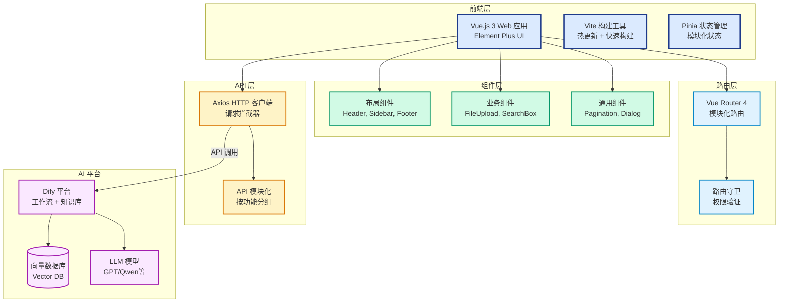
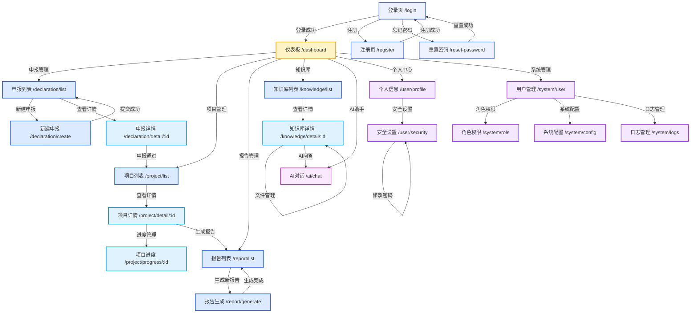
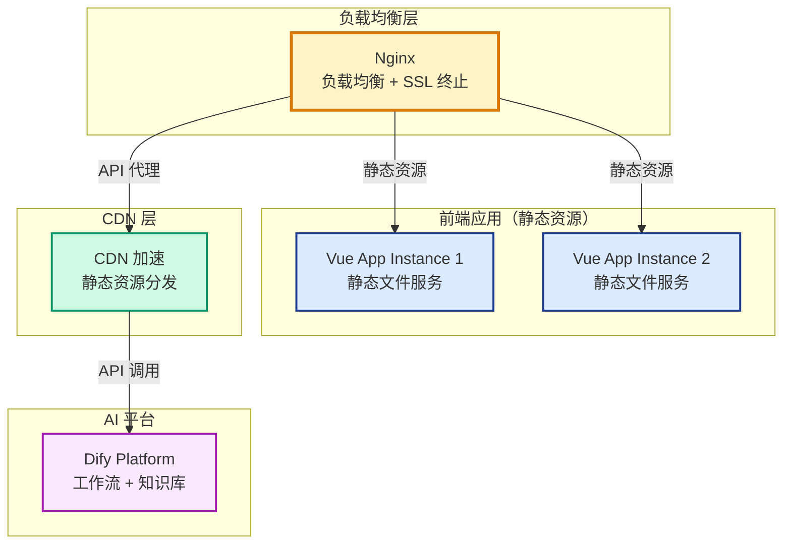

# 高校科研项目管理平台 - 前端开发文档

## 目录

- [高校科研项目管理平台 - 前端开发文档](#高校科研项目管理平台---前端开发文档)
  - [目录](#目录)
  - [1. 项目概述](#1-项目概述)
    - [1.1 核心特性](#11-核心特性)
    - [1.2 技术栈](#12-技术栈)
      - [前端技术栈](#前端技术栈)
      - [AI 平台](#ai-平台)
      - [架构模式](#架构模式)
  - [2. 核心功能模块](#2-核心功能模块)
    - [2.1 认证模块](#21-认证模块)
      - [功能描述](#功能描述)
      - [核心功能](#核心功能)
      - [页面结构](#页面结构)
    - [2.2 仪表板模块](#22-仪表板模块)
      - [功能描述](#功能描述-1)
      - [核心功能](#核心功能-1)
      - [页面结构](#页面结构-1)
    - [2.3 申报模块](#23-申报模块)
      - [功能描述](#功能描述-2)
      - [核心功能](#核心功能-2)
      - [页面结构](#页面结构-2)
    - [2.4 项目模块](#24-项目模块)
      - [功能描述](#功能描述-3)
      - [核心功能](#核心功能-3)
      - [页面结构](#页面结构-3)
    - [2.5 报告管理模块](#25-报告管理模块)
      - [功能描述](#功能描述-4)
      - [核心功能](#核心功能-4)
      - [页面结构](#页面结构-4)
    - [2.6 文件管理模块](#26-文件管理模块)
      - [功能描述](#功能描述-5)
      - [核心功能](#核心功能-5)
      - [组件结构](#组件结构)
    - [2.7 知识库模块](#27-知识库模块)
      - [功能描述](#功能描述-6)
      - [核心功能](#核心功能-6)
      - [页面结构](#页面结构-5)
    - [2.8 AI 助手模块](#28-ai-助手模块)
      - [功能描述](#功能描述-7)
      - [核心功能](#核心功能-7)
      - [页面结构](#页面结构-6)
    - [2.9 用户中心模块](#29-用户中心模块)
      - [功能描述](#功能描述-8)
      - [核心功能](#核心功能-8)
      - [页面结构](#页面结构-7)
    - [2.10 系统管理模块](#210-系统管理模块)
      - [功能描述](#功能描述-9)
      - [核心功能](#核心功能-9)
      - [页面结构](#页面结构-8)
    - [功能模块总览](#功能模块总览)
  - [3. 技术架构](#3-技术架构)
    - [3.1 总体架构](#31-总体架构)
      - [架构说明](#架构说明)
    - [3.2 前端架构设计](#32-前端架构设计)
      - [分层架构](#分层架构)
      - [核心设计模式](#核心设计模式)
  - [4. 前端设计](#4-前端设计)
    - [4.1 前端项目结构](#41-前端项目结构)
    - [4.2 设计规范](#42-设计规范)
      - [4.2.1 颜色系统](#421-颜色系统)
      - [4.2.2 字体系统](#422-字体系统)
      - [4.2.3 按钮样式](#423-按钮样式)
      - [4.2.4 卡片样式](#424-卡片样式)
      - [4.2.5 表单样式](#425-表单样式)
      - [4.2.6 弹窗样式](#426-弹窗样式)
      - [4.2.7 消息提示样式](#427-消息提示样式)
    - [4.3 页面功能模块](#43-页面功能模块)
      - [4.3.1 页面路由配置表](#431-页面路由配置表)
      - [4.3.2 页面业务流转关系图](#432-页面业务流转关系图)
    - [4.4 交互规范](#44-交互规范)
  - [5. 部署说明](#5-部署说明)
    - [5.1 环境要求](#51-环境要求)
    - [5.2 部署架构](#52-部署架构)
    - [5.3 部署步骤](#53-部署步骤)
      - [5.3.1 前端构建部署](#531-前端构建部署)
      - [5.3.2 Nginx 配置](#532-nginx-配置)
    - [5.4 配置说明](#54-配置说明)
      - [5.4.1 环境变量配置](#541-环境变量配置)
      - [5.4.2 Vite 配置](#542-vite-配置)
      - [5.4.3 性能优化配置](#543-性能优化配置)
  - [总结](#总结)

---

## 1. 项目概述

高校科研项目管理平台是一个基于 **Vue.js 3**、**前后端分离**、**现代化前端架构**的智能化科研项目全生命周期管理系统。平台以 Dify 工作流为核心，实现科研项目从申报、执行到验收的智能化、自动化管理。

### 1.1 核心特性

- 🎯 **现代化前端架构**：Vue 3 + Vite + Element Plus，高性能开发体验
- 🚀 **组件化开发**：高度可复用的组件库，提升开发效率
- 🤖 **AI 智能化**：集成 Dify 平台，实现智能工作流编排
- 📊 **全生命周期管理**：覆盖申报、执行、报告全流程
- 🔒 **安全可靠**：基于 JWT 的前端认证体系
- ⚡ **Vue 3 新特性**：Composition API、响应式系统、Teleport 等

### 1.2 技术栈

#### 前端技术栈

- **Vue.js 3.x** - 渐进式 JavaScript 框架
- **Vue Router 4.x** - 官方路由管理器
- **Pinia** - 新一代状态管理
- **Element Plus 2.3.14** - Vue 3 企业级组件库
- **Axios** - HTTP 客户端
- **Vite 5.x** - 新一代前端构建工具
- **SCSS** - CSS 预处理器
- **ESLint + Prettier** - 代码质量工具

#### AI 平台

- **Dify** - AI 工作流编排与知识库管理
- **Vector Database** - 向量数据库（语义搜索）

#### 架构模式

- **组件化架构** - 高度可复用的组件设计
- **模块化路由** - 按功能模块组织路由
- **状态管理** - 集中式状态管理
- **API 抽象** - 统一的 API 调用层

---

## 2. 核心功能模块

本系统共包含 **9 大核心功能模块**，覆盖科研项目全生命周期管理。

---

### 2.1 认证模块

#### 功能描述

用户身份认证模块，提供登录、注册、密码重置等基础功能。

#### 核心功能

- **用户登录**：支持用户名/邮箱登录，可选记住登录状态
- **用户注册**：新用户注册，支持邮箱/手机验证
- **密码重置**：通过邮箱/手机验证码重置密码
- **验证码**：图形验证码防止暴力破解
- **自动登录**：支持 7 天免登录

#### 页面结构

- `Login.vue` - 登录页面
- `Register.vue` - 注册页面
- `ResetPassword.vue` - 重置密码页面

---

### 2.2 仪表板模块

#### 功能描述

数据可视化仪表板，提供项目统计、进度概览、快捷入口等功能。

#### 核心功能

- **统计卡片**：项目总数、进行中、待验收、已完成
- **项目进度概览**：可视化展示所有项目的进度
- **最近申报列表**：最新提交的申报记录
- **快捷操作**：快速跳转到各功能模块
- **数据趋势分析**：项目统计数据的趋势变化

#### 页面结构

- `Dashboard.vue` - 仪表板主页面

---

### 2.3 申报模块

#### 功能描述

科研项目申报模块，通过 Dify 工作流辅助用户完成申报信息填写和提交。

#### 核心功能

- **申报列表**：查看所有申报记录，支持搜索、筛选、分页
- **新建申报**：填写申报信息（研究方向、领域、课题等）
- **申报详情**：查看申报详细信息和工作流执行结果
- **工作流触发**：提交后触发 Dify 申报工作流
- **状态跟踪**：实时跟踪工作流执行状态
- **草稿保存**：支持保存草稿，稍后继续编辑

#### 页面结构

- `Declaration/List.vue` - 申报列表
- `Declaration/Create.vue` - 新建申报
- `Declaration/Detail.vue` - 申报详情

---

### 2.4 项目模块

#### 功能描述

科研项目执行管理模块，提供项目详情、成员管理、进度跟踪等功能。

#### 核心功能

- **项目列表**：查看所有项目，支持搜索、筛选、分页
- **项目详情**：查看项目基本信息、成员、进度、文档
- **成员管理**：添加/移除项目成员，分配成员角色
- **进度管理**：记录项目进度，设置里程碑
- **文档管理**：上传项目文档，自动同步到 Dify 知识库
- **知识库搜索**：基于 Dify 的语义搜索功能
- **项目编辑**：修改项目描述、预算等可编辑字段

#### 页面结构

- `Project/List.vue` - 项目列表
- `Project/Detail.vue` - 项目详情
- `Project/Progress.vue` - 项目进度
- `Project/Members.vue` - 项目成员
- `Project/Documents.vue` - 项目文档
- `Project/KnowledgeBase.vue` - 知识库搜索

---

### 2.5 报告管理模块

#### 功能描述

基于 Dify 工作流自动生成科技报告和自评报告，支持多格式导出。

#### 核心功能

- **报告列表**：查看所有报告，支持搜索、筛选、分页
- **创建报告**：选择项目和报告类型，配置生成参数
- **生成报告**：触发 Dify 工作流，实时显示生成进度
- **报告预览**：在线预览生成的 HTML 报告内容
- **报告导出**：导出为 PDF、Word、Markdown 等格式
- **重新生成**：调整参数后重新生成报告
- **报告删除**：删除不需要的报告记录

#### 页面结构

- `Report/List.vue` - 报告列表
- `Report/Generate.vue` - 报告生成

---

### 2.6 文件管理模块

#### 功能描述

通用文件存储与管理模块，支持文件去重、预览、下载等功能。

#### 核心功能

- **文件上传**：单文件/批量文件上传
- **文件列表**：查看文件列表，支持筛选、搜索
- **文件预览**：在线预览 PDF、图片等文件
- **文件下载**：下载文件到本地
- **文件重命名**：修改文件名称
- **文件删除**：删除文件（软删除）
- **文件去重**：通过 MD5 哈希值避免重复存储

#### 组件结构

- `FileUpload/FileUpload.vue` - 文件上传组件
- `FileUpload/FileList.vue` - 文件列表组件
- `FilePreview/FilePreview.vue` - 文件预览组件

---

### 2.7 知识库模块

#### 功能描述

独立的知识库管理模块，支持多层级文件夹结构、文件管理、AI 问答。

#### 核心功能

- **知识库创建**：创建独立知识库或关联项目知识库
- **文件夹管理**：创建多级文件夹，支持重命名、删除
- **文件管理**：上传、重命名、删除、移动文件
- **文件夹树**：展示知识库的文件夹树形结构
- **文件列表**：查看知识库文件，支持筛选、搜索
- **AI 问答**：基于知识库内容进行实时问答（调用 Dify）
- **知识库共享**：设置知识库为私有或共享

#### 页面结构

- `Knowledge/List.vue` - 知识库列表
- `Knowledge/Detail.vue` - 知识库详情
- `Knowledge/Folder.vue` - 文件夹管理

---

### 2.8 AI 助手模块

#### 功能描述

基于 Dify 平台的智能对话助手，提供项目相关的智能问答和知识检索服务。

#### 核心功能

- **创建会话**：创建新的对话会话
- **发送消息**：发送用户消息，接收 AI 回复
- **会话列表**：查看所有对话会话
- **会话历史**：查看对话的完整消息历史
- **会话管理**：修改会话标题、置顶会话、删除会话
- **知识来源**：显示 AI 回复的知识来源和置信度
- **流式输出**：支持 AI 回复的流式输出

#### 页面结构

- `AI/Chat.vue` - AI 对话页面

---

### 2.9 用户中心模块

#### 功能描述

用户个人信息管理和安全设置模块，支持多行业动态字段配置。

#### 核心功能

- **个人信息**：查看和编辑个人基本信息
- **头像上传**：上传和更换用户头像
- **密码修改**：修改登录密码
- **登录日志**：查看个人登录历史记录
- **安全设置**：密码强度、登录通知等安全配置

#### 页面结构

- `User/Profile.vue` - 个人信息
- `User/Security.vue` - 安全设置

---

### 2.10 系统管理模块

#### 功能描述

系统管理员功能模块，包含用户管理、角色权限、系统配置、日志管理等。

#### 核心功能

**用户管理**：

- 用户列表查询（支持搜索、筛选、分页）
- 新建用户（分配角色、部门）
- 编辑用户信息
- 启用/禁用用户
- 重置用户密码
- 删除用户

**角色权限管理**：

- 角色列表查询
- 新建角色
- 编辑角色
- 删除角色
- 配置角色权限（权限树选择）
- 查看权限树结构

**部门管理**：

- 部门列表查询（按行业筛选）
- 部门树形结构展示

**系统配置**：

- 行业配置（行业类型、字段标签）
- 基本配置（系统名称、Logo、联系方式）
- Dify 配置（API 地址、密钥、工作流配置、连接测试）
- 邮件配置（SMTP 配置、发送测试）
- 文件存储配置（文件大小限制、允许扩展名）
- 安全配置（密码策略、会话超时、登录锁定）

**日志管理**：

- 操作日志查询（支持筛选、搜索、分页）
- 操作日志详情查看
- 操作日志导出（Excel/CSV）
- 操作日志清空
- 登录日志查询

#### 页面结构

- `System/User.vue` - 用户管理
- `System/Role.vue` - 角色权限管理
- `System/Config.vue` - 系统配置
- `System/Logs.vue` - 日志管理

---

### 功能模块总览

| 模块     | 页面数 | 核心功能                           | 主要组件                          |
| -------- | ------ | ---------------------------------- | --------------------------------- |
| 认证模块 | 3      | 登录、注册、密码重置               | Login, Register, ResetPassword    |
| 仪表板   | 1      | 数据统计、快捷入口                 | Dashboard                         |
| 申报模块 | 3      | 申报列表、新建申报、申报详情       | Declaration/List, Create, Detail  |
| 项目模块 | 6      | 项目列表、详情、进度、成员、文档   | Project/List, Detail, Progress 等 |
| 报告管理 | 2      | 报告列表、报告生成                 | Report/List, Generate             |
| 文件管理 | -      | 文件上传、下载、预览、删除         | FileUpload, FileList, FilePreview |
| 知识库   | 3      | 知识库列表、详情、文件夹管理       | Knowledge/List, Detail, Folder    |
| AI 助手  | 1      | AI 对话、会话管理                  | AI/Chat                           |
| 用户中心 | 2      | 个人信息、安全设置                 | User/Profile, Security            |
| 系统管理 | 4      | 用户、角色、权限、部门、配置、日志 | System/User, Role, Config, Logs   |
| **总计** | **25** | **完整科研项目全生命周期管理**     | **25+ 页面组件**                  |

---

## 3. 技术架构

### 3.1 总体架构

平台采用**现代化前端架构 + 组件化设计 + 模块化路由**模式。



#### 架构说明

**设计原则**：

1. **组件化优先**：高度可复用的组件设计，提升开发效率
2. **模块化路由**：按功能模块组织路由，便于维护
3. **状态管理**：集中式状态管理，数据流清晰
4. **API 抽象**：统一的 API 调用层，便于后端集成
5. **现代化工具链**：Vite + Vue 3 + Element Plus，开发体验优秀

**技术优势**：

- ✅ **Vue 3 新特性**：Composition API、响应式系统、Teleport
- ✅ **开发效率高**：Vite 热更新、组件化开发
- ✅ **性能优秀**：Tree-shaking、代码分割、懒加载
- ✅ **维护性强**：模块化架构、清晰的代码组织
- ✅ **扩展性好**：组件化设计、插件化架构

### 3.2 前端架构设计

#### 分层架构

```
┌─────────────────────────────────────┐
│           页面层 (Views)             │  ← 业务页面组件
├─────────────────────────────────────┤
│          组件层 (Components)         │  ← 可复用组件
├─────────────────────────────────────┤
│          组合式函数 (Composables)    │  ← 业务逻辑复用
├─────────────────────────────────────┤
│           工具层 (Utils)            │  ← 工具函数
├─────────────────────────────────────┤
│            API 层 (API)             │  ← 接口调用
├─────────────────────────────────────┤
│          状态管理 (Store)           │  ← 全局状态
├─────────────────────────────────────┤
│           路由层 (Router)           │  ← 路由管理
└─────────────────────────────────────┘
```

#### 核心设计模式

1. **组件化设计**：高度可复用的组件库
2. **模块化路由**：按功能模块组织路由
3. **状态管理**：Pinia 模块化状态管理
4. **API 抽象**：统一的接口调用层
5. **组合式函数**：业务逻辑复用

---

## 4. 前端设计

### 4.1 前端项目结构

```
sci-z-web/
├── public/
│   ├── favicon.ico
│   └── index.html
├── src/
│   ├── api/                      # API 接口
│   │   ├── auth.js              # 认证相关
│   │   ├── user.js              # 用户中心相关
│   │   ├── declaration.js       # 申报相关
│   │   ├── project.js           # 项目相关
│   │   ├── report.js            # 报告管理相关
│   │   ├── file.js              # 文件管理相关
│   │   ├── knowledge.js         # 知识库相关
│   │   ├── ai.js                # AI助手相关
│   │   ├── system.js            # 系统管理相关
│   │   └── index.js             # API 统一导出
│   ├── assets/                   # 静态资源
│   │   ├── images/              # 图片
│   │   ├── styles/              # 全局样式
│   │   │   ├── variables.scss   # SCSS 变量
│   │   │   ├── mixins.scss      # SCSS 混入
│   │   │   └── common.scss      # 通用样式
│   │   └── icons/               # 图标
│   ├── components/               # 公共组件
│   │   ├── Layout/              # 布局组件
│   │   │   ├── Header.vue
│   │   │   ├── Sidebar.vue
│   │   │   ├── Footer.vue
│   │   │   └── MainLayout.vue
│   │   ├── FileUpload/          # 文件上传组件
│   │   │   ├── FileUpload.vue
│   │   │   └── FileList.vue
│   │   ├── FilePreview/         # 文件预览组件
│   │   │   └── FilePreview.vue
│   │   ├── SearchBox/           # 搜索框组件
│   │   │   └── SearchBox.vue
│   │   ├── StatusTag/           # 状态标签组件
│   │   │   └── StatusTag.vue
│   │   └── Common/              # 通用组件
│   │       ├── Pagination.vue
│   │       ├── Dialog.vue
│   │       └── Loading.vue
│   ├── composables/              # 组合式函数
│   │   ├── useAuth.js           # 认证相关
│   │   ├── useUpload.js         # 上传相关
│   │   ├── useSearch.js         # 搜索相关
│   │   └── useTable.js          # 表格相关
│   ├── directives/               # 自定义指令
│   │   ├── permission.js        # 权限指令
│   │   └── loading.js           # 加载指令
│   ├── router/                   # 路由配置
│   │   ├── index.js             # 路由主文件
│   │   ├── modules/             # 路由模块
│   │   │   ├── auth.js          # 认证路由
│   │   │   ├── user.js          # 用户中心路由
│   │   │   ├── declaration.js   # 申报路由
│   │   │   ├── project.js       # 项目路由
│   │   │   ├── report.js        # 报告管理路由
│   │   │   ├── knowledge.js     # 知识库路由
│   │   │   ├── ai.js            # AI助手路由
│   │   │   └── system.js        # 系统管理路由
│   │   └── guards.js            # 路由守卫
│   ├── store/                    # 状态管理（Pinia）
│   │   ├── index.js             # Store 入口
│   │   ├── modules/             # Store 模块
│   │   │   ├── auth.js          # 认证状态
│   │   │   ├── user.js          # 用户状态
│   │   │   ├── app.js           # 应用状态
│   │   │   ├── declaration.js   # 申报状态
│   │   │   ├── project.js       # 项目状态
│   │   │   ├── report.js        # 报告状态
│   │   │   ├── knowledge.js     # 知识库状态
│   │   │   ├── ai.js            # AI助手状态
│   │   │   ├── permission.js    # 权限状态
│   │   │   └── system.js        # 系统管理状态
│   │   └── types.js             # 类型定义
│   ├── utils/                    # 工具函数
│   │   ├── request.js           # Axios 封装
│   │   ├── auth.js              # 认证工具
│   │   ├── validate.js          # 表单验证
│   │   ├── date.js              # 日期处理
│   │   ├── file.js              # 文件处理
│   │   └── constants.js         # 常量定义
│   ├── views/                    # 页面视图
│   │   ├── Login/               # 登录页
│   │   │   └── index.vue
│   │   ├── Register/            # 注册页
│   │   │   └── index.vue
│   │   ├── Dashboard/           # 仪表板
│   │   │   └── index.vue
│   │   ├── User/                # 用户中心
│   │   │   ├── Profile.vue      # 个人信息
│   │   │   └── Security.vue     # 安全设置
│   │   ├── Declaration/         # 申报模块
│   │   │   ├── List.vue         # 申报列表
│   │   │   ├── Create.vue       # 新建申报
│   │   │   └── Detail.vue       # 申报详情
│   │   ├── Project/             # 项目模块
│   │   │   ├── List.vue         # 项目列表
│   │   │   ├── Detail.vue       # 项目详情
│   │   │   ├── Documents.vue    # 项目文档
│   │   │   ├── Progress.vue     # 项目进度
│   │   │   ├── Members.vue      # 项目成员
│   │   │   └── KnowledgeBase.vue # 知识库搜索
│   │   ├── Report/              # 报告管理模块
│   │   │   ├── List.vue         # 报告列表
│   │   │   └── Generate.vue     # 报告生成
│   │   ├── AI/                  # AI助手模块
│   │   │   └── Chat.vue         # AI对话
│   │   ├── Knowledge/           # 知识库管理模块
│   │   │   ├── List.vue         # 知识库列表
│   │   │   ├── Detail.vue       # 知识库详情
│   │   │   └── Folder.vue       # 文件夹管理
│   │   ├── System/              # 系统管理模块
│   │   │   ├── User.vue         # 用户管理
│   │   │   ├── Role.vue         # 角色权限管理
│   │   │   ├── Config.vue       # 系统配置
│   │   │   └── Logs.vue         # 日志管理
│   │   └── Error/               # 错误页
│   │       ├── 403.vue
│   │       └── 404.vue
│   ├── App.vue                   # 根组件
│   └── main.js                   # 入口文件
├── .env.development              # 开发环境配置
├── .env.production               # 生产环境配置
├── .eslintrc.js                  # ESLint 配置
├── .prettierrc.js                # Prettier 配置
├── vite.config.js                # Vite 配置
└── package.json                  # 项目依赖
```

---

### 4.2 设计规范

#### 4.2.1 颜色系统

**主色调**

```css
:root {
  /* 主色调 - 深蓝色系 (学术蓝) */
  --color-primary: #1e3a8a;
  --color-primary-light: #2563eb;
  --color-primary-lighter: #3b82f6;
  --color-primary-lightest: #60a5fa;
  --color-primary-dark: #1e40af;

  /* 辅助色 - 皇家蓝色系 (优雅蓝) */
  --color-accent: #4169e1;
  --color-accent-light: #6b8cff;
  --color-accent-dark: #2952cc;

  /* 功能色 */
  --color-info: #2563eb;
  --color-success: #16a34a;
  --color-warning: #f59e0b;
  --color-error: #dc2626;

  /* 中性色 */
  --bg: #f7f9fc;
  --surface: #ffffff;
  --border: #e5e7eb;
  --text: #111827;
  --text-2: #4b5563;
  --text-3: #6b7280;
  --hover: #eef2ff;
  --disabled: #9ca3af;

  /* 其他 */
  --radius: 8px;
  --gap: 16px;
}
```

**颜色使用规范**

| 场景          | 颜色      | 使用场景                         |
| ------------- | --------- | -------------------------------- |
| 主要按钮      | `#1E3A8A` | 提交、保存、确认操作             |
| 链接/悬浮     | `#4169E1` | 文字链接、鼠标悬浮状态、次级按钮 |
| 成功提示      | `#16A34A` | 操作成功、完成状态               |
| 警告提示      | `#F59E0B` | 需要注意的信息                   |
| 错误提示      | `#DC2626` | 错误信息、删除操作               |
| 信息提示      | `#2563EB` | 一般性信息提示                   |
| 高亮/交互反馈 | `#6B8CFF` | 卡片悬浮、选中高亮、交互状态     |

#### 4.2.2 字体系统

```css
body {
  font-family: Inter, system-ui, -apple-system, Segoe UI, Roboto, PingFang SC, Microsoft
      YaHei, sans-serif;
  font-size: 14px;
  line-height: 1.5;
  color: #111827;
}

/* 标题字体 */
h1 {
  font-size: 24px;
  font-weight: 600;
}
h2 {
  font-size: 20px;
  font-weight: 600;
}
h3 {
  font-size: 18px;
  font-weight: 600;
}
h4 {
  font-size: 16px;
  font-weight: 600;
}
h5 {
  font-size: 14px;
  font-weight: 600;
}

/* 正文字体 */
.text-lg {
  font-size: 16px;
}
.text-base {
  font-size: 14px;
}
.text-sm {
  font-size: 12px;
}
.text-xs {
  font-size: 10px;
}
```

#### 4.2.3 按钮样式

```css
/* 主要按钮 */
.el-button--primary {
  background-color: #1e3a8a;
  border-color: #1e3a8a;
  color: #ffffff;
}

.el-button--primary:hover {
  background-color: #1e40af;
  border-color: #1e40af;
  transform: translateY(-1px);
  box-shadow: 0 4px 12px rgba(30, 58, 138, 0.3);
}

/* 次要按钮 */
.el-button--default {
  background-color: #ffffff;
  border-color: #d1d5db;
  color: #6b7280;
}

.el-button--default:hover {
  background-color: #f9fafb;
  border-color: #9ca3af;
  color: #374151;
}

/* 文本按钮 */
.el-button--text {
  color: #4169e1;
}

.el-button--text:hover {
  color: #2952cc;
  background-color: #eef2ff;
}

/* 危险按钮 */
.el-button--danger {
  background-color: #dc2626;
  border-color: #dc2626;
  color: #ffffff;
}
```

#### 4.2.4 卡片样式

```css
.card {
  background: #ffffff;
  border: 1px solid #e5e7eb;
  border-radius: 8px;
  padding: 16px;
  box-shadow: 0 1px 2px rgba(0, 0, 0, 0.04);
  transition: all 0.3s ease;
}

.card:hover {
  box-shadow: 0 4px 12px rgba(0, 0, 0, 0.08);
  transform: translateY(-2px);
}
```

#### 4.2.5 表单样式

```css
.el-form-item__label {
  color: #374151;
  font-weight: 500;
  font-size: 14px;
}

.el-input__inner {
  border-color: #e5e7eb;
  color: #1f2937;
}

.el-input__inner:focus {
  border-color: #1e3a8a;
  box-shadow: 0 0 0 2px rgba(30, 58, 138, 0.2);
}

.el-input__inner::placeholder {
  color: #9ca3af;
}
```

#### 4.2.6 弹窗样式

```css
.el-dialog {
  border-radius: 12px;
  overflow: hidden;
  box-shadow: 0 8px 32px rgba(0, 0, 0, 0.12);
}

.el-dialog__header {
  padding: 20px 24px 16px;
  border-bottom: 1px solid #f0f0f0;
  background: #ffffff;
}

.el-dialog__title {
  font-size: 16px;
  font-weight: 600;
  color: #1e3a8a;
}

.el-dialog__body {
  padding: 20px 24px;
  background: #ffffff;
}

.el-dialog__footer {
  padding: 16px 24px 20px;
  background: #ffffff;
}
```

#### 4.2.7 消息提示样式

```css
.el-message-box {
  border-radius: 12px;
  box-shadow: 0 8px 32px rgba(0, 0, 0, 0.12);
}

.el-message-box__title {
  font-size: 16px;
  font-weight: 600;
  color: #1f2937;
}

.el-message-box__message {
  font-size: 14px;
  color: #374151;
}
```

---

### 4.3 页面功能模块

#### 4.3.1 页面路由配置表

| 路径                      | 组件                     | 名称       | 权限                      | 说明           |
| ------------------------- | ------------------------ | ---------- | ------------------------- | -------------- |
| `/login`                  | `auth/Login.vue`         | 登录       | 公开                      | 用户登录页面   |
| `/register`               | `auth/Register.vue`      | 注册       | 公开                      | 用户注册页面   |
| `/reset-password`         | `auth/ResetPassword.vue` | 重置密码   | 公开                      | 密码重置页面   |
| `/dashboard`              | `dashboard/Index.vue`    | 仪表板     | `menu:dashboard:view`     | 数据统计仪表板 |
| `/declaration/list`       | `declaration/List.vue`   | 申报列表   | `menu:declaration:list`   | 申报列表页面   |
| `/declaration/create`     | `declaration/Create.vue` | 新建申报   | `menu:declaration:create` | 新建申报页面   |
| `/declaration/detail/:id` | `declaration/Detail.vue` | 申报详情   | `menu:declaration:detail` | 申报详情页面   |
| `/project/list`           | `project/List.vue`       | 项目列表   | `menu:project:list`       | 项目列表页面   |
| `/project/detail/:id`     | `project/Detail.vue`     | 项目详情   | `menu:project:detail`     | 项目详情页面   |
| `/project/progress/:id`   | `project/Progress.vue`   | 项目进度   | `menu:project:progress`   | 项目进度页面   |
| `/report/list`            | `report/List.vue`        | 报告列表   | `menu:report:list`        | 报告管理列表   |
| `/report/generate`        | `report/Generate.vue`    | 报告生成   | `menu:report:generate`    | 生成报告页面   |
| `/knowledge/list`         | `knowledge/List.vue`     | 知识库列表 | `menu:knowledge:list`     | 知识库列表页面 |
| `/knowledge/detail/:id`   | `knowledge/Detail.vue`   | 知识库详情 | `menu:knowledge:detail`   | 知识库详情页面 |
| `/ai/chat`                | `ai/Chat.vue`            | AI 对话    | `menu:ai:chat`            | AI 助手对话    |
| `/user/profile`           | `user/Profile.vue`       | 个人信息   | `menu:user:profile`       | 个人信息管理   |
| `/user/security`          | `user/Security.vue`      | 安全设置   | `menu:user:security`      | 安全设置页面   |
| `/system/user`            | `system/User.vue`        | 用户管理   | `menu:system:user`        | 用户管理页面   |
| `/system/role`            | `system/Role.vue`        | 角色权限   | `menu:system:role`        | 角色权限管理   |
| `/system/config`          | `system/Config.vue`      | 系统配置   | `menu:system:config`      | 系统配置页面   |
| `/system/logs`            | `system/Logs.vue`        | 日志管理   | `menu:system:logs`        | 系统日志查看   |

**路由守卫**

```javascript
router.beforeEach((to, from, next) => {
  const token = localStorage.getItem("auth_token");
  const publicPages = ["/login", "/register", "/reset-password"];
  const authRequired = !publicPages.includes(to.path);

  if (authRequired && !token) {
    return next("/login");
  }

  // 权限验证
  if (to.meta.permission) {
    const hasPermission = checkPermission(to.meta.permission);
    if (!hasPermission) {
      ElMessage.error("无权限访问该页面");
      return next(from.path);
    }
  }

  next();
});
```

#### 4.3.2 页面业务流转关系图



---

### 4.4 交互规范

- 所有异步操作显示 Loading 状态
- 操作成功/失败给予明确提示
- 危险操作需二次确认
- 表单验证实时反馈
- 支持键盘快捷键操作

---

## 5. 部署说明

### 5.1 环境要求

**前端环境：**

- **Node.js 18+** (LTS, 推荐 Node.js 20)
- **npm 9+** 或 **yarn 1.22+** 或 **pnpm 8+**

### 5.2 部署架构



### 5.3 部署步骤

#### 5.3.1 前端构建部署

**1. 环境准备**

```bash
# 安装 Node.js 20 LTS
curl -fsSL https://deb.nodesource.com/setup_20.x | sudo -E bash -
sudo apt-get install -y nodejs

# 验证版本
node --version  # v20.x.x
npm --version   # 10.x.x
```

**2. 项目构建**

```bash
# 克隆项目
git clone <repository-url>
cd sci-z-web

# 安装依赖
npm install

# 开发环境运行
npm run dev

# 生产环境构建
npm run build

# 预览构建结果
npm run preview
```

**3. 部署配置**

```bash
# 创建部署目录
sudo mkdir -p /var/www/sci-z-web
sudo chown -R $USER:$USER /var/www/sci-z-web

# 复制构建文件
cp -r dist/* /var/www/sci-z-web/

# 设置权限
sudo chmod -R 755 /var/www/sci-z-web
```

#### 5.3.2 Nginx 配置

**Nginx 配置文件**

```nginx
server {
    listen 80;
    server_name your-domain.com;
    root /var/www/sci-z-web;
    index index.html;

    # 静态资源缓存
    location ~* \.(js|css|png|jpg|jpeg|gif|ico|svg)$ {
        expires 1y;
        add_header Cache-Control "public, immutable";
    }

    # SPA 路由支持
    location / {
        try_files $uri $uri/ /index.html;
    }

    # API 代理（如果需要）
    location /api/ {
        proxy_pass http://backend-server;
        proxy_set_header Host $host;
        proxy_set_header X-Real-IP $remote_addr;
        proxy_set_header X-Forwarded-For $proxy_add_x_forwarded_for;
        proxy_set_header X-Forwarded-Proto $scheme;
    }

    # 安全头
    add_header X-Frame-Options "SAMEORIGIN" always;
    add_header X-Content-Type-Options "nosniff" always;
    add_header X-XSS-Protection "1; mode=block" always;
}
```

**SSL 配置（可选）**

```nginx
server {
    listen 443 ssl http2;
    server_name your-domain.com;

    ssl_certificate /path/to/certificate.crt;
    ssl_certificate_key /path/to/private.key;

    # SSL 配置
    ssl_protocols TLSv1.2 TLSv1.3;
    ssl_ciphers ECDHE-RSA-AES256-GCM-SHA512:DHE-RSA-AES256-GCM-SHA512;
    ssl_prefer_server_ciphers off;

    # 其他配置同上面
}
```

### 5.4 配置说明

#### 5.4.1 环境变量配置

**开发环境 (.env.development)**

```env
# API 基础地址
VITE_API_BASE_URL=http://localhost:8080/api

# Dify 配置
VITE_DIFY_API_URL=https://api.dify.ai/v1
VITE_DIFY_API_KEY=your-dify-api-key

# 应用配置
VITE_APP_TITLE=高校科研项目管理平台
VITE_APP_VERSION=1.0.0
```

**生产环境 (.env.production)**

```env
# API 基础地址
VITE_API_BASE_URL=https://your-api-domain.com/api

# Dify 配置
VITE_DIFY_API_URL=https://api.dify.ai/v1
VITE_DIFY_API_KEY=your-production-dify-api-key

# 应用配置
VITE_APP_TITLE=高校科研项目管理平台
VITE_APP_VERSION=1.0.0
```

#### 5.4.2 Vite 配置

**vite.config.js**

```javascript
import { defineConfig } from "vite";
import vue from "@vitejs/plugin-vue";
import { resolve } from "path";

export default defineConfig({
  plugins: [vue()],
  resolve: {
    alias: {
      "@": resolve(__dirname, "src"),
    },
  },
  server: {
    port: 3000,
    open: true,
    proxy: {
      "/api": {
        target: "http://localhost:8080",
        changeOrigin: true,
        rewrite: (path) => path.replace(/^\/api/, ""),
      },
    },
  },
  build: {
    outDir: "dist",
    assetsDir: "assets",
    sourcemap: false,
    rollupOptions: {
      output: {
        manualChunks: {
          vendor: ["vue", "vue-router", "pinia"],
          element: ["element-plus"],
        },
      },
    },
  },
});
```

#### 5.4.3 性能优化配置

**代码分割**

```javascript
// 路由懒加载
const routes = [
  {
    path: "/dashboard",
    component: () => import("@/views/Dashboard/index.vue"),
  },
  {
    path: "/declaration",
    component: () => import("@/views/Declaration/index.vue"),
  },
  // ... 其他路由
];
```

**组件懒加载**

```javascript
// 异步组件
const AsyncComponent = defineAsyncComponent(() =>
  import("@/components/HeavyComponent.vue")
);
```

---

## 总结

本文档详细介绍了高校科研项目管理平台的前端开发设计，包括：

1. **项目概述**：核心特性和技术栈
2. **功能模块**：9 大核心功能模块的详细设计
3. **技术架构**：现代化前端架构和组件化设计
4. **前端设计**：项目结构、设计规范、页面功能
5. **部署说明**：环境要求、部署架构、配置说明

该平台采用 Vue 3 + Vite + Element Plus 的现代化技术栈，具有高性能、易维护、可扩展的特点，能够满足科研项目全生命周期管理的需求。
